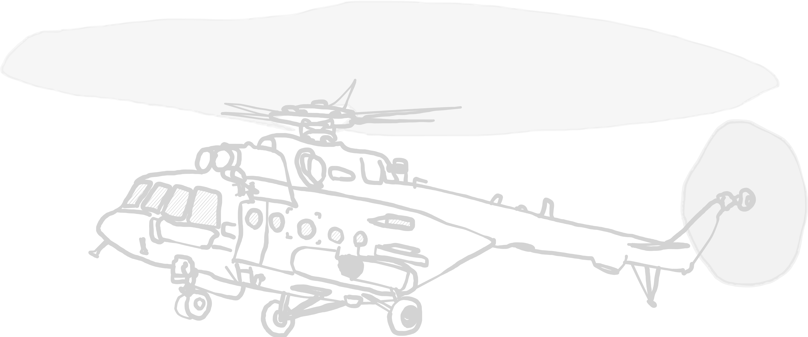

# H.E.A.T. Skirmish Wargame

This is <b>H.E.A.T</b>, a ruleset expansion for 28mm ultramodern tabletop.

***

## Rules

This is meant as an expansion of Bolt Action rules, so only additions or in a few
cases rebalanced rules are provided. Everything else can be found in the
Bolt Action rulebook.

>This ruleset currently expands on the v3 ruleset. Since it initially was written
>for v2, some phrasing might be a bit off, but I think everything should work fine.
>If you find anything, just let me know.

[Ruleset Expansion](ruleset/heat-ruleset.md)

[Quick Chart Expansion (mobile)](ruleset/quickchart-mobile.excalidraw.png)

[Quick Chart Expansion (PC)](ruleset/quickchart-pc.excalidraw.png)

### Platoon lists

Since v3, we no longer have the army list, but platoon structures. Below are the
three basic roster applicable for all armies, as well as a brief overview over the
NATO military symbols used in the army lists.

[List making overview](/ruleset/list-overview.md)

***

## Theatres

A list of theatres with their own storyline, scenarios templates, army lists and
everything else needed for a modern wargame.

### Estonian Civil War

 
War in Europe right next to the russian border.

A volatile situation ready to escalate to a full-blown land war between NATO
and Russia over a single misstep on either side.

[Theatre Overview Page](/scenarios/estonia/estonia-scenario.md)

***

## Templates

Stuff you may find useful if you want to create your own units.

### Calculators

Based in large parts on the [v2 cost calculator](https://www.wargaming3d.com/product/bolt-action-unofficial-vehicle-design-system/). Unit calculator based on stuff i parsed from the book.

<a href=""> Unit calculator sheet [.xlsx]</a>

<a href="./calculators/vehicle-calculator.xlsx"> Vehicle calculator sheet [.xlsx]</a>

### Unit rosters

#### Infantry/System operator unit template

Units such as infantry groups, artillery, mortars, etc. are described in a table
as seen below:

| Unit name | Unit type |
| :---- | ---- |
| Cost | Cost by veterancy |
| Reinforcement | Cost per additional unit |
| Standard Setup | NCO ( Weapon ) + x attendants ( Weapon ) |
|Options|<table><tr><td><b>Additional weapons</td><td><b>Description</td><td><b>Cost</b></td></tr><tr><td>Example weapon system</td><td>What the weapon does.</td><td>+/- X pt</td></tr><tr><td>...</td><td>...</td><td>+/- X pt</td></tr></table><table><tr><td><b>Optional rules</td><td><b>Description</td><td><b>Cost</b></td></tr><tr><td>Example rule</td><td>Description of rule.</td><td>+/- X pt</td></tr><tr><td>...</td><td>...</td><td>+/- X pt</td></tr></table>|
| Special rules | <table><tr><td><b>Rules</td><td><b>Description</td></tr><tr><td>Example rule</td><td>This rule does things.</td></tr><tr><td>...</td><td>...</td></tr></table> |

#### Vehicle unit template

Additionally, the following table is used for vehicles, as seen below. To better
represent the sheer amount of modern vehicle variants, many vehicles have
replacement options for their main weapon system, or can even be fielded without
any at all.

| Vehicle name | Vehicle / helicopter type |
| :---- | ---- |
| Cost | Cost by veterancy |
| Capacity | Troop capacity |
| Damage value | Vehicle damage value |
| Default weapon configuration | <table><tr><td><b>Weapon Systems</td><td><b>Modifiers</td><td><b>Rules</b></td></tr><tr><td>Example Weapon System</td><td>What the weapon does.</td><td>+/- X pt</td></tr><tr><td>...</td><td>...</td><td>+/- X pt</td></tr></table> |
|Options|<table><tr><td><b>Rules</td><td><b>Description</td><td><b>Cost</b></td></tr><tr><td>Example Rule</td><td>This rule does things.</td><td>+/-X [pt/unit]</td></tr><tr><td>...</td><td>...</td><td>+/-X [pt/unit]</td></tr></table><table><tr><td><b>Main Weapon Replacement</td><td><b>Description</td><td><b>Cost</b></td></tr><tr><td>Example Weapon System</td><td>What the weapon does.</td><td>+/- X pt</td></tr><tr><td>...</td><td>...</td><td>+/- X pt</td></tr></table><table><tr><td><b>Additional Weapons</td><td><b>Description</td><td><b>Cost</b></td></tr><tr><td>Example Weapon System</td><td>Modifiers and other information.</td><td>+/- X pt</td></tr><tr><td>...</td><td>...</td><td>+/- X pt</td></tr></table> |
| Special rules | <table><tr><td><b>Rules</td><td><b>Description</td></tr><tr><td>Example Rule</td><td>This rule does things.</td></tr><tr><td>...</td><td>...</td></tr></table> |

***

## Sources and FAQ

Most images were taken from Wikipedia articles or Google Image searches and
traced over. All information regarding weapon names were also taken from Wikipedia
or the websites of their respective origin country or manufacturer. For a more
detailed look, [here](/ruleset/sources.md) is the links to every image I traced.

NATO military iconology according to [APP-6(C)](https://www.cimic-coe.org/resources/external-publications/app-6-c.pdf).

Lastly, Here are answers to some [questions](/ruleset/faq.md) you might have.
