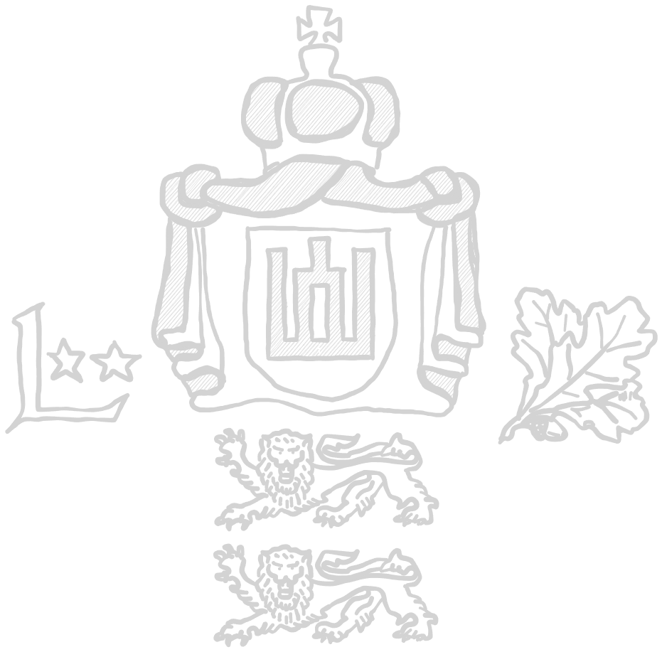

# Baltic Security Partnership Brigade

***

## Links

[Platoon Leader](Baltic%20Security%20Partnership%20Brigade.md#platoon-leader--1-)

[Infantry Units](Baltic%20Security%20Partnership%20Brigade.md#infantry-units--2---5-)

[Combat Support Units](Baltic%20Security%20Partnership%20Brigade.md#combat-support-units--0---1-)

[Machine gun](Baltic%20Security%20Partnership%20Brigade.md#machine-gun-team--0---1-)

[AT](Baltic%20Security%20Partnership%20Brigade.md#anti-tank-team--0---1-)

[AA](Baltic%20Security%20Partnership%20Brigade.md#anti-air-systems--0---1-)

[Drone](Baltic%20Security%20Partnership%20Brigade.md#drone-team--0---1-)

[Mortar](Baltic%20Security%20Partnership%20Brigade.md#mortar-team--0---1-)

[Artillery](Baltic%20Security%20Partnership%20Brigade.md#artillery--0---1-)

[Divisional Reinforcements](Baltic%20Security%20Partnership%20Brigade.md#divisional-reinforcements--0---1-)

[IFVs and APCs](Baltic%20Security%20Partnership%20Brigade.md#armoured-personell-carriers--infantry-fighting-vehicles--0---2-)

[Heavy Armour](Baltic%20Security%20Partnership%20Brigade.md#reinforcing-vehicles--0---1-)

[Transports](Baltic%20Security%20Partnership%20Brigade.md#transports)

***

## Army modifiers

### Cavalry Training

Units in this Brigade are specifically trained to be deployed by helicopter.
Combat landings and disembarking are the norm. Due to this training, regulars
are allowed to disembark by rapelling, and any failed order test to leave a
helicopter may be rerolled.

*TLDR: Regs are allowed to rapell, reroll failed helicopter disembark order tests*

### Forest dwellers

These units are trained for deep incursions and traversal of the bogs and
marches of the Baltics. What is a specialization for other forces is here normal. 
Any infantry group is allowed to get the following rule at 2pt/u:

<table><tr><td>Recon training</td><td>These soldiers are trained to operate and maneuver  in even the toughest terrain.  When using an ADVANCE to move through rough terrain, throw a D2, and on a positive result the team may instead use the RUN distance.</td></table>

***

## Platoon leader [ 1 ]

### Leitenantas

| Leitenantas | Platoon Leader |
| :---- | ---- |
| Cost | 35 pt / 50 pt / 65 pt |
| Reinforcement | up to 2 attendants (AR): 7 pt / 10 pt / 13 pt each |
| Setup | NCO (as depicted) |
| Options | - |
| Special rules | <table><tr><td><b>Rules</td><td><b>Description</td></tr><tr><td>You men, snap to action!</td><td>-</td></tr><tr><td>Command</td><td>-</td></tr></table>

### Vyresnysis leitenantas

| Vyresnysis leitenantas | Platoon Leader |
| :---- | ---- |
| Cost | 60 pt / 75 pt / 90 pt |
| Reinforcement | up to 2 attendants (AR): 7 pt / 10 pt / 13 pt each |
| Setup | NCO (as depicted) |
| Options | - |
| Special rules | <table><tr><td><b>Rules</td><td><b>Description</td></tr><tr><td>You men, snap to action! (2x)</td><td>-</td></tr><tr><td>Command</td><td>-</td></tr></table>

***

## Infantry Units [ 2 - 5 ]

### Žvalgybos komanda

A small team of forward reconnaissance infantry.

60

AR + 2 AR

Opt DMR, Smoke

Rangers

### Žvalgybos grupė

A group of recon infantry.

50

SMG + 4 AR

Opt DMR, LMG, LAW, UGL, Smoke

### Pasienis pėstininkų "Varlių vyrai"

Nicknamed frog men, this group of infantry is boarded on small boats to
traverse the bogs and marches of the baltic national parks along the borders.

70

SMG + 4 SMG

Opt LAW, UGL (GraPi), Explosives, Smoke

### Kavalerijos grupė

Retaining the old name for horse mounted infantry, modern cavalry is mounted upon
helicopters. This infantry group works in conjunction with a helicopter
in areas which are hard to reach by any other means.

50

AR + 4 AR

Opt LAW, LMG, UGL

### Husarų pėstininkų grupė

The heaviest infantry the brigade has to offer. The hussars are the mechanized units
which use M113 and armoured reserve vehicles.

60

SMG + 4 AR

Opt DMR, LMG, UGL, Explosives

### Eksitaja užpuolimas grupė 

Raid infantry groups were used in the beginning of the war to deal heavy losses to
the NSPR logistical hubs located in remote parts of the national park. This earned them
the local nickname "Eksitaja", which are mythological creatures haunting estonian bogs.

60

SMG + 4 AR

Opt LMG, UGL, Explosives, Smoke

Engineers

Stubborn

### Territorial Reserve Volunteers

All baltic states have relatively large territorial reserves, made up from volunteers and
former military servicemen. Some of those units were restructured under the Baltic Treaty to serve in this brigade.

30er

AR + 4 AR

Opt LMG

***

## Combat support units [ 0 - 1 ]

***

## Machine gun team [ 0 - 1 ]

***

## Anti-Tank team [ 0 - 1 ]

***

## Drone team [ 0 - 1 ]

***

## Mortar team [ 0 - 1 ]

***

## Artillery [ 0 - 1 ]

***

## Divisional Reinforcements [ 0 - 1 ]

***

## Anti-Air systems [ 0 - 1 ]

***

## Armoured Personell Carriers / Infantry Fighting Vehicles [ 0 - 2 ]

### Sisu Parsi 4x4

### M113

### BTR-80 UNSh

Hand-downs from the Estonian Defense League.
### Humvee

### Polaris RZR 4x4

***

## Reinforcing Vehicles [ 0 - 1 ]

While the brigade itself only fielded IFVs and helicopters, some older reserve vehicles and light armoured vehicles are available.

### CVR(T)

Some latvian CVR(T) for recon missions.

### Mi-8/17 combat helicopter

From latvian air force. Two available.

### W-3W/WA Sokół

Part of arms donation from polish land forces. Two are available.

***

## Transports

### Mi-2 Hoplite

### Mi-17 Hip

### AS365 Dauphin

### BTR 80

### Sisu Parsi

### PTS

### M113

### Truck

### Toyota/Range Rover

more space than jeep

### Jeep

### Boat

From the latvian national guard.
