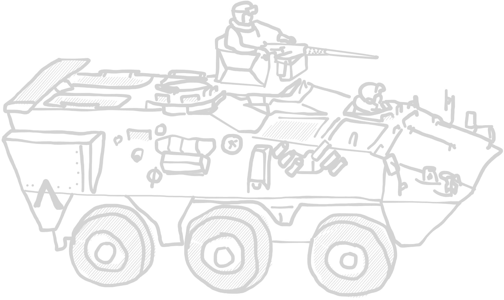
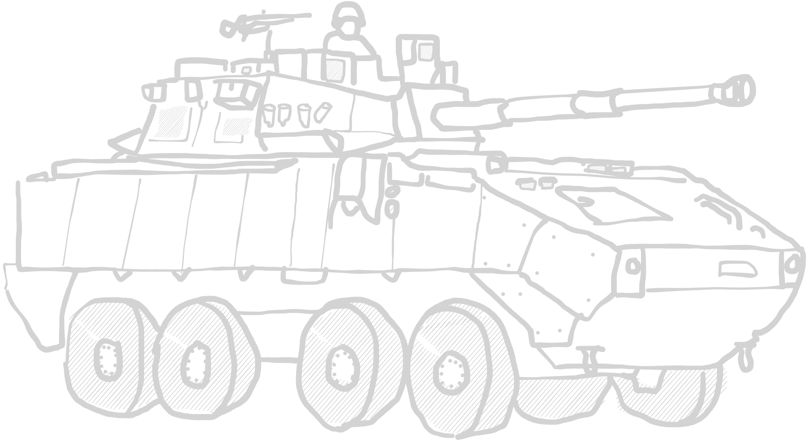

# EUFOR Estonia Ground Forces

This list represents the reinforced battlegroups sent by the European Union to
Estonia to defeat the separatist forces of Ida Viru. The corps-sized ground force
is compromised of the franco-belgian battlegroup as well as the EUROCORPS.

***

## Table of content

- [Army modifiers](#army-modifiers)

- [Officers](#officers)
- [Infantry](#infantry)
- [Combat support](#combat-support-units)
- [Machine guns](#machine-gun-teams)
- [Anti tank teams](#anti-tank-teams)
- [Micro air vehicles](#micro-air-vehicles)
- [Mortar teams](#mortar-teams)
- [Divisional Reinforcements](#divisional-reinforcements)
- [Artillery](#artillery)
- [Anti-air systems](#anti-air-systems)
- [APCs/IFVs](#apcs--ifvs)
- [Heavy vehicles](#heavy-vehicles)
- [Transports](#transports)

***

## Army modifiers

### FÉLIN system

Infantry units can be equipped with the FÉLIN integrated combat and comm system
(_Fantassin à Équipement et Liaisons Intégrés_), which allows a squad to share
position and real-time camera information between each other.

Due to the enhanced interconnection of the squad, communication gets easier.
Fireteams with the FÉLIN system do not need to do an order check when separated,
as long as they have no Pins. The system costs +1pt/soldier of a squad.

_TLDR: FÉLIN system for every infantry unit at +1pt/u. Units with FÉLIN system do not need to do an order check when splitting into fireteams._

***

## Officers

_an actual image i found an eurocorps leaflet. The document even used the classic Windows military font for headers lmao_

### Platoon Officer

Officers of NATO code OF-1 are young officers such as First or Second Lieutenants.
They lead a platoon into battle.

| OF-1 Officer | </img> |
| :---- | ---- |
| Cost | 21 pt / 30 pt / 39 pt |
| Reinforcement | up to 2 attendants (AR): 7 pt / 10 pt / 13 pt each |
| Setup | NCO (as depicted) |
| Options | - |
| Special rules | <table><tr><td><b>Rules</td><td><b>Description</td></tr><tr><td>You men, snap to action!</td><td>-</td></tr><tr><td>Command</td><td>-</td></tr></table> |

### Company Officer

Companies are lead by Captains or in some cases even Majors. They manage several
platoons and outrank all other units on the table.

| OF-2 Officer | </img> |
| :---- | ---- |
| Cost | 42 pt / 60 pt / 78 pt |
| Reinforcement | up to 2 attendants (AR): 7 pt / 10 pt / 13 pt each |
| Setup | NCO (as depicted) |
| Options | - |
| Special rules | <table><tr><td><b>Rules</td><td><b>Description</td></tr><tr><td>You men, snap to action! (2x)</td><td>-</td></tr><tr><td>Command</td><td>-</td></tr></table> |

***

## Infantry

### Aufklärergruppe

German reconnaissance infantry group, watching the area in front of friendly
forces and reporting enemy troop movement.

| Recon infantry group | </img> |
| :---- | ---- |
| Cost | 45 pt / 60 pt / 75 pt |
| Reinforcement | up to 3 attendants (AR): 7 pt / 10 pt / 13 pt each |
| Setup | NCO (AR) + 3 attendants (AR) |
| Options |<table><tr><td><b>Additional weapons</td><td><b>Description</td><td><b>Cost</b></td></tr><tr><td>1x DMR</td><td>Designated marksman rifle</td><td>+15 pt</td></tr><tr><td>Smoke grenades</td><td>DM-25 smoke grenade, used for conceilment of movement.</td><td>+10 pt</td></tr></table> |
| Special rules | <table><tr><td><b>Rules</td><td><b>Description</td></tr><tr><td>Rangers</td><td>-</td></tr><tr><td>Break contact</td><td>Recon units are often confronted with superior enemies they are not meant to engage. To fall back in a controlled fashion,  these units may fire first, then maneuver during an ADVANCE.</td></tr><tr><td>Smoke grenades (*if selected*)</td><td>One time smoke screen.  See [ruleset](../ruleset/H.E.A.T.md#smoke-grenades) for more information.</td></tr></table> |

### Jägergruppe

Light infantry unit, which is able to perform flanking operations without
motorized support.

| Light infantry group | </img> |
| :---- | ---- |
| Cost | 35 pt / 50 pt / 65 pt |
| Reinforcement | up to 5 attendants (AR): 7 pt / 10 pt / 13 pt each |
| Setup | NCO (AR) + 3 attendants (AR) |
| Options | <table><tr><td><b>Additional weapons</td><td><b>Description</td><td><b>Cost</b></td></tr><tr><td>1x DMR</td><td>Designated marksman rifle</td><td>+15 pt</td></tr><tr><td>1x LMG</td><td>Light machine gun</td><td>+20 pt</td></tr><tr><td>PETN Plastiksprengstoff (*Explosives*)</td><td>Multi-purpose explosive.</td><td>+15 pt</td></tr><tr><td>RABE drones</td><td>Small recon rc drones.</td><td>+20 pt</td></tr></table><table><tr><td><b>Optional rules</td><td><b>Description</td><td><b>Cost</b></td></tr><tr><td>Tough Fighters</td><td>-</td><td>+ 1 pt each</td></tr></table> |
| Special rules | <table><tr><td><b>Rules</td><td><b>Description</td></tr><tr><td>Explosives</td><td>See [ruleset](../ruleset/H.E.A.T.md#explosives) for more information.</td></tr><tr><td>RABE drones</td><td>Unit has small rc drone to use in attacks into enemy buildings. If chosen, CQC attacks into a building always begin with this units attack.</td></tr></table> |

### Groupe de Hussards

French hussards look back on a long history of reactivations and restructures,
from the horseborne heavy infantry units of the 1700s to the airborne cavalry
role they serve today.

Hussards, e. g. from the  _1e Régiment de Hussards Parachutistes_ are trained not
only as airborne infantry, but also serve in a reconnaissance role. In the french
army, this often includes engagements with the enemy, and these units are equipped
with wheeled tanks and other APCs and IFVs other armies would not use in a
recon role.

| Cavalry group | </img> |
| :---- | ---- |
| Cost | 35 pt / 50 pt / 65 pt |
| Reinforcement | up to 5 attendants (AR): 7 pt / 10 pt / 13 pt each |
| Setup | NCO (AR) + 3 attendants (AR) |
| Options | <table><tr><td><b>Additional weapons</td><td><b>Description</td><td><b>Cost</b></td></tr><tr><td>1x DMR</td><td>Designated marksman rifle</td><td>+15 pt</td></tr><tr><td>1x LMG</td><td>Light machine gun</td><td>+20 pt</td></tr><tr><td>1x UGL</td><td>Underbarrel grenade launcher</td><td>+10 pt</td></tr><tr><td>1x LAW</td><td>Light anti-tank weapon</td><td>+20 pt</td></tr></table> |
| Special rules | <table><tr><td>Airborne</td><td>When dismounting from a helicopter, this unit may reroll failed order checks.</td></tr></table> |

### Groupe de Combat

The french army structures its infantry into so called _groupe de combat_, which
are mechanized infantry squads divided into three distinct sections of differing
role.

The first team is the leading element consisting of the squad leader and a
designated marksman.

The "Alpha team", formerly known as the _L´equipe choc_ (Shock team), consists of
the weapon systems with an effective range of up to 300m, which means HK416, one
of sometimes is equipped with the HK269F 40mm grenade launcher, as well as LAW
carried by the Grenadier-Voltiguer.

The "Bravo team" or _L´equipe feu_ (Fire team) is the second half of the weapon
section equipped with a FN Minimi Para and an optional Lance Grenadier carrying
a 51mm light mortar, which can support the Alpha teams advance.

| Mechanized infantry group | </img> |
| :---- | ---- |
| Cost | 35 pt / 50 pt / 65 pt |
| Reinforcement | up to 5 attendants (AR): 7 pt / 10 pt / 13 pt each |
| Setup | NCO (AR) + 3 attendants (AR) |
| Options |<table><tr><td><b>Additional weapons</td><td><b>Description</td><td><b>Cost</b></td></tr><tr><td>2x LMG</td><td>Light machine gun</td><td>+20 pt each</td></tr><tr><td>1x UGL</td><td>Underbarrel grenade launcher</td><td>+10 pt</td></tr><tr><td>1x LAW</td><td>Light anti-tank weapon</td><td>+20 pt</td></tr></table> |
| Special rules | <table><tr><td><b>Rules</td><td><b>Description</td></tr><tr><td>Fireteam</td><td>Unit is able to split into fireteams. See [ruleset](../ruleset/H.E.A.T.md#fireteams) for details.</td></tr></table> |

### Panzergrenadiergruppe

Armoured infantry from the german-franco EUROCORPS.

| Armoured infantry group | </img> |
| :---- | ---- |
| Cost | 35 pt / 50 pt / 65 pt |
| Reinforcement | up to 5 attendants (AR): 7 pt / 10 pt / 13 pt each |
| Setup | NCO (AR) + 3 attendants (AR) |
| Options |<table><tr><td><b>Additional weapons</td><td><b>Description</td><td><b>Cost</b></td></tr><tr><td>2x LMG</td><td>Light machine gun</td><td>+20 pt each</td></tr><tr><td>1x UGL</td><td>Underbarrel grenade launcher</td><td>+10 pt</td></tr><tr><td>1x RPG</td><td>PzF 3 RPG. One further soldier becomes a loader. Both keep their rifles.</td><td>+60 pt</td></tr></table> |
| Special rules | - |

### Groupe de Dragons Parachutistes

Dragoons have been decommissioned, reactived and repurposed just as the Hussards.
These days, they serve as special reconnaisance teams in the Special Forces
Command of the French Army, and have seen deployment in dozens of campaigns.

| Special Recon group | </img> |
| :---- | ---- |
| Cost | - / 65 pt / 80 pt |
| Reinforcement | up to 3 attendants (AR): 7 pt / 10 pt / 13 pt each |
| Setup | NCO (AR) + 3 attendants (AR) |
| Options |<table><tr><td><b>Additional weapons</td><td><b>Description</td><td><b>Cost</b></td></tr><tr><td>2x DMR</td><td>Designated marksman rifle</td><td>+15 pt</td></tr></table> |
| Special rules | <table><tr><td><b>Rules</td><td><b>Description</td></tr></tr><tr><td>Rangers</td><td>-</td></tr><tr><td>Stubborn</td><td>-</td></tr><tr><td>Recon training</td><td>These soldiers are trained to operate and maneuver  in even the toughest terrain.  When using an ADVANCE to move through rough terrain, throw a D2, and on a positive result the team may instead use the RUN distance.</td></table> |

***

## Combat support units

### Panzerpioniergruppe

German armoured engineers from the franco-german brigade, equipped with explosives
and mine clearing equipment.

| Engineer group | </img> |
| :---- | ---- |
| Cost | 40 pt / 55 pt / 70 pt |
| Reinforcement | up to 5 attendants (SMG): 7 pt / 10 pt / 13 pt each |
| Setup | NCO (SMG) + 2 attendants (SMG) |
| Options |<table><tr><td><b>Additional weapons</td><td><b>Description</td><td><b>Cost</b></td></tr><tr><td>1x LMG</td><td>Light machine gun</td><td>+20 pt</td></tr><tr><td>PETN Plastiksprengstoff (*Explosives*)</td><td>Multi-purpose explosive.</td><td>+15 pt</td></tr><tr><td>Mines</td><td>See IED section in [ruleset](../ruleset/H.E.A.T.md#improvised-explosive-devices-ied-and-mines). They behave the same as IEDs, but can't be disguised. Conventional forces don't use decoys.<td>+20 pt</td></tr></table> |
| Special rules | <table><tr><td><b>Rules</td><td><b>Description</td></tr><tr><td>Explosives</td><td>See [ruleset](../ruleset/H.E.A.T.md#explosives) for more information.</td></tr><tr><td>Engineers</td><td>See [ruleset](../ruleset/H.E.A.T.md#engineer) for more information.</td></tr></table> |

### FR F2 sniper team

| FR F2 sniper team | </img> |
| :---- | ---- |
| Cost | 35 pt / 50 pt / 65 pt |
| Reinforcement | - |
| Setup | NCO (SNIPER) + 1 attendant (SMG) |
| Options | - |
| Special rules | <table><tr><td><b>Rules</td><td><b>Description</td></tr><tr><td>Sniper</td><td>-</td></tr><tr><td>Team</td><td>-</td></tr></table> |

### PGM Hécate II AMR team

Anti materiell rifle sniper team.

| PGM Hécate II AMR team | </img> |
| :---- | ---- |
| Cost | 45 pt / 60 pt / 75 pt |
| Reinforcement | - |
| Setup | NCO (AMR) + 1 attendant (SMG) |
| Options | - |
| Special rules | <table><tr><td><b>Rules</td><td><b>Description</td></tr><tr><td>Sniper</td><td>-</td></tr><tr><td>Team</td><td>-</td></tr><tr><td>Fixed</td><td>-</td></tr></table> |

### Medical specialist

| Medic | </img> |
| :---- | ---- |
| Cost | - / - / 45 pt |
| Reinforcement | - |
| Setup | NCO (unarmed) |
|Options| - |
| Special rules | <table><tr><td><b>Rules</td><td><b>Description</td></tr><tr><td>Medic</td><td>-</td></tr></table> |

***

## Machine gun teams

### FN Minimi Para LMG team

Widely used in the conventional forces of the french army.

| FN Minimi LMG team | </img> |
| :---- | ---- |
| Cost | 35 pt / 50 pt / 65 pt |
| Reinforcement | - |
| Setup | NCO (MMG) + 2 loaders (SMG) |
| Options | - |
| Special rules | <table><tr><td><b>Rules</td><td><b>Description</td></tr><tr><td>Team</td><td>-</td></tr><tr><td>Fixed</td><td>-</td></tr></table> |

### FN MAG 58 MMG team

The general purpose machine gun currently replacing the old ANF1 GMGs. Used
in most parts of the french army.

| FN MAG 58 MMG team | </img> |
| :---- | ---- |
| Cost | 35 pt / 50 pt / 65 pt |
| Reinforcement | - |
| Setup | NCO (MMG) + 2 loaders (SMG) |
| Options | - |
| Special rules | <table><tr><td><b>Rules</td><td><b>Description</td></tr><tr><td>Team</td><td>-</td></tr><tr><td>Fixed</td><td>-</td></tr></table> |

### .50cal Browning HMG team

.50cal HMG team.

| .50cal Browning HMG team | </img> |
| :---- | ---- |
| Cost | 49 pt / 70 pt / 91 pt |
| Reinforcement | - |
| Setup | NCO (HMG) + 2 loaders (SMG) |
| Options | - |
| Special rules | <table><tr><td><b>Rules</td><td><b>Description</td></tr><tr><td>Team</td><td>-</td></tr><tr><td>Fixed</td><td>-</td></tr></table> |

### GMG 40mm team

AGL team with a HK GMG 40mm.

| AGL team | </img> |
| :---- | ---- |
| Cost | 50 pt / 60 pt / 75 pt |
| Reinforcement | - |
| Setup | NCO (AGL) + 2 loaders (SMG) |
| Options | - |
| Special rules | <table><tr><td><b>Rules</td><td><b>Description</td></tr><tr><td>Team</td><td>-</td></tr><tr><td>Fixed</td><td>-</td></tr><tr><td>HE 1"</td><td>-</td></tr><tr><td>AGL</td><td>Automatic grenade launcher, which rapidly fires 40mm ordnance.  Detailed description in [ruleset](../ruleset/H.E.A.T.md#automatic-grenade-launchers-agl). </td></tr></table> |

***

## Anti-Tank teams

### Panzerfaust team

Anti-tank rocket team, equipped with Panzerfaust 3, which is the standard issue
german RPG.

| RPG team | </img> |
| :---- | ---- |
| Cost | 42 pt / 60 pt / 78 pt |
| Reinforcement | - |
| Setup | NCO (RPG + SMG) + 1 loader (SMG) |
| Options | <table><table><tr><td><b>Rules</td><td><b>Description</td><td><b>Cost</td></tr><tr><td>Tandem HEAT Charge</td><td>Heavier charge than  normal round, but less range. Check [ruleset](../ruleset/H.E.A.T.md#tandem-heat-charges) for details.</td><td>+15 pt</td></tr></table> |
| Special rules | <table><tr><td><b>Rules</td><td><b>Description</td></tr><tr><td>Team</td><td>-</td></tr><tr><td>Fixed</td><td>-</td></tr><tr><td>Backblast</td><td>See [ruleset](../ruleset/H.E.A.T.md#anti-tank-guided-missiles-atgm) for more information.</td></tr></table> |

### MILAN/Eryx 136mm ATGM team

EUFOR fields a number of european ATGM launchers, most prominently the MILAN ATGM
and the Eryx ATGM systems.

|  ATGM team | </img> |
| :---- | ---- |
| Cost | 60 pt / 75 pt / 90 pt |
| Reinforcement | - |
| Setup | NCO (ATGM) + 2 loaders (SMG) |
| Options |- |
| Special rules | <table><tr><td><b>Rules</td><td><b>Description</td></tr><tr><td>Team</td><td>-</td></tr><tr><td>Fixed</td><td>-</td><tr><td>ATGM</td><td>See [ruleset](../ruleset/H.E.A.T.md#anti-tank-guided-missiles-atgm) for more information.</td></tr><tr><td>Backblast</td><td>See [ruleset](../ruleset/H.E.A.T.md#anti-tank-guided-missiles-atgm) for more information.</td></tr></table> |

### FMG-48 Javelin team

Anti-tank guided missile team, a valid threat to any armoured vehicle.

| Javelin team | </img> |
| :---- | ---- |
| Cost | 60 pt / 75 pt / 90 pt |
| Reinforcement | - |
| Setup | NCO (ATGM) + 2 loaders (SMG) |
| Options |<table><tr><td><b>Additional weapons</td><td><b>Description</td><td><b>Cost</b></td></tr><tr><td>Fire-And-Forget</td><td>Weapon team is not required to stay stationary during flight.  See ATGM section in [ruleset](../ruleset/H.E.A.T.md#anti-tank-guided-missiles-atgm).<td>+20 pt</td></tr></table> |
| Special rules | <table><tr><td><b>Rules</td><td><b>Description</td></tr><tr><td>Team</td><td>-</td></tr><tr><td>Fixed</td><td>-</td><tr><td>ATGM</td><td>See [ruleset](../ruleset/H.E.A.T.md#anti-tank-guided-missiles-atgm) for more information.</td></tr><tr><td>Backblast</td><td>See [ruleset](../ruleset/H.E.A.T.md#anti-tank-guided-missiles-atgm) for more information.</td></tr></table> |

***

## Mortar teams

### Hirtenberger M60 60mm light mortar team

light mortar team.

| M60 60mm light mortar team | </img> |
| :---- | ---- |
| Cost | 24 pt / 35 pt / 46 pt |
| Reinforcement | Spotter (PDW) +10 pt |
| Setup | NCO (LIGHT MORTAR) + 1 loader (PISTOL) |
| Options | - |
| Special rules | <table><tr><td><b>Rules</td><td><b>Description</td></tr><tr><td>Team</td><td>-</td></tr><tr><td>HE 1"</td><td>-</td></tr><tr><td>Indirect Fire</td><td>-</td></tr><tr><td>Spotter</td><td>-</td></tr></table> |

### Mo 81 LLR F1 81mm medium mortar team

medium mortar team.

| 81mm medium mortar team | </img> |
| :---- | ---- |
| Cost | 35 pt / 50 pt / 65 pt |
| Reinforcement | Spotter +10 pt |
| Setup | NCO (MEDIUM MORTAR) + 1 loader (PISTOL) |
| Options | - |
| Special rules | <table><tr><td><b>Rules</td><td><b>Description</td></tr><tr><td>Team</td><td>-</td></tr><tr><td>Fixed</td><td>-</td></tr><tr><td>HE 2"</td><td>-</td></tr><tr><td>Indirect Fire</td><td>-</td></tr><tr><td>Spotter</td><td>-</td></tr></table> |

### MO 120 RT F1 120 mm heavy mortar team

heavy mortar team.

| 120mm heavy mortar team |</img> |
| :---- | ---- |
| Cost | 46 pt / 65 pt / 84 pt |
| Reinforcement | Spotter (PDW) +10 pt |
| Setup | NCO (HEAVY MORTAR) + 2 loader (PISTOL) |
| Options | - |
| Special rules | <table><tr><td><b>Rules</td><td><b>Description</td></tr><tr><td>Team</td><td>-</td></tr><tr><td>Fixed</td><td>-</td></tr><tr><td>HE 3"</td><td>-</td></tr><tr><td>Indirect Fire</td><td>-</td></tr><tr><td>Spotter</td><td>-</td></tr></table> |

### Wiesel I Mörser 120mm

Wiesel I mounted heavy mortar system.

| 120mm heavy mortar Wiesel | </img> |
| :---- | ---- |
| Cost | 46 pt / 65 pt / 84 pt |
| Reinforcement | Spotter (PDW) +10 pt |
| Options | - |
| Damage value | 7+ Armoured Carrier |
| Default weapon configuration | <table><tr><td><b>Weapon systems</td><td><b>Description</td><td>Modifiers</td><tr><td>Nebelmittel-wurfanlage (*Smoke Screen*)</td><td>Smoke grenade launcher.   Detailed rules see [ruleset](../ruleset/H.E.A.T.md#smoke-screens). </td><td><ul><li>hull-mounted</li><li>front-facing</li></ul></tr></table> |
| Special rules | <table><tr><td><b>Rules</td><td><b>Description</td></tr><tr><td>Team</td><td>-</td></tr><tr><td>Fixed</td><td>-</td></tr><tr><td>HE 3"</td><td>-</td></tr><tr><td>Indirect Fire</td><td>-</td></tr><tr><td>Spotter</td><td>-</td></tr></table> |
***

## Divisional Reinforcements

### EUNAVFOR Battery Observer

Artillery Observer coordinating fire missions from EUNAVFOR naval assets.

| Artillery forward observer | </img> |
| :---- | ---- |
| Cost | - pt / 100 pt / 115 pt |
| Reinforcement | up to 2 attendants (SMG) 7 pt / 10 pt / 13 pt each |
| Setup | NCO (SMG) |
| Options | - |
| Special rules | <table><tr><td><b>Rules</td><td><b>Description</td></tr><tr><td>Artillery Observer</td><td>Detailed rules see [Rule adjustments](../ruleset/H.E.A.T.md#spotters).</td></tr></table> |

### VAB VOA

VAB version for artillery coordination.

| APC Observer | </img> |
| :---- | ---- |
| Cost | tbd |
| Capacity | - |
| Damage value | 7+ Armoured Carrier |
| Default weapon configuration | - |
| Options | - |
| Special rules | <table><tr><td><b>Rules</td><td><b>Description</td></tr><tr><td>Artillery Observer</td><td>Detailed rules see [Rule adjustments](../ruleset/H.E.A.T.md#spotters).</td></tr><tr><td>Amphibious</td><td>-</td></tr></table> |

### Thales Squire GBR

Ground based radar system operated by a radar unit.

| RADAR team | </img> |
| :---- | ---- |
| Cost | 65 pt / 75 pt / 85 pt |
| Reinforcement | up to 2 attendants (SMG) 7 pt / 10 pt / 13 pt each |
| Setup | NCO (RADAR) + 1 helper (SMG) |
| Options | - |
| Special rules | <table><tr><td><b>Rules</td><td><b>Description</td></tr><tr><td>Ground Radar</td><td>Can enhance zeroing capability for indirect fire missions. See [ruleset adjustments](/ruleset/H.E.A.T.md#radar) for detailed description.</td></tr></table> |

***

## Micro Air Vehicles

### AirRobot AR 100-B "Mikado"

Mikado is a micro quadcopter drone with several imaging capabilities. Equipped
with a normal camera, a black/white NV capable one and a thermal imaging device,
Mikado can be used to observe an area of up to one kilometer at any time of the
day. In use since 2011 and used in Afghanistan, Kosovo, Mali and other missions.

| Recon UAV team | </img> |
| :---- | ---- |
| Cost | tbd |
| Reinforcement | up to 2 attendants: 7 pt / 10 pt / 13 pt |
| Setup | NCO (PDW) |
|Options| - |
| Special rules | <table><tr><td><b>Rules</td><td><b>Description</td></tr><tr><td>Fixed</td><td>-</td></tr><tr><td>UAV</td><td>Team operates a small UAV with varying mission role. Detailed description in [ruleset](../ruleset/H.E.A.T.md#drones). </td></tr><tr><td>On-map Operator</td><td>Operator of unit is present on map.</td></tr><tr><td>Quadrocopter</td><td>Drone is propelled by multiple rotors. </td></tr></table> |

### EMT Aladin

The "Abbildende Luftgestützte Aufklärungsdrohne im Nächstbereich" or "Airborne
Reconnaissance drone for image generation in close proximity" is a fixed wing,
lightweight drone with a camera capable of broadcasting a live-feed to its
operator. Used mainly in Afghanistan and Mali, EMT Aladin is a proven design
and a part of german reconnaissance capabilities since 2005.

| Recon UAV team |  </img> |
| :---- | ---- |
| Cost | tbd |
| Reinforcement | up to 2 attendants: 7 pt / 10 pt / 13 pt |
| Setup | NCO (PDW) |
|Options| - |
| Special rules | <table><tr><td><b>Rules</td><td><b>Description</td></tr><tr><td>Fixed</td><td>-</td></tr><tr><td>UAV</td><td>Team operates a small UAV with varying mission role. Detailed description in [ruleset](../ruleset/H.E.A.T.md#drones). </td></tr><tr><td>On-map Operator</td><td>Operator of unit is present on map.</td></tr><tr><td>Fixed wing</td><td>Drone is propelled by a rotor and fixed wings. </td></tr></table> |

### Rheinmetall KZO

The "Kleinfluggerät für Zielortung" (small guidance air vehicle) is a tactical
fixed wing air vehicle for artillery guidance.

| Artillery UAV team |  </img> |
| :---- | ---- |
| Cost | tbd |
| Reinforcement | - |
| Setup | Drone |
|Options| - |
| Special rules | <table><tr><td><b>Rules</td><td><b>Description</td></tr><tr><td>Fixed</td><td>-</td></tr><tr><td>UAV</td><td>Team operates a small UAV with varying mission role. Detailed description in [ruleset](../ruleset/H.E.A.T.md#drones). </td></tr><tr><td>Off-map Operator</td><td>Unit is operated off-map.</td></tr><tr><td>Fixed wing</td><td>Drone is propelled by a rotor and fixed wings. </td></tr><tr><td>Artillery Observer</td><td>Unit acts the same a normal artillery observer.</td></tr></table> |

***

## Artillery

### CAESAR

| CAESAR | </img> |
| :---- | ---- |
| Cost | tbd |
| Capacity | - |
| Damage value | 7+ Armoured Carrier |
| Default weapon configuration | TODO |
| Options | - |
| Special rules | <table><tr><td><b>Rules</td><td><b>Description</td></tr><tr><td>Indirect Fire</td><td>-</td></tr><tr><td>Howitzer</td><td>-</td></tr><tr><td>HE 3"</td><td>-</td></tr></table> |

### AMX-30 AuF1

| Panzerhaubitze 2000 | </img> |
| :---- | ---- |
| Cost | tbd |
| Capacity | - |
| Damage value | 7+ Armoured Carrier |
| Default weapon configuration | <table><tr><td><b>Weapon systems</td><td><b>Description</td><td>Modifiers</td></r><tr><td>Smoke Screen</td><td>Smoke grenade launcher.   Detailed rules see [ruleset](../ruleset/H.E.A.T.md#smoke-screens). </td><td><ul><li>hull-mounted</li><li>front-facing</li></ul></tr><tr><td>155mm Howitzer</td><td>Medium sized howitzer.</td><td><ul><li>turret-mounted</li><li>Howitzer</li></ul></tr></table> |
| Options | <table><tr><td><b>Additional weapons</td><td><b>Description</td><td>Modifiers</td><td><b>Cost</b></td></tr><tr><td>.50cal M2HB HMG</td><td>Heavy machine gun, pintle-mounted at the commander's hatch.</td><td><ul><li>pintle-mounted</li><li>open-topped</li></ul></td><td>+ 20 pt</td></tr></table> |
| Special rules | <table><tr><td><b>Rules</td><td><b>Description</td></tr><tr><td>Indirect Fire</td><td>-</td></tr><tr><td>Howitzer</td><td>-</td></tr><tr><td>HE 3"</td><td>-</td></tr></table> |

### Panzerhaubitze 2000

| Panzerhaubitze 2000 | </img> |
| :---- | ---- |
| Cost | tbd |
| Capacity | - |
| Damage value | 7+ Armoured Carrier |
| Default weapon configuration | <table><tr><td><b>Weapon systems</td><td><b>Description</td><td>Modifiers</td></r><tr><td>Nebelmittel-wurfanlage (*Smoke Screen*)</td><td>Smoke grenade launcher.   Detailed rules see [ruleset](../ruleset/H.E.A.T.md#smoke-screens). </td><td><ul><li>hull-mounted</li><li>front-facing</li></ul></tr><tr><td>L/52 155mm Haubitze</td><td>Medium sized howitzer.</td><td><ul><li>turret-mounted</li><li>Howitzer</li></ul></tr></table> |
| Options | <table><tr><td><b>Additional weapons</td><td><b>Description</td><td>Modifiers</td><td><b>Cost</b></td></tr><tr><td>MG 3 MMG</td><td>Medium machine gun, pintle-mounted at the commander's hatch.</td><td><ul><li>pintle-mounted</li><li>open-topped</li></ul></td><td>+ 15 pt</td></tr></table> |
| Special rules | <table><tr><td><b>Rules</td><td><b>Description</td></tr><tr><td>Indirect Fire</td><td>-</td></tr><tr><td>Howitzer</td><td>-</td></tr><tr><td>HE 3"</td><td>-</td></tr></table> |

### MARS II MLRS

| MARS II MLRS | </img> |
| :---- | ---- |
| Cost | 181 pt / 196 pt / 211 pt |
| Capacity | - |
| Damage value | 7+ Armoured Carrier |
| Default weapon configuration | <table><tr><td><b>Weapon systems</td><td><b>Description</td><td>Modifiers</td></r><tr><td>Nebelmittel-wurfanlage (*Smoke Screen*)</td><td>Smoke grenade launcher.   Detailed rules see [ruleset](../ruleset/H.E.A.T.md#smoke-screens). </td><td><ul><li>hull-mounted</li><li>front-facing</li></ul></tr><tr><td>Cal. 298mm MLRS</td><td>Multiple Launcher Rocket System</td><td><ul><li>turret-mounted</li><li>rocket-launcher</li></ul></tr></table> |
| Options | - |
| Special rules | <table><tr><td><b>Rules</td><td><b>Description</td></tr><tr><td>Multiple Launcher</td><td>-</td></tr><tr><td>Indirect Fire</td><td>-</td></tr><tr><td>HE 3"</td><td>-</td></tr></table> |

***

## Anti-Air systems

### Mistral team

Small team of infantry with a MANPADS Stinger Surface-to-air-missile launcher.

| MANPADS team | </img> |
| :---- | ---- |
| Cost | 50 pt / 65 pt / 80 pt |
| Reinforcement | up to 2 attendants (SMG) 7 pt / 10 pt / 13 pt each |
| Setup | NCO (MANPADS) + 1 loader (SMG) |
| Options | - |
| Special rules | <table><tr><td><b>Rules</td><td><b>Description</td></tr><tr><td>Team</td><td>-</td></tr><tr><td>Fixed</td><td>-</td></tr><tr><td>Backblast</td><td>See [ruleset](../ruleset/H.E.A.T.md#anti-tank-guided-missiles-atgm) for more information.</td></tr><tr><td>MANPADS</td><td>See [ruleset](../ruleset/H.E.A.T.md#manportable-air-defense-systems-manpads) for more information.</td></tr></table> |

### VLRA Mistral

| VLRA Mistral | </img> |
| :---- | ---- |
| Cost | tbd |
| Capacity | - |
| Damage value | 6+ Soft-skinned vehicle |
| Default weapon configuration | <table><tr><td><b>Weapon systems</td><td><b>Description</td><td>Modifiers</td></r><tr><td>Mistral MANPADS</td><td>Anti Air Rocket Launcher</td><td><ul><li>pintle-mounted</li><li>open-topped</li></ul></tr></table> |
| Options | - |
| Special rules | <table><tr><td><b>Rules</td><td><b>Description</td></tr><tr><td>MANPADS</td><td>Anti-Air rocket launcher system. See [ruleset](../ruleset/H.E.A.T.md#manportable-air-defense-systems-manpads) for more information.</td></tr></table> |

***

## APCs / IFVs

### Nexter Systems Aravis / Dingo II

Both the Aravis and the Dingo II use the U5000 Unimog chassis as a base, and
are in many regards very similar vehicles. Since the merger of KMW and Nexus,
they are even produced by the same company KNDS KMW! And yet, they seem to have
been developed separately. But regarding their points and equipment, they are
as similar as they look.

| Aravis/Dingo 2 |</img> |
| :---- | ---- |
| Cost | 70 pt / 80 pt / 90 pt |
| Capacity | 5 soldiers |
| Damage value | 7+ Armoured Carrier |
| Default weapon configuration | - |
| Options | _Only one FLW can be mounted per vehicle._<table><tr><td><b>Main weapon options</td><td><b>Description</td><td>Modifiers</td><td><b>Cost</b></td></tr><tr><td>FLW 200 (7.62mm) MMG</td><td>Remote-controlled MMG</td><td><ul><li>turret-mounted</li></ul></td><td>+ 15 pt</td></tr><tr><td>FLW 200 (12.7mm) HMG</td><td>Remote-controlled HMG</td><td><ul><li>turret-mounted</li></ul></td><td>+ 25 pt</td></tr><tr><td>FLW 200 (40mm HE) GraMaWa</td><td>Remote-controlled AGL</td><td><ul><li>turret-mounted</li></ul></td><td>+ 35 pt</td></tr></table> |
| Special rules | - |

### VBL

The Panhard Véhicule Blindé Léger ("Light armoured vehicle") is a french 4x4 based
on the P4 Peugeot. It serves in several roles in the french armed forces, from
a light combat reconnaissance role in combination with the AMX-10RC, as a MILAN
platform or as a troop transport. 

| VBL | </img> |
| :---- | ---- |
| Cost | 60 pt / 65 pt / 70 pt |
| Capacity | 2 soldiers |
| Damage value | 7+ Armoured Carrier |
| Default weapon configuration | <table><tr><td><b>Weapon systems</td><td><b>Description</td><td>Modifiers</td><tr><td>ANF1 MMG</td><td>Pintle-mounted MMG. </td><td><ul><li>pintle-mounted</li><li>open-topped</li></ul></tr></table> |
| Options | <table><tr><td><b>Rules</td><td><b>Description</td><td><b>Cost</b></td></tr><tr><td>POSTE DE COMMANDEMENT *Command Vehicle*</td><td>-  *This does <b>not</b> cancel weapons options.*</td><td>+40 pt</td></tr></table><table><tr><td><b>Main weapon options</td><td><b>Description</td><td>Modifiers</td><td><b>Cost</b></td></tr><tr><td>MILAN ATGM launcher</td><td>MILAN Anti-tank guided missile launcher  Detailed rules see [ruleset](../ruleset/H.E.A.T.md#anti-tank-guided-missiles-atgm).</td><td><ul><li>pintle-mounted</li><li>open-topped</li></ul></td><td>+ 35 pt</td></tr></table><table><tr><td><b>Additional weapons</td><td><b>Description</td><td>Modifiers</td><td><b>Cost</b></td></tr><tr><td>MMG</td><td>Medium machine gun</td><td><ul><li>pintle-mounted</li><li>open-topped</li></ul></td><td>+15 pt</td></tr><tr><td>HMG</td><td>Heavy machine gun</td><td><ul><li>pintle-mounted</li><li>open-topped</li></ul></td><td>+ 25 pt</td></tr><tr><td>HK GMG 40mm</td><td>40mm AGL.</td><td><ul><li>pintle-mounted</li><li>open-topped</li></ul></td><td>+ 30 pt</td></tr></table> |
| Special rules | <table><tr><td><b>Rules</td><td><b>Description</td></tr><tr><td>Open-Topped _(if selected)_</td><td>-</td></tr><tr><td>Recce</td><td>-</td></tr></table> |

### PVP

| PVP | </img> |
| :---- | ---- |
| Cost | tbd |
| Capacity | 4 soldiers |
| Damage value | 7+ Armoured Carrier |
| Default weapon configuration | - |
| Options | _Only one FLW can be mounted per vehicle._<table><tr><td><b>Main weapon options</td><td><b>Description</td><td>Modifiers</td><td><b>Cost</b></td></tr><tr><td>FLW 200 (7.62mm) MMG</td><td>Remote-controlled MMG</td><td><ul><li>turret-mounted</li></ul></td><td>+ 15 pt</td></tr><tr><td>FLW 200 (12.7mm) HMG</td><td>Remote-controlled HMG</td><td><ul><li>turret-mounted</li></ul></td><td>+ 25 pt</td></tr><tr><td>FLW 200 (40mm HE) GraMaWa</td><td>Remote-controlled AGL</td><td><ul><li>turret-mounted</li></ul></td><td>+ 35 pt</td></tr></table>|
| Special rules | - |

### VAB

| VAB | </img> |
| :---- | ---- |
| Cost | 95 pt / 110 pt / 125 pt |
| Capacity | 8 soldiers |
| Damage value | 7+ Armoured Carrier |
| Default weapon configuration | <table><tr><td><b>Weapon systems</td><td><b>Description</td><td>Modifiers</td><tr><td>Smoke Screen</td><td>Smoke grenade launcher.   Detailed rules see [ruleset](../ruleset/H.E.A.T.md#smoke-screens). </td><td><ul><li>hull-mounted</li><li>front-facing</li></ul></tr></table> |
| Options | <table><tr><td><b>Additional weapons</td><td><b>Description</td><td>Modifiers</td><td><b>Cost</b></td></tr><tr><td>.50cal M2HB HMG</td><td>Heavy machine gun, pintle-mounted at the commander's hatch.</td><td><ul><li>pintle-mounted</li><li>open-topped</li></ul></td><td>+ 20 pt</td></tr></table> |
| Special rules | <table><tr><td><b>Rules</td><td><b>Description</td></tr><tr><td>Open-Topped _(if selected)_</td><td>-</td></tr></table> |

### VBCI

| VBCI | </img> |
| :---- | ---- |
| Cost | 145 pt / 170 pt / 185 pt |
| Capacity | 6 soldiers |
| Damage value | 8+ Light Tank |
| Default weapon configuration | <table><tr><td><b>Weapon systems</td><td><b>Description</td><td>Modifiers</td></r><tr><td>Smoke Screen</td><td>Smoke grenade launcher.   Detailed rules see [ruleset](../ruleset/H.E.A.T.md#smoke-screens). </td><td><ul><li>hull-mounted</li><li>front-facing</li></ul></tr><tr><td>GIAT modèle M811 25 mm</td><td>25mm light autocannon.</td><td><ul><li>turret-mounted</li></ul></tr><tr><td>MMG</td><td>Coaxial MMG.</td><td><ul><li>turret-mounted</li><li>co-axial</li></ul></tr></table> |
| Options |- |
| Special rules | <table><tr><td><b>Rules</td><td><b>Description</td></tr><tr><td>IFV _(optional)_</td><td>Detailed rules see [ruleset](../ruleset/H.E.A.T.md#ifv-rule).</td></tr></table> |

#### VBCI VCI

#### VBCI VPC

### GTK Boxer

The GTK Boxer is a German-designed and manufactured Infantry Fighting Vehicle (IFV)
known for its versatility and modular design. It is part of the Boxer family of
armored vehicles, which includes various configurations for different military roles.
The GTK Boxer IFV is specifically designed to transport and support infantry
troops on the battlefield.

| GTK Boxer | </img> |
| :---- | ---- |
| Cost | 90 pt / 105 pt / 120 pt |
| Capacity | 7 soldiers |
| Damage value | 7+ Armoured Carrier |
| Default weapon configuration | <table><tr><td><b>Weapon systems</td><td><b>Description</td><td>Modifiers</td><tr><td>Nebelmittel-wurfanlage (*Smoke Screen*)</td><td>Smoke grenade launcher.   Detailed rules see [ruleset](../ruleset/H.E.A.T.md#smoke-screens). </td><td><ul><li>hull-mounted</li><li>front-facing</li></ul></tr></table> |
| Options |_Only one FLW can be mounted per vehicle._<table><tr><td><b>Main weapon options</td><td><b>Description</td><td>Modifiers</td><td><b>Cost</b></td></tr><tr><td>FLW 200 (7.62mm) MMG</td><td>Remote-controlled MMG</td><td><ul><li>turret-mounted</li></ul></td><td>+ 15 pt</td></tr><tr><td>FLW 200 (12.7mm) HMG</td><td>Remote-controlled HMG</td><td><ul><li>turret-mounted</li></ul></td><td>+ 25 pt</td></tr><tr><td>FLW 200 (40mm HE) GraMaWa</td><td>Remote-controlled AGL</td><td><ul><li>turret-mounted</li></ul></td><td>+ 35 pt</td></tr></table> |
| Special rules | <table><tr><td><b>Rules</td><td><b>Description</td></tr><tr><td>IFV _(optional)_</td><td>Detailed rules see [ruleset](../ruleset/H.E.A.T.md#ifv-rule).</td></tr><tr><td>AGL _(if selected)_</td><td>Detailed rules see [ruleset](../ruleset/H.E.A.T.md#automatic-grenade-launchers-agl).</td></tr><tr><td>HE 1" _(if selected)_</td><td>-</td></tr></table> |

### Pandur I

APC used by the belgian army. The vehicle comes in the normal configuration
with a 12.7mm weapon station, in a reconaissance variant or a medical evacuation vehicle.

### Piranha IIIC

The main IFV used by belgian armoured infantry. The belgian army fields a range of variants:
<ul>
<li>APC - default configuration</li>
<li>DF30 - IFV variant with RWS</li>
<li>DF90 - assault gun variant </li>
<li>C2 - mobile command post</li>
<li>Ambulance - medical evacuation vehicle</li>
</ul>

***

## Heavy vehicles

### Jankel FOX RRV

Special Forces vehicle.

| Jankel FOX RRV | </img> |
| :---- | ---- |
| Cost | tbd |
| Capacity | 3 soldiers |
| Damage value | 6+ Soft-skinned Vehicle |
| Default weapon configuration | <table><tr><td><b>Weapon systems</td><td><b>Description</td><td>Modifiers</td></r><tr><td>Smoke Screen</td><td>Smoke grenade launcher.  Detailed rules see [ruleset](../ruleset/H.E.A.T.md#smoke-screens). </td><td><ul><li>hull-mounted</li><li>front-facing</li></ul></tr><tr><td>.50cal</td><td>HMG.</td><td><ul><li>pintle-mounted</li></ul></tr><tr><td>ANF1 MMG</td><td>MMG.</td><td><ul><li>front-facing</li></ul></tr></table> |
| Options | - |
| Special rules | <table><tr><td><b>Rules</td><td><b>Description</td></tr><tr><td>Open-topped</td><td>-</td></tr></table> |

### Jankel/NP Aerospace: WOLF LTTV

Special Forces vehicle.

| Panhard VPS | </img> |
| :---- | ---- |
| Cost | tbd |
| Capacity | 3 soldiers |
| Damage value | 6+ Soft-skinned Vehicle |
| Default weapon configuration | <table><tr><td><b>Weapon systems</td><td><b>Description</td><td>Modifiers</td></r><tr><td>Smoke Screen</td><td>Smoke grenade launcher.  Detailed rules see [ruleset](../ruleset/H.E.A.T.md#smoke-screens). </td><td><ul><li>hull-mounted</li><li>front-facing</li></ul></tr><tr><td>.50cal</td><td>HMG.</td><td><ul><li>pintle-mounted</li></ul></tr><tr><td>ANF1 MMG</td><td>MMG.</td><td><ul><li>front-facing</li></ul></tr></table> |
| Options | - |
| Special rules | <table><tr><td><b>Rules</td><td><b>Description</td></tr><tr><td>Open-topped</td><td>-</td></tr></table> |

### Panhard VPS

| Panhard VPS | </img> |
| :---- | ---- |
| Cost | tbd |
| Capacity | 3 soldiers |
| Damage value | 6+ Soft-skinned Vehicle |
| Default weapon configuration | <table><tr><td><b>Weapon systems</td><td><b>Description</td><td>Modifiers</td></r><tr><td>Smoke Screen</td><td>Smoke grenade launcher.  Detailed rules see [ruleset](../ruleset/H.E.A.T.md#smoke-screens). </td><td><ul><li>hull-mounted</li><li>front-facing</li></ul></tr><tr><td>.50cal</td><td>HMG.</td><td><ul><li>pintle-mounted</li></ul></tr><tr><td>ANF1 MMG</td><td>MMG.</td><td><ul><li>front-facing</li></ul></tr></table> |
| Options | - |
| Special rules | <table><tr><td><b>Rules</td><td><b>Description</td></tr><tr><td>Open-topped</td><td>-</td></tr></table> |

### Wiesel I

A german tankette used in a variety of roles, from ambulance and reconnaissance
to combat roles with a 20mm autocannon, a TOW or even with an Ozelot
anti air system. Capable of air transport with a A400M or helicopter.

#### Wiesel I TOW

| Wiesel I TOW | </img> |
| :---- | ---- |
| Cost | tbd |
| Capacity | - |
| Damage value | 8+ Light Tank |
| Default weapon configuration | <table><tr><td><b>Weapon systems</td><td><b>Description</td><td>Modifiers</td></r><tr><td>Nebelmittel-wurfanlage (*Smoke Screen*)</td><td>Smoke grenade launcher.  Detailed rules see [ruleset](../ruleset/H.E.A.T.md#smoke-screens). </td><td><ul><li>hull-mounted</li><li>front-facing</li></ul></tr><tr><td>TOW ATGM Launcher</td><td>TOW Anti-Tank Guided Missile Launcher.</td><td><ul><li>turret-mounted</li></ul></td><tr><td>MG 3 MMG</td><td>MG 3 MMG.</td><td><ul><li>turret-mounted</li><li>co-axial</li></ul></tr></table> |
| Options | <table><tr><td><b>Additional weapons</td><td><b>Description</td><td>Modifiers</td><td><b>Cost</b></td></tr><tr><td>MG 3 MMG</td><td>Medium machine gun, pintle-mounted at the commander's hatch.</td><td><ul><li>pintle-mounted</li><li>open-topped</li></ul></td><td>+ 15 pt</td></tr></table> |
| Special rules | <table><tr><td><b>Rules</td><td><b>Description</td></tr><tr><td>ATGM</td><td>Detailed rules see [ruleset](../ruleset/H.E.A.T.md#anti-tank-guided-missiles-atgm).</td></tr></table> |

#### Wiesel I A3 MK

| Wiesel I A3 MK | </img> |
| :---- | ---- |
| Cost | tbd |
| Capacity | - |
| Damage value | 8+ Light Tank |
| Default weapon configuration | <table><tr><td><b>Weapon systems</td><td><b>Description</td><td>Modifiers</td></r><tr><td>Nebelmittel-wurfanlage (*Smoke Screen*)</td><td>Smoke grenade launcher.  Detailed rules see [ruleset](../ruleset/H.E.A.T.md#smoke-screens). </td><td><ul><li>hull-mounted</li><li>front-facing</li></ul></tr><tr><td>30-mm-MK 30-2/ABM</td><td>30mm medium autocannon</td><td><ul><li>turret-mounted</li></ul></td></tr></table> |
| Options | - |

### AMX-10 RC

| AMX 10 RC | </img> |
| :---- | ---- |
| Cost | tbd |
| Capacity | - |
| Damage value | 8+ Light Tank |
| Default weapon configuration | <table><tr><td><b>Weapon systems</td><td><b>Description</td><td>Modifiers</td></r><tr><td>Smoke Screen</td><td>Smoke grenade launcher.  Detailed rules see [ruleset](../ruleset/H.E.A.T.md#smoke-screens). </td><td><ul><li>hull-mounted</li><li>front-facing</li></ul></tr><tr><td>105 mm F2 BK MECA L/47 medium anti tank gun</td><td>Medium anti tank gun.</td><td><ul><li>turret-mounted</li></ul></td><tr><td> 7.62 mm NF1 medium machine gun</td><td>Co-axial MMG.</td><td><ul><li>turret-mounted</li><li>co-axial</li></ul></tr></table> |
| Options | <table><tr><td><b>Additional weapons</td><td><b>Description</td><td>Modifiers</td><td><b>Cost</b></td></tr><tr><td>M2HB 12.7mm</td><td>Heavy machine gun, pintle-mounted at the commander's hatch.</td><td><ul><li>pintle-mounted</li><li>open-topped</li></ul></td><td>+ 25 pt</td></tr></table> |
| Special rules | <table><tr><td><b>Rules</td><td><b>Description</td></tr><tr><td>Recce</td><td>-</td></tr></table> |

### AMX Leclerc

| AMX Leclerc | </img> |
| :---- | ---- |
| Cost | 210 pt / 225 pt / 240 pt |
| Capacity | - |
| Damage value | 9+ Medium Tank |
| Default weapon configuration | <table><tr><td><b>Weapon systems</td><td><b>Description</td><td>Modifiers</td></r><tr><td>Smoke Screen</td><td>Smoke grenade launcher.   Detailed rules see [ruleset](../ruleset/H.E.A.T.md#smoke-screens). </td><td><ul><li>hull-mounted</li><li>front-facing</li></ul></tr><tr><td>GIAT CN120-26/52 120mm</td><td>120mm smoothbore heavy anti-tank gun</td><td><ul><li>turret-mounted</li></ul></tr><tr><td>ANF1 MMG</td><td>ANF1 MMG.</td><td><ul><li>turret-mounted</li><li>co-axial</li></ul></tr></table> |
| Options | <table><tr><td><b>Additional weapons</td><td><b>Description</td><td>Modifiers</td><td><b>Cost</b></td></tr><tr><td>.50cal M2HB HMG</td><td>Heavy machine gun, pintle-mounted at the commander's hatch.</td><td><ul><li>pintle-mounted</li><li>open-topped</li></ul></td><td>+ 20 pt</td></tr></table> |
| Special rules | <table><tr><td><b>Rules</td><td><b>Description</td></tr><tr><td>Open-Topped (*if selected*)</td><td>-</td></tr></table> |

### Eurocopter

| Eurocopter Tiger | </img> |
| :---- | ---- |
| Cost | 145 pt / 160 pt / 175 pt |
| Capacity | - |
| Damage value | 7+ Medium Helicopter |
| Default weapon configuration | <table><tr><td><b>Weapon systems</td><td><b>Description</td><td>Modifiers</td></r><tr><td>30 mm (1.18 in) GIAT 30</td><td>medium autocannon</td><td><ul><li>hull-mounted</li><li>front-facing</li></ul></tr></table> |
| Options |*The Tiger has 4 hardpoints, which can be equipped with the following weapon pods:*<table><tr><td><b>Weapon Pod</td><td><b>Modifier</td><td><b>Cost</td></tr><tr><td>12.7mm rotary gun pod</td><td><ul><li>front-facing</li><li>heavy machine gun</li></ul></td><td>+25 pt/u</td></tr><tr><td>30mm autocannon pod</td><td><ul><li>front-facing</li><li>medium auto cannon</li><li>HE 1"</li></ul></td><td>+30 pt/u</td></tr><tr><td>23mm autocannon pod </td><td><ul><li>front-facing</li><li>light auto cannon</li><li>HE 1"</li></ul></td><td>+40 pt/u</td></tr><tr><td>HEAT dump rockets</td><td><ul><li>front-facing</li><li>medium rocket pod</li><li>HE 2"</li></ul></td><td>+70 pt/u</td></tr><tr><td>70mm hydra rockets</td><td><ul><li>front-facing</li><li>medium missile</li><li>HE 2"</li><li>Single Use</li></ul></td><td>+65 pt/u</td></tr></table>*Additional Options:*<table><tr><td><b>Option</td><td><b>Cost</td></tr><tr><td>Countermeasures</td><td>+20 pt</td></tr></table> |
| Special rules | <table><tr><td><b>Rules</td><td><b>Description</td></tr><tr><td>Multiple Launcher (*if selected*)</td><td>-</td></tr><tr><td>Indirect Fire (*if selected*)</td><td>-</td></tr><tr><td>HE 3" (*if selected*)</td><td>-</td></tr></table> |

***

## Transports

### M113 Transport

| M113 | Armoured Carrier |
| :---- | ---- |
| Cost | 85 pt / 90 pt / 95 pt |
| Capacity | 15 soldiers |
| Damage value | 7+ Armoured Carrier |
| Default weapon configuration | <table><tr><td><b>Weapon systems</td><td><b>Description</td><td>Modifiers</td><tr><td>Nebelmittel-wurfanlage (*Smoke Screen*)</td><td>Smoke grenade launcher.   Detailed rules see [ruleset](../ruleset/H.E.A.T.md#smoke-screens). </td><td><ul><li>hull-mounted</li><li>front-facing</li></ul></tr></table> |
| Options |<table><tr><td><b>Additional weapons</td><td><b>Description</td><td>Modifiers</td><td><b>Cost</b></td></tr><tr><td>MMG</td><td>Medium machine gun</td><td><ul><li>pintle-mounted</li><li>open-topped</li></ul></td><td>+15 pt</td></tr><tr><td>HMG</td><td>Heavy machine gun</td><td><ul><li>pintle-mounted</li><li>open-topped</li></ul></td><td>+ 25 pt</td></tr></table> |
| Special rules | <table><tr><td><b>Rules</td><td><b>Description</td></tr><tr><td>Open-Topped _(if selected)_</td><td>-</td></tr></table> |

### TPz Fuchs 1A4/5 Transport

| TPz Fuchs 1A4/5 | Armoured Carrier |
| :---- | ---- |
| Cost | 60 pt / 65 pt / 70 pt |
| Capacity | 8 soldiers |
| Damage value | 7+ Armoured Carrier |
| Default weapon configuration | <table><tr><td><b>Weapon systems</td><td><b>Description</td><td>Modifiers</td><tr><td>Nebelmittel-wurfanlage (*Smoke Screen*)</td><td>Smoke grenade launcher.   Detailed rules see [ruleset](../ruleset/H.E.A.T.md#smoke-screens). </td><td><ul><li>hull-mounted</li><li>front-facing</li></ul></tr></table> |
| Options |<table><tr><td><b>Additional weapons</td><td><b>Description</td><td>Modifiers</td><td><b>Cost</b></td></tr><tr><td>MG3 MMG  (*3x possible*)</td><td>Medium machine guns, either at the co-pilot's hatch (*front-right*),  the commander's hatch (*center-right*),  or the transport room hatch (*back-left*). </td><td><ul><li>pintle-mounted</li><li>open-topped</li></ul></td><td>+15 pt each</td></tr></table> |
| Special rules | <table><tr><td><b>Rules</td><td><b>Description</td></tr><tr><td>Open-Topped _(if selected)_</td><td>-</td></tr></table> |

### GTK Boxer Tranport

| GTK Boxer | Armoured Carrier |
| :---- | ---- |
| Cost | 55 pt / 60 pt / 65 pt |
| Capacity | 7 soldiers |
| Damage value | 7+ Armoured Carrier |
| Default weapon configuration | <table><tr><td><b>Weapon systems</td><td><b>Description</td><td>Modifiers</td><tr><td>Nebelmittel-wurfanlage (*Smoke Screen*)</td><td>Smoke grenade launcher.   Detailed rules see [ruleset](../ruleset/H.E.A.T.md#smoke-screens). </td><td><ul><li>hull-mounted</li><li>front-facing</li></ul></tr></table> |
| Options | - |
| Special rules | - |

### MAN gl Transport

| MAN gl | Soft-Skinned Vehicle |
| :---- | ---- |
| Cost | 25 pt / 30 pt / 35 pt |
| Capacity | 16 soldiers |
| Damage value | 6+ Soft-Skinned Vehicle |
| Default weapon configuration |- |
| Options | - |
| Special rules | - |

### Unimog

| Unimog | Soft-Skinned Vehicle |
| :---- | ---- |
| Cost | 20 pt / 25 pt / 30 pt |
| Capacity | 12 soldiers |
| Damage value | 6+ Soft-Skinned Vehicle |
| Default weapon configuration |- |
| Options | - |
| Special rules | - |

### Wolf G5 Jeep

| Wolf G5 Jeep | Soft-Skinned Vehicle |
| :---- | ---- |
| Cost | 15 pt / 20 pt / 25 pt |
| Capacity | 6 soldiers |
| Damage value | 6+ Soft-Skinned Vehicle |
| Default weapon configuration |- |
| Options | - |
| Special rules | - |
