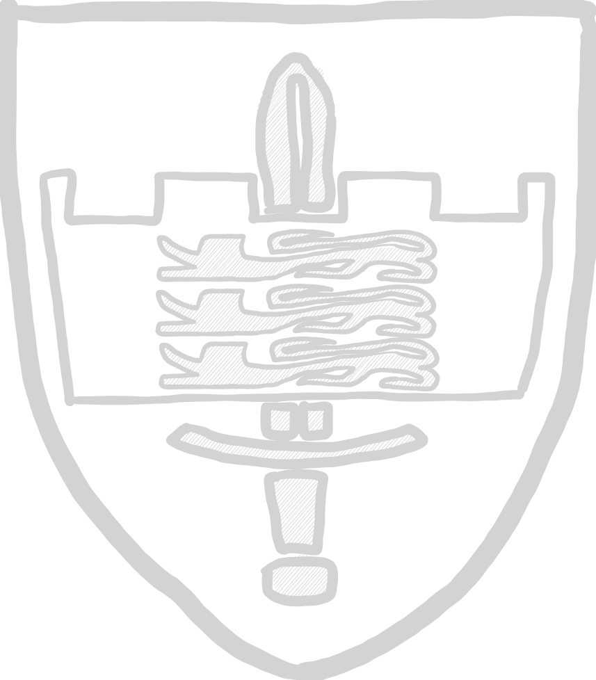
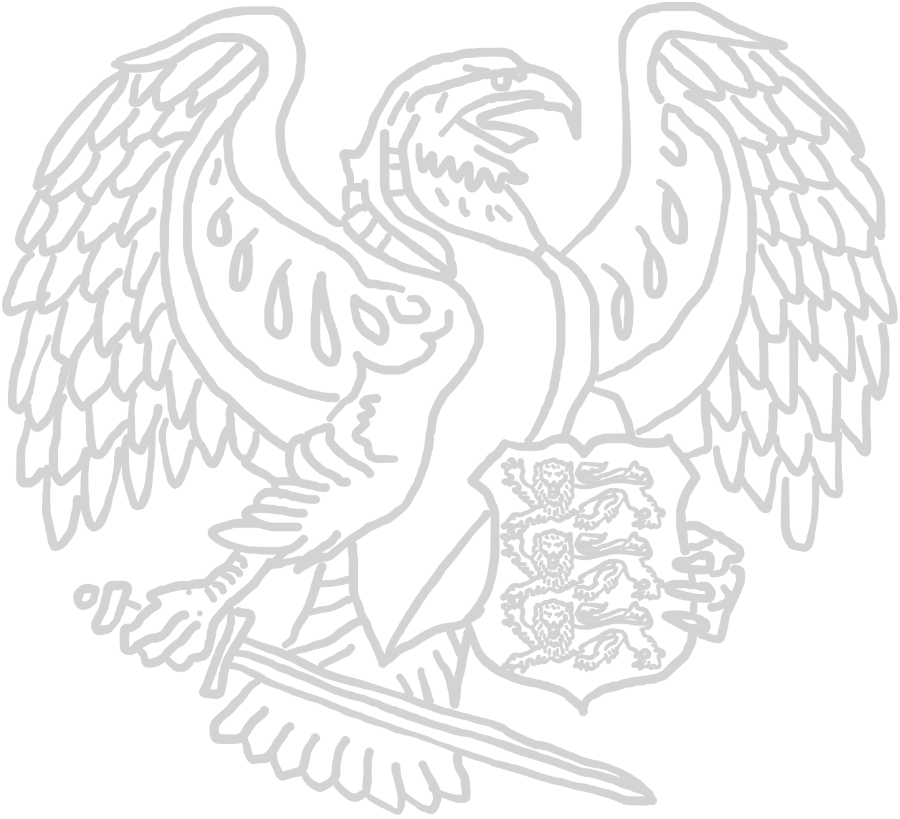

# 1. Estonian Division

*Emblem of the 1. Estonian Division*

*Emblem of the Kaitseliig, the Estonian Defense League*

The combined remaining forces fighting for the liberation of Ida Viru. While not
a large force in comparison to its neighbours Russia or Finland, the estonian
army is one of the few in NATO actually having a budget of 2% of GDP. With well-
equipped infantry brigades, modern Combat Vehicle 90 and a modern technology stack,
the estonian army is a capable army.

The division is bolstered by a large reservist and volunteer formation called the
Kaitseliit, or Estonian Defense League.

***

## Army modifiers

### A personal affair

The civil war is a deeply formative event for the estonian people. With such a small
country and fewer than 2 million Estonians, everyone is more or less directly
tied up in hostilities and tragedies.

As such, estonian formations are fighting tooth and nail for their country. If a unit
falls below 50% strength and has to perform a roll to morale whether they stay fighting,
they might reroll failed checks to reflect this vigilance.

*TLDR: Reroll failed morale checks on 50% loss of unit.*

***

## Platoon leader [ 1 ]

### Nooremleitnant

| Nooremleitnant | </img> |
| :---- | ---- |
| Cost | 35 pt / 50 pt / 65 pt |
| Reinforcement | up to 2 attendants (AR): 7 pt / 10 pt / 13 pt each |
| Setup | NCO (as depicted) |
| Options | - |
| Special rules | <table><tr><td><b>Rules</td><td><b>Description</td></tr><tr><td>You men, snap to action!</td><td>-</td></tr><tr><td>Command</td><td>-</td></tr></table> |

### Leitnant

| Vyresnysis leitenantas | </img> |
| :---- | ---- |
| Cost | 60 pt / 75 pt / 90 pt |
| Reinforcement | up to 2 attendants (AR): 7 pt / 10 pt / 13 pt each |
| Setup | NCO (as depicted) |
| Options | - |
| Special rules | <table><tr><td><b>Rules</td><td><b>Description</td></tr><tr><td>You men, snap to action! (2x)</td><td>-</td></tr><tr><td>Command</td><td>-</td></tr></table> |

***

## Infantry Units [ 2 - 5 ]

### Reke pooljagu

A group of recon infantry, light infantry used to observe enemy movement and
equipped with enough firepower to defend itself and fall back in case of an
overwhelming enemy force.

| Recon group | </img> |
| :---- | ---- |
| Cost | 35 pt / 50 pt / 65 pt |
| Reinforcement | up to 2 attendants (AR): 7 pt / 10 pt / 13 pt each |
| Setup | NCO (SMG) + 3 attendants (AR) |
| Options |<table><tr><td><b>Additional weapons</td><td><b>Description</td><td><b>Cost</b></td></tr><tr><td>1x DMR</td><td>Designated marksman rifle</td><td>+15 pt</td></tr><tr><td>1x LAW</td><td>Light anti-tank weapon</td><td>+20 pt</td></tr><tr><td>Smoke grenades</td><td>DM-25 smoke grenade, used for conceilment of movement.</td><td>+10 pt</td></tr></table>|
| Special rules | <table><tr><td><b>Rules</td><td><b>Description</td></tr><tr><td>Rangers</td><td>-</td></tr><tr><td>Smoke grenades (*if selected*)</td><td>One time smoke screen.  See [ruleset](../ruleset/H.E.A.T.md#smoke-grenades) for more information.</td></tr></table> |

### Eesti scouts jagu

Infantry from the Eesti Scouts Battalion.

| Scouts squad |  </img> |
| :---- | ---- |
| Cost | 45 pt / 60 pt / 75 pt |
| Reinforcement | up to 3 attendants (AR): 7 pt / 10 pt / 13 pt each |
| Setup | NCO (AR) + 3 attendants (AR) |
| Options |<table><tr><td><b>Additional weapons</td><td><b>Description</td><td><b>Cost</b></td></tr><tr><td>1x LMG</td><td>Light machine gun</td><td>+20 pt</td></tr><tr><td>1x UGL</td><td>Underbarrel grenade launcher</td><td>+10 pt</td></tr><tr><td>Explosives</td><td>Multi-purpose explosive.</td><td>+15 pt</td></tr><tr><td>Smoke grenades</td><td>DM-25 smoke grenade, used for conceilment of movement.</td><td>+10 pt</td></tr></table> |
| Special rules | <table><tr><td><b>Rules</td><td><b>Description</td></tr><tr><td>Smoke grenades (*if selected*)</td><td>One time smoke screen.  See [ruleset](../ruleset/H.E.A.T.md#smoke-grenades) for more information.</td></tr><tr><td>Sprengrohr</td><td>See [ruleset](../ruleset/H.E.A.T.md#bangalores) for more information.</td></tr></table> |

### Jalaväe jagu

Mechanized infantry, operating in conjunction with the armoured vehicles of the
estonian ground forces.

| Armoured Infantry group | </img> |
| :---- | ---- |
| Cost | 35 pt / 50 pt / 65 pt |
| Reinforcement | up to 5 attendants (AR): 7 pt / 10 pt / 13 pt each |
| Setup | NCO (AR) + 3 attendants (AR) |
| Options |<table><tr><td><b>Additional weapons</td><td><b>Description</td><td><b>Cost</b></td></tr><tr><td>2x LMG</td><td>Light machine gun</td><td>+20 pt each</td></tr><tr><td>1x UGL</td><td>Underbarrel grenade launcher</td><td>+10 pt</td></tr><tr><td>1x LAW</td><td>Light anti-tank weapon</td><td>+20 pt</td></tr></table> |
| Special rules | - |

### Kaitseliit jagu

The estonian Kaitseliit is a paramilitary/reservist force of civilian volunteers
which can be mobilized during times of war. They have a separate stockpile of
weaponry from the normal army, are equipped with AK4s, MG3s and Ksp-58Bs.

| Paramilitary Infantry group | </img> |
| :---- | ---- |
| Cost | 35 pt / - / - |
| Reinforcement | up to 5 attendants (AR): 7 pt / 10 pt / 13 pt each |
| Setup | NCO (AR) + 3 attendants (AR) |
| Options |<table><tr><td><b>Additional weapons</td><td><b>Description</td><td><b>Cost</b></td></tr><tr><td>1x LMG</td><td>Light machine gun</td><td>+20 pt</td></tr><tr><td>1x LAW</td><td>Light anti-tank weapon</td><td>+20 pt</td></tr></table> |
| Special rules | <table><tr><td><b>Rules</td><td><b>Description</td></tr><tr><td>Green</td><td>-</td></tr></table> |

### Territorial Reserve Volunteers

All baltic states have relatively large territorial reserves, made up from
volunteers and former military servicemen.

| Volunteer squad | </img> |
| :---- | ---- |
| Cost | 30 pt / - / - |
| Reinforcement | up to 3 attendants (AR): 7 pt / - / - |
| Setup | NCO (AR) + 3 attendants (AR) |
| Options |<table><tr><td><b>Additional weapons</td><td><b>Description</td><td><b>Cost</b></td></tr><tr><td>2x LMG</td><td>Light machine gun</td><td>+20 pt each</td></tr></table><table><tr><td><b>Optional rules</td><td><b>Description</td><td><b>Cost</b></td></tr><tr><td>Shirkers</td><td>-</td><td>-2 pt each</td></tr></table> |
| Special rules | <table><tr><td><b>Rules</td><td><b>Description</td></tr><tr><td>Green</td><td>-</td></tr></table> |

***

## Combat support units [ 0 - 1 ]

### Lahingpioneerid jagu

Support infantry, used to clear terrain or restrict enemy movement.

| Engineers group | </img> |
| :---- | ---- |
| Cost | 40 pt / 55 pt / 70 pt |
| Reinforcement | up to 5 attendants (SMG): 7 pt / 10 pt / 13 pt each |
| Setup | NCO (SMG) + 2 attendants (SMG) |
| Options |<table><tr><td><b>Additional weapons</td><td><b>Description</td><td><b>Cost</b></td></tr><tr><td>1x LMG</td><td>Light machine gun</td><td>+20 pt</td></tr><tr><td>Explosives</td><td>Multi-purpose explosive.</td><td>+15 pt</td></tr><tr><td>Mines</td><td>See IED section in [ruleset](../ruleset/H.E.A.T.md#improvised-explosive-devices-ied-and-mines). They behave the same as IEDs, but can't be disguised. Conventional forces don't use decoys.<td>+20 pt</td></tr></table> |
| Special rules | <table><tr><td><b>Rules</td><td><b>Description</td></tr><tr><td>Explosives</td><td>See [ruleset](../ruleset/H.E.A.T.md#explosives) for more information.</td></tr><tr><td>Engineers</td><td>See [ruleset](../ruleset/H.E.A.T.md#engineer) for more information.</td></tr></table> |

### Sako TRG-22 sniper team

| TRG-22 sniper team | </img> |
| :---- | ---- |
| Cost | 35 pt / 50 pt / 65 pt |
| Reinforcement | - |
| Setup | NCO (SNIPER) + 1 attendant (SMG) |
| Options | - |
| Special rules | <table><tr><td><b>Rules</td><td><b>Description</td></tr><tr><td>Sniper</td><td>-</td></tr><tr><td>Team</td><td>-</td></tr></table> |

### M82 AMR team

Anti materiell rifle sniper team.

| M82 AMR team | </img> |
| :---- | ---- |
| Cost | 45 pt / 60 pt / 75 pt |
| Reinforcement | - |
| Setup | NCO (AMR) + 1 attendant (SMG) |
| Options | - |
| Special rules | <table><tr><td><b>Rules</td><td><b>Description</td></tr><tr><td>Sniper</td><td>-</td></tr><tr><td>Team</td><td>-</td></tr><tr><td>Fixed</td><td>-</td></tr></table> |

### Medical specialist

| Medic | </img> |
| :---- | ---- |
| Cost | - / - / 45 pt |
| Reinforcement | - |
| Setup | NCO (unarmed) |
| Options | - |
| Special rules | <table><tr><td><b>Rules</td><td><b>Description</td></tr><tr><td>Medic</td><td>-</td></tr></table> |

***

## Machine gun team [ 0 - 1 ]

### MG3/Ksp 58 MMG team

Main machine gun unit for infantry warfare, as HMGs are usually only reserved for
vehicle mounts.

| MMG team | </img> |
| :---- | ---- |
| Cost | 35 pt / 50 pt / 65 pt |
| Reinforcement | - |
| Setup | NCO (MMG) + 2 loaders (SMG) |
| Options | - |
| Special rules | <table><tr><td><b>Rules</td><td><b>Description</td></tr><tr><td>Team</td><td>-</td></tr><tr><td>Fixed</td><td>-</td></tr></table> |

### B-300 weapon system team

A special dual warhead with a delayed high explosive using the breach opened by
the hollow point. The team consists of a gunner and a loader and is used as a
direct fire team against infantry in buildings and bunkers, or light vehicles.

| HE RPG team | </img> |
| :---- | ---- |
| Cost | 49 pt / 70 pt / 91 pt |
| Reinforcement | - |
| Setup | NCO (AGL) + 1 loader (SMG) |
| Options | - |
| Special rules | <table><tr><td><b>Rules</td><td><b>Description</td></tr><tr><td>Team</td><td>-</td></tr><tr><td>Fixed</td><td>-</td></tr><tr><td>Backblast</td><td>See [ruleset](../ruleset/H.E.A.T.md#anti-tank-guided-missiles-atgm) for more information.</td></tr><tr><td>Bunker Buster round</td><td>HE 3" value attack, with the same range  as a standard RPG.</td></tr></table> |

***

## Anti-Tank team [ 0 - 1 ]

### Carl-Gustav M2/3/4 team

Anti-tank rocket team, equipped with a Carl Gustav anti tank recoilless rifle.

| RPG team | </img> |
| :---- | ---- |
| Cost | 42 pt / 60 pt / 78 pt |
| Reinforcement | - |
| Setup | NCO (AGL) + 1 loader (SMG) |
| Options | <table><table><tr><td><b>Rules</td><td><b>Description</td><td><b>Cost</td></tr><tr><td>Tandem HEAT Charge</td><td>Heavier charge than  normal round, but less range. Check [ruleset](../ruleset/H.E.A.T.md#tandem-heat-charges) for details.</td><td>+15 pt</td></tr></table> |
| Special rules | <table><tr><td><b>Rules</td><td><b>Description</td></tr><tr><td>Team</td><td>-</td></tr><tr><td>Fixed</td><td>-</td></tr><tr><td>Backblast</td><td>See [ruleset](../ruleset/H.E.A.T.md#anti-tank-guided-missiles-atgm) for more information.</td></tr></table> |

### FMG-48 Javelin team

Anti-tank guided missile team, a valid threat to any armoured vehicle.

| ATGM team | </img> |
| :---- | ---- |
| Cost | 60 pt / 75 pt / 90 pt |
| Reinforcement | - |
| Setup | NCO (ATGM) + 2 loaders (SMG) |
| Options |<table><tr><td><b>Additional weapons</td><td><b>Description</td><td><b>Cost</b></td></tr><tr><td>Fire-And-Forget</td><td>Weapon team is not required to stay stationary during flight.  See ATGM section in [ruleset](../ruleset/H.E.A.T.md#anti-tank-guided-missiles-atgm).<td>+20 pt</td></tr></table> |
| Special rules | <table><tr><td><b>Rules</td><td><b>Description</td></tr><tr><td>Team</td><td>-</td></tr><tr><td>Fixed</td><td>-</td><tr><td>ATGM</td><td>See [ruleset](../ruleset/H.E.A.T.md#anti-tank-guided-missiles-atgm) for more information.</td></tr><tr><td>Backblast</td><td>See [ruleset](../ruleset/H.E.A.T.md#anti-tank-guided-missiles-atgm) for more information.</td></tr></table> |

### MILAN 2 team

The MILAN (*Missile d′Infanterie léger antichar*) is a light anti tank missile
system. The projectile is wire guided.

| ATGM team | </img> |
| :---- | ---- |
| Cost | 60 pt / 75 pt / 90 pt |
| Reinforcement | - |
| Setup | NCO (ATGM) + 2 loaders (SMG) |
| Options | - |
| Special rules | <table><tr><td><b>Rules</td><td><b>Description</td></tr><tr><td>Team</td><td>-</td></tr><tr><td>Fixed</td><td>-</td><tr><td>ATGM</td><td>See [ruleset](../ruleset/H.E.A.T.md#anti-tank-guided-missiles-atgm) for more information.</td></tr><tr><td>Backblast</td><td>See [ruleset](../ruleset/H.E.A.T.md#anti-tank-guided-missiles-atgm) for more information.</td></tr></table> |

### 90mm Pvpj-1110 recoilless rifle team

The Pansarvärnspjäs 1110, commonly abbreviated as Pvpj-1110 and nicknamed
"stove pipe", is a swedish anti tank recoilless rifle. It is mounted on a one-axial
carriage and can be towed.

| Recoilless rifle team | </img> |
| :---- | ---- |
| Cost | tbd |
| Reinforcement | - |
| Setup | NCO (MEDIUM AT GUN) + 2 loaders (PISTOL) |
| Options | - |
| Special rules | <table><tr><td><b>Rules</td><td><b>Description</td></tr><tr><td>Team</td><td>-</td></tr><tr><td>Fixed</td><td>-</td></table> |

***

## Drone team [ 0 - 1 ]

### AeroVironment RQ-20 Puma

The RQ-20 Puma is an american made fixed wing reconnaissance drone system used
to observe enemy formations.

| Recon UAV team | </img> |
| :---- | ---- |
| Cost | 41 pt / 52 pt / 63 pt |
| Reinforcement | up to 2 attendants: 7 pt / 10 pt / 13 pt |
| Setup | NCO (PDW) |
| Options | - |
| Special rules | <table><tr><td><b>Rules</td><td><b>Description</td></tr><tr><td>Fixed</td><td>-</td></tr><tr><td>UAV</td><td>Team operates a small UAV with varying mission role. Detailed description in [ruleset](../ruleset/H.E.A.T.md#drones). </td></tr><tr><td>On-map Operator</td><td>Operator of unit is present on map.</td></tr><tr><td>Quadrocopter</td><td>Drone is propelled by multiple rotors. </td></tr></table> |

### Threod Systems Stream C VTOL

A versatile fixed wing drone design with a large payload weight and range. Used
as an intelligence and surveillance system with a MWIR camera pod.

In this variant, the drone is operated off map. See [ruleset](../ruleset/H.E.A.T.md#drones) for more detailed informations.

| UAV team | </img> |
| :---- | ---- |
| Cost | 51 pt / 62 pt / 73 pt |
| Reinforcement | - |
| Setup | UAV |
| Options |<table><tr><td><b>Variants</td><td><b>Description</td><td><b>Cost</b></td></tr><tr><td>MWIR Gimbal</td><td>All artillery units which operate via this spotter get use 2D6 for its attack move and may use the preferrable outcome.<td>+25 pt</td></tr></table> |
| Special rules | <table><tr><td><b>Rules</td><td><b>Description</td></tr><tr><td>Fixed</td><td>-</td></tr><tr><td>UAV</td><td>Team operates a small UAV with varying mission role. Detailed description in [ruleset](../ruleset/H.E.A.T.md#drones). </td></tr><tr><td>Off-map Operator</td><td>Operator is located off map.</td></tr><tr><td>Fixed Wing</td><td>Drone has fixed wing design.</td></tr><tr><td>VTOL</td><td>Unit is able to start and land without being trown or launched.</td></tr></table> |

### THeMIS Operator

As if taken straight from a science fiction movie, the THeMIS is a ground based
drone with a modular flatbed design. It can operate as a mule for logistical
purposes on a group level, be equipped with a camera pod for reconnaissance
missions, or be fielded with remote weapon stations in a support or attack role.

| THeMIS |  </img> |
| :---- | ---- |
| Cost | tbd |
| Reinforcement | up to 2 attendants: 7 pt / 10 pt / 13 pt |
| Setup | NCO (PDW) |
| Options | <table><tr><td><b>Variant<b></td><td><b>Description<b></td><td><b>Modifiers<b></td><td><b>Cost</td></tr><tr><td>Observe</td><td>Recon unit. Serves as a platoon spotter.</td><td>-</td><td>+ 0 pt</td></tr><tr><td>Combat Support</td><td>Equipped with singular MMG. Remote controlled weapon station.</td><td><ul><li>turret mounted</ul></td><td>+ 15 pt</td></tr><tr><td>Combat ADDER</td><td>Combat Version with remote weapon station. Equipped with:<ul><li>CIS40 AGL</li><li>CIS50MG HMG</li><li>7.62 COAX MMG</li></ul></td><td><ul><li>turret mounted</li><li>co-axial</ul></td><td>+ 70 pt</td></tr></tr></table> Additionally, the ADDER Variant are allowed to buy the following smoke screen. <table><tr><td><b>Variant<b></td><td><b>Description<b></td><td><b>Modifiers<b><td><b>Cost</td></td></tr><tr><td>Smoke Screen</td><td>Smoke grenade launcher.   Detailed rules see [ruleset](../ruleset/H.E.A.T.md#smoke-screens). </td><td><ul><li>hull-mounted</li><li>front-facing</li></ul></td><td>+ 15 pt</td></tr></table>|

***

## Mortar team [ 0 - 1 ]

### 81mm medium mortar team

Medium mortar team at infantry group level, models fielded by the estonian army
include the B-455, M252 and L16A1, all 81mm.

| 81mm medium mortar team | </img> |
| :---- | ---- |
| Cost | 35 pt / 50 pt / 65 pt |
| Reinforcement | Spotter +10 pt |
| Setup | NCO (MEDIUM MORTAR) + 1 loader (PISTOL) |
| Options | - |
| Special rules | <table><tr><td><b>Rules</td><td><b>Description</td></tr><tr><td>Team</td><td>-</td></tr><tr><td>Fixed</td><td>-</td></tr><tr><td>HE 2"</td><td>-</td></tr><tr><td>Indirect Fire</td><td>-</td></tr><tr><td>Spotter</td><td>-</td></tr></table> |

### m/41D/2B11 120 mm heavy mortar team

heavy mortar team.

| 120mm heavy mortar team | </img> |
| :---- | ---- |
| Cost | 46 pt / 65 pt / 84 pt |
| Reinforcement | Spotter (PDW) +10 pt |
| Setup | NCO (HEAVY MORTAR) + 2 loader (PISTOL) |
| Options | - |
| Special rules | <table><tr><td><b>Rules</td><td><b>Description</td></tr><tr><td>Team</td><td>-</td></tr><tr><td>Fixed</td><td>-</td></tr><tr><td>HE 3"</td><td>-</td></tr><tr><td>Indirect Fire</td><td>-</td></tr><tr><td>Spotter</td><td>-</td></tr></table> |

***

## Artillery [ 0 - 1 ]

### H61-37 105mm

A swedish designed light howitzer system used by the estonian armed forces.

| H61-37 105mm light howitzer | </img> |
| :---- | ---- |
| Cost | 40 pt / 50 pt / 60 pt |
| Reinforcement | Spotter (PDW) +10 pt |
| Setup | NCO (LIGHT HOWITZER) + 3 loader (PISTOL) |
|Options|- |
| Special rules | <table><tr><td><b>Rules</td><td><b>Description</td></tr><tr><td>Team</td><td>-</td></tr><tr><td>Fixed</td><td>-</td></tr><tr><td>HE 2"</td><td>-</td></tr><tr><td>Howitzer</td><td>-</td></tr><tr><td>Spotter</td><td>-</td></tr></table> |

### D-30 122mm Howitzer

The D-30 howitzer is a soviet design capable of firing 122mm calibre artillery
rounds. It has been produced since the 60s and still is in production and
active service all over the world.

| D-30 122mm medium Howitzer | </img> |
| :---- | ---- |
| Cost | 60 pt / 75 pt / 90 pt |
| Reinforcement | Spotter (PDW) +10 pt |
| Setup | NCO (MEDIUM HOWITZER) + 3 loader (PISTOL) |
| Options |- |
| Special rules | <table><tr><td><b>Rules</td><td><b>Description</td></tr><tr><td>Team</td><td>-</td></tr><tr><td>Fixed</td><td>-</td></tr><tr><td>HE 3"</td><td>-</td></tr><tr><td>Howitzer</td><td>-</td></tr><tr><td>Spotter</td><td>-</td></tr></table> |

### 155 mm FH-70

The FH-70 howitzer is a towed artillery system in calibre 155mm. It was co-developed
by several NATO and western alligned nations and serves in a multitude of armies
to this day.

| 155 mm FH-70 heavy howitzer | </img> |
| :---- | ---- |
| Cost | 92 pt / 115 pt / 138 pt |
| Reinforcement | Spotter (PDW) +10 pt |
| Setup | NCO (HEAVY HOWITZER) + 4 loader (PISTOL) |
| Options |- |
| Special rules | <table><tr><td><b>Rules</td><td><b>Description</td></tr><tr><td>Team</td><td>-</td></tr><tr><td>Fixed</td><td>-</td></tr><tr><td>HE 4"</td><td>-</td></tr><tr><td>Howitzer</td><td>-</td></tr><tr><td>Spotter</td><td>-</td></tr></table> |

***

## Operational Reinforcements [ 0 - 1 ]

### PzH 2000 Battery Observer

| Artillery forward observer | </img> |
| :---- | ---- |
| Cost | - pt / 100 pt / 115 pt |
| Reinforcement | up to 2 attendants (SMG) 7 pt / 10 pt / 13 pt each |
| Setup | NCO (SMG) |
| Options |- |
| Special rules | - |

### Robinson R44 Observer

The Robinson R44 is a lightweight helicopter usually used as a rotocraft trainer
vehicle, which was repurposed in an artillery oberver role.

| Robinson R44 Artillery Observer | </img> |
| :---- | ---- |
| Cost | tbd |
| Capacity | - |
| Damage value | 6+ Light Helicopter |
| Default weapon configuration | - |
| Options | - |
| Special rules | <table><tr><td><b>Rules</td><td><b>Description</td></tr><tr><td>Artillery Observer</td><td>-</td></tr></table> |

***

## Anti-Air systems [ 0 - 1 ]

### PPZR Piorun 72mm MANPADS team

PPZR Piorun MANPADS are a light anti-air system donated by the polish armed forces
to the estonian army. They were developed in Poland from 2010-15 as a modernization
of anti air capability.

| PPZR Piorun 72mm MANPADS team | </img> |
| :---- | ---- |
| Cost | 35 pt / 50 pt / 65 pt |
| Reinforcement | up to 2 attendants (SMG) 7 pt / 10 pt / 13 pt each |
| Setup | NCO (LIGHT MANPADS) + 1 loader (SMG) |
| Options | - |
| Special rules | <table><tr><td><b>Rules</td><td><b>Description</td></tr><tr><td>Team</td><td>-</td></tr><tr><td>Fixed</td><td>-</td></tr><tr><td>Backblast</td><td>See [ruleset](../ruleset/H.E.A.T.md#anti-tank-guided-missiles-atgm) for more information.</td></tr><tr><td>MANPADS</td><td>See [ruleset](../ruleset/H.E.A.T.md#manportable-air-defense-systems-manpads) for more information.</td></tr></table> |

### MANPADS Mistral team

Small team of infantry with a MANPADS Mistral Surface-to-air-missile launcher.

| Mistral MANPADS team | </img> |
| :---- | ---- |
| Cost | 50 pt / 65 pt / 80 pt |
| Reinforcement | up to 2 attendants (SMG) 7 pt / 10 pt / 13 pt each |
| Setup | NCO (MANPADS) + 1 loader (SMG) |
| Options | - |
| Special rules | <table><tr><td><b>Rules</td><td><b>Description</td></tr><tr><td>Team</td><td>-</td></tr><tr><td>Fixed</td><td>-</td></tr><tr><td>Backblast</td><td>See [ruleset](../ruleset/H.E.A.T.md#anti-tank-guided-missiles-atgm) for more information.</td></tr><tr><td>MANPADS</td><td>See [ruleset](../ruleset/H.E.A.T.md#manportable-air-defense-systems-manpads) for more information.</td></tr></table> |

### ZU-23-2 anti air autocannon

The ZU-23-2 is a towed 23 mm anti-aircraft twin autocannon.

| ZU-23-2 AA gun team | </img> |
| :---- | ---- |
| Cost | 40 / 51 / 62 pt |
| Reinforcement | up to 2 attendants (SMG) 7 pt / 10 pt / 13 pt each |
| Setup | NCO (MEDIUM AUTOCANNON) + 2 loader (SMG) |
| Options | - |
| Special rules | <table><tr><td><b>Rules</td><td><b>Description</td></tr><tr><td>Team</td><td>-</td></tr><tr><td>Fixed</td><td>-</td></tr></table> |

***

## Armoured Personell Carriers / Infantry Fighting Vehicles [ 0 - 2 ]

### Mamba Mk2 EE

A south african design and used in small numbers in Afghanistan and Iraq. It
utilizes an Unimog chassis. The estonian army uses it in small numbers.

| Mamba Mk2 EE | </img> |
| :---- | ---- |
| Cost | tbd |
| Capacity | 3 soldiers |
| Damage value | 7+ Armoured Carrier |
| Default weapon configuration |- |
| Options | _As a reminder, only one option may be chosen._<table><tr><td><b>Main weapon options</td><td><b>Description</td><td>Modifiers</td><td><b>Cost</b></td></tr><tr><td>Pintle mounted 7.62mm MMG</td><td>Top mounted MMG</td><td><ul><li>pintle-mounted</li><li>open-topped</li></ul></td><td>+ 15 pt</td></tr><tr><td>Pintle mounted 12.7mm HMG</td><td>Top mounted HMG</td><td><ul><li>pintle-mounted</li><li>open-topped</li></ul></td><td>+ 25 pt</td></tr><tr><td>Pintle mounted 40mm AGL</td><td>Top mounted AGL</td><td><ul><li>pintle-mounted</li><li>open-topped</li></ul></td><td>+ 35 pt</td></tr></table> |
| Special rules | <table><tr><td><b>Rules</td><td><b>Description</td></tr><tr><td>Open-topped</td><td>-</td></tr></table> |

### Volvo Tbg "Terrain Vehicle 11"

A late 60s design with a high ground clearance used for a range of roles. The
estonian military uses it as a troop transport or as a weapon platform.

| Volvo Tgb| </img> |
| :---- | ---- |
| Cost | tbd |
| Capacity | 8 soldiers |
| Damage value | +6 Soft-Skinned Vehicve |
| Default weapon configuration | - |
| Options | Choosing a vehicle weapon removes any transport capacity from the vehicle.<table><tr><td><b>Additional weapons</td><td><b>Description</td><td>Modifiers</td><td><b>Cost</b></td></tr><tr><td>MMG</td><td>Medium machine gun</td><td><ul><li>pintle-mounted</li><li>open-topped</li></ul></td><td>+15 pt</td></tr><tr><td>HMG</td><td>Heavy machine gun</td><td><ul><li>pintle-mounted</li><li>open-topped</li></ul></td><td>+ 25 pt</td></tr><tr><td>SPG-9</td><td>recoilless rocket grenade launcher</td><td><ul><li>pintle-mounted</li><li>open-topped</li></ul></td><td>+ 35 pt</td></tr></table> |
| Special rules | <table><tr><td><b>Rules</td><td><b>Description</td></tr><tr><td>Open-Topped _(if selected)_</td><td>-</td></tr></table> |

### M113

A true workhorse of NATO forces, the M113 comes in dozens of variants and has
been used by more countries than not since the 1960s. These vehicles are part
of a binational armoured formation with the polish forces and sponsored by
the polish army.

| M113 | </img> |
| :---- | ---- |
| Cost | 100 pt / 125 pt / 140 pt |
| Capacity | 11 soldiers |
| Damage value | 7+ Armoured Carrier |
| Default weapon configuration | <table><tr><td><b>Weapon systems</td><td><b>Description</td><td>Modifiers</td><tr><td>Smoke Screen</td><td>Smoke grenade launcher.   Detailed rules see [ruleset](../ruleset/H.E.A.T.md#smoke-screens). </td><td><ul><li>hull-mounted</li><li>front-facing</li></ul></tr></table> |
| Options |<table><tr><td><b>Rules</td><td><b>Description</td><td><b>Cost</b></td></tr><tr><td>M577  *Command Vehicle*</td><td>-  *This removes the ability to use any main weapon option, the IFV rule or use this vehicle as a troop transport.*</td><td>+40 pt</td></tr><tr><td>Medic Vehicle</td><td>-  *This removes the ability to use any main weapon option, the IFV rule or use this vehicle as a troop transport.*</td><td>+25 pt</td></tr></table><table><tr><td><b>Main weapon options</td><td><b>Description</td><td>Modifiers</td><td><b>Cost</b></td></tr><tr><td>TOW ATGM launcher</td><td>TOW Anti-tank guided missile launcher  Detailed rules see [ruleset](../ruleset/H.E.A.T.md#anti-tank-guided-missiles-atgm).</td><td><ul><li>pintle-mounted</li><li>open-topped</li></ul></td><td>+ 35 pt</td></tr></table><table><tr><td><b>Additional weapons</td><td><b>Description</td><td>Modifiers</td><td><b>Cost</b></td></tr><tr><td>MMG</td><td>Medium machine gun</td><td><ul><li>pintle-mounted</li><li>open-topped</li></ul></td><td>+15 pt</td></tr><tr><td>HMG</td><td>Heavy machine gun</td><td><ul><li>pintle-mounted</li><li>open-topped</li></ul></td><td>+ 25 pt</td></tr></table> |
| Special rules | <table><tr><td><b>Rules</td><td><b>Description</td></tr><tr><td>IFV _(optional)_</td><td>Detailed rules see [ruleset](../ruleset/H.E.A.T.md#ifv-rule).</td></tr><tr><td>Open-Topped _(if selected)_</td><td>-</td></tr></table> |

### BTR-80 UNsh

From the Estonian Defense League. While obsolete and difficult to maintain without
a guaranteed supply of spare parts, the BTR-80 is a relic of soviet times and the
last major surviving unit by numbers, as BMP1s and other BTR variants have largely
been retired.

| BTR-80 |  </img> |
| :---- | ---- |
| Cost | 110 pt / 120 pt / 130 pt |
| Capacity | 7 soldiers |
| Damage value | 7+ Armoured Carrier |
| Default weapon configuration | <table><tr><td><b>Weapon systems</td><td><b>Description</td><td>Modifiers</td><tr><td>Smoke Screen</td><td>Smoke grenade launcher.   Detailed rules see [ruleset](../ruleset/H.E.A.T.md#smoke-screens). </td><td><ul><li>hull-mounted</li><li>front-facing</li></ul></tr><tr><td>14.5mm KPWT</td><td>Light auto-cannon.</td><td><ul><li>turret-mounted</li></ul></td></tr><td>7.62mm PKT</td><td>Co-axial MMG.  Comes as part of turret with the autocannon.</td><td><ul><li>turret-mounted</li><li>co-axial</li></ul></td></tr></table> |
| Options | - |
| Special rules | <table><tr><td><b>Rules</td><td><b>Description</td></tr><tr><td>IFV</td><td>Detailed rules see [HEAT rules](../H.E.A.T.excalidraw).</td></tr></table> |

### Patria Parsi XA-180EST & XA-188

Two vehicles of the finnish APC family. XA-180EST is an estonian version of the
XA-180 with a domestic production line, with active combat use in Afghanistan.
The vehicle is mostly used for troop transport, but there are also medevac and
command units available to the estonian army.

Due to Finlands neutral status at the time, it refused to sell Estonia additional
vehicles to be used in the Coalition of the Willing, because of which the estonian
government was forced to buy from the XA-188 variant from the Dutch Army. The
vehicle has some modernization, but for all intents and purposes, it is a very
similar vehicle.

| XA-180EST / XA-188 | </img> |
| :---- | ---- |
| Cost | tbd |
| Capacity | 16 soldiers |
| Damage value | 7+ Armoured Carrier |
| Default weapon configuration | <table><tr><td><b>Weapon systems</td><td><b>Description</td><td>Modifiers</td><tr><td>Smoke Screen</td><td>Smoke grenade launcher.   Detailed rules see [ruleset](../ruleset/H.E.A.T.md#smoke-screens). </td><td><ul><li>hull-mounted</li><li>front-facing</li></ul></tr></table> |
| Options | <table><tr><td><b>Rules</td><td><b>Description</td><td><b>Cost</b></td></tr><tr><td>Command Vehicle</td><td>-  *This removes the ability to use any main weapon option, the IFV rule or use this vehicle as a troop transport.*</td><td>+40 pt</td></tr><tr><td>Medic Vehicle</td><td>-  *This removes the ability to use any main weapon option, the IFV rule or use this vehicle as a troop transport.*</td><td>+25 pt</td></tr></table><table><tr><td><b>Main weapon options</td><td><b>Description</td><td>Modifiers</td><td><b>Cost</b></td></tr><tr><td>HMG in Turret box</td><td>M2 Browning in a turret box,  colloquially known as a "crow's nest".</td><td><ul><li>pintle-mounted</li><li>open-topped</li><li>Gun Shield</li></ul></td><td>+ 20 pt</td></tr></table> |
| Special rules |  <table><tr><td><b>Rules</td><td><b>Description</td></tr><tr><td>IFV _(optional)_</td><td>Detailed rules see [ruleset](../ruleset/H.E.A.T.md#ifv-rule).</td></tr><tr><td>Open-Topped _(if selected)_</td><td>-</td></tr><tr><td>Gun Shield _(if turret box is selected)_</td><td>-</td></tr></table> |

### BWP-1

As part of the polish weapon package for the estonian army, some reserve BWP-1
were included for the Estonian Defense League and other reservist structures.
The vehicle is a license build BMP-1 variant which is still actively being used
in the polish forces.

| BWP-1 | </img> |
| :---- | ---- |
| Cost | tbd |
| Capacity | - |
| Damage value | 7+ Armoured Carrier |
| Options | TODO |
| Default weapon configuration | - |
| Special rules | TODO |

### CV9035EE

Armed with a Bushmaster III 35/50. The CV9035EE is an export variant of the swedish
CV90 family. It is a modular infantry fighting vehicle design with a Bushmaster
35mm autocannon in the estonian variant. It is specifically designed with a high
mobility in artic climate and swamplands, making it ideal for estonian terrain.

Currently the system has over a thousand units produced and is being operated
by 17 nations, 7 of which are NATO members.

| CV9035EE | </img> |
| :---- | ---- |
| Cost | tbd |
| Capacity | 8 soldiers |
| Damage value | 8+ Light Tank |
| Default weapon configuration | <table><tr><td><b>Weapon systems</td><td><b>Description</td><td>Modifiers</td></r><tr><td>Smoke Screen</td><td>Smoke grenade launcher.   Detailed rules see [ruleset](../ruleset/H.E.A.T.md#smoke-screens). </td><td><ul><li>hull-mounted</li><li>front-facing</li></ul></tr><tr><td>35×228mm Bushmaster III 35/50</td><td>35mm medium autocannon</td><td><ul><li>turret-mounted</li></ul></tr><tr><td> Ksp m/39</td><td>7.62mm coaxial MMG.</td><td><ul><li>turret-mounted</li><li>co-axial</li></ul></tr></table> |
| Options | - |
| Special rules | <table><tr><td><b>Rules</td><td><b>Description</td></tr><tr><td>Open-Topped (*if selected*)</td><td>-</td></tr><tr><td>IFV</td><td>Detailed rules see [HEAT rules](../H.E.A.T.excalidraw).</td></tr></table> |

***

## Reinforcing Vehicles [ 0 - 1 ]

While the brigade itself only fielded IFVs and helicopters, some older reserve
vehicles and light armoured vehicles are available.

### T-72M

Prior to the civil war, Poland formed a binational armoured brigade with the
estonian armed forces as a force projection measure. The unit is equipped with
the licence built T-72M variants Poland inherited from soviet times, which were
being faced out by Poland in favor of the M1 Abrams, Leopards, the korean K2 and
a domestic derivative called the PT-91 Twardy.

| T-72M | </img> |
| :---- | ---- |
| Cost | tbd |
| Capacity | - |
| Damage value | +9 Medium Tank |
| Default weapon configuration | <table><tr><td><b>Weapon systems</td><td><b>Description</td><td>Modifiers</td></r><tr><td>Smoke Screen</td><td>Smoke grenade launcher.   Detailed rules see [ruleset](../ruleset/H.E.A.T.md#smoke-screens). </td><td><ul><li>hull-mounted</li><li>front-facing</li></ul></tr><tr><td>125 mm 2A46M/2A46M-5m</td><td>125mm smoothbore heavy anti-tank gun</td><td><ul><li>turret-mounted</li></ul></tr><tr><td>PKT MMG</td><td>PKT MMG</td><td><ul><li>turret-mounted</li><li>co-axial</li></ul></tr></table> |
| Options | <table><tr><td><b>Additional weapons</td><td><b>Description</td><td>Modifiers</td><td><b>Cost</b></td></tr><tr><td>12.7 mm NSVT HMG</td><td>Heavy machine gun, pintle-mounted at the commander's hatch.</td><td><ul><li>pintle-mounted</li><li>open-topped</li></ul></td><td>+25 pt</td></tr></table> |
| Special rules | <table><tr><td><b>Rules</td><td><b>Description</td></tr><tr><td>Open-Topped (*if selected*)</td><td>-</td></tr></table> |

### W-3W/WA Sokół

The PZL W-3 Sokół ("Falcon") is a medium-size, twin-engine, multipurpose helicopter.
The WA Variant is equipped with a twin 23mm autocannon and four hardpoint pylons
for different weapon assets.

Part of arms donation from polish land forces to Estonia.

| W-3W/WA Sokół | </img> |
| :---- | ---- |
| Cost | 95 / 115 / 140 pt |
| Capacity | 12 soldiers |
| Damage value | 7+ Large Helicopter |
| Default weapon configuration | <table><tr><td><b>Weapon systems</td><td><b>Description</td><td>Modifiers</td></r><tr><td>GSh-23 23×115mm</td><td>medium autocannon</td><td><ul><li>hull-mounted</li><li>front-facing</li></ul></tr></table> |
| Options | *The W-3W/WA has 4 hardpoints, which can be equipped with the following weapoon pods:*<table><tr><td><b>Weapon Pod</td><td><b>Modifier</td><td><b>Cost</td></tr><tr><td>12.7mm / 7.62mm rotary gun pod</td><td><ul><li>front-facing</li><li>heavy machine gun</li><li>coaxial medium machine gun</li></ul></td><td>+40 pt/u</td></tr><tr><td>30mm autocannon pod</td><td><ul><li>front-facing</li><li>medium auto cannon</li><li>HE 1"</li></ul></td><td>+30 pt/u</td></tr><tr><td>23mm autocannon pod </td><td><ul><li>front-facing</li><li>light auto cannon</li><li>HE 1"</li></ul></td><td>+40 pt/u</td></tr><tr><td>HEAT dump rockets</td><td><ul><li>front-facing</li><li>medium rocket pod</li><li>HE 2"</li></ul></td><td>+70 pt/u</td></tr></table> |
| Special rules | Weapon special rules in Modifier tab. |

***

## Transports

### Mil Mi-2 "Hoplite"

### Mil Mi-8 "Hip"

### Robinson R44

### Sisu Parsi

### Truck

### Toyota/Range Rover

more space than jeep

### Unimog 435

### Jeep

### Boat

From the latvian national guard.
