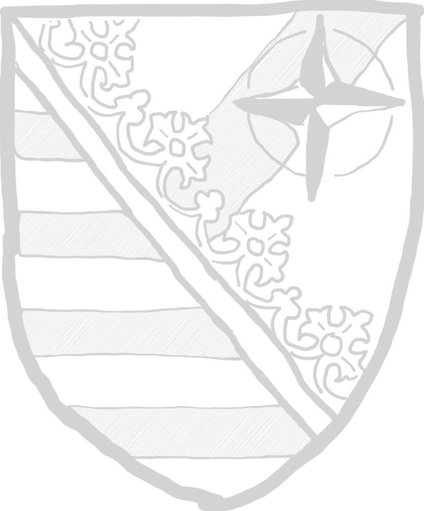
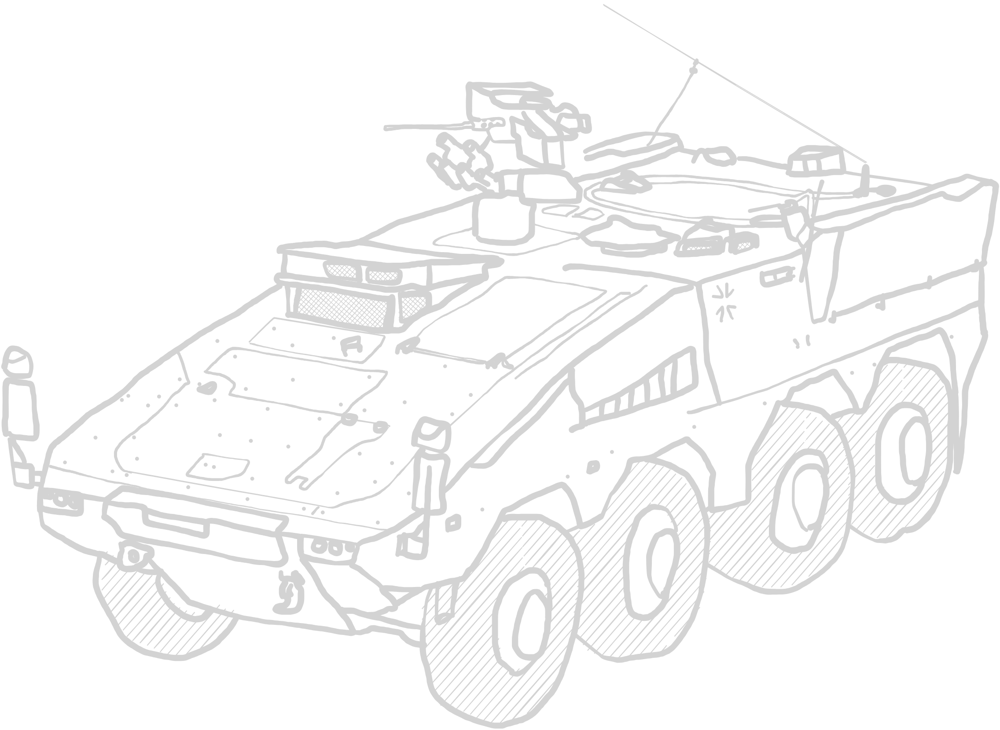
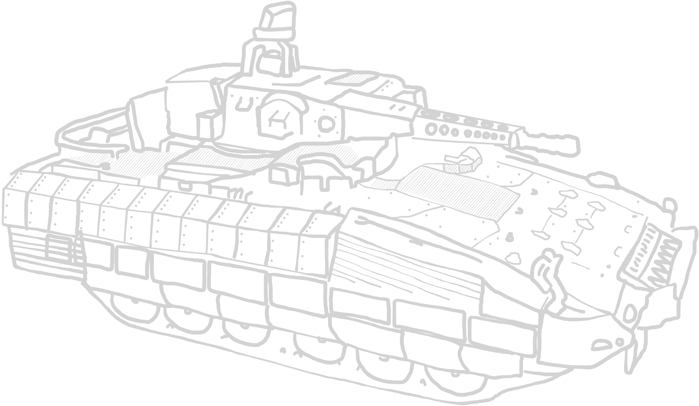

# **BLUFOR VJTF Armored Infantry Brigade**

***

## Links

[Platoon Leader](German%20VJTF%20Panzergrenadier%20Division.md#platoon-leader--1-)

[Infantry Units](German%20VJTF%20Panzergrenadier%20Division.md#infantry-units--2---5-)

[Combat Support Units](German%20VJTF%20Panzergrenadier%20Division.md#combat-support-units--0---1-)

[Machine gun](German%20VJTF%20Panzergrenadier%20Division.md#machine-gun-team--0---1-)

[AT](German%20VJTF%20Panzergrenadier%20Division.md#anti-tank-team--0---1-)

[AA](German%20VJTF%20Panzergrenadier%20Division.md#anti-air-systems--0---1-)

[Drone](German%20VJTF%20Panzergrenadier%20Division.md#drone-team--0---1-)

[Mortar](German%20VJTF%20Panzergrenadier%20Division.md#mortar-team--0---1-)

[Artillery](German%20VJTF%20Panzergrenadier%20Division.md#artillery--0---1-)

[Divisional Reinforcements](German%20VJTF%20Panzergrenadier%20Division.md#divisional-reinforcements--0---1-)

[IFVs and APCs](German%20VJTF%20Panzergrenadier%20Division.md#armoured-personnel-carriers--infantry-fighting-vehicles--0---2-)

[Heavy Armour](German%20VJTF%20Panzergrenadier%20Division.md#reinforcing-vehicles--0---1-)

[Transports](German%20VJTF%20Panzergrenadier%20Division.md#transports)

***

## Army modifiers

### (Non-)Standardization

Due to a lack of standardization in equipment between NATO forces, the
strain on logistic is higher than for other forces. Transport units must
perform an order check with 2 pin markers when moving out of reserve to
represent the stressed personnel. 

*TLDR +2 pin on all reserve transports*

### High Training standards

Many NATO soldiers had extensive pre-deployment training in JMRCs,
allowing them to perform better under stressful situations. Regular or
Veteran infantry units are allowed to reroll failed moral checks. 

*TLDR reroll failed morale checks for reg/vet infantry groups*

***

## Platoon leader **[ 1 ]**

### Leutnant

| Leutnant | </img> |
| :---- | ---- |
| Cost | 35 pt / 50 pt / 65 pt |
| Reinforcement | up to 2 attendants (AR): 7 pt / 10 pt / 13 pt each |
| Setup | NCO (as depicted) |
| Options | - |
| Special rules | <table><tr><td><b>Rules</td><td><b>Description</td></tr><tr><td>You men, snap to action!</td><td>-</td></tr><tr><td>Command</td><td>-</td></tr></table>|

### Oberleutnant

| Oberleutnant | </img> |
| :---- | ---- |
| Cost | 60 pt / 75 pt / 90 pt |
| Reinforcement | up to 2 attendants (AR): 7 pt / 10 pt / 13 pt each |
| Setup | NCO (as depicted) |
| Options | - |
| Special rules | <table><tr><td><b>Rules</td><td><b>Description</td></tr><tr><td>You men, snap to action! (2x)</td><td>-</td></tr><tr><td>Command</td><td>-</td></tr></table>|

***

## Infantry Units **[ 2 - 5 ]**

### Aufklärertrupp

Small reconnaissance infantry team, watching the area in front of friendly forces
and reporting enemy troop movement. Can be fielded on quad bikes for faster
repositioning.

| Recon team | </img> |
| :---- | ---- |
| Cost | 20 pt / 30 pt / 40 pt |
| Reinforcement | up to 2 attendants (AR): 7 pt / 10 pt / 13 pt each |
| Setup | NCO (AR) + 1 attendants (AR) |
| Options |<table><tr><td><b>Additional weapons</td><td><b>Description</td><td><b>Cost</b></td></tr><tr></tr><tr><td>1x DMR</td><td>Designated marksman rifle</td><td>+15 pt</td></tr><tr><td>Smoke grenades</td><td>DM-25 smoke grenade, used for conceilment of movement.</td><td>+10 pt</td></tr></table><table><tr><td><b>Optional rules</td><td><b>Description</td><td><b>Cost</b></td></tr><tr><td>Quad Bikes</td><td>Unit is equipped with quad bikes.  See [ruleset](../ruleset/H.E.A.T.md#quad-bikes) for more information.</td><td>+15 pt/unit</td></tr></table> |
| Special rules | <table><tr><td><b>Rules</td><td><b>Description</td></tr><tr><td>Rangers</td><td>-</td></tr><tr><td>Smoke grenades (*if selected*)</td><td>One time smoke screen.  See [ruleset](../ruleset/H.E.A.T.md#smoke-grenades) for more information.</td></tr></table> |

### Aufklärergruppe

Reconnaissance infantry group, watching the area in front of friendly forces
and reporting enemy troop movement.

| Recon infantry group | </img> |
| :---- | ---- |
| Cost | 45 pt / 60 pt / 75 pt |
| Reinforcement | up to 3 attendants (AR): 7 pt / 10 pt / 13 pt each |
| Setup | NCO (AR) + 3 attendants (AR) |
| Options |<table><tr><td><b>Additional weapons</td><td><b>Description</td><td><b>Cost</b></td></tr><tr><td>1x DMR</td><td>Designated marksman rifle</td><td>+15 pt</td></tr><tr><td>Smoke grenades</td><td>DM-25 smoke grenade, used for conceilment of movement.</td><td>+10 pt</td></tr></table> |
| Special rules | <table><tr><td><b>Rules</td><td><b>Description</td></tr><tr><td>Rangers</td><td>-</td></tr><tr><td>Smoke grenades (*if selected*)</td><td>One time smoke screen.  See [ruleset](../ruleset/H.E.A.T.md#smoke-grenades) for more information.</td></tr></table> |

### Jägergruppe

Light infantry unit, which is able to perform flanking operations without
motorized support.

| Light infantry group | </img> |
| :---- | ---- |
| Cost | 35 pt / 50 pt / 65 pt |
| Reinforcement | up to 5 attendants (AR): 7 pt / 10 pt / 13 pt each |
| Setup | NCO (AR) + 3 attendants (AR) |
| Options |<table><tr><td><b>Additional weapons</td><td><b>Description</td><td><b>Cost</b></td></tr><tr><td>1x DMR</td><td>Designated marksman rifle</td><td>+15 pt</td></tr><tr><td>1x LMG</td><td>Light machine gun</td><td>+20 pt</td></tr><tr><td>PETN Plastiksprengstoff (*Explosives*)</td><td>Multi-purpose explosive.</td><td>+15 pt</td></tr></table><table><tr><td><b>Optional rules</td><td><b>Description</td><td><b>Cost</b></td></tr><tr><td>Tough Fighters</td><td>-.</td><td>+ 1 pt each</td></tr></table> |
| Special rules | <table><tr><td><b>Rules</td><td><b>Description</td></tr><tr><td>PETN Plastiksprengstoff</td><td>See [ruleset](../ruleset/H.E.A.T.md#bangalores) for more information.</td></tr></table> |

TODO RABE als Häuserkampfbonus für +15pt?

### Panzergrenadiergruppe

Armored infantry squad, the core of any modern fighting force. Deployed as the
infanty part of german IFVs.

| Armoured infantry group | </img> |
| :---- | ---- |
| Cost | 35 pt / 50 pt / 65 pt |
| Reinforcement | up to 5 attendants (AR): 7 pt / 10 pt / 13 pt each |
| Setup | NCO (AR) + 3 attendants (AR) |
| Options |<table><tr><td><b>Additional weapons</td><td><b>Description</td><td><b>Cost</b></td></tr><tr><td>2x LMG</td><td>Light machine gun</td><td>+20 pt each</td></tr><tr><td>1x UGL</td><td>Underbarrel grenade launcher</td><td>+10 pt</td></tr><tr><td>1x LAW</td><td>Light anti-tank weapon</td><td>+20 pt</td></tr></table> |
| Special rules | - |

### NATO VJTF Rapid Response squad

Part of the NATO VJTF response regiment, during 2015 era consisting of german
armoured infantry. Able to deploy rapidly and well equipped to face most
conventional threats.

| Rapid Response squad | </img> |
| :---- | ---- |
| Cost | - / 60 pt / 75 pt |
| Reinforcement | up to 5 attendants (AR): - pt / 10 pt / 13 pt |
| Setup | NCO (AR) + 3 attendants (AR) |
| Options |<table><tr><td><b>Additional weapons</td><td><b>Description</td><td><b>Cost</b></td></tr><tr><td>2x LMG</td><td>Light machine gun</td><td>+20 pt</td></tr><tr><td>1x UGL</td><td>Underbarrel grenade launcher</td><td>+10 pt</td></tr><tr><td>1x LAW</td><td>Light anti-tank weapon</td><td>+20 pt</td></tr></table> |
| Special rules | <table><tr><td><b>Rules</td><td><b>Description</td></tr><tr><td>Stubborn</td><td>-</td></tr></table> |

### Fernspähergruppe

Special reconaissance infantry, able to strike deep into enemy territory and
report movement back to the command structure.

| Special Recon group | </img> |
| :---- | ---- |
| Cost | - / 65 pt / 80 pt |
| Reinforcement | up to 3 attendants (AR): 7 pt / 10 pt / 13 pt each |
| Setup | NCO (AR) + 3 attendants (AR) |
| Options |<table><tr><td><b>Additional weapons</td><td><b>Description</td><td><b>Cost</b></td></tr><tr><td>2x DMR</td><td>Designated marksman rifle</td><td>+15 pt</td></tr></table> |
| Special rules | <table><tr><td><b>Rules</td><td><b>Description</td></tr></tr><tr><td>Rangers</td><td>-</td></tr><tr><td>Stubborn</td><td>-</td></tr><tr><td>Recon training</td><td>These soldiers are trained to operate and maneuver  in even the toughest terrain.  When using an ADVANCE to move through rough terrain, throw a D2, and on a positive result the team may instead use the RUN distance.</td></table> |

***

## Combat support units [ 0 - 1 ]

### Panzerpioniergruppe

Support infantry, used to clear terrain or restrict enemy movement.

| Engineer group | </img> |
| :---- | ---- |
| Cost | 40 pt / 55 pt / 70 pt |
| Reinforcement | up to 5 attendants (SMG): 7 pt / 10 pt / 13 pt each |
| Setup | NCO (SMG) + 2 attendants (SMG) |
| Options |<table><tr><td><b>Additional weapons</td><td><b>Description</td><td><b>Cost</b></td></tr><tr><td>1x LMG</td><td>Light machine gun</td><td>+20 pt</td></tr><tr><td>PETN Plastiksprengstoff (*Explosives*)</td><td>Multi-purpose explosive.</td><td>+15 pt</td></tr><tr><td>Mines</td><td>See IED section in [ruleset](../ruleset/H.E.A.T.md#improvised-explosive-devices-ied-and-mines). They behave the same as IEDs, but can't be disguised. Conventional forces don't use decoys.<td>+20 pt</td></tr></table> |
| Special rules | <table><tr><td><b>Rules</td><td><b>Description</td></tr><tr><td>PETN Plastiksprengstoff</td><td>See [ruleset](../ruleset/H.E.A.T.md#bangalores) for more information.</td></tr><tr><td>Engineers</td><td>See [ruleset](../ruleset/H.E.A.T.md#engineer) for more information.</td></tr></table> |

### G22A2 sniper team

Standard issued german sniper team.

| G22A2 sniper team | </img> |
| :---- | ---- |
| Cost | 35 pt / 50 pt / 65 pt |
| Reinforcement | - |
| Setup | NCO (SNIPER) + 1 attendant (SMG) |
| Options | - |
| Special rules | <table><tr><td><b>Rules</td><td><b>Description</td></tr><tr><td>Sniper</td><td>-</td></tr><tr><td>Team</td><td>-</td></tr></table> |

### G82 AMR team

Anti materiell rifle sniper team.

| G82 AMR team | </img> |
| :---- | ---- |
| Cost | 45 pt / 60 pt / 75 pt |
| Reinforcement | - |
| Setup | NCO (AMR) + 1 attendant (SMG) |
| Options | - |
| Special rules | <table><tr><td><b>Rules</td><td><b>Description</td></tr><tr><td>Sniper</td><td>-</td></tr><tr><td>Team</td><td>-</td></tr><tr><td>Fixed</td><td>-</td></tr></table> |

### Sani

| Medic | </img> |
| :---- | ---- |
| Cost | - / - / 45 pt |
| Reinforcement | - |
| Setup | NCO (unarmed) |
|Options| - |
| Special rules | <table><tr><td><b>Rules</td><td><b>Description</td></tr><tr><td>Medic</td><td>-</td></tr></table> |

***

## Machine gun team [ 0 - 1 ]

### MG 3 MMG team

The german army still uses MG 3s in some capacity, and even though it is being
replaced by more modern MG 5s with optics and better ergonomics, it still has its
place as a general purpose machine gun. Especially on a "Dreibein"-mount it can
be used as a anti-air machine gun, as it has a special iron sight just for this
purpose on the regular model.

| MG3 MMG team |  </img> |
| :---- | ---- |
| Cost | 45 pt / 60 pt / 75 pt |
| Reinforcement | - |
| Setup | NCO (MMG) + 2 loaders (SMG) |
| Options | - |
| Special rules | <table><tr><td><b>Rules</td><td><b>Description</td></tr><tr><td>Team</td><td>-</td></tr><tr><td>Fixed</td><td>-</td></tr><tr><td>Anti-Air sight</td><td>+1 to hit against helicopters.</td></tr></table> |

### MG5 MMG team

The more modern counterpart and future main machine gun of the german forces.

| MG5 MMG team | </img> |
| :---- | ---- |
| Cost | 35 pt / 50 pt / 65 pt |
| Reinforcement | - |
| Setup | NCO (MMG) + 2 loaders (SMG) |
| Options | - |
| Special rules | <table><tr><td><b>Rules</td><td><b>Description</td></tr><tr><td>Team</td><td>-</td></tr><tr><td>Fixed</td><td>-</td></tr></table> |

### .50cal Browning HMG team

.50cal HMG team.

| .50cal Browning HMG team | </img> |
| :---- | ---- |
| Cost | 49 pt / 70 pt / 91 pt |
| Reinforcement | - |
| Setup | NCO (HMG) + 2 loaders (SMG) |
| Options | - |
| Special rules | <table><tr><td><b>Rules</td><td><b>Description</td></tr><tr><td>Team</td><td>-</td></tr><tr><td>Fixed</td><td>-</td></tr></table> |

### KSK Quad MMG

A Yamaha Grizzly 450EPS Quad with a rear-mounted MG 3 MMG. Used by special services.

| MG3 quad | </img> |
| :---- | ---- |
| Cost | - pt / 65 pt / 80 pt |
| Reinforcement | - |
| Setup | NCO ( MMG ) |
|Options| - |
| Special rules | <table><tr><td><b>Rules</td><td><b>Description</td></tr><tr><td>Team</td><td>Rulebook [pg. X]</td></tr><tr><td>Fixed</td><td>Rulebook [pg. X]</td></tr><tr><td>Quad Bike</td><td>For movement, see [ruleset](../ruleset/H.E.A.T.md#quad-bikes). Otherwise behaves like a normal infantrist regarding damage values, etc.</td></tr><tr><td>Rear-mounted MMG</td><td>Fire ark of MG3 is to the back and 90° to each side (so 9 and 3 o'clock from the drivers perspective).</td></tr><tr><td>Anti-Air sight</td><td>+1 to hit against helicopters.</td></tr></table> |

### Granatmaschinenwaffe M1 AGL team

The AGl of the german forces, the "GraMaWa M1" is a HK GMW automatic grenade
launcher. Operated and carried by three people, it is used as a direct fire or
unguided indirect fire weapon against infantry and light vehicles.

| AGL team | </img> |
| :---- | ---- |
| Cost | 50 pt / 60 pt / 75 pt |
| Reinforcement | - |
| Setup | NCO (AGL) + 2 loaders (SMG) |
| Options | - |
| Special rules | <table><tr><td><b>Rules</td><td><b>Description</td></tr><tr><td>Team</td><td>-</td></tr><tr><td>Fixed</td><td>-</td></tr><tr><td>HE 1"</td><td>-</td></tr><tr><td>AGL</td><td>Automatic grenade launcher, which rapidly fires 40mm ordnance.  Detailed description in [ruleset](../ruleset/H.E.A.T.md#automatic-grenade-launchers-agl). </td></tr></table> |

### Bunkerfaust team

A special dual warhead with a delayed high explosive using the breach opened by
the hollow point. Able to penetrate 110 mm (4.3 in) RHA, 360 mm (14 in) concrete
or 1,300 mm (4 ft 3 in) of sandbags. The team consists of a gunner and a loader
and is used as a direct fire team against infantry in buildings and bunkers, or
light vehicles.

| HE RPG team | </img> |
| :---- | ---- |
| Cost | 49 pt / 70 pt / 91 pt |
| Reinforcement | - |
| Setup | NCO (AGL) + 1 loader (SMG) |
| Options | - |
| Special rules | <table><tr><td><b>Rules</td><td><b>Description</td></tr><tr><td>Team</td><td>-</td></tr><tr><td>Fixed</td><td>-</td></tr><tr><td>Backblast</td><td>See [ruleset](../ruleset/H.E.A.T.md#anti-tank-guided-missiles-atgm) for more information.</td></tr><tr><td>Bunker Buster round</td><td>HE 3" value attack, with the same range  as a standard RPG.</td></tr></table> |

***

## Anti-Tank team [ 0 - 1 ]

### PzF 3 team

Anti-tank rocket team, equipped with Panzerfaust 3, which is the standard issue
german RPG.

| PzF 3 team | </img> |
| :---- | ---- |
| Cost | 42 pt / 60 pt / 78 pt |
| Reinforcement | - |
| Setup | NCO (AGL) + 1 loader (SMG) |
| Options | <table><table><tr><td><b>Rules</td><td><b>Description</td><td><b>Cost</td></tr><tr><td>Tandem HEAT Charge</td><td>Heavier charge than  normal round, but less range. Check [ruleset](../ruleset/H.E.A.T.md#tandem-heat-charges) for details.</td><td>+15 pt</td></tr></table> |
| Special rules | <table><tr><td><b>Rules</td><td><b>Description</td></tr><tr><td>Team</td><td>-</td></tr><tr><td>Fixed</td><td>-</td></tr><tr><td>Backblast</td><td>See [ruleset](../ruleset/H.E.A.T.md#anti-tank-guided-missiles-atgm) for more information.</td></tr></table> |

### MELLS ATGM team

Anti-tank guided missile team, a valid threat to any armoured vehicle. Equipped
with modern, israeli "Spike" missiles, under the german designation "MELLS" for
"Mehrrollenfähiges Leichtes Lenkflugkörper-System".

| MELLS ATGM team | </img> |
| :---- | ---- |
| Cost | 60 pt / 75 pt / 90 pt |
| Reinforcement | - |
| Setup | NCO (ATGM) + 2 loaders (SMG) |
| Options |<table><tr><td><b>Additional weapons</td><td><b>Description</td><td><b>Cost</b></td></tr><tr><td>Fire-And-Forget</td><td>Weapon team is not required to stay stationary during flight.  See ATGM section in [ruleset](../ruleset/H.E.A.T.md#anti-tank-guided-missiles-atgm).<td>+20 pt</td></tr></table> |
| Special rules | <table><tr><td><b>Rules</td><td><b>Description</td></tr><tr><td>Team</td><td>-</td></tr><tr><td>Fixed</td><td>-</td><tr><td>ATGM</td><td>See [ruleset](../ruleset/H.E.A.T.md#anti-tank-guided-missiles-atgm) for more information.</td></tr><tr><td>Backblast</td><td>See [ruleset](../ruleset/H.E.A.T.md#anti-tank-guided-missiles-atgm) for more information.</td></tr></table> |

***

## Micro Air Vehicles [ 0 - 1 ]

### AirRobot AR 100-B "Mikado"

Mikado is a micro quadcopter drone with several imaging capabilities. Equipped
with a normal camera, a black/white NV capable one and a thermal imaging device,
Mikado can be used to observe an area of up to one kilometer at any time of the
day. In use since 2011 and used in Afghanistan, Kosovo, Mali and other missions.

| Recon UAV team | </img> |
| :---- | ---- |
| Cost | tbd |
| Reinforcement | up to 2 attendants: 7 pt / 10 pt / 13 pt |
| Setup | NCO (PDW) |
|Options| - |
| Special rules | <table><tr><td><b>Rules</td><td><b>Description</td></tr><tr><td>Fixed</td><td>-</td></tr><tr><td>UAV</td><td>Team operates a small UAV with varying mission role. Detailed description in [ruleset](../ruleset/H.E.A.T.md#drones). </td></tr><tr><td>On-map Operator</td><td>Operator of unit is present on map.</td></tr><tr><td>Quadrocopter</td><td>Drone is propelled by multiple rotors. </td></tr></table> |

TODO recon onmap

### EMT Aladin

The "Abbildende Luftgestützte Aufklärungsdrohne im Nächstbereich" or "Airborne
Reconnaissance drone for image generation in close proximity" is a fixed wing,
lightweight drone with a camera capable of broadcasting a live-feed to its
operator. Used mainly in Afghanistan and Mali, EMT Aladin is a proven design
and a part of german reconnaissance capabilities since 2005.

| Recon UAV team |  </img> |
| :---- | ---- |
| Cost | tbd |
| Reinforcement | up to 2 attendants: 7 pt / 10 pt / 13 pt |
| Setup | NCO (PDW) |
|Options| - |
| Special rules | <table><tr><td><b>Rules</td><td><b>Description</td></tr><tr><td>Fixed</td><td>-</td></tr><tr><td>UAV</td><td>Team operates a small UAV with varying mission role. Detailed description in [ruleset](../ruleset/H.E.A.T.md#drones). </td></tr><tr><td>On-map Operator</td><td>Operator of unit is present on map.</td></tr><tr><td>Fixed wing</td><td>Drone is propelled by a rotor and fixed wings. </td></tr></table> |

### Rheinmetall KZO

The "Kleinfluggerät für Zielortung" (small guidance air vehicle) is a tactical
fixed wing air vehicle for artillery guidance.

| Artillery UAV team |  </img> |
| :---- | ---- |
| Cost | tbd |
| Reinforcement | - |
| Setup | Drone |
|Options| - |
| Special rules | <table><tr><td><b>Rules</td><td><b>Description</td></tr><tr><td>Fixed</td><td>-</td></tr><tr><td>UAV</td><td>Team operates a small UAV with varying mission role. Detailed description in [ruleset](../ruleset/H.E.A.T.md#drones). </td></tr><tr><td>Off-map Operator</td><td>Unit is operated off-map.</td></tr><tr><td>Fixed wing</td><td>Drone is propelled by a rotor and fixed wings. </td></tr><tr><td>Artillery Observer</td><td>Unit acts the same a normal artillery observer.</td></tr></table> |

***

## Mortar team [ 0 - 1 ]

### M224 LWCMS 60mm light mortar team

light mortar team.

| M224 LWCMS 60mm light mortar team | </img> |
| :---- | ---- |
| Cost | 24 pt / 35 pt / 46 pt |
| Reinforcement | Spotter (PDW) +10 pt |
| Setup | NCO (LIGHT MORTAR) + 1 loader (PISTOL) |
| Options | - |
| Special rules | <table><tr><td><b>Rules</td><td><b>Description</td></tr><tr><td>Team</td><td>-</td></tr><tr><td>HE 1"</td><td>-</td></tr><tr><td>Indirect Fire</td><td>-</td></tr><tr><td>Spotter</td><td>-</td></tr></table> |

### M252 81mm medium mortar team

Medium mortar team, equipped with a M252 mortar firing a 81mm round.

| M252 81mm medium mortar team | </img> |
| :---- | ---- |
| Cost | 35 pt / 50 pt / 65 pt |
| Reinforcement | Spotter +10 pt |
| Setup | NCO (MEDIUM MORTAR) + 1 loader (PISTOL) |
| Options | - |
| Special rules | <table><tr><td><b>Rules</td><td><b>Description</td></tr><tr><td>Team</td><td>-</td></tr><tr><td>Fixed</td><td>-</td></tr><tr><td>HE 2"</td><td>-</td></tr><tr><td>Indirect Fire</td><td>-</td></tr><tr><td>Spotter</td><td>-</td></tr></table> |

### Mörser 120 mm heavy mortar team

Tampella Mörser 120mm with "Erdsporen" for non-vehicle deployment.

| 120mm heavy mortar team | </img> |
| :---- | ---- |
| Cost | 46 pt / 65 pt / 84 pt |
| Reinforcement | Spotter (PDW) +10 pt |
| Setup | NCO (HEAVY MORTAR) + 2 loader (PISTOL) |
| Options | - |
| Special rules | <table><tr><td><b>Rules</td><td><b>Description</td></tr><tr><td>Team</td><td>-</td></tr><tr><td>Fixed</td><td>-</td></tr><tr><td>HE 3"</td><td>-</td></tr><tr><td>Indirect Fire</td><td>-</td></tr><tr><td>Spotter</td><td>-</td></tr></table> |

### M113 Mörser 120mm

M113 mounted heavy mortar system, as it is form for any good NATO army.

| 120mm heavy mortar M113 | </img> |
| :---- | ---- |
| Cost | tbd |
| Reinforcement | Spotter (PDW) +10 pt |
| Options | - |
| Damage value | 7+ Armoured Carrier |
| Default weapon configuration | <table><tr><td><b>Weapon systems</td><td><b>Description</td><td>Modifiers</td><tr><td>Nebelmittelwurfanlage (*Smoke Screen*)</td><td>Smoke grenade launcher.   Detailed rules see [ruleset](../ruleset/H.E.A.T.md#smoke-screens). </td><td><ul><li>hull-mounted</li><li>front-facing</li></ul></tr></table> |
| Special rules | <table><tr><td><b>Rules</td><td><b>Description</td></tr><tr><td>Team</td><td>-</td></tr><tr><td>Fixed</td><td>-</td></tr><tr><td>HE 3"</td><td>-</td></tr><tr><td>Indirect Fire</td><td>-</td></tr><tr><td>Spotter</td><td>-</td></tr></table> |

### Wiesel I Mörser 120mm

Wiesel I mounted heavy mortar system.

| 120mm heavy mortar Wiesel | </img> |
| :---- | ---- |
| Cost | 46 pt / 65 pt / 84 pt |
| Reinforcement | Spotter (PDW) +10 pt |
| Options | - |
| Damage value | 7+ Armoured Carrier |
| Default weapon configuration | <table><tr><td><b>Weapon systems</td><td><b>Description</td><td>Modifiers</td><tr><td>Nebelmittelwurfanlage (*Smoke Screen*)</td><td>Smoke grenade launcher.   Detailed rules see [ruleset](../ruleset/H.E.A.T.md#smoke-screens). </td><td><ul><li>hull-mounted</li><li>front-facing</li></ul></tr></table> |
| Special rules | <table><tr><td><b>Rules</td><td><b>Description</td></tr><tr><td>Team</td><td>-</td></tr><tr><td>Fixed</td><td>-</td></tr><tr><td>HE 3"</td><td>-</td></tr><tr><td>Indirect Fire</td><td>-</td></tr><tr><td>Spotter</td><td>-</td></tr></table> |

***

## Artillery [ 0 - 1 ]

German forces have a combined arm called the "Artillerietruppe", which combines
most indirect fire assets of the army. 

### Panzerhaubitze 2000 Battery Observer

Forward observer team for a artillery battery.

| Artillery forward observer | </img> |
| :---- | ---- |
| Cost | - pt / 100 pt / 115 pt |
| Reinforcement | up to 2 attendants (SMG) 7 pt / 10 pt / 13 pt each |
| Setup | NCO (SMG) |
| Options |- |
| Special rules | - |

### M113 Feuerleitpanzer

This variant of the M113 APC is used as a platoon spotter. Any indirect fire unit
that can coordinate with a spotter can use this APC as its spotter (Check [adjustments](../ruleset/H.E.A.T.md#spotters)).

| M113 | </img> |
| :---- | ---- |
| Cost | 50 pt / 55 pt / 60 pt |
| Capacity | - |
| Damage value | 7+ Armoured Carrier |
| Default weapon configuration | - |
| Options | - |
| Special rules | <table><tr><td><b>Rules</td><td><b>Description</td></tr><tr><td>Spotter</td><td>Detailed rules see [Rule adjustments](../ruleset/H.E.A.T.md#spotters).</td></tr></table> |

### Joint Fire Support Team

JFSTs are a combination of artillery observing/mortar spotter units which actively
follow along the infantry, coordinating indirect fire missions with a combat
support role.

***

## Anti-Air systems [ 0 - 1 ]

### Stinger ground team

Small team of infantry with a MANPADS Stinger Surface-to-air-missile launcher.

| MANPADS team | Infantry unit |
| :---- | ---- |
| Cost | 50 pt / 65 pt / 80 pt |
| Reinforcement | up to 2 attendants (SMG) 7 pt / 10 pt / 13 pt each |
| Setup | NCO (MANPADS) + 1 loader (SMG) |
| Options | - |
| Special rules | <table><tr><td><b>Rules</td><td><b>Description</td></tr><tr><td>Team</td><td>-</td></tr><tr><td>Fixed</td><td>-</td></tr><tr><td>Backblast</td><td>See [ruleset](../ruleset/H.E.A.T.md#anti-tank-guided-missiles-atgm) for more information.</td></tr><tr><td>MANPADS</td><td>See [ruleset](../ruleset/H.E.A.T.md#manportable-air-defense-systems-manpads) for more information.</td></tr></table> |

### MANTIS Flugabwehrsystem

### Störpanzer Hummel (Fuchs APC)

***

## Armoured personnel Carriers / Infantry Fighting Vehicles [ 0 - 2 ]

If a vehicle has the IFV rule and is chosen in an IFV role, these vehicles are connected to the first and second mandatory infantry units.

Any vehicle that has the IFV rule can also choose to ignore it and act on its own.

### Eagle IV APC

Command and Opoerations
Ambulance

### Eagle V APC

Command and Operations Variant

### Enok Armoured Car

### Yak

Tactical Transport Variant
Ambulance

### ESK Mungo

### LGS Fennek

Small and fast car used for reconnaissance and command roles.

| Fennek | Light armoured car |
| :---- | ---- |
| Cost | 60 pt / 65 pt / 70 pt |
| Capacity | 8 soldiers |
| Damage value | 7+ Armoured Carrier |
| Default weapon configuration | - |
| Options | TODO |
| Special rules | - |

### ATF Dingo 1

Mine resistant personnel carrier.

| ATF Dingo 1 | MRAP Carrier |
| :---- | ---- |
| Cost | 60 pt / 65 pt / 70 pt |
| Capacity | 2 soldiers |
| Damage value | 7+ Armoured Carrier |
| Default weapon configuration | - |
| Options | TODO |
| Special rules | - |

#### ATF Dingo 2

Larger version of the Dingo on an Unimog 5000 frame.

| ATF Dingo 2 | MRAP Carrier |
| :---- | ---- |
| Cost | 70 pt / 80 pt / 90 pt |
| Capacity | 5 soldiers |
| Damage value | 7+ Armoured Carrier |
| Default weapon configuration | - |
| Options | TODO |
| Special rules | - |

### M113

A true workhorse of NATO forces, the M113 comes in dozens of variants and has
been used by more countries than not since the 1960s. The Bundeswehr uses it
nowadays in support roles, e. g. with a 120mm, custom made mortar weapon system
in the rear.

| M113 | APC Armoured Carrier |
| :---- | ---- |
| Cost | 100 pt / 125 pt / 140 pt |
| Capacity | 11 soldiers |
| Damage value | 7+ Armoured Carrier |
| Default weapon configuration | <table><tr><td><b>Weapon systems</td><td><b>Description</td><td>Modifiers</td><tr><td>Nebelmittelwurfanlage (*Smoke Screen*)</td><td>Smoke grenade launcher.   Detailed rules see [ruleset](../ruleset/H.E.A.T.md#smoke-screens). </td><td><ul><li>hull-mounted</li><li>front-facing</li></ul></tr></table> |
| Options |<table><tr><td><b>Rules</td><td><b>Description</td><td><b>Cost</b></td></tr><tr><td>Gefechtsstand *Command Vehicle*</td><td>-  *This removes the ability to use any main weapon option, the IFV rule or use this vehicle as a troop transport.*</td><td>+40 pt</td></tr><tr><td>Medic Vehicle</td><td>-  *This removes the ability to use any main weapon option, the IFV rule or use this vehicle as a troop transport.*</td><td>+25 pt</td></tr></table><table><tr><td><b>Main weapon options</td><td><b>Description</td><td>Modifiers</td><td><b>Cost</b></td></tr><tr><td>TOW ATGM launcher</td><td>TOW Anti-tank guided missile launcher  Detailed rules see [ruleset](../ruleset/H.E.A.T.md#anti-tank-guided-missiles-atgm).</td><td><ul><li>pintle-mounted</li><li>open-topped</li></ul></td><td>+ 35 pt</td></tr><tr><td>Panzermörser 120mm heavy mortar</td><td>heavy mortar system</td><td><ul><li>hull-mounted</li><li>front-facing</li><li>open-topped</li></ul></td><td>+ 35 pt</td></tr></table><table><tr><td><b>Additional weapons</td><td><b>Description</td><td>Modifiers</td><td><b>Cost</b></td></tr><tr><td>MMG</td><td>Medium machine gun</td><td><ul><li>pintle-mounted</li><li>open-topped</li></ul></td><td>+15 pt</td></tr><tr><td>HMG</td><td>Heavy machine gun</td><td><ul><li>pintle-mounted</li><li>open-topped</li></ul></td><td>+ 25 pt</td></tr></table> |
| Special rules | <table><tr><td><b>Rules</td><td><b>Description</td></tr><tr><td>IFV _(optional)_</td><td>Detailed rules see [ruleset](../ruleset/H.E.A.T.md#ifv-rule).</td></tr><tr><td>Open-Topped _(if selected)_</td><td>-</td></tr></table> |

### TPz Fuchs 1A4/5

Almost 60 years old and still found in most platoons, the TPz Fuchs is a
versatile and reliable, if also old-fashioned, troop transport for the german
armed forces. With almost as many variants and upgrade kits as the M113, this
APC can be equipped with medical equipment, command utility or recon modifications.

| TPz Fuchs 1A4/5 | APC / IFV |
| :---- | ---- |
| Cost | 95 pt / 110 pt / 125 pt |
| Capacity | 8 soldiers |
| Damage value | 7+ Armoured Carrier |
| Default weapon configuration | <table><tr><td><b>Weapon systems</td><td><b>Description</td><td>Modifiers</td><tr><td>Nebelmittelwurfanlage (*Smoke Screen*)</td><td>Smoke grenade launcher.   Detailed rules see [ruleset](../ruleset/H.E.A.T.md#smoke-screens). </td><td><ul><li>hull-mounted</li><li>front-facing</li></ul></tr></table> |
| Options | <table><tr><td><b>Rules</td><td><b>Description</td><td><b>Cost</b></td></tr><tr><td>Gefechtsstand *Command Vehicle*</td><td>-  *This removes the ability to use any main weapon option, the IFV rule or use this vehicle as a troop transport.*</td><td>+40 pt</td></tr><tr><td>Medic Vehicle</td><td>-  *This removes the ability to use any main weapon option, the IFV rule or use this vehicle as a troop transport.*</td><td>+25 pt</td></tr></table><table><tr><td><b>Main weapon options</td><td><b>Description</td><td>Modifiers</td><td><b>Cost</b></td></tr><tr><td>Milan ATGM launcher</td><td>Milan Anti-Tank Guided Missile Launcher. Mounted at the commander's hatch in  the middle-right, blocking it for optional MG 3.  Detailed rules see [ruleset](../ruleset/H.E.A.T.md#anti-tank-guided-missiles-atgm).</td><td><ul><li>pintle-mounted</li><li>open-topped</li></ul></td><td>+ 35 pt</td></tr></table><table><tr><td><b>Additional weapons</td><td><b>Description</td><td>Modifiers</td><td><b>Cost</b></td></tr><tr><td>MG3 MMG  (*3x possible*)</td><td>Medium machine guns, either at the co-pilot's hatch (*front-right*),  the commander's hatch (*center-right*),  or the transport room hatch (*back-left*). </td><td><ul><li>pintle-mounted</li><li>open-topped</li></ul></td><td>+15 pt each</td></tr></table> |
| Special rules |  <table><tr><td><b>Rules</td><td><b>Description</td></tr><tr><td>IFV _(optional)_</td><td>Detailed rules see [ruleset](../ruleset/H.E.A.T.md#ifv-rule).</td></tr><tr><td>Open-Topped _(if selected)_</td><td>-</td></tr></table> |

### GTK Boxer

The GTK Boxer is a German-designed and manufactured Infantry Fighting Vehicle (IFV)
known for its versatility and modular design. It is part of the Boxer family of
armored vehicles, which includes various configurations for different military roles.
The GTK Boxer IFV is specifically designed to transport and support infantry
troops on the battlefield.

| GTK Boxer | APC / IFV |
| :---- | ---- |
| Cost | 90 pt / 105 pt / 120 pt |
| Capacity | 7 soldiers |
| Damage value | 7+ Armoured Carrier |
| Default weapon configuration | <table><tr><td><b>Weapon systems</td><td><b>Description</td><td>Modifiers</td><tr><td>Nebelmittelwurfanlage (*Smoke Screen*)</td><td>Smoke grenade launcher.   Detailed rules see [ruleset](../ruleset/H.E.A.T.md#smoke-screens). </td><td><ul><li>hull-mounted</li><li>front-facing</li></ul></tr></table> |
| Options |_Only one FLW can be mounted per vehicle._<table><tr><td><b>Main weapon options</td><td><b>Description</td><td>Modifiers</td><td><b>Cost</b></td></tr><tr><td>FLW 200 (7.62mm) MMG</td><td>Remote-controlled MMG</td><td><ul><li>turret-mounted</li></ul></td><td>+ 15 pt</td></tr><tr><td>FLW 200 (12.7mm) HMG</td><td>Remote-controlled HMG</td><td><ul><li>turret-mounted</li></ul></td><td>+ 25 pt</td></tr><tr><td>FLW 200 (40mm HE) GraMaWa</td><td>Remote-controlled AGL</td><td><ul><li>turret-mounted</li></ul></td><td>+ 35 pt</td></tr></table> |
| Special rules | <table<tr><td><b>Rules</td><td><b>Description</td></tr><tr><td>IFV _(optional)_</td><td>Detailed rules see [ruleset](../ruleset/H.E.A.T.md#ifv-rule).</td></tr><tr><td>AGL _(if selected)_</td><td>Detailed rules see [ruleset](../ruleset/H.E.A.T.md#automatic-grenade-launchers-agl).</td></tr><tr><td>HE 1" _(if selected)_</td><td>-</td></tr></table> |

### SPz 1A3 Marder

The Marder is a German Infantry Fighting Vehicle (IFV) that has been in service
since the 1970s. It was designed to transport infantry troops and support them
on the battlefield. While it has seen several upgrades over the years, it is
gradually being replaced by more modern IFV designs in some armed forces.

| SPz 1A3 Marder | APC / IFV |
| :---- | ---- |
| Cost | 120 pt / 135 pt / 150 pt |
| Capacity | 6 soldiers |
| Damage value | 7+ Armoured carrier |
| Default weapon configuration | <table><tr><td><b>Weapon systems</td><td><b>Description</td><td>Modifiers</td></r><tr><td>Nebelmittelwurfanlage (*Smoke Screen*)</td><td>Smoke grenade launcher.   Detailed rules see [ruleset](../ruleset/H.E.A.T.md#smoke-screens). </td><td><ul><li>hull-mounted</li><li>front-facing</li></ul></tr><tr><td>MG 3 MMG</td><td>MG 3 MMG.</td><td><ul><li>turret-mounted</li><li>co-axial</li></ul></tr><tr><td>20-mm MK 20 RH 202</td><td>20mm light autocannon</td><td><ul><li>turret-mounted</li></ul></tr></table> |
| Options | <table><tr><td><b>Rules</td><td><b>Description</td><td><b>Costs</td></tr><tr><td>Schottpanzerung</td><td>Improved armour profile adds a +1 to the armour value.</td><td>+20pt</td></tr></table><table><tr><td><b>Additional weapons</td><td><b>Description</td><td>Modifiers</td><td><b>Cost</b></td></tr><tr><td>Milan ATGM Launcher</td><td>Milan Anti-Tank Guided Missile Launcher.</td><td><ul><li>turret-mounted</li><li>co-axial</li></ul></td><td>+ 35 pt</td></tr></table> |
| Special rules | <table><tr><td><b>Rules</td><td><b>Description</td></tr><tr><td>IFV _(optional)_</td><td>Detailed rules see [ruleset](../ruleset/H.E.A.T.md#ifv-rule).</td></tr><tr><td>ATGM _(if selected)_</td><td>Detailed rules see [ruleset](../ruleset/H.E.A.T.md#anti-tank-guided-missiles-atgm).</td></tr></table> |

### SPz Puma

The Puma began its development around 1998 as a replacement for the aging Marder IFVs. As one of the heaviest and most modern APCs in the world, it features a remotely controlled weapon station, improved equipment and night fighting capabilities. The weapon station is modular and can be switched out for different purposes. It also uses the israeli Spike ATGM instead of the older MILAN system.

This vehicle is just being introduced into the Heer and is only available in small numbers for field testing.

| SPz Puma | APC / IFV |
| :---- | ---- |
| Cost | 164 pt / 179 pt / 194 pt |
| Capacity | 6 soldiers |
| Damage value | 8+ Light Tank |
| Default weapon configuration | <table><tr><td><b>Weapon systems</td><td><b>Description</td><td>Modifiers</td></r><tr><td>Nebelmittelwurfanlage (*Smoke Screen*)</td><td>Smoke grenade launcher.   Detailed rules see [ruleset](../ruleset/H.E.A.T.md#smoke-screens). </td><td><ul><li>hull-mounted</li><li>front-facing</li></ul></tr><tr><td>MG 4 MMG</td><td>MG 4 MMG.</td><td><ul><li>turret-mounted</li><li>co-axial</li></ul></tr><tr><td>30-mm-MK 30-2/ABM</td><td>30mm medium autocannon</td><td><ul><li>turret-mounted</li></ul></tr></table> |
| Options |<table><tr><td><b>Additional weapons</td><td><b>Description</td><td>Modifiers</td><td><b>Cost</b></td></tr><tr><td>Spike VR ATGM Launcher</td><td>Spike Anti-Tank Guided Missile Launcher.</td><td><ul><li>turret-mounted</li><li>co-axial</li><li>fire-and-forget</li></ul></td><td>+ 50 pt</td></tr></table> |
| Special rules | <table><tr><td><b>Rules</td><td><b>Description</td></tr><tr><td><b>Rules</td><td><b>Description</td></tr><tr><td>IFV _(optional)_</td><td>Detailed rules see [ruleset](../ruleset/H.E.A.T.md#ifv-rule).</td></tr><tr><td>ATGM</td><td>Detailed rules see [ruleset](../ruleset/H.E.A.T.md#anti-tank-guided-missiles-atgm).</td></tr><tr><td>Fire-And-Forget</td><td>Detailed rules see [ruleset](../ruleset/H.E.A.T.md#anti-tank-guided-missiles-atgm).</td></tr></table> |

### M2/M3 Bradley

| M2/M3 Bradley | APC / IFV |
| :---- | ---- |
| Cost | 134 pt / 149 pt / 164 pt |
| Capacity | 6 soldiers |
| Damage value | 7+ Armoured carrier |
| Default weapon configuration | <table><tr><td><b>Weapon systems</td><td><b>Description</td><td>Modifiers</td></r><tr><td>Nebelmittelwurfanlage (*Smoke Screen*)</td><td>Smoke grenade launcher.   Detailed rules see [ruleset](../ruleset/H.E.A.T.md#smoke-screens). </td><td><ul><li>hull-mounted</li><li>front-facing</li></ul></tr><tr><td>M240C MMG</td><td>M240C MMG.</td><td><ul><li>turret-mounted</li><li>co-axial</li></ul></tr><tr><td>25 mm M242 </td><td>25mm medium autocannon</td><td><ul><li>turret-mounted</li></ul></tr></table> |
| Options |<table><tr><td><b>Additional weapons</td><td><b>Description</td><td>Modifiers</td><td><b>Cost</b></td></tr><tr><td>TOW ATGM Launcher</td><td>TOW Anti-Tank Guided Missile Launcher.</td><td><ul><li>turret-mounted</li><li>co-axial</li></ul></td><td>+ 35 pt</td></tr></table> |
| Special rules | <table><tr><td><b>Rules</td><td><b>Description</td></tr><tr><td>IFV _(optional)_</td><td>Detailed rules see [ruleset](../ruleset/H.E.A.T.md#ifv-rule).</td></tr><tr><td>ATGM</td><td>Detailed rules see [ruleset](../ruleset/H.E.A.T.md#anti-tank-guided-missiles-atgm).</td></tr></table> |

***

## Reinforcing Vehicles [ 0 - 1 ]

### AGF Serval LIV (SO)

Special Forces Reconnaissance and Combat Support Vehicle

### Wiesel I/II

A german tankette used in a variety of roles, from ambulance and reconnaissance
to combat roles with a 20mm autocannon, a TOW, a MILAN or even with an Ozelot
anti air system. Capable of air transport with a A400M or helicopter.

### Hauptkampfpanzer Leopard 2A6

The Leopard 2A6 features a powerful 120mm smoothbore gun, advanced armor
protection, and state-of-the-art technology. With a crew of four, it is known for
its exceptional firepower, mobility, and survivability on the battlefield. The
tank's composite armor provides excellent protection against various threats,
and it is equipped with advanced fire control systems, thermal imaging, and other
modern features that enhance its accuracy and situational awareness. The Leopard
2A6 is used by several countries and is recognized for its combat effectiveness
and reliability.

| Hauptkampfpanzer  Leopard 2A6 | MBT Medium Tank |
| :---- | ---- |
| Cost | 210 pt / 225 pt / 240 pt |
| Capacity | - |
| Damage value | 9+ Medium Tank |
| Default weapon configuration | <table><tr><td><b>Weapon systems</td><td><b>Description</td><td>Modifiers</td></r><tr><td>Nebelmittelwurfanlage (*Smoke Screen*)</td><td>Smoke grenade launcher.   Detailed rules see [ruleset](../ruleset/H.E.A.T.md#smoke-screens). </td><td><ul><li>hull-mounted</li><li>front-facing</li></ul></tr><tr><td>MG 3 MMG</td><td>MG 3 MMG.</td><td><ul><li>turret-mounted</li><li>co-axial</li></ul></tr><tr><td>Rh-120 L/44 120 mm</td><td>120mm smoothbore heavy anti-tank gun</td><td><ul><li>turret-mounted</li></ul></tr></table> |
| Options |<table><tr><td><b>Additional weapons</td><td><b>Description</td><td>Modifiers</td><td><b>Cost</b></td></tr><tr><td>MG 3 MMG</td><td>Medium machine gun, pintle-mounted at the commander's hatch.</td><td><ul><li>pintle-mounted</li><li>open-topped</li></ul></td><td>+ 15 pt</td></tr></table> |
| Special rules | <table><tr><td><b>Rules</td><td><b>Description</td></tr><tr><td>Tiger Fear</td><td>-</td></tr><tr><td>Open-Topped (*if selected*)</td><td>-</td></tr></table> |

### Panzerhaubitze 2000

### MARS II MLRS

| MARS II MLRS | Armoured Carrier |
| :---- | ---- |
| Cost | 181 pt / 196 pt / 211 pt |
| Capacity | - |
| Damage value | 7+ Armoured Carrier |
| Default weapon configuration | <table><tr><td><b>Weapon systems</td><td><b>Description</td><td>Modifiers</td></r><tr><td>Nebelmittelwurfanlage (*Smoke Screen*)</td><td>Smoke grenade launcher.   Detailed rules see [ruleset](../ruleset/H.E.A.T.md#smoke-screens). </td><td><ul><li>hull-mounted</li><li>front-facing</li></ul></tr><tr><td>Cal. 298mm MLRS</td><td>Multiple Launcher Rocket System</td><td><ul><li>turret-mounted</li><li>rocket-launcher</li></ul></tr></table> |
| Options | - |
| Special rules | <table><tr><td><b>Rules</td><td><b>Description</td></tr><tr><td>Multiple Launcher</td><td>-</td></tr><tr><td>Indirect Fire</td><td>-</td></tr><tr><td>HE 3"</td><td>-</td></tr></table> |

### Unterstützungshubschrauber Eurocopter Tiger

| Unterstützungshubschrauber  Eurocopter Tiger | Medium helicopter |
| :---- | ---- |
| Cost | 145 pt / 160 pt / 175 pt |
| Capacity | - |
| Damage value | 7+ Medium Helicopter |
| Default weapon configuration | <table><tr><td><b>Weapon systems</td><td><b>Description</td><td>Modifiers</td></r><tr><td>30 mm (1.18 in) GIAT 30</td><td>medium autocannon</td><td><ul><li>hull-mounted</li><li>front-facing</li></ul></tr></table> |
| Options |<table><tr><td><b>Additional weapons</td><td><b>Description</td><td>Modifiers</td><td><b>Cost</b></td></tr><tr><td>70mm Hydra rockets</td><td></td><td><ul><li>front-facing</li><li>rocket-launcher</li></ul></td><td>+ 50 pt</td></tr></table> |
| Special rules | <table><tr><td><b>Rules</td><td><b>Description</td></tr><tr><td>Multiple Launcher (*if selected*)</td><td>-</td></tr><tr><td>Indirect Fire (*if selected*)</td><td>-</td></tr><tr><td>HE 3" (*if selected*)</td><td>-</td></tr></table> |

***

## Transports

### S-Boot

### Polaris RZR

### M113 Transport

| M113 | Armoured Carrier |
| :---- | ---- |
| Cost | 85 pt / 90 pt / 95 pt |
| Capacity | 15 soldiers |
| Damage value | 7+ Armoured Carrier |
| Default weapon configuration | <table><tr><td><b>Weapon systems</td><td><b>Description</td><td>Modifiers</td><tr><td>Nebelmittelwurfanlage (*Smoke Screen*)</td><td>Smoke grenade launcher.   Detailed rules see [ruleset](../ruleset/H.E.A.T.md#smoke-screens). </td><td><ul><li>hull-mounted</li><li>front-facing</li></ul></tr></table> |
| Options |<table><tr><td><b>Additional weapons</td><td><b>Description</td><td>Modifiers</td><td><b>Cost</b></td></tr><tr><td>MMG</td><td>Medium machine gun</td><td><ul><li>pintle-mounted</li><li>open-topped</li></ul></td><td>+15 pt</td></tr><tr><td>HMG</td><td>Heavy machine gun</td><td><ul><li>pintle-mounted</li><li>open-topped</li></ul></td><td>+ 25 pt</td></tr></table> |
| Special rules | <table><tr><td><b>Rules</td><td><b>Description</td></tr><tr><td>Open-Topped _(if selected)_</td><td>-</td></tr></table> |

### TPz Fuchs 1A4/5 Transport

| TPz Fuchs 1A4/5 | Armoured Carrier |
| :---- | ---- |
| Cost | 60 pt / 65 pt / 70 pt |
| Capacity | 8 soldiers |
| Damage value | 7+ Armoured Carrier |
| Default weapon configuration | <table><tr><td><b>Weapon systems</td><td><b>Description</td><td>Modifiers</td><tr><td>Nebelmittelwurfanlage (*Smoke Screen*)</td><td>Smoke grenade launcher.   Detailed rules see [ruleset](../ruleset/H.E.A.T.md#smoke-screens). </td><td><ul><li>hull-mounted</li><li>front-facing</li></ul></tr></table> |
| Options |<table><tr><td><b>Additional weapons</td><td><b>Description</td><td>Modifiers</td><td><b>Cost</b></td></tr><tr><td>MG3 MMG  (*3x possible*)</td><td>Medium machine guns, either at the co-pilot's hatch (*front-right*),  the commander's hatch (*center-right*),  or the transport room hatch (*back-left*). </td><td><ul><li>pintle-mounted</li><li>open-topped</li></ul></td><td>+15 pt each</td></tr></table> |
| Special rules | <table><tr><td><b>Rules</td><td><b>Description</td></tr><tr><td>Open-Topped _(if selected)_</td><td>-</td></tr></table> |

### GTK Boxer Tranport

| GTK Boxer | Armoured Carrier |
| :---- | ---- |
| Cost | 55 pt / 60 pt / 65 pt |
| Capacity | 7 soldiers |
| Damage value | 7+ Armoured Carrier |
| Default weapon configuration | <table><tr><td><b>Weapon systems</td><td><b>Description</td><td>Modifiers</td><tr><td>Nebelmittelwurfanlage (*Smoke Screen*)</td><td>Smoke grenade launcher.   Detailed rules see [ruleset](../ruleset/H.E.A.T.md#smoke-screens). </td><td><ul><li>hull-mounted</li><li>front-facing</li></ul></tr></table> |
| Options | - |
| Special rules | - |

### MAN gl Transport

| MAN gl | Soft-Skinned Vehicle |
| :---- | ---- |
| Cost | 25 pt / 30 pt / 35 pt |
| Capacity | 16 soldiers |
| Damage value | 6+ Soft-Skinned Vehicle |
| Default weapon configuration |- |
| Options | - |
| Special rules | - |

### Unimog

| Unimog | Soft-Skinned Vehicle |
| :---- | ---- |
| Cost | 20 pt / 25 pt / 30 pt |
| Capacity | 12 soldiers |
| Damage value | 6+ Soft-Skinned Vehicle |
| Default weapon configuration |- |
| Options | - |
| Special rules | - |

### Wolf G5 Jeep

| Wolf G5 Jeep | Soft-Skinned Vehicle |
| :---- | ---- |
| Cost | 15 pt / 20 pt / 25 pt |
| Capacity | 6 soldiers |
| Damage value | 6+ Soft-Skinned Vehicle |
| Default weapon configuration |- |
| Options | - |
| Special rules | - |