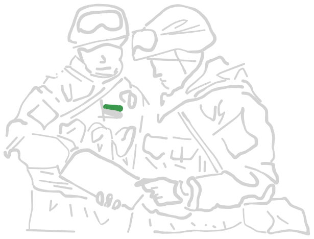

# **NSPR Volunteer Rifle Contingent**

Emblem of the Narva Armed Forces

PMC Bratstwa Logo

The NSPR has a standing force of around 10-13.000 personnel, which serve under
the umbrella of the NSPR flag. Internally, there are several factions.

The "Bratstwa" far-right, russian-nationalistic militia is the best equipped part
of the force. Their leader, Roman Sokolov, is a wealthy oligarch with ties to the
Kremlin. Most personnel enjoyed a thorough paramilitary training and their
equipment pool is modern. The entire force is estimated to consist of about
2000-2500 men.

In contrast to Bratstwa stands the majority of NSPR soldiers, which consist of
more left-leaning, mostly ethnic russian estonians, which are fighting for anything
between a sovereign, communist state, just more autonomy, frustration and pure
hartred for the West. These people come from diverse backgrounds, some have former
military training, like the soviet mandatory service or come from a estonian armed
forces background. Most have no real prior experience at all and were trained
covertly in NSPR training camps throughout the county.

The vehicle pool is a mix of former soviet equipment, some stolen western/estonian
armed forces materiell, small amounts of modern russian weaponry and just reworked
civilian technicals. Additionally, some civilian drones are used for surveillance,
as IED carriers or suicide drones.

***

## Table of content

- [Army modifiers](#army-modifiers)

- [Leadership](#leadership)
- [Infantry](#infantry)
- [Combat support](#combat-support-units)
- [Machine guns](#machine-gun-teams)
- [Anti tank teams](#anti-tank-teams)
- [Drone teams](#drone-teams)
- [Mortar teams](#mortar-teams)
- [Anti-air systems](#anti-air-systems)
- [Artillery support](#artillery-support)

- [APCs/IFVs](/factions/NSPR-vehicles.md#apcs--ifvs)
- [Heavy vehicles](/factions/NSPR-vehicles.md#heavy-vehicles)
- [Transports](/factions/NSPR-vehicles.md#transports)

***

## Army modifiers

### Territorial knowledge

Due to being accustomed to the surrounding terrain features, NSPR
forces do not have to fulfill an order check to enter the map as reserve
units.

*TLDR no order checks for all reserve transports*

### Foreign aid

As part of undisclosed weapon shipments from alligned nations, NSPR
forces receive a free medium mortar as part of their artillery section.

This unit is counted as a regular mortar with a spotter. It does not block
a mortar slot.

*TLDR free regular medium mortar with spotter*

### Old technology

Most vehicles in the NSPR forces are old, salvaged material from
soviet stockpiles, inferior to modern equipment.

These vehicle types do have to suffer one of the following modifiers:

- Slow - vehicles suffer a 50% reduction in speed.
- Unreliable - every order taken has to pass an order check.
- Understaffed - +1 pin marker taken every time the unit suffers pins.

*TLDR choose for every APC, IFV, tank or helicopter a malus.*

***

## Leadership

### Assistant Commander

| Assistant Commander | </img> |
| :---- | ---- |
| Cost | 35 pt / 50 pt / 65 pt |
| Reinforcement | up to 2 attendants (AR): 7 pt / 10 pt / 13 pt |
| Setup | NCO (as depicted) |
| Options | - |
| Special rules | <table><tr><td><b>Rules</td><td><b>Description</td></tr><tr><td>You men, snap to action!</td><td>-</td></tr><tr><td>Command</td><td>-</td></tr></table> |

### Commander

| Commander | </img> |
| :---- | ---- |
| Cost | 60 pt / 75 pt / 90 pt |
| Reinforcement | up to 2 attendants (AR): 7 pt / 10 pt / 13 pt |
| Setup | NCO (as depicted) |
| Options | - |
| Special rules | <table><tr><td><b>Rules</td><td><b>Description</td></tr><tr><td>You men, snap to action! (2x)</td><td>-</td></tr><tr><td>Command</td><td>-</td></tr></table> |

***

## Infantry

### Forward reconnaissance team

Reconnaissance infantry team, watching the area in front of friendly forces
and reporting enemy troop movement.

| Forward reconnaissance team | </img> |
| :---- | ---- |
| Cost | 20 pt / 30 pt / 40 pt |
| Reinforcement | up to 2 attendants: 7 pt / 10 pt / 13 pt |
| Setup | NCO (AR) + 1 attendants (AR) |
| Options |<table><tr><td><b>Additional weapons</td><td><b>Description</td><td><b>Cost</b></td></tr><tr><td>1x DMR</td><td>Designated marksman rifle</td><td>+15 pt</td></tr><tr><td>Smoke grenades</td><td>smoke grenades, used for conceilment of movement.</td><td>+10 pt</td></tr></table><table><tr><td><b>Optional rules</td><td><b>Description</td><td><b>Cost</b></td></tr><tr><td>Quad Bikes</td><td>Unit is equipped with quad bikes.  See [ruleset](../ruleset/H.E.A.T.md#quad-bikes) for more information.</td><td>+15 pt/unit</td></tr></table> |
| Special rules | <table><tr><td><b>Rules</td><td><b>Description</td></tr><tr><td>Rangers</td><td>-</td></tr><tr><td>Break contact</td><td>Recon units are often confronted with superior enemies they are not meant to engage. To fall back in a controlled fashion,  these units may fire first, then maneuver during an ADVANCE.</td></tr><tr><td>Smoke grenades (*if selected*)</td><td>One time smoke screen.  See [ruleset](../ruleset/H.E.A.T.md#smoke-grenades) for more information.</td></tr></table> |

### Reconnaissance infantry group

Reconnaissance infantry group, watching the area in front of friendly forces
and reporting enemy troop movement.

| Reconnaissance infantry group | </img> |
| :---- | ---- |
| Cost | 45 pt / 60 pt / 75 pt |
| Reinforcement | up to 2 attendants (AR): 7 pt / 10 pt / 13 pt |
| Setup | NCO (AR) + 3 attendants (AR) |
| Options |<table><tr><td><b>Additional weapons</td><td><b>Description</td><td><b>Cost</b></td></tr><tr><td>1x DMR</td><td>Designated marksman rifle</td><td>+15 pt</td></tr><tr><td>Smoke grenades</td><td>DM-25 smoke grenade, used for conceilment of movement.</td><td>+10 pt</td></tr></table>|
| Special rules | <table><tr><td><b>Rules</td><td><b>Description</td></tr><tr><td>Rangers</td><td>-</td></tr><tr><td>Break contact</td><td>Recon units are often confronted with superior enemies they are not meant to engage. To fall back in a controlled fashion,  these units may fire first, then maneuver during an ADVANCE.</td></tr><tr><td>Smoke grenades (*if selected*)</td><td>One time smoke screen.  See [ruleset](../ruleset/H.E.A.T.md#smoke-grenades) for more information.</td></tr></table> |

### Assault Detachment

Light infantry unit, which is able to perform flanking operations without
motorized support or operate in urban environments. Equipped with breaching
material.

| Assault Detachment | </img> |
| :---- | ---- |
| Cost | 35 pt / 50 pt / 65 pt |
| Reinforcement | up to 5 attendants (SMG): 7 pt / 10 pt / 13 pt |
| Setup | NCO (SMG) + 3 attendants (SMG) |
| Options |<table><tr><td><b>Additional weapons</td><td><b>Description</td><td><b>Cost</b></td></tr><td>1x UGL</td><td>Underbarrel grenade launcher</td><td>+10 pt</td></tr><tr><td>Explosives</td><td>Explosives pipe</td><td>+15 pt</td></tr><tr><td>2x LAW</td><td>Light anti-tank weapon</td><td>+20 pt/u</td></tr><tr><td>1x RPG-7</td><td>AT Rocket Launcher. One further soldiers becomes a loader. Both soldiers keep their rifles and can use either.</td><td>+ 60 pt</tr></table><table><tr><td><b>Optional rules</td><td><b>Description</td><td><b>Cost</b></td></tr><tr><td>Tough Fighters</td><td>-</td><td>+ 1 pt each</td></tr></table> |
| Special rules | <table><tr><td><b>Rules</td><td><b>Description</td></tr><tr><td>Explosives (*if selected*)</td><td>See [ruleset](../ruleset/H.E.A.T.md#explosives) for more information</td></tr></table> |

### Support Infantry group

A small group with DMR support. Can take up to two DMRs. This unit is
able to be mounted on horses to maximize their mobility.

| Support infantry group | </img> |
| :---- | ---- |
| Cost | 35 pt / 50 pt / 65 pt |
| Reinforcement | up to 5 attendants (AR): 7 pt / 10 pt / 13 pt |
| Setup | NCO (DMR) + 2 attendants (AR) |
| Options | <table><tr><td><b>Additional weapons</td><td><b>Description</td><td><b>Cost</b></td></tr><tr><td>1x DMR</td><td>Designated marksman rifle</td><td>+10 pt</td></tr></table><table><tr><td><b>Optional Rules</td><td><b>Description</td><td><b>Cost</b></td></tr><tr><td>Cavalry</td><td>-</td><td>+1 pt/u</td></tr></table> |
| Special rules | <table><tr><td><b>Rules</td><td><b>Description</td></tr><tr><td>Cavalry (*if selected*)</td><td>-</td></tr></table> |

### Motorized Infantry squad

The core of any modern fighting force. Deployed as the infanty part of IFVs.
Part of the more well-trained core force, these infantrists have at least
undergone mandatory services and understand how a military unit has to behave
in conjunction with other units and vehicles.

| Motorized Infantry Squad | </img> |
| :---- | ---- |
| Cost | 35 pt / 50 pt / 65 pt |
| Reinforcement | up to 5 attendants (AR): 7 pt / 10 pt / 13 pt |
| Setup | NCO (AR) + 3 attendants (AR) |
| Options |<table><tr><td><b>Additional weapons</td><td><b>Description</td><td><b>Cost</b></td></tr><tr><td>2x LMG</td><td>Light machine gun</td><td>+20 pt</td></tr><tr><td>1x UGL</td><td>Underbarrel grenade launcher</td><td>+10 pt</td></tr><tr><td>1x LAW</td><td>Light anti-tank weapon</td><td>+20 pt</td></tr></table> |
| Special rules | - |

### PMC Contractors squad

Soldiers of the russian PMC group "Bratstwa" are well-trained and equipped,
and are used since the revolution began to strike down difficult targets,
perform covert operations or support breakthrough attempts.

| PMC squad | </img> |
| :---- | ---- |
| Cost | - / 60 pt / 85 pt |
| Reinforcement | up to 5 attendants (AR): - pt / 10 pt / 13 pt |
| Setup | NCO (AR) + 3 attendants (AR) |
| Options |<table><tr><td><b>Additional weapons</td><td><b>Description</td><td><b>Cost</b></td></tr><tr><td>2x LMG</td><td>Light machine gun</td><td>+20 pt</td></tr><tr><td>1x UGL</td><td>Underbarrel grenade launcher</td><td>+10 pt</td></tr><tr><td>1x LAW</td><td>Light anti-tank weapon</td><td>+20 pt</td></tr></table> |
| Special rules | <table><tr><td><b>Rules</td><td><b>Description</td></tr><tr><td>Fireteam</td><td>Unit is able to split into fireteams. See [ruleset](../ruleset/H.E.A.T.md#fireteams) for details.</td></tr></table> |

### Light Rifle squad

While NSPR forces have a somewhat regular core force, the majority of freedom-
fighting revolutionaries consist of untrained, unprofessional personnel,
with maybe the NCO and one or two trained leaders to keep everything together
and follow orders.

| Volunteer squad | </img> |
| :---- | ---- |
| Cost | 30 pt / - / - |
| Reinforcement | up to 5 attendants: 7 pt / - / - |
| Setup | NCO (AR) + 3 attendants (AR) |
| Options |<table><tr><td><b>Additional weapons</td><td><b>Description</td><td><b>Cost</b></td></tr><tr><td>Rifles</td><td>Old-fashioned, semi-automatic weapons</td><td>-3 pt each</td></tr><tr><td>2x LMG</td><td>Light machine gun</td><td>+20 pt each</td></tr></table><table><tr><td><b>Optional rules</td><td><b>Description</td><td><b>Cost</b></td></tr><tr><td>Shirkers</td><td>-.</td><td>-2 pt each</td></tr></table> |
| Special rules | <table><tr><td><b>Rules</td><td><b>Description</td></tr><tr><td>Green</td><td>-</td></tr></table> |

***

## Combat support units

### Demolition squad

Support infantry, used to clear terrain or restrict enemy movement.

| Demolition squad | </img>  |
| :---- | ---- |
| Cost | 40 pt / 55 pt / 70 pt |
| Reinforcement | up to 5 attendants (SMG): 7 pt / 10 pt / 13 pt |
| Setup | NCO (SMG) + 2 attendants (SMG) |
| Options |<table><tr><td><b>Additional weapons</td><td><b>Description</td><td><b>Cost</b></td></tr><tr><td>1x LMG</td><td>Light machine gun</td><td>+20 pt</td></tr><tr><td>Explosives</td><td>Explosives pipe</td><td>+15 pt</td></tr><tr><td>IEDs</td><td>See IED section in [ruleset](../ruleset/H.E.A.T.md#improvised-explosive-devices-ied-and-mines).<td>+20 pt</td></tr></table> |
| Special rules | <table><tr><td><b>Rules</td><td><b>Description</td></tr><tr><td>Enginners</td><td>See [ruleset](../ruleset/H.E.A.T.md#engineer) for more information.</td></tr></table> |

### Sapper team

A small team with a lot of explosives, their role is to find any way to hinder
enemy forces in the dynamic enviromnent of warfare.

| Sapper team | </img> |
| :---- | ---- |
| Cost | 25 pt / 35 pt / 50 pt |
| Reinforcement | up to 2 attendants (SMG): 7 pt / 10 pt / 13 pt |
| Setup | NCO (SMG) |
| Options |<table><tr><td><b>Additional weapons</td><td><b>Description</td><td><b>Cost</b></td></tr><tr><td>1x LAW</td><td>Light anti-tank weapon</td><td>+20 pt</td></tr><tr><td>Explosives</td><td>Explosives pipe</td><td>+15 pt</td></tr></table><table><tr><td><b>Optional Rules</td><td><b>Description</td><td><b>Cost</b></td></tr><tr><td>Cavalry</td><td>-</td><td>+1 pt/u</td></tr></table> |
| Special rules | <table><tr><td><b>Rules</td><td><b>Description</td></tr><tr><td>Enginners</td><td>See [ruleset](../ruleset/H.E.A.T.md#engineer) for more information.</td></tr><tr><td>Sapper</td><td>See [ruleset](../ruleset/H.E.A.T.md#sapper) for more information.</td></tr><tr><td>Cavalry (*if selected*)</td><td>-</td></tr></table> |

### Dragunov sniper team

A sniper team, equipped with a SVD "Dragunov" rifle. One attendant helps with
spotting and rangefinding.

Snipers are used to engage high-valuable targets in an engagement, particularly
leaders of infantry groups, heavy weapon system operators or other assets.
They can be devastating in the correct spot, used at the correct time.

| Sniper team | </img> |
| :---- | ---- |
| Cost | 35 pt / 50 pt / 65 pt |
| Reinforcement | - |
| Setup | NCO (SNIPER) + 1 attendant (SMG) |
| Options |- |
| Special rules | <table><tr><td><b>Rules</td><td><b>Description</td></tr><tr><td>Sniper</td><td>-</td></tr><tr><td>Team</td><td>-</td></tr></table> |

### AMR team

Sniper team equipped with a heavy-hitting anti-materiell rifle. While AT rifles
such as the PTRS-41 have become obsolete with modern armour development, these
guns are still used against lightly armoured vehicles, buildings or heavier
cover.

| AMR team | </img> |
| :---- | ---- |
| Cost | 45 pt / 60 pt / 75 pt |
| Reinforcement | - |
| Setup | NCO (AMR) + 1 attendant (SMG) |
| Options |- |
| Special rules | <table><tr><td><b>Rules</td><td><b>Description</td></tr><tr><td>Sniper</td><td>-</td></tr><tr><td>Team</td><td>-</td></tr><tr><td>Fixed</td><td>-</td></tr></table> |

### Medic

Medics move among the frontline and try to rescue any casualties that happen close
to them. Just as in the original ruleset, they are treated as true profesionalls,
only worthy of the "Veteran" status.

| Medic | </img> |
| :---- | ---- |
| Cost | - / - / 45 pt |
| Reinforcement | - |
| Setup | NCO (unarmed) |
| Options |- |
| Special rules | <table><tr><td><b>Rules</td><td><b>Description</td></tr><tr><td>Medic</td><td>-</td></tr></table> |

***

## Machine gun teams

### RPK MMG team

A machine gun team equipped with a RPK.

| RPK Team | </img> |
| :---- | ---- |
| Cost | 35 pt / 50 pt / 65 pt |
| Reinforcement | - |
| Setup | NCO (MMG) + 2 loaders (SMG) |
| Options |- |
| Special rules | <table><tr><td><b>Rules</td><td><b>Description</td></tr><tr><td>Team</td><td>-</td></tr><tr><td>Fixed</td><td>-</td></tr></table> |

### NSV HMG team

Heavy machine gun system used to surpress enemy forces at longer ranges, as well
as lightly armoured vehicles.

| NSV team | </img> |
| :---- | ---- |
| Cost | 49 pt / 70 pt / 91 pt |
| Reinforcement | - |
| Setup | NCO (HMG) + 2 loaders (SMG) |
| Options |- |
| Special rules | <table><tr><td><b>Rules</td><td><b>Description</td></tr><tr><td>Team</td><td>-</td></tr><tr><td>Fixed</td><td>-</td></tr></table> |

### AGS-17 Plamja AGL team

Infantry unit equipped with an AGL, used to surpress infantry sections.

| AGS-17 team | </img> |
| :---- | ---- |
| Cost | 50 pt / 60 pt / 75 pt |
| Reinforcement | - |
| Setup | NCO (AGL) + 2 loaders (SMG) |
| Options |- |
| Special rules | <table><tr><td><b>Rules</td><td><b>Description</td></tr><tr><td>Team</td><td>-</td></tr><tr><td>Fixed</td><td>-</td></tr><tr><td>HE 1"</td><td>-</td></tr><tr><td>AGL</td><td>Automatic grenade launcher, which rapidly fires 40mm ordnance.  Detailed description in [ruleset](../ruleset/H.E.A.T.md#automatic-grenade-launchers-agl). </td></tr></table> |

### LPO-50 flamethrower team

Small team equipped with an old LPO-50 flame thrower. This weapon saw use in
many irregular armies alligned with the Soviet Union in the Cold War and is
frowned upon by most regular armies of today.

| Flamethrower team | </img> |
| :---- | ---- |
| Cost | 30 pt / 40 pt / 55 pt |
| Reinforcement | up to 2 attendants (SMG): 7 pt / 10 pt / 13 pt |
| Setup | NCO (FLAMETHROWER) + 1 loader (SMG) |
| Options | - |
| Special rules | - |

### R75 Ural Motorcycle

Old motorcycle with a side car that can be used as a mobile weapons platform.
Weapon fires to the front and sides.

| MG motorcycle | </img> |
| :---- | ---- |
| Cost | 30 pt / 45 pt / 60 pt |
| Reinforcement | - |
| Setup | Motorcycle (WEAPON SYSTEM)|
|Options| Since these weapons are mounted to the side car, only one main weapon may be chosen.<table><tr><td><b>Main weapon options</td><td><b>Description</td><td><b>Cost</b></td></tr><tr><td>7.62mm PKT MMG</td><td>Side car mounted MMG.</td><td>+15 pt</td></tr><tr><td>14.5mm DshK HMG</td><td>Side car mounted HMG.</td><td>+20 pt</td></tr><tr><td>AGS-17 "Plamja" AGL</td><td>AGS-17 "Plamja" automatic  grenade launcher  Detailed rules see [ruleset](../ruleset/H.E.A.T.md#automatic-grenade-launchers-agl).</td><td>+ 25 pt</td></tr></table> |
| Special rules | <table><tr><td><b>Rules</td><td><b>Description</td></tr><tr><td>Team</td><td>-</td></tr><tr><td>Fixed</td><td>-</td></tr><tr><td>Motorcycle (_Quad Bike Proxy_)</td><td>For movement, see [ruleset](../ruleset/H.E.A.T.md#quad-bikes). Otherwise behaves like a normal infantrist regarding damage values, etc.</td></tr><tr><td>Front-facing MMG</td><td>Fire ark of machine gun is to the front and 90° to each side (so 9 and 3 o'clock from the drivers perspective).</td></tr><tr><td>Anti-Air sight</td><td>+1 to hit against helicopters.</td></tr></table> |

***

## Anti-tank teams

### RPG-7 team

Infantry section equipped with an AT RPG launcher. Used against small vehicles
and lightly armoured tanks.

| RPG team | </img> |
| :---- | ---- |
| Cost | 42 pt / 60 pt / 78 pt |
| Reinforcement | - |
| Setup | NCO (RPG + SMG) + 1 loader (SMG) |
| Options | <table><table><tr><td><b>Rules</td><td><b>Description</td><td><b>Cost</td></tr><tr><td>Tandem HEAT Charge</td><td>Heavier charge than  normal round, but less range. Check [ruleset](../ruleset/H.E.A.T.md#tandem-heat-charges) for details.</td><td>+15 pt</td></tr></table> |
| Special rules | <table><tr><td><b>Rules</td><td><b>Description</td></tr><tr><td>Team</td><td>-</td></tr><tr><td>Fixed</td><td>-</td></tr><tr><td>Backblast</td><td>See [ruleset](../ruleset/H.E.A.T.md#anti-tank-guided-missiles-atgm) for more information.</td></tr></table> |

### 9K113 Konkurs ATGM team

Anti-tank guided missiles are used against heavily armoured targets, and are
oftentimes launched from a man-portable weapon system or from a vehicle mount.
They are able to traverse large areas and more modern targeting systems do not
even require the operator themselves to aid the missile to its target.

| ATGM team | </img> |
| :---- | ---- |
| Cost | 60 pt / 75 pt / 90 pt |
| Reinforcement | - |
| Setup | NCO (ATGM) + 2 loaders (SMG) |
| Options | - |
| Special rules | <table><tr><td><b>Rules</td><td><b>Description</td></tr><tr><td>Team</td><td>-</td></tr><tr><td>Fixed</td><td>-</td><tr><td>ATGM</td><td>See [ruleset](../ruleset/H.E.A.T.md#anti-tank-guided-missiles-atgm) for more information.</td></tr><tr><td>Backblast</td><td>See [ruleset](../ruleset/H.E.A.T.md#anti-tank-guided-missiles-atgm) for more information.</td></tr></table> |

### SPG-9 73mm recoilless rifle team

Recoilless guns or rifles are lightweight artillery pieces, or in this case man-
portable launchers, which propel a large projectile and a counterweight at the
same time. This way, the recoil is mitigated, allowing for a simpler, lighter
design compared to weapons of similar calibre and effect.

| Recoilless rifle team | </img> |
| :---- | ---- |
| Cost | tbd |
| Reinforcement | - |
| Setup | NCO (LIGHT AT GUN) + 2 loaders (PISTOL) |
| Options | - |
| Special rules | <table><tr><td><b>Rules</td><td><b>Description</td></tr><tr><td>Team</td><td>-</td></tr><tr><td>Fixed</td><td>-</td></table> |

### B-10 82mm recoilless rifle team

Recoilless guns or rifles are lightweight artillery pieces, or in this case man-
portable launchers, which propel a large projectile and a counterweight at the
same time. This way, the recoil is mitigated, allowing for a simpler, lighter
design compared to weapons of similar calibre and effect.

| Recoilless rifle team | </img> |
| :---- | ---- |
| Cost | tbd |
| Reinforcement | - |
| Setup | NCO (MEDIUM AT GUN) + 2 loaders (PISTOL) |
| Options | - |
| Special rules | <table><tr><td><b>Rules</td><td><b>Description</td></tr><tr><td>Team</td><td>-</td></tr><tr><td>Fixed</td><td>-</td></table> |

***

## Drone teams

### UAV operator team

This team is equipped with a small quadcopter and varying payload, depending on
mission objective. The frame itself is a homebrew quadcopter built from a toy
drone, which is equipped with a camera pod and hardpoints for small anti tank
bombs.

| Quadcopter drone | </img> |
| :---- | ---- |
| Cost | 41 pt / 52 pt / 63 pt |
| Reinforcement | up to 2 attendants: 7 pt / 10 pt / 13 pt |
| Setup | NCO (PDW) |
| Options |<table><tr><td><b>Payload</td><td><b>Description</td><td><b>Cost</b></td></tr><td>-</td><td> Recon role. Serves as spotter.</td><td>-</td></tr><tr><td>IED </td><td>Rigged IED, set to explode a HE payload on release.  See UAV section in [ruleset](../ruleset/H.E.A.T.md#ied-variant).<td>+10 pt</td></tr><tr><td>AT IED</td><td>Heavier payload which is able to damage or destroy vehicels.  See IED section in [ruleset](../ruleset/H.E.A.T.md#anti-tank-ied-variant).<td>+20 pt</td></tr></table> |
| Special rules | <table><tr><td><b>Rules</td><td><b>Description</td></tr><tr><td>Fixed</td><td>-</td></tr><tr><td>UAV</td><td>Team operates a small UAV with varying mission role. Detailed description in [ruleset](../ruleset/H.E.A.T.md#drones). </td></tr><tr><td>On-map Operator</td><td>Operator of unit is present on map.</td></tr><tr><td>Quadrocopter</td><td>Drone is propelled by multiple rotors. </td></tr></table> |

### Bomb "Bravo" drone

Bravo drones, or colloquially also called "Muruniiduks" or "lawn mowers"
due to their engine sound, are a domestic drone design used as loitering ammunition.

While not as advanved as similar drones of professional armies, the Bravo drone
was developed to be cheap in production and does not require many high-tech parts.
The drones are said to be of mixed quality, but due to them being used in a kamikaze
role, they are only expected to fly once anyway.

| Bravo UAV |  </img> |
| :---- | ---- |
| Cost | tbd |
| Reinforcement | - |
| Setup | Drone (MEDIUM BOMB) |
| Options | - |
| Special rules | <table><tr><td><b>Rules</td><td><b>Description</td></tr><tr><td>Fixed</td><td>-</td></tr><tr><td>UAV</td><td>Team operates a small UAV with varying mission role. Detailed description in [ruleset](../ruleset/H.E.A.T.md#drones). </td></tr><tr><td>Off-map Operator</td><td>Unit is operated off-map.</td></tr><tr><td>Fixed wing</td><td>Drone is propelled by a rotor and fixed wings. </td></tr><tr><td>Loitering Ammonition</td><td>Self-destroying drone with large payload. See [ruleset](../ruleset/H.E.A.T.md#drones).</td></tr></table> |

***

## Mortar teams

### RM-38 50mm light mortar team

light mortar team.

| 50mm RM-38 light mortar team | </img> |
| :---- | ---- |
| Cost | 24 pt / 35 pt / 46 pt |
| Reinforcement | Spotter (PDW) +10 pt |
| Setup | NCO (LIGHT MORTAR) + 1 loader (PISTOL) |
| Options |- |
| Special rules | <table><tr><td><b>Rules</td><td><b>Description</td></tr><tr><td>Team</td><td>-</td></tr><tr><td>HE 1"</td><td>-</td></tr><tr><td>Indirect Fire</td><td>-</td></tr><tr><td>Spotter</td><td>-</td></tr></table> |

### M1938 107mm medium mortar team

medium mortar team.

| M1938 107mm medium mortar eam | </img> |
| :---- | ---- |
| Cost | 35 pt / 50 pt / 65 pt |
| Reinforcement | Spotter (PDW) +10 pt |
| Setup | NCO (MEDIUM MORTAR) + 2 loader (PISTOL) |
| Options |- |
| Special rules | <table><tr><td><b>Rules</td><td><b>Description</td></tr><tr><td>Team</td><td>-</td></tr><tr><td>Fixed</td><td>-</td></tr><tr><td>HE 2"</td><td>-</td></tr><tr><td>Indirect Fire</td><td>-</td></tr><tr><td>Spotter</td><td>-</td></tr></table> |

### 120mm 2S12 "Sani" heavy mortar team

heavy mortar team.

| 120mm 2S12 heavy mortar team | </img> |
| :---- | ---- |
| Cost | 46 pt / 65 pt / 84 pt |
| Reinforcement | Spotter (PDW) +10 pt |
| Setup | NCO (HEAVY MORTAR) + 3 loader (PISTOL) |
| Options |- |
| Special rules | <table><tr><td><b>Rules</td><td><b>Description</td></tr><tr><td>Team</td><td>-</td></tr><tr><td>Fixed</td><td>-</td></tr><tr><td>HE 3"</td><td>-</td></tr><tr><td>Indirect Fire</td><td>-</td></tr><tr><td>Spotter</td><td>-</td></tr></table> |

### "Hell Cannon" propane mortar team

The "Hell Cannon" is a mortar type first seen in Libya and Syria, which consists
of some sort of pipe or metal piece capable of fitting a propane tank and some
sort of carriage. The mortar fires propane tanks with an impact fuze, and while
not too accurate, is able to inflict a hefty amount of damage to whatever it hits.

| "Hell Cannon" propane mortar team | </img> |
| :---- | ---- |
| Cost | 56 pt / 75 pt / 94 pt |
| Reinforcement | Spotter (PDW) +10 pt |
| Setup | NCO (HELL CANNON) + 3 loader (PISTOL) |
| Options |- |
| Special rules | <table><tr><td><b>Rules</td><td><b>Description</td></tr><tr><td>Team</td><td>-</td></tr><tr><td>Fixed</td><td>-</td></tr><tr><td>HE 3"</td><td>-</td></tr><tr><td>Indirect Fire</td><td>-</td></tr><tr><td>Spotter</td><td>-</td></tr><tr><td>Selfmade</td><td>Hits 6-D6" in a random direction around the target.</td></tr></table> |

***

## Artillery

### M1938 M-30 122mm light howitzer

light howitzer.

| M1938 M-30 122mm light howitzer | </img> |
| :---- | ---- |
| Cost | 40 pt / 50 pt / 60 pt |
| Reinforcement | Spotter (PDW) +10 pt |
| Setup | NCO (LIGHT HOWITZER) + 3 loader (PISTOL) |
| Options |- |
| Special rules | <table><tr><td><b>Rules</td><td><b>Description</td></tr><tr><td>Team</td><td>-</td></tr><tr><td>Fixed</td><td>-</td></tr><tr><td>HE 2"</td><td>-</td></tr><tr><td>Howitzer</td><td>-</td></tr><tr><td>Spotter</td><td>-</td></tr></table> |

### 2A65 Msta-B 152mm medium howitzer

medium howitzer.

| 2A65 Msta-B 152mm medium howitzer | </img> |
| :---- | ---- |
| Cost | 60 pt / 75 pt / 90 pt |
| Reinforcement | Spotter (PDW) +10 pt |
| Setup | NCO (MEDIUM HOWITZER) + 3 loader (PISTOL) |
| Options |- |
| Special rules | <table><tr><td><b>Rules</td><td><b>Description</td></tr><tr><td>Team</td><td>-</td></tr><tr><td>Fixed</td><td>-</td></tr><tr><td>HE 3"</td><td>-</td></tr><tr><td>Howitzer</td><td>-</td></tr><tr><td>Spotter</td><td>-</td></tr></table> |

### M1931 B-4 203mm heavy howitzer

heavy howitzer.

| M1931 B-4 203mm heavy howitzer | </img> |
| :---- | ---- |
| Cost | 92 pt / 115 pt / 138 pt |
| Reinforcement | Spotter (PDW) +10 pt |
| Setup | NCO (HEAVY HOWITZER) + 4 loader (PISTOL) |
| Options |- |
| Special rules | <table><tr><td><b>Rules</td><td><b>Description</td></tr><tr><td>Team</td><td>-</td></tr><tr><td>Fixed</td><td>-</td></tr><tr><td>HE 4"</td><td>-</td></tr><tr><td>Howitzer</td><td>-</td></tr><tr><td>Spotter</td><td>-</td></tr></table> |

***

## Artillery support

### Artillery forward observer

Forward Observer team for artillery Batteries located off-map. Is able to call in
a massive artillery barrage from  artillery batteries at standby.

| Artillery forward Observer | </img> |
| :---- | ---- |
| Cost | - pt / 100 pt / 115 pt |
| Reinforcement | up to 2 attendants (SMG) |
| Setup | NCO (SMG) |
| Options |- |
| Special rules | - |

***

## Anti-air systems

### Strela ground team

Small team of infantry with a MANPADS Strela Surface-to-air-missile launcher.

| MANPADS team | </img> |
| :---- | ---- |
| Cost | 50 pt / 65 pt / 80 pt |
| Reinforcement | up to 2 attendants (SMG) 7 pt / 10 pt / 13 pt each |
| Setup | NCO (MANPADS) + 1 loader (SMG) |
| Options |- |
| Special rules | <table><tr><td><b>Rules</td><td><b>Description</td></tr><tr><td>Team</td><td>-</td></tr><tr><td>Fixed</td><td>-</td></tr><tr><td>Backblast</td><td>See [ruleset](../ruleset/H.E.A.T.md#anti-tank-guided-missiles-atgm) for more information.</td></tr><tr><td>MANPADS</td><td>See [ruleset](../ruleset/H.E.A.T.md#manportable-air-defense-systems-manpads) for more information.</td></tr></table> |

### ZU-23-2 anti air autocannon

The ZU-23-2 is a towed 23 mm anti-aircraft twin autocannon.

| ZU-23-2 AA gun team | </img> |
| :---- | ---- |
| Cost | 40 / 51 / 62 pt |
| Reinforcement | up to 2 attendants (SMG) 7 pt / 10 pt / 13 pt each |
| Setup | NCO (MEDIUM AUTOCANNON) + 2 loader (SMG) |
| Options | - |
| Special rules | <table><tr><td><b>Rules</td><td><b>Description</td></tr><tr><td>Team</td><td>-</td></tr><tr><td>Fixed</td><td>-</td></tr></table> |

***

*Vehicles can be found [here](./factions/nspr-vehicles.md)*