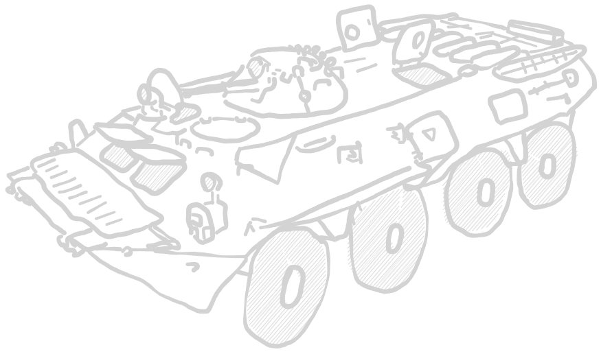

# **NSPR volunteer rifle contingent**

*Emblem of the Narva Volunteer Rifle Contingent*

*PMC Bratstwa Logo*

The NSPR has a standing force of around 10-13.000 personnel, which serve under
the umbrella of the NSPR flag. Internally, there are several factions.

The "Bratstwa" far-right, russian-nationalistic militia is the best equipped part
of the force. Their leader, Roman Sokolov, is a wealthy oligarch with ties to the
Kremlin. Most personnel enjoyed a thorough paramilitary training and their
equipment pool is modern. The entire force is estimated to consist of about
2000-2500 men.

In contrast to Bratstwa stands the majority of NSPR soldiers, which consist of
more left-leaning, mostly ethnic russian estonians, which are fighting for anything
between a sovereign, communist state, just more autonomy, frustration and pure
hartred for the West. These people come from diverse backgrounds, some have former
military training, like the soviet mandatory service or come from a estonian armed
forces background. Most have no real prior experience at all and were trained
covertly in NSPR training camps throughout the county.

The vehicle pool is a mix of former soviet equipment, some stolen western/estonian
armed forces materiell, small amounts of modern russian weaponry and just reworked
civilian technicals. Additionally, some civilian drones are used for surveillance,
as IED carriers or suicide drones.

***

## Army modifiers

### Territorial knowledge

Due to being accustomed to the surrounding terrain features, INDEPENDENT
forces do not have to fulfill an order check to enter the map as reserve
units.

*TLDR no order checks for all reserve transports*

### Foreign aid

As part of undisclosed weapon shipments from alligned nations, INDEPENDENT
forces receive a free medium mortar as part of their artillery section.

This unit is counted as a regular mortar with a spotter. It does not block
a mortar slot.

*TLDR free regular medium mortar with spotter*

### Old technology

Most vehicles in the INDEPENDENT forces are old, salvaged material from
soviet stockpiles, inferior to modern equipment.

These vehicle types do have to suffer one of the following modifiers:

- Slow - vehicles suffer a 50% reduction in speed.
- Unreliable - every order taken has to pass an order check.
- Understaffed - +1 pin marker taken every time the unit suffers pins.

*TLDR choose for every APC, IFV, tank or helicopter a malus.*

***

## Platoon leader **[ 1 ]**

### Assistant Commander

| Assistant Commander | </img> |
| :---- | ---- |
| Cost | 35 pt / 50 pt / 65 pt |
| Reinforcement | up to 2 attendants (AR): 7 pt / 10 pt / 13 pt |
| Setup | NCO (as depicted) |
| Options | - |
| Special rules | <table><tr><td><b>Rules</td><td><b>Description</td></tr><tr><td>You men, snap to action!</td><td>-</td></tr><tr><td>Command</td><td>-</td></tr></table> |

### Commander

| Commander | </img> |
| :---- | ---- |
| Cost | 60 pt / 75 pt / 90 pt |
| Reinforcement | up to 2 attendants (AR): 7 pt / 10 pt / 13 pt |
| Setup | NCO (as depicted) |
| Options | - |
| Special rules | <table><tr><td><b>Rules</td><td><b>Description</td></tr><tr><td>You men, snap to action! (2x)</td><td>-</td></tr><tr><td>Command</td><td>-</td></tr></table> |

***

## Infantry Units **[ 2 - 5 ]**

### Forward reconnaissance team

Reconnaissance infantry team, watching the area in front of friendly forces
and reporting enemy troop movement.

| Forward reconnaissance team | </img> |
| :---- | ---- |
| Cost | 20 pt / 30 pt / 40 pt |
| Reinforcement | up to 2 attendants: 7 pt / 10 pt / 13 pt |
| Setup | NCO (AR) + 1 attendants (AR) |
| Options |<table><tr><td><b>Additional weapons</td><td><b>Description</td><td><b>Cost</b></td></tr><tr><td>1x DMR</td><td>Designated marksman rifle</td><td>+15 pt</td></tr><tr><td>Smoke grenades</td><td>smoke grenades, used for conceilment of movement.</td><td>+10 pt</td></tr></table><table><tr><td><b>Optional rules</td><td><b>Description</td><td><b>Cost</b></td></tr><tr><td>Quad Bikes</td><td>Unit is equipped with quad bikes.  See [ruleset](../ruleset/H.E.A.T.md#quad-bikes) for more information.</td><td>+15 pt/unit</td></tr></table> |
| Special rules | <table><tr><td><b>Rules</td><td><b>Description</td></tr><tr><td>Rangers</td><td>-</td></tr><tr><td>Smoke grenades (*if selected*)</td><td>One time smoke screen.  See [ruleset](../ruleset/H.E.A.T.md#smoke-grenades) for more information.</td></tr></table> |

### Reconnaissance infantry group

Reconnaissance infantry group, watching the area in front of friendly forces
and reporting enemy troop movement.

| Reconnaissance infantry group | </img> |
| :---- | ---- |
| Cost | 45 pt / 60 pt / 75 pt |
| Reinforcement | up to 2 attendants (AR): 7 pt / 10 pt / 13 pt |
| Setup | NCO (AR) + 3 attendants (AR) |
| Options |<table><tr><td><b>Additional weapons</td><td><b>Description</td><td><b>Cost</b></td></tr><tr><td>1x DMR</td><td>Designated marksman rifle</td><td>+15 pt</td></tr><tr><td>Smoke grenades</td><td>DM-25 smoke grenade, used for conceilment of movement.</td><td>+10 pt</td></tr></table>|
| Special rules | <table><tr><td><b>Rules</td><td><b>Description</td></tr><tr><td>Rangers</td><td>-</td></tr><tr><td>Smoke grenades (*if selected*)</td><td>One time smoke screen.  See [ruleset](../ruleset/H.E.A.T.md#smoke-grenades) for more information.</td></tr></table> |

### Assault Detachment

Light infantry unit, which is able to perform flanking operations without
motorized support or operate in urban environments. Equipped with breaching
material.

| Assault Detachment | </img> |
| :---- | ---- |
| Cost | 35 pt / 50 pt / 65 pt |
| Reinforcement | up to 5 attendants (SMG): 7 pt / 10 pt / 13 pt |
| Setup | NCO (SMG) + 3 attendants (SMG) |
| Options |<table><tr><td><b>Additional weapons</td><td><b>Description</td><td><b>Cost</b></td></tr><tr><td>1x LAW</td><td>Light anti-tank weapon</td><td>+20 pt</td></tr><tr><td>1x UGL</td><td>Underbarrel grenade launcher</td><td>+10 pt</td></tr><tr><td>Explosives</td><td>Explosives pipe</td><td>+15 pt</td></tr></table><table><tr><td><b>Optional rules</td><td><b>Description</td><td><b>Cost</b></td></tr><tr><td>Tough Fighters</td><td>-</td><td>+ 1 pt each</td></tr></table> |
| Special rules | <table><tr><td><b>Rules</td><td><b>Description</td></tr><tr><td>Explosives</td><td>See [ruleset](../ruleset/H.E.A.T.md#explosives) for more information</td></tr></table> |

### Support Infantry group

A small group with DMR support. Can take up to two DMRs.

| Support infantry group | </img> |
| :---- | ---- |
| Cost | 35 pt / 50 pt / 65 pt |
| Reinforcement | up to 5 attendants (AR): 7 pt / 10 pt / 13 pt |
| Setup | NCO (DMR) + 2 attendants (AR) |
| Options |<table><tr><td><b>Additional weapons</td><td><b>Description</td><td><b>Cost</b></td></tr><tr><td>1x DMR</td><td>Designated marksman rifle</td><td>+10 pt</td></tr></table> |
| Special rules | - |

### Motorized Infantry squad

The core of any modern fighting force. Deployed as the infanty part of IFVs.
Part of the more well-trained core force, these freedom fighters have at least
undergone mandatory services and understand how a military unit has to behave.

| Motorized Infantry Squad | </img> |
| :---- | ---- |
| Cost | 35 pt / 50 pt / 65 pt |
| Reinforcement | up to 5 attendants (AR): 7 pt / 10 pt / 13 pt |
| Setup | NCO (AR) + 3 attendants (AR) |
| Options |<table><tr><td><b>Additional weapons</td><td><b>Description</td><td><b>Cost</b></td></tr><tr><td>2x LMG</td><td>Light machine gun</td><td>+20 pt</td></tr><tr><td>1x UGL</td><td>Underbarrel grenade launcher</td><td>+10 pt</td></tr><tr><td>1x LAW</td><td>Light anti-tank weapon</td><td>+20 pt</td></tr></table> |
| Special rules | - |

### PMC Contractors squad

The right wing, paramilitary force "Bratstwa" are well-trained and equipped,
and are used since the revolution began to strike down difficult targets,
perform covert operations or support breakthrough attempts.

| PMC squad | </img> |
| :---- | ---- |
| Cost | - / 60 pt / 85 pt |
| Reinforcement | up to 5 attendants (AR): - pt / 10 pt / 13 pt |
| Setup | NCO (AR) + 3 attendants (AR) |
| Options |<table><tr><td><b>Additional weapons</td><td><b>Description</td><td><b>Cost</b></td></tr><tr><td>2x LMG</td><td>Light machine gun</td><td>+20 pt</td></tr><tr><td>1x UGL</td><td>Underbarrel grenade launcher</td><td>+10 pt</td></tr><tr><td>1x LAW</td><td>Light anti-tank weapon</td><td>+20 pt</td></tr></table> |
| Special rules | <table><tr><td><b>Rules</td><td><b>Description</td></tr><tr><td>Stubborn</td><td>-</td></tr></table> |

### Light Rifle squad

While NSPR forces have a somewhat regular core force, the majority of freedom- |
fighting revolutionaries consist of mostly untrained, unprofessional personell,
with maybe the NCO and one or two trained leaders to keep everything together
and follow orders.

| Volunteer squad | </img> |
| :---- | ---- |
| Cost | 30 pt / - / - |
| Reinforcement | up to 5 attendants: 7 pt / - / - |
| Setup | NCO (AR) + 3 attendants (AR) |
| Options |<table><tr><td><b>Additional weapons</td><td><b>Description</td><td><b>Cost</b></td></tr><tr><td>Rifles</td><td>Old-fashioned, semi-automatic weapons</td><td>-3 pt each</td></tr><tr><td>2x LMG</td><td>Light machine gun</td><td>+20 pt each</td></tr></table><table><tr><td><b>Optional rules</td><td><b>Description</td><td><b>Cost</b></td></tr><tr><td>Shirkers</td><td>-.</td><td>-2 pt each</td></tr></table> |
| Special rules | <table><tr><td><b>Rules</td><td><b>Description</td></tr><tr><td>Green</td><td>-</td></tr></table> |

***

## Combat support units [ 0 - 1 ]

### Demolition squad

Support infantry, used to clear terrain or restrict enemy movement.

| Demolition squad | </img>  |
| :---- | ---- |
| Cost | 40 pt / 55 pt / 70 pt |
| Reinforcement | up to 5 attendants (SMG): 7 pt / 10 pt / 13 pt |
| Setup | NCO (SMG) + 2 attendants (SMG) |
| Options |<table><tr><td><b>Additional weapons</td><td><b>Description</td><td><b>Cost</b></td></tr><tr><td>1x LMG</td><td>Light machine gun</td><td>+20 pt</td></tr><tr><td>Explosives</td><td>Explosives pipe</td><td>+15 pt</td></tr><tr><td>IEDs</td><td>See IED section in [ruleset](../ruleset/H.E.A.T.md#improvised-explosive-devices-ied-and-mines).<td>+20 pt</td></tr></table> |
| Special rules | <table><tr><td><b>Rules</td><td><b>Description</td></tr><tr><td>Enginners</td><td>See [ruleset](../ruleset/H.E.A.T.md#engineer) for more information.</td></tr></table> |

### Sapper team

A small team with a lot of explosives, their role is to find any way to hinder
enemy forces in the dynamic enviromnent of warfare.

| Sapper team | </img> |
| :---- | ---- |
| Cost | 25 pt / 35 pt / 50 pt |
| Reinforcement | up to 2 attendants (SMG): 7 pt / 10 pt / 13 pt |
| Setup | NCO (SMG) |
| Options |<table><tr><td><b>Additional weapons</td><td><b>Description</td><td><b>Cost</b></td></tr><tr><td>1x LAW</td><td>Light anti-tank weapon</td><td>+20 pt</td></tr><tr><td>Explosives</td><td>Explosives pipe</td><td>+15 pt</td></tr></table> |
| Special rules | <table><tr><td><b>Rules</td><td><b>Description</td></tr><tr><td>Enginners</td><td>See [ruleset](../ruleset/H.E.A.T.md#engineer) for more information.</td></tr><tr><td>Sapper</td><td>See [ruleset](../ruleset/H.E.A.T.md#sapper) for more information.</td></tr></table> |

### Dragunov sniper team

A sniper team, equipped with a SVD "Dragunov" rifle. One attendant helps with
spotting and rangefinding.

| Sniper team | </img> |
| :---- | ---- |
| Cost | 35 pt / 50 pt / 65 pt |
| Reinforcement | - |
| Setup | NCO (SNIPER) + 1 attendant (SMG) |
| Options |- |
| Special rules | <table><tr><td><b>Rules</td><td><b>Description</td></tr><tr><td>Sniper</td><td>-</td></tr><tr><td>Team</td><td>-</td></tr></table> |

### AMR team

Sniper team equipped with a heavy-hitting anti-materiell rifle. While AT rifles
such as the PTRS-41 have become obsolete with modern armour development, these
guns are still used against lightly armoured vehicles, buildings or heavier
cover.

| AMR team | </img> |
| :---- | ---- |
| Cost | 45 pt / 60 pt / 75 pt |
| Reinforcement | - |
| Setup | NCO (AMR) + 1 attendant (SMG) |
| Options |- |
| Special rules | <table><tr><td><b>Rules</td><td><b>Description</td></tr><tr><td>Sniper</td><td>-</td></tr><tr><td>Team</td><td>-</td></tr><tr><td>Fixed</td><td>-</td></tr></table> |

### Medic

| Medic | </img> |
| :---- | ---- |
| Cost | - / - / 45 pt |
| Reinforcement | - |
| Setup | NCO (unarmed) |
| Options |- |
| Special rules | <table><tr><td><b>Rules</td><td><b>Description</td></tr><tr><td>Medic</td><td>-</td></tr></table> |

***

## Machine gun team [ 0 - 1 ]

### RPK MMG team

A machine gun team equipped with a RPK.

| RPK Team | </img> |
| :---- | ---- |
| Cost | 35 pt / 50 pt / 65 pt |
| Reinforcement | - |
| Setup | NCO (MMG) + 2 loaders (SMG) |
| Options |- |
| Special rules | <table><tr><td><b>Rules</td><td><b>Description</td></tr><tr><td>Team</td><td>-</td></tr><tr><td>Fixed</td><td>-</td></tr></table> |

### NSV HMG team

Infantry unit equipped with an HMG, used to surpress infantry sections, light vehicles and helicopters.

| NSV team | </img> |
| :---- | ---- |
| Cost | 49 pt / 70 pt / 91 pt |
| Reinforcement | - |
| Setup | NCO (HMG) + 2 loaders (SMG) |
| Options |- |
| Special rules | <table><tr><td><b>Rules</td><td><b>Description</td></tr><tr><td>Team</td><td>-</td></tr><tr><td>Fixed</td><td>-</td></tr></table> |

### AGS-17 Plamja AGL eam

Infantry unit equipped with an AGL, used to surpress infantry sections.

| AGS-17 team | </img> |
| :---- | ---- |
| Cost | 50 pt / 60 pt / 75 pt |
| Reinforcement | - |
| Setup | NCO (AGL) + 2 loaders (SMG) |
| Options |- |
| Special rules | <table><tr><td><b>Rules</td><td><b>Description</td></tr><tr><td>Team</td><td>-</td></tr><tr><td>Fixed</td><td>-</td></tr><tr><td>HE 1"</td><td>-</td></tr><tr><td>AGL</td><td>Automatic grenade launcher, which rapidly fires 40mm ordnance.  Detailed description in [ruleset](../ruleset/H.E.A.T.md#automatic-grenade-launchers-agl). </td></tr></table> |

***

## Anti-Tank team [ 0 - 1 ]

### RPG-7 team

Infantry section equipped with an AT RPG launcher. Used against small vehicles and lightly armoured tanks.

| RPG-7 team | </img> |
| :---- | ---- |
| Cost | 42 pt / 60 pt / 78 pt |
| Reinforcement | - |
| Setup | NCO (AGL) + 1 loader (SMG) |
| Options | <table><table><tr><td><b>Rules</td><td><b>Description</td><td><b>Cost</td></tr><tr><td>Tandem HEAT Charge</td><td>Heavier charge than  normal round, but less range. Check [ruleset](../ruleset/H.E.A.T.md#tandem-heat-charges) for details.</td><td>+15 pt</td></tr></table> |
| Special rules | <table><tr><td><b>Rules</td><td><b>Description</td></tr><tr><td>Team</td><td>-</td></tr><tr><td>Fixed</td><td>-</td></tr><tr><td>Backblast</td><td>See [ruleset](../ruleset/H.E.A.T.md#anti-tank-guided-missiles-atgm) for more information.</td></tr></table> |

### 9K113 Konkurs ATGM team

Anti-tank guided missile team, a valid threat to any armoured vehicle.

| 9K113 Konkurs ATGM team | </img> |
| :---- | ---- |
| Cost | 60 pt / 75 pt / 90 pt |
| Reinforcement | - |
| Setup | NCO (ATGM) + 2 loaders (SMG) |
| Options | - |
| Special rules | <table><tr><td><b>Rules</td><td><b>Description</td></tr><tr><td>Team</td><td>-</td></tr><tr><td>Fixed</td><td>-</td><tr><td>ATGM</td><td>See [ruleset](../ruleset/H.E.A.T.md#anti-tank-guided-missiles-atgm) for more information.</td></tr><tr><td>Backblast</td><td>See [ruleset](../ruleset/H.E.A.T.md#anti-tank-guided-missiles-atgm) for more information.</td></tr></table> |

***

## Drone team [ 0 - 1 ]

### UAV operator team

This team is equipped with a small quadcopter and varying payload, depending on
mission objective. The frame itself is a homebrew quadcopter built from a toy
drone, which is equipped with a camera pod and hardpoints for small anti tank
bombs.

| Quadcopter drone | </img> |
| :---- | ---- |
| Cost | 41 pt / 52 pt / 63 pt |
| Reinforcement | up to 2 attendants: 7 pt / 10 pt / 13 pt |
| Setup | NCO (PDW) |
| Options |<table><tr><td><b>Payload</td><td><b>Description</td><td><b>Cost</b></td></tr><tr><td>IED </td><td>Rigged IED, set to explode a HE payload on release.  See UAV section in [ruleset](../ruleset/H.E.A.T.md#ied-variant).<td>+10 pt</td></tr><tr><td>AT IED</td><td>Heavier payload which is able to damage or destroy vehicels.  See IED section in [ruleset](../ruleset/H.E.A.T.md#anti-tank-ied-variant).<td>+20 pt</td></tr></table> |
| Special rules | <table><tr><td><b>Rules</td><td><b>Description</td></tr><tr><td>Fixed</td><td>-</td></tr><tr><td>UAV</td><td>Team operates a small UAV with varying mission role. Detailed description in [ruleset](../ruleset/H.E.A.T.md#drones). </td></tr><tr><td>On-map Operator</td><td>Operator of unit is present on map.</td></tr><tr><td>Quadrocopter</td><td>Drone is propelled by multiple rotors. </td></tr></table> |

### Bomb "Bravo" drone

A domestic drone design used as loitering ammunition. While not as advanved as
similar drone designs, the Bravo drone was developed to be cheap in production
and does not require many high-tech parts. The drones are said to be of mixed
quality, but due to them being used in a kamikaze drone, they are only expected
to fly once anyway.

| Bravo UAV |  </img> |
| :---- | ---- |
| Cost | tbd |
| Reinforcement | - |
| Setup | Drone |
| Options | - |
| Special rules | <table><tr><td><b>Rules</td><td><b>Description</td></tr><tr><td>Fixed</td><td>-</td></tr><tr><td>UAV</td><td>Team operates a small UAV with varying mission role. Detailed description in [ruleset](../ruleset/H.E.A.T.md#drones). </td></tr><tr><td>Off-map Operator</td><td>Unit is operated off-map.</td></tr><tr><td>Fixed wing</td><td>Drone is propelled by a rotor and fixed wings. </td></tr><tr><td>Loitering Ammonition</td><td>Self-destroying drone with large payload. See [ruleset](../ruleset/H.E.A.T.md#drones).</td></tr></table> |

***

## Mortar team [ 0 - 1 ]

### RM-38 50mm light mortar team

light mortar team.

| 50mm RM-38 light mortar team | </img> |
| :---- | ---- |
| Cost | 24 pt / 35 pt / 46 pt |
| Reinforcement | Spotter (PDW) +10 pt |
| Setup | NCO (LIGHT MORTAR) + 1 loader (PISTOL) |
| Options |- |
| Special rules | <table><tr><td><b>Rules</td><td><b>Description</td></tr><tr><td>Team</td><td>-</td></tr><tr><td>HE 1"</td><td>-</td></tr><tr><td>Indirect Fire</td><td>-</td></tr><tr><td>Spotter</td><td>-</td></tr></table> |

### M1938 107mm medium mortar team

medium mortar team.

| M1938 107mm medium mortar eam | </img> |
| :---- | ---- |
| Cost | 35 pt / 50 pt / 65 pt |
| Reinforcement | Spotter (PDW) +10 pt |
| Setup | NCO (MEDIUM MORTAR) + 2 loader (PISTOL) |
| Options |- |
| Special rules | <table><tr><td><b>Rules</td><td><b>Description</td></tr><tr><td>Team</td><td>-</td></tr><tr><td>Fixed</td><td>-</td></tr><tr><td>HE 2"</td><td>-</td></tr><tr><td>Indirect Fire</td><td>-</td></tr><tr><td>Spotter</td><td>-</td></tr></table> |

### 120mm 2S12 "Sani" heavy mortar team

heavy mortar team.

| 120mm 2S12 heavy mortar team | </img> |
| :---- | ---- |
| Cost | 46 pt / 65 pt / 84 pt |
| Reinforcement | Spotter (PDW) +10 pt |
| Setup | NCO (HEAVY MORTAR) + 3 loader (PISTOL) |
| Options |- |
| Special rules | <table><tr><td><b>Rules</td><td><b>Description</td></tr><tr><td>Team</td><td>-</td></tr><tr><td>Fixed</td><td>-</td></tr><tr><td>HE 3"</td><td>-</td></tr><tr><td>Indirect Fire</td><td>-</td></tr><tr><td>Spotter</td><td>-</td></tr></table> |

### "Hell Cannon" propane mortar team

The "Hell Cannon" is a mortar type first seen in Libya and Syria, which consists
of some sort of pipe or metal piece capable of fitting a propane tank and some
sort of carriage. The mortar fires propane tanks with an impact fuze, and while
not too accurate, is able to inflict a hefty amount of damage to whatever it hits.

| "Hell Cannon" propane mortar team | </img> |
| :---- | ---- |
| Cost | 56 pt / 75 pt / 94 pt |
| Reinforcement | Spotter (PDW) +10 pt |
| Setup | NCO (HELL CANNON) + 3 loader (PISTOL) |
| Options |- |
| Special rules | <table><tr><td><b>Rules</td><td><b>Description</td></tr><tr><td>Team</td><td>-</td></tr><tr><td>Fixed</td><td>-</td></tr><tr><td>HE 3"</td><td>-</td></tr><tr><td>Indirect Fire</td><td>-</td></tr><tr><td>Spotter</td><td>-</td></tr><tr><td>Selfmade</td><td>Hits 6-D6" in a random direction around the target.</td></tr></table> |

***

## Artillery [ 0 - 1 ]

### M1938 M-30 122mm light howitzer

light howitzer.

| M1938 M-30 122mm light howitzer | </img> |
| :---- | ---- |
| Cost | 40 pt / 50 pt / 60 pt |
| Reinforcement | Spotter (PDW) +10 pt |
| Setup | NCO (LIGHT HOWITZER) + 3 loader (PISTOL) |
| Options |- |
| Special rules | <table><tr><td><b>Rules</td><td><b>Description</td></tr><tr><td>Team</td><td>-</td></tr><tr><td>Fixed</td><td>-</td></tr><tr><td>HE 2"</td><td>-</td></tr><tr><td>Howitzer</td><td>-</td></tr><tr><td>Spotter</td><td>-</td></tr></table> |

### 2A65 Msta-B 152mm medium howitzer

medium howitzer.

| 2A65 Msta-B 152mm medium howitzer | </img> |
| :---- | ---- |
| Cost | 60 pt / 75 pt / 90 pt |
| Reinforcement | Spotter (PDW) +10 pt |
| Setup | NCO (MEDIUM HOWITZER) + 3 loader (PISTOL) |
| Options |- |
| Special rules | <table><tr><td><b>Rules</td><td><b>Description</td></tr><tr><td>Team</td><td>-</td></tr><tr><td>Fixed</td><td>-</td></tr><tr><td>HE 3"</td><td>-</td></tr><tr><td>Howitzer</td><td>-</td></tr><tr><td>Spotter</td><td>-</td></tr></table> |

### M1931 B-4 203mm heavy howitzer

heavy howitzer.

| M1931 B-4 203mm heavy howitzer | </img> |
| :---- | ---- |
| Cost | 92 pt / 115 pt / 138 pt |
| Reinforcement | Spotter (PDW) +10 pt |
| Setup | NCO (HEAVY HOWITZER) + 4 loader (PISTOL) |
| Options |- |
| Special rules | <table><tr><td><b>Rules</td><td><b>Description</td></tr><tr><td>Team</td><td>-</td></tr><tr><td>Fixed</td><td>-</td></tr><tr><td>HE 4"</td><td>-</td></tr><tr><td>Howitzer</td><td>-</td></tr><tr><td>Spotter</td><td>-</td></tr></table> |

***

## Artillery Support [ 0 - 1 ]

### Artillery forward observer

Forward Observer team for artillery Batteries located off-map.

| Artillery forward Observer | </img> |
| :---- | ---- |
| Cost | - pt / 100 pt / 115 pt |
| Reinforcement | up to 2 attendants (SMG) |
| Setup | NCO (SMG) |
| Options |- |
| Special rules | - |

***

## Anti-Air systems [ 0 - 1 ]

### Strela ground team

Small team of infantry with a MANPADS Strela Surface-to-air-missile launcher.

| MANPADS team | </img> |
| :---- | ---- |
| Cost | 50 pt / 65 pt / 80 pt |
| Reinforcement | up to 2 attendants (SMG) 7 pt / 10 pt / 13 pt each |
| Setup | NCO (MANPADS) + 1 loader (SMG) |
| Options |- |
| Special rules | <table><tr><td><b>Rules</td><td><b>Description</td></tr><tr><td>Team</td><td>-</td></tr><tr><td>Fixed</td><td>-</td></tr><tr><td>Backblast</td><td>See [ruleset](../ruleset/H.E.A.T.md#anti-tank-guided-missiles-atgm) for more information.</td></tr><tr><td>MANPADS</td><td>See [ruleset](../ruleset/H.E.A.T.md#manportable-air-defense-systems-manpads) for more information.</td></tr></table> |

### ZU-23-2 anti air autocannon

The ZU-23-2 is a towed 23 mm anti-aircraft twin autocannon.

| ZU-23-2 AA gun team | </img> |
| :---- | ---- |
| Cost | 40 / 51 / 62 pt |
| Reinforcement | up to 2 attendants (SMG) 7 pt / 10 pt / 13 pt each |
| Setup | NCO (MEDIUM AUTOCANNON) + 2 loader (SMG) |
| Options | - |
| Special rules | <table><tr><td><b>Rules</td><td><b>Description</td></tr><tr><td>Team</td><td>-</td></tr><tr><td>Fixed</td><td>-</td></tr></table> |

***

## Armoured Personell Carriers / Infantry Fighting Vehicles

If a vehicle has the IFV rule and is chosen in an IFV role, these vehicles are
connected to the first and second mandatory infantry units. Any vehicle that has
the IFV rule can also choose to ignore it and act on its own.

### BTR-D

| BTR-D | </img> |
| :---- | ---- |
| Cost | 102 pt / 120 pt / 138 pt |
| Capacity | 10 soldiers |
| Damage value | 7+ Armoured Carrier |
| Default weapon configuration | <table><tr><td><b>Weapon systems</td><td>Smoke grenade launcher.   Detailed rules see [ruleset](../ruleset/H.E.A.T.md#smoke-screens). </td><td><ul><li>hull-mounted</li><li>front-facing</li></ul></tr><tr><td>PKB 7.62mm MMG</td><td>PKB 7.62mm medium machine gun  The weapon is located in the front-left, similar to a headlight.</td><td><ul><li>hull-mounted</li><li>front-facing</li></ul></tr><tr><td>PKB 7.62mm MMG</td><td>PKB 7.62mm medium machine gun  The weapon is located in the front-right, similar to a headlight.</td><td><ul><li>hull-mounted</li><li>front-facing</li></ul></tr></table> |
| Options |<table><tr><td><b>Main weapon options</td><td><b>Description</td><td>Modifiers</td><td><b>Cost</b></td></tr><tr><td>ZSU-23-2 medium autocannon</td><td>ZSU-23-2 anti-air gun. This weapon is secured by cables on the sides of the tank, which makes it less stable than a turret- mounted gun, but it's better than nothing, maybe?</td><td><ul><li>pintle-mounted</li><li>separted gun post</li></ul></td><td>+ 30 pt</td></tr></table>All weapons are mounted at the commander's hatch, so only one can be chosen.<table><tr><td><b>Additional weapons</td><td><b>Description</td><td>Modifiers</td><td><b>Cost</b></td></tr><tr><td>MMG</td><td>Medium machine gun</td><td><ul><li>pintle-mounted</li><li>open-topped</li></ul></td><td>+15 pt</td></tr><tr><td>HMG</td><td>Heavy machine gun</td><td><ul><li>pintle-mounted</li><li>open-topped</li></ul></td><td>+ 25 pt</td></tr><tr><td>AGS-17 "Plamja" AGL</td><td>AGS-17 "Plamja" automatic  grenade launcher  Detailed rules see [HEAT rules](../H.E.A.T.excalidraw).</td><td><ul><li>pintle-mounted</li><li>open-topped</li></ul></td><td>+ 25 pt</td></tr><tr><td>9M14 Malyutka ATGM launcher</td><td>9M14 Malyutka Anti-Tank Guided  Missile Launcher  Detailed rules see [HEAT rules](../H.E.A.T.excalidraw).</td><td><ul><li>pintle-mounted</li><li>open-topped</li></ul></td><td>+ 35 pt</td></tr></table> |
| Special rules | <table><tr><td><b>Rules</td><td><b>Description</td></tr><tr><td>IFV</td><td>Detailed rules see [HEAT rules](../H.E.A.T.excalidraw).</td></tr><tr><td>Airborne Restraints</td><td>Due to being designed as small as possible to be air-dropped over enemy territory,  the BTR-Ds two bow-mounted machine guns were operated by a single machine gunner.  <ul><li>While actively transporting units, the second MMG can be operated by one of the passengers, but once disembarked, only one can be used per turn.</li><li>If any further weapon is added to the BTR-D, this also applies.</li></ul></td></tr><tr><td>Separted gun post</td><td>The cable-mounted ZSU is completely seperated from the inside of the tank.  <ul><li> To operate it, the gunner has to exit the vehicle and get on his post. This can happen after any successful RALLY, ADVANCE or when going DOWN. This cannot happen after a FIRE or RUN.</li><li>The weapon suffers a -1 on the first turn the gunner disembarks.</li><li>Disembarking can happen beforehand to negate this effect.</li><li>Reentering does not require a whole turn, but cannot happen during a RUN order,  and not after already firing the weapon.</li><li>While exposed, unit takes double pins.</li></ul></td></tr><tr><td>Amphibious</td><td>-</td></tr></table> |

### BTR-60P/PB

Old, soviet-made personell carrier from the 60s. Can be deployed reinforced by a
turret with a 14.5mm auto cannon  (BTR-60PB), which lead to a reduction in troop
capacity.

| BTR-60P/PB | </img> |
| :---- | ---- |
| Cost | 95 pt / 110 pt / 125 pt |
| Capacity | 14 soldiers |
| Damage value | 7+ Armoured Carrier |
| Default weapon configuration | <table><tr><td><b>Weapon systems</td><td><b>Description</td><td><b>Modifier</td></tr><tr><tr><td>Smoke Screen </td><td>Smoke grenade launcher.   Detailed rules see [ruleset](../ruleset/H.E.A.T.md#smoke-screens). </td><td><ul><li>hull-mounted</li><li>front-facing</li></ul></tr></table> |
| Options | <table><tr><td><b>Main weapon options</td><td><b>Description</td><td>Modifiers</td><td><b>Cost</b></td></tr><tr><td>14.5mm KPWT</td><td>Light auto-cannon.</td><td><ul><li>turret-mounted</li></ul></td><td>+ 40 pt</td></tr><td>7.62mm PKT</td><td>Co-axial MMG.  Comes as part of turret with the autocannon.  Reduces the capacity to **8**.</td><td><ul><li>turret-mounted</li><li>co-axial</li></ul></td><td>-</td></tr></table> |
| Special rules | <table><tr><td><b>Rules</td><td><b>Description</td></tr><tr><td>IFV</td><td>Detailed rules see [HEAT rules](../H.E.A.T.excalidraw).</td></tr><tr><td>Amphibious</td><td>-</td></tr></table> |

### BTR-80

More modern version of the older BTR series.

| BTR-80 | </img> |
| :---- | ---- |
| Cost | 120 pt / 130 pt / 140 pt |
| Capacity | 7 soldiers |
| Damage value | 7+ Armoured Carrier |
| Default weapon configuration | <table><tr><td><b>Weapon systems</td><td><b>Description</td><td>Modifiers</td><tr><td>Smoke Screen</td><td>Smoke grenade launcher.   Detailed rules see [ruleset](../ruleset/H.E.A.T.md#smoke-screens). </td><td><ul><li>hull-mounted</li><li>front-facing</li></ul></tr><tr><td>14.5mm KPWT</td><td>Light auto-cannon.</td><td><ul><li>turret-mounted</li></ul></td></tr><td>7.62mm PKT</td><td>Co-axial MMG.  Comes as part of turret with the autocannon.</td><td><ul><li>turret-mounted</li><li>co-axial</li></ul></td></tr></table> |
| Options |- |
| Special rules | <table><tr><td><b>Rules</td><td><b>Description</td></tr><tr><td>IFV</td><td>Detailed rules see [HEAT rules](../H.E.A.T.excalidraw).</td></tr><tr><td>Amphibious</td><td>-</td></tr></table> |

### MT-LB

The MT-LB is a Soviet multi-purpose, fully amphibious, tracked armored fighting
vehicle in use since the 1970s. With its flat chassis back, a low profile and
big compartments, the MT-LB is ideal for the flat terrain of Estonia.

| BTR-60P/PB | </img> |
| :---- | ---- |
| Cost | 70 pt / 85 pt / 100 pt |
| Capacity | 11 soldiers |
| Damage value | 7+ Armoured Carrier |
| Default weapon configuration | <table><tr><td><b>Weapon systems</td><td>Smoke grenade launcher.   Detailed rules see [ruleset](../ruleset/H.E.A.T.md#smoke-screens). </td><td><ul><li>hull-mounted</li><li>front-facing</li></ul></tr></table> |
| Options |<table><tr><td><b>Main weapon options</td><td><b>Description</td><td>Modifiers</td><td><b>Cost</b></td></tr><tr><td>14.5mm KPWT</td><td>Light auto-cannon.</td><td><ul><li>turret-mounted</li></ul></td><td>+ 40 pt</td></tr><td>7.62mm PKT</td><td>Co-axial MMG.  Comes as part of turret with the autocannon.  Reduces the capacity to **8**.</td><td><ul><li>turret-mounted</li><li>co-axial</li></ul></td><td>-</td></tr></table> |
| Special rules | <table><tr><td><b>Rules</td><td><b>Description</td></tr><tr><td>IFV</td><td>Detailed rules see [HEAT rules](../H.E.A.T.excalidraw).</td></tr><tr><td>Amphibious</td><td>-</td></tr></table> |

***

## Extended vehicle pool [ 0 - 1 ]

The NSPR uses what it has. Their arsenal is a patchwork of anything that drives
and has a gun, and utilizes old tanks and APCs just as much as modern civilian
vehicles. A fast pickup with an AA gun, a mortar on a truck, T-54s old enough to
predate the Berlin wall.

### Toyota Hilux

The Toyota Hilux serves the full spectrum of armoured support. With almost
anything the separtists deemed small enough to work being bolted to one, this
fast pickup can serve as an anti-infantry, anti-tank or anti-air role, as
artillery, as a driving bomb. Versatility, courtesy of Japan.

| Toyota Hilux | </img> |
| :---- | ---- |
| Cost | 40 pt / 55 pt / 70 pt |
| Capacity | 8 soldiers |
| Damage value | 6+ Soft-Skinned Vehicle |
| Default weapon configuration |- |
| Options |<table><tr><td><b>Rules</td><td><b>Description</td><td>Modifiers</td><td><b>Cost</b></td></tr><tr><td>Command Vehicle</td><td>This vehicle is equipped with multiple radios and acts as a command vehicle.  Removes troop carrying ability.</td><td><ul><li>Command</li><li>No longer carries  troops</li></ul></td><td>+45 pt</td></tr><tr><td>Medical Equipment</td><td>The back of the vehicle is modified to tend for the wounded and transport patients.  Removes troop carrying ability.</td><td><ul><li>Medic</li><li>No longer carries  troops</li><li>No armaments allowed</li></ul></td><td>+ 20 pt</td></tr><tr><td>Selfmade armour</td><td>Metal sheets, chicken wire, rebar,  concrete; This vehicle is equipped  with DIY armour, protecting it from small arms fire and shrappnel.   Also, it weights way too much now.</td><td><ul><li>Slow</li><li>7+ Damage Value</li></ul></td><td>+25 pt</td></tr></table>Since these weapons are mounted to the back flat, only one main weapon may be chosen.<table><tr><td><b>Main weapon options</td><td><b>Description</td><td>Modifiers</td><td><b>Cost</b></td></tr><tr><td>7.62mm PKT MMG</td><td>Back mounted MMG  Reduces troop capacity to **4**.</td><td><ul><li>pintle-mounted</li><li>open-topped</li></ul></td><td>+15 pt</td></tr><tr><td>14.5mm DshK HMG</td><td>Back mounted HMG  Reduces troop capacity to **4**.</td><td><ul><li>pintle-mounted</li><li>open-topped</li></ul></td><td>+20 pt</td></tr><tr><td>AGS-17 "Plamja" AGL</td><td>AGS-17 "Plamja" automatic  grenade launcher  Detailed rules see [ruleset](../ruleset/H.E.A.T.md#automatic-grenade-launchers-agl).  Reduces troop capacity to **4**.</td><td><ul><li>pintle-mounted</li><li>open-topped</li></ul></td><td>+ 25 pt</td></tr><tr><td>9K113 Konkurs ATGM launcher</td><td>9K113 Konkurs Anti-Tank Guided  Missile Launcher  Detailed rules see [ruleset](../ruleset/H.E.A.T.md#anti-tank-guided-missiles-atgm). Reduces troop capacity to **4**.</td><td><ul><li>pintle-mounted</li><li>open-topped</li></ul></td><td>+ 30 pt</td></tr><tr><td>SPG-9 recoilless rifle</td><td>SPG-9 recoilless rifle. Used to fire  projectiles similar to the BMP-1's 73 mm  2A28 Grom.  Counts as a light anti-tank gun.  Reduces troop capacity to **4**.</td><td><ul><li>front-facing</li><li>light anti-tank gun</li><li>open-topped</li><li>Backblast</li></ul></td><td>+30 pt</td></tr><tr><td>UB-32 rocket pod system</td><td>Air-to-ground S5 rocket pod, which is  used as an area suppression weapon. While not very accurate, it is able to fire rapidly and is effective, if it hits.</td><td><ul><li>open-topped</li><li>front-facing</li><li>Indirect Fire</li><li>HE 2"</li><li>rocket pod</li></ul></td><td>+25 pt</td></tr><tr><td>M1938 107mm medium mortar</td><td>medium mortar system</td><td><ul><li>hull-mounted</li><li>front-facing</li><li>open-topped</li></ul></td><td>+ 30 pt</td></tr><tr><td>ZSU-23-2 medium autocannon</td><td>ZSU-23-2 anti-air gun.</td><td><ul><li>hull-mounted</li><li>open-topped</li></ul></td><td>+40 pt</td></tr></table> |
| Special rules | - |

### Tracked Technical

Repurposed tank hull from a scrap yard, museum or whereever else, the NSPR used
everything which allowed them to move weapon systems as self propelled weapons
to conceil their actual numbers, even a T34-mounted 120mm mortar is hardly ideal
for shoot and scoot maneuvers...

| Technical | </img> |
| :---- | ---- |
| Cost | tbd |
| Capacity | - |
| Damage value | 8+ Light Tank |
| Default weapon configuration | - |
| Options |<table><tr><td><b>Rules</td><td><b>Description</td><td>Modifiers</td><td><b>Cost</b></td></tr><tr><td>Command Vehicle</td><td>This vehicle is equipped with multiple radios and acts as a command vehicle.  Removes troop carrying ability.</td><td><ul><li>Command</li><li>No longer carries  troops</li></ul></td><td>+45 pt</td></tr><tr><td>Medical Equipment</td><td>The back of the vehicle is modified to tend for the wounded and transport patients.  Removes troop carrying ability.</td><td><ul><li>Medic</li><li>No longer carries  troops</li><li>No armaments allowed</li></ul></td><td>+ 20 pt</td></tr><tr><td>Selfmade armour</td><td>Metal sheets, chicken wire, rebar,  concrete; This vehicle is equipped  with DIY armour, protecting it from small arms fire and shrappnel.   Also, it weights way too much now.</td><td><ul><li>Slow</li><li>7+ Damage Value</li></ul></td><td>+25 pt</td></tr></table>Since these weapons are mounted to the interiour, only one main weapon may be chosen.<table><tr><td><b>Main weapon options</td><td><b>Description</td><td>Modifiers</td><td><b>Cost</b></td></tr><tr><td>7.62mm PKT MMG</td><td>Back mounted MMG</td><td><ul><li>pintle-mounted</li><li>open-topped</li></ul></td><td>+15 pt</td></tr><tr><td>14.5mm DshK HMG</td><td>Back mounted HMG</td><td><ul><li>pintle-mounted</li><li>open-topped</li></ul></td><td>+20 pt</td></tr><tr><td>AGS-17 "Plamja" AGL</td><td>AGS-17 "Plamja" automatic  grenade launcher  Detailed rules see [ruleset](../ruleset/H.E.A.T.md#automatic-grenade-launchers-agl). </td><td><ul><li>pintle-mounted</li><li>open-topped</li></ul></td><td>+ 25 pt</td></tr><tr><td>9K113 Konkurs ATGM launcher</td><td>9K113 Konkurs Anti-Tank Guided  Missile Launcher  Detailed rules see [ruleset](../ruleset/H.E.A.T.md#anti-tank-guided-missiles-atgm).</td><td><ul><li>pintle-mounted</li><li>open-topped</li></ul></td><td>+ 30 pt</td></tr><tr><td>SPG-9 recoilless rifle</td><td>SPG-9 recoilless rifle. Used to fire  projectiles similar to the BMP-1's 73 mm  2A28 Grom.  Counts as a light anti-tank gun.</td><td><ul><li>front-facing</li><li>light anti-tank gun</li><li>open-topped</li><li>Backblast</li></ul></td><td>+30 pt</td></tr><tr><td>UB-32 rocket pod system</td><td>Air-to-ground S5 rocket pod, which is  used as an area suppression weapon. While not very accurate, it is able to fire rapidly and is effective, if it hits.</td><td><ul><li>open-topped</li><li>front-facing</li><li>Indirect Fire</li><li>HE 2"</li><li>rocket pod</li></ul></td><td>+25 pt</td></tr><tr><td>M1938 107mm medium mortar</td><td>medium mortar system</td><td><ul><li>hull-mounted</li><li>front-facing</li><li>open-topped</li></ul></td><td>+ 30 pt</td></tr><tr><td>S2S1 120mm heavy mortar</td><td>heavy mortar system</td><td><ul><li>hull-mounted</li><li>front-facing</li><li>open-topped</li></ul></td><td>+ 40 pt</td></tr><tr><td>ZSU-23-2 medium autocannon</td><td>ZSU-23-2 anti-air gun.</td><td><ul><li>hull-mounted</li><li>open-topped</li></ul></td><td>+40 pt</td></tr></table> |
| Special rules | - |

### BRDM-2

The BRDM-2 is a soviet era reconnaissance and patrol vehicle. Not only used by
over 35 nations, it is still in active production, despite being introduced in
1962.

| BRDM-2 | </img> |
| :---- | ---- |
| Cost | 100 pt / 115 pt / 130 pt |
| Capacity | 2 soldiers |
| Damage value | 7+ Armoured Carrier |
| Default weapon configuration | <table><tr><td><b>Weapon systems</td><td><b>Description</td><td>Modifiers</td><tr><td>Smoke Screen</td><td>Smoke grenade launcher.   Detailed rules see [ruleset](../ruleset/H.E.A.T.md#smoke-screens). </td><td><ul><li>hull-mounted</li><li>front-facing</li></ul></tr><tr><td>14.5mm KPWT</td><td>Light auto-cannon.</td><td><ul><li>turret-mounted</li></ul></td></tr><td>7.62mm PKT MMG</td><td>Co-axial MMG.  Comes as part of turret with the autocannon.</td><td><ul><li>turret-mounted</li><li>co-axial</li></ul></td></tr></table> |
| Options |- |
| Special rules | <table><tr><td><b>Rules</td><td><b>Description</td></tr><tr><td>Recce</td><td>-</td></tr><tr><td>Amphibious</td><td>-</td></tr></table> |

### PT-76

Developed in the 60s and since used in most soviet armies, the PT-76 and its
derivatives serve to this day as light reconnaissance tanks. An amphibious tank
with a 76.2mm main gun, capable of damaging lightly armoured vehicles.

| PT-76 | </img> |
| :---- | ---- |
| Cost | tbd |
| Capacity | - |
| Damage value | 7+ Armoured carrier |
| Default weapon configuration | <table><tr><td><b>Weapon systems</td><td><b>Description</td><td>Modifiers</td></r><tr><td>Smoke Screen</td><td>Smoke grenade launcher.   Detailed rules see [ruleset](../ruleset/H.E.A.T.md#smoke-screens). </td><td><ul><li>turret-mounted</li><li>coaxial</li></ul></tr><tr><td>D56-T 76.2mm</td><td>76.2mm rifle-boored medium anti-tank gun</td><td><ul><li>turret-mounted</li><li>medium anti tank gun</li></ul></td></tr><tr><td>7.62mm SGMT MMG</td><td>7.62mm SGMT medium machine gun</td><td><ul><li>turret-mounted</li><li>co-axial</li></ul></tr></table> |
| Options | <table><tr><td><b>Main weapon options</td><td><b>Description</td><td>Modifiers</td><td><b>Cost</b></td></tr><tr><td>12.7mm DshK HMG</td><td>12.7mm DshK heavy machine gun</td><td><ul><li>pintle-mounted</li><li>open-topped</li></ul></td><td>+ 25 pt</tr></tr></table> |
| Special rules | <table><tr><td><b>Rules</td><td><b>Description</td></tr><tr><td>HE 1"</td><td>-</td></tr><tr><td>Amphibious</td><td>-</td></tr><tr><td>Obsolete Main Gun</td><td>Unlike most modern tank guns, this ww2-era gun still uses a rifled barrel to propell a kinetic round. When firing at an armoured target, this weapon suffers a -1 PEN.</ul></td></tr><tr><td>Open-Topped (*if selected*)</td><td>-</td></tr></table> |

### T-54/T-55

NSPR forces have access to some T-54 and T-55 Main Battle Tanks. These vehicles
are vastly inferiour in comparison against modern or even 1970s-onwards MBTs, but
are still valuable armoured assets if used defensively.

| T-54/T-55 | </img> |
| :---- | ---- |
| Cost | 144 pt / 159 pt / 174 pt |
| Capacity | - |
| Damage value | 9+ Medium Tank |
| Default weapon configuration | <table><tr><td><b>Weapon systems</td><td><b>Description</td><td>Modifiers</td></r><tr><td>Smoke Screen</td><td>Smoke grenade launcher.   Detailed rules see [ruleset](../ruleset/H.E.A.T.md#smoke-screens). </td><td><ul><li>hull-mounted</li><li>front-facing</li></ul></tr><tr><td>7.62mm SGMT MMG</td><td>7.62mm SGMT medium machine gun</td><td><ul><li>turret-mounted</li><li>co-axial</li></ul></tr><tr><td>D10-T 100mm</td><td>100mm rifle-boored heavy anti-tank gun</td><td><ul><li>turret-mounted</li></ul></tr></table> |
| Options | <table><tr><td><b>Main weapon options</td><td><b>Description</td><td>Modifiers</td><td><b>Cost</b></td></tr><tr><td>12.7mm DshK HMG</td><td>12.7mm DshK heavy machine gun</td><td><ul><li>pintle-mounted</li><li>open-topped</li></ul></td><td>+ 25 pt</tr></tr></table> |
| Special rules | <table><tr><td><b>Rules</td><td><b>Description</td></tr><tr><td>Slow</td><td>Vehicle suffers a 50% reduction in speed.</td></tr><tr><td>HE 2"</td><td>-</td></tr><tr><td>Obsolete Main Gun</td><td>Unlike most modern tank guns, this ww2-era gun still uses a rifled barrel to propell a kinetic round. When firing at an armoured target, this weapon suffers a -1 PEN.</td><tr><td>Open-Topped (*if selected*)</td><td>-</td></tr></table> |

***

## Transport

### BTR-60P Transport

| BTR-60P | Armoured Carrier |
| :---- | ---- |
| Cost | 70 pt / 75 pt / 80 pt |
| Capacity | 14 soldiers |
| Damage value | 7+ Armoured Carrier |
| Default weapon configuration | - |
| Options |- |
| Special rules | - |

### GAZ-51 Transport

| GAZ-51 | Soft-Skinned Vehicle |
| :---- | ---- |
| Cost | 25 pt / 30 pt / 35 pt |
| Capacity | 16 soldiers |
| Damage value | 6+ Soft-Skinned Vehicle |
| Default weapon configuration |- |
| Options |- |
| Special rules | - |

### GAZ-69 Jeep

| GAZ-69 | Soft-Skinned Vehicle |
| :---- | ---- |
| Cost | 15 pt / 20 pt / 25 pt |
| Capacity | 6 soldiers |
| Damage value | 6+ Soft-Skinned Vehicle |
| Default weapon configuration |- |
| Options |- |
| Special rules | - |

### Toyota Hilux Transport

| Toyota Hilux | Soft-Skinned Vehicle |
| :---- | ---- |
| Cost | 25 pt / 30 pt / 35 pt |
| Capacity | 8 soldiers |
| Damage value | 6+ Soft-Skinned Vehicle |
| Default weapon configuration |- |
| Options |<table><tr><td><b>Additional weapons</td><td><b>Description</td><td>Modifiers</td><td><b>Cost</b></td></tr><tr><td>7.62mm PKT MMG</td><td>Back mounted MMG  Reduces troop capacity by **4**</td><td><ul><li>front-facing</li></ul></td><td>+15 pt</td></tr><tr><td>14.5mm DshK HMG</td><td>Back mounted HMG  Reduces troop capacity by **4**</td><td><ul><li>front-facing</li></ul></td><td>+25 pt</td></tr></table> |
| Special rules | - |

### R75 Ural Motorcycle

| R75 Ural | Soft-Skinned Vehicle |
| :---- | ---- |
| Cost | 18 pt / 23 pt / 28 pt |
| Capacity | 2 soldiers |
| Damage value | 6+ Soft-Skinned Vehicle |
| Default weapon configuration |- |
| Options | <table><tr><td><b>Additional weapons</td><td><b>Description</td><td>Modifiers</td><td><b>Cost</b></td></tr><tr><td>7.62mm PKT MMG</td><td>Side car mounted MMG</td><td><ul><li>front-facing</li></ul></td><td>+15 pt</td></tr></table> |
| Special rules | - |

### Mil Mi-2B

| Mil Mi-2B | Medium helicopter |
| :---- | ---- |
| Cost | 50 pt / 55 pt / 60 pt |
| Capacity | 16 soldiers |
| Damage value | 7+ Medium helicopter |
| Default weapon configuration |- |
| Options |- |
| Special rules | - |
