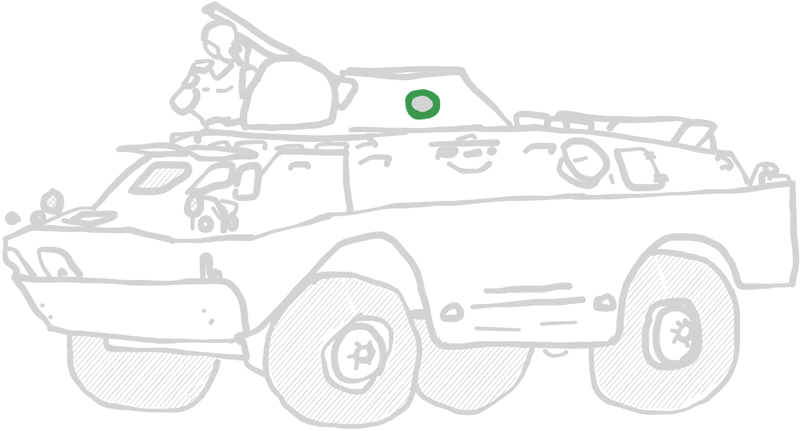
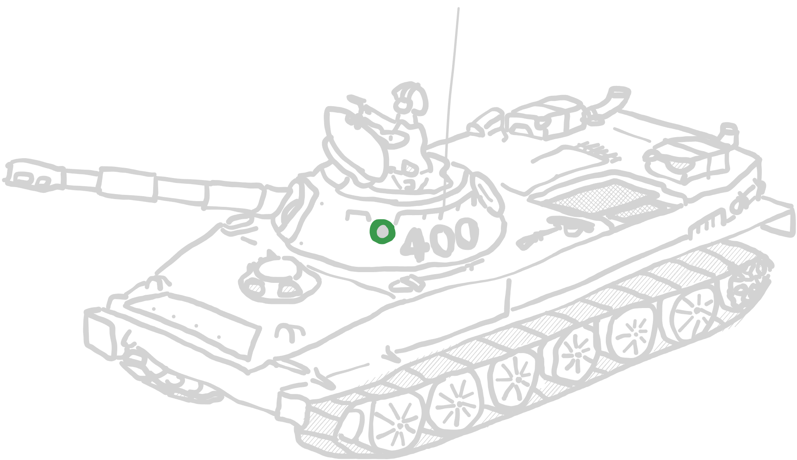
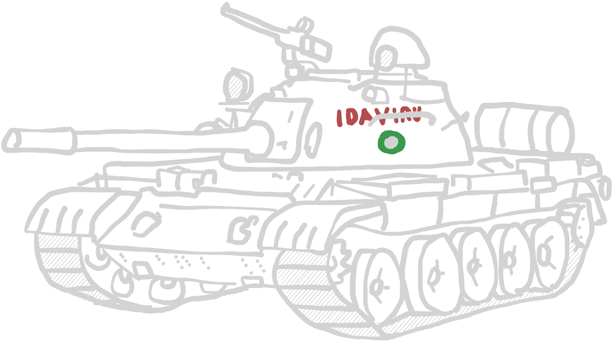

# NSPR Vehicles

## APCs / IFVs

If a vehicle has the IFV rule and is chosen in an IFV role, these vehicles are
connected to the first and second mandatory infantry units. Any vehicle that has
the IFV rule can also choose to ignore it and act on its own.

### BTR-D

The BTR-D is a Soviet airborne multi-purpose tracked armoured personnel carrier.
It was introduced in 1974 and first seen by the West in 1979 during the
Soviet–Afghan War. A unique design based on the BMD-1, addressing some of its
design flaws with a bigger troop compartment and the removal of a turret in favor
of two front-facing machine guns.

| BTR-D | </img> |
| :---- | ---- |
| Cost | 102 pt / 120 pt / 138 pt |
| Capacity | 10 soldiers |
| Damage value | 7+ Armoured Carrier |
| Default weapon configuration | <table><tr><td><b>Weapon systems</td><td>Smoke grenade launcher.   Detailed rules see [ruleset](../ruleset/H.E.A.T.md#smoke-screens). </td><td><ul><li>hull-mounted</li><li>front-facing</li></ul></tr><tr><td>PKB 7.62mm MMG</td><td>PKB 7.62mm medium machine gun  The weapon is located in the front-left, similar to a headlight.</td><td><ul><li>hull-mounted</li><li>front-facing</li></ul></tr><tr><td>PKB 7.62mm MMG</td><td>PKB 7.62mm medium machine gun  The weapon is located in the front-right, similar to a headlight.</td><td><ul><li>hull-mounted</li><li>front-facing</li></ul></tr></table> |
| Options |<table><tr><td><b>Main weapon options</td><td><b>Description</td><td>Modifiers</td><td><b>Cost</b></td></tr><tr><td>ZSU-23-2 medium autocannon</td><td>ZSU-23-2 anti-air gun. This weapon is secured by cables on the sides of the tank, which makes it less stable than a turret- mounted gun, but it's better than nothing, maybe?</td><td><ul><li>pintle-mounted</li><li>open-topped</li></ul></td><td>+ 30 pt</td></tr></table>All weapons are mounted at the commander's hatch, so only one can be chosen.<table><tr><td><b>Additional weapons</td><td><b>Description</td><td>Modifiers</td><td><b>Cost</b></td></tr><tr><td>MMG</td><td>Medium machine gun</td><td><ul><li>pintle-mounted</li><li>open-topped</li></ul></td><td>+15 pt</td></tr><tr><td>HMG</td><td>Heavy machine gun</td><td><ul><li>pintle-mounted</li><li>open-topped</li></ul></td><td>+ 25 pt</td></tr><tr><td>AGS-17 "Plamja" AGL</td><td>AGS-17 "Plamja" automatic  grenade launcher  Detailed rules see [HEAT rules](../H.E.A.T.excalidraw).</td><td><ul><li>pintle-mounted</li><li>open-topped</li></ul></td><td>+ 25 pt</td></tr><tr><td>9M14 Malyutka ATGM launcher</td><td>9M14 Malyutka Anti-Tank Guided  Missile Launcher  Detailed rules see [HEAT rules](../H.E.A.T.excalidraw).</td><td><ul><li>pintle-mounted</li><li>open-topped</li></ul></td><td>+ 35 pt</td></tr></table> |
| Special rules | <table><tr><td><b>Rules</td><td><b>Description</td></tr><tr><td>IFV</td><td>Detailed rules see [HEAT rules](../H.E.A.T.excalidraw).</td></tr><tr><td>Airborne Restraints</td><td>Due to being designed as small as possible to be air-dropped over enemy territory,  the BTR-Ds two bow-mounted machine guns were operated by a single machine gunner.  <ul><li>While actively transporting units, the second MMG can be operated by one of the passengers, but once disembarked, only one can be used per turn.</li><li>If any further weapon is added to the BTR-D, this also applies.</li></ul></td></tr><tr><td>Open-Topped</td><td>-</td></tr><tr><td>Amphibious</td><td>-</td></tr></table> |

### BTR-60P/PB

Old, soviet-made personell carrier from the 60s. Can be deployed reinforced by a
turret with a 14.5mm auto cannon  (BTR-60PB), which lead to a reduction in troop
capacity.

| BTR-60P/PB | </img> |
| :---- | ---- |
| Cost | 95 pt / 110 pt / 125 pt |
| Capacity | 14 soldiers |
| Damage value | 7+ Armoured Carrier |
| Default weapon configuration | <table><tr><td><b>Weapon systems</td><td><b>Description</td><td><b>Modifier</td></tr><tr><tr><td>Smoke Screen </td><td>Smoke grenade launcher.   Detailed rules see [ruleset](../ruleset/H.E.A.T.md#smoke-screens). </td><td><ul><li>hull-mounted</li><li>front-facing</li></ul></tr></table> |
| Options | <table><tr><td><b>Main weapon options</td><td><b>Description</td><td>Modifiers</td><td><b>Cost</b></td></tr><tr><td>14.5mm KPWT</td><td>Light auto-cannon.</td><td><ul><li>turret-mounted</li></ul></td><td>+ 40 pt</td></tr><td>7.62mm PKT</td><td>Co-axial MMG.  Comes as part of turret with the autocannon.  Reduces the capacity to **8**.</td><td><ul><li>turret-mounted</li><li>co-axial</li></ul></td><td>-</td></tr></table> |
| Special rules | <table><tr><td><b>Rules</td><td><b>Description</td></tr><tr><td>IFV</td><td>Detailed rules see [HEAT rules](../H.E.A.T.excalidraw).</td></tr><tr><td>Amphibious</td><td>-</td></tr></table> |

### BTR-80

The BTR-80 is an 8×8 wheeled APC designed in the Soviet Union. It was adopted in
1985 and replaced the previous vehicles, the BTR-60 and BTR-70, in the Soviet
Army. It was first deployed during the Soviet–Afghan War and serves to this day
in many modern armies.

| BTR-80 | </img> |
| :---- | ---- |
| Cost | 120 pt / 130 pt / 140 pt |
| Capacity | 7 soldiers |
| Damage value | 7+ Armoured Carrier |
| Default weapon configuration | <table><tr><td><b>Weapon systems</td><td><b>Description</td><td>Modifiers</td><tr><td>Smoke Screen</td><td>Smoke grenade launcher.   Detailed rules see [ruleset](../ruleset/H.E.A.T.md#smoke-screens). </td><td><ul><li>hull-mounted</li><li>front-facing</li></ul></tr><tr><td>14.5mm KPWT</td><td>Light auto-cannon.</td><td><ul><li>turret-mounted</li></ul></td></tr><td>7.62mm PKT</td><td>Co-axial MMG.  Comes as part of turret with the autocannon.</td><td><ul><li>turret-mounted</li><li>co-axial</li></ul></td></tr></table> |
| Options |- |
| Special rules | <table><tr><td><b>Rules</td><td><b>Description</td></tr><tr><td>IFV</td><td>Detailed rules see [HEAT rules](../H.E.A.T.excalidraw).</td></tr><tr><td>Amphibious</td><td>-</td></tr></table> |

### MT-LB

The MT-LB is a Soviet multi-purpose, fully amphibious, tracked armored fighting
vehicle in use since the 1970s. With its flat chassis back, a low profile and
big compartments, the MT-LB is ideal for the flat terrain of Estonia.

| BTR-60P/PB | </img> |
| :---- | ---- |
| Cost | 70 pt / 85 pt / 100 pt |
| Capacity | 11 soldiers |
| Damage value | 7+ Armoured Carrier |
| Default weapon configuration | <table><tr><td><b>Weapon systems</td><td>Smoke grenade launcher.   Detailed rules see [ruleset](../ruleset/H.E.A.T.md#smoke-screens). </td><td><ul><li>hull-mounted</li><li>front-facing</li></ul></tr></table> |
| Options |<table><tr><td><b>Main weapon options</td><td><b>Description</td><td>Modifiers</td><td><b>Cost</b></td></tr><tr><td>14.5mm KPWT</td><td>Light auto-cannon.</td><td><ul><li>turret-mounted</li></ul></td><td>+ 40 pt</td></tr><td>7.62mm PKT</td><td>Co-axial MMG.  Comes as part of turret with the autocannon.  Reduces the capacity to **8**.</td><td><ul><li>turret-mounted</li><li>co-axial</li></ul></td><td>-</td></tr></table> Additionally, one weapon system may be mounted to the flat bed. <table><tr><td><b>Main weapon options</td><td><b>Description</td><td>Modifiers</td><td><b>Cost</b></td></tr><tr><td>7.62mm PKT MMG</td><td>Back mounted MMG.</td><td><ul><li>pintle-mounted</li><li>open-topped</li></ul></td><td>+15 pt</td></tr><tr><td>14.5mm DshK HMG</td><td>Back mounted HMG.</td><td><ul><li>pintle-mounted</li><li>open-topped</li></ul></td><td>+20 pt</td></tr><tr><td>AGS-17 "Plamja" AGL</td><td>AGS-17 "Plamja" automatic  grenade launcher  Detailed rules see [ruleset](../ruleset/H.E.A.T.md#automatic-grenade-launchers-agl).</td><td><ul><li>pintle-mounted</li><li>open-topped</li></ul></td><td>+ 25 pt</td></tr><tr><td>9K113 Konkurs ATGM launcher</td><td>9K113 Konkurs Anti-Tank Guided  Missile Launcher  Detailed rules see [ruleset](../ruleset/H.E.A.T.md#anti-tank-guided-missiles-atgm).</td><td><ul><li>pintle-mounted</li><li>open-topped</li></ul></td><td>+ 30 pt</td></tr><tr><td>SPG-9 recoilless rifle</td><td>SPG-9 recoilless rifle. Used to fire  projectiles similar to the BMP-1's 73 mm  2A28 Grom.  Counts as a light anti-tank gun.</td><td><ul><li>front-facing</li><li>light anti-tank gun</li><li>open-topped</li><li>Backblast</li></ul></td><td>+30 pt</td></tr><tr><td>UB-32 rocket pod system</td><td>Air-to-ground S5 rocket pod.</td><td><ul><li>open-topped</li><li>front-facing</li><li>Indirect Fire</li><li>HE 2"</li><li>rocket pod</li></ul></td><td>+25 pt</td></tr><tr><td>M1938 107mm medium mortar</td><td>medium mortar system</td><td><ul><li>hull-mounted</li><li>front-facing</li><li>open-topped</li></ul></td><td>+ 30 pt</td></tr><tr><td>ZSU-23-2 medium autocannon</td><td>ZSU-23-2 anti-air gun.</td><td><ul><li>hull-mounted</li><li>open-topped</li></ul></td><td>+40 pt</td></tr></table> |
| Special rules | <table><tr><td><b>Rules</td><td><b>Description</td></tr><tr><td>IFV</td><td>Detailed rules see [HEAT rules](../H.E.A.T.excalidraw).</td></tr><tr><td>Amphibious</td><td>-</td></tr></table> |

***

## Heavy vehicles

The NSPR uses what it has. Their arsenal is a patchwork of anything that drives
and has a gun, and utilizes old tanks and APCs just as much as modern civilian
vehicles. A fast pickup with an AA gun, a mortar on a truck, T-54s old enough to
predate the Berlin wall.

### Wheeled Technical

Technicals serve the full spectrum of armoured support. With almost anything the
separtists deemed small enough to work being bolted to one, this fast pickup can serve
as an anti-infantry, anti-tank or anti-air role, as
artillery, as a driving bomb.

>Even though the Hilux is a promiment example of the wheeled technical, feel free to use
>any vehicle you want. This is for the unit for kitbashing.

| Toyota Hilux | </img> |
| :---- | ---- |
| Cost | 40 pt / 55 pt / 70 pt |
| Capacity | 8 soldiers |
| Damage value | 6+ Soft-Skinned Vehicle |
| Default weapon configuration |- |
| Options |<table><tr><td><b>Rules</td><td><b>Description</td><td>Modifiers</td><td><b>Cost</b></td></tr><tr><td>Command Vehicle</td><td>This vehicle is equipped with multiple radios and acts as a command vehicle.  Removes troop carrying ability.</td><td><ul><li>Command</li><li>No longer carries  troops</li></ul></td><td>+45 pt</td></tr><tr><td>Medical Equipment</td><td>The back of the vehicle is modified to tend for the wounded and transport patients.  Removes troop carrying ability.</td><td><ul><li>Medic</li><li>No longer carries  troops</li><li>No armaments allowed</li></ul></td><td>+ 20 pt</td></tr><tr><td>Selfmade armour</td><td>Metal sheets, chicken wire, rebar,  concrete; This vehicle is equipped  with DIY armour, protecting it from small arms fire and shrappnel.   Also, it weights way too much now.</td><td><ul><li>Slow</li><li>7+ Damage Value</li></ul></td><td>+25 pt</td></tr></table>Since these weapons are mounted to the back flat, only one main weapon may be chosen.<table><tr><td><b>Main weapon options</td><td><b>Description</td><td>Modifiers</td><td><b>Cost</b></td></tr><tr><td>7.62mm PKT MMG</td><td>Back mounted MMG  Reduces troop capacity to **4**.</td><td><ul><li>pintle-mounted</li><li>open-topped</li></ul></td><td>+15 pt</td></tr><tr><td>14.5mm DshK HMG</td><td>Back mounted HMG  Reduces troop capacity to **4**.</td><td><ul><li>pintle-mounted</li><li>open-topped</li></ul></td><td>+20 pt</td></tr><tr><td>AGS-17 "Plamja" AGL</td><td>AGS-17 "Plamja" automatic  grenade launcher  Detailed rules see [ruleset](../ruleset/H.E.A.T.md#automatic-grenade-launchers-agl).  Reduces troop capacity to **4**.</td><td><ul><li>pintle-mounted</li><li>open-topped</li></ul></td><td>+ 25 pt</td></tr><tr><td>9K113 Konkurs ATGM launcher</td><td>9K113 Konkurs Anti-Tank Guided  Missile Launcher  Detailed rules see [ruleset](../ruleset/H.E.A.T.md#anti-tank-guided-missiles-atgm). Reduces troop capacity to **4**.</td><td><ul><li>pintle-mounted</li><li>open-topped</li></ul></td><td>+ 30 pt</td></tr><tr><td>SPG-9 recoilless rifle</td><td>SPG-9 recoilless rifle. Used to fire  projectiles similar to the BMP-1's 73 mm  2A28 Grom.  Counts as a light anti-tank gun.  Reduces troop capacity to **4**.</td><td><ul><li>front-facing</li><li>light anti-tank gun</li><li>open-topped</li><li>Backblast</li></ul></td><td>+30 pt</td></tr><tr><td>UB-32 rocket pod system</td><td>Air-to-ground S5 rocket pod, which is  used as an area suppression weapon. While not very accurate, it is able to fire rapidly and is effective, if it hits.</td><td><ul><li>open-topped</li><li>front-facing</li><li>Indirect Fire</li><li>HE 2"</li><li>rocket pod</li></ul></td><td>+25 pt</td></tr><tr><td>M1938 107mm medium mortar</td><td>medium mortar system</td><td><ul><li>hull-mounted</li><li>front-facing</li><li>open-topped</li></ul></td><td>+ 30 pt</td></tr><tr><td>ZSU-23-2 medium autocannon</td><td>ZSU-23-2 anti-air gun.</td><td><ul><li>hull-mounted</li><li>open-topped</li></ul></td><td>+40 pt</td></tr></table> |
| Special rules | - |

### Tracked Technical

Repurposed tank hull from a scrap yard, museum or whereever else, the NSPR used
everything which allowed them to move weapon systems as self propelled weapons
to conceil their actual numbers, even a T34-mounted 120mm mortar is hardly ideal
for shoot and scoot maneuvers...

| Technical | </img> |
| :---- | ---- |
| Cost | tbd |
| Capacity | - |
| Damage value | 8+ Light Tank |
| Default weapon configuration | - |
| Options |<table><tr><td><b>Rules</td><td><b>Description</td><td>Modifiers</td><td><b>Cost</b></td></tr><tr><td>Command Vehicle</td><td>This vehicle is equipped with multiple radios and acts as a command vehicle.  Removes troop carrying ability.</td><td><ul><li>Command</li><li>No longer carries  troops</li></ul></td><td>+45 pt</td></tr><tr><td>Medical Equipment</td><td>The back of the vehicle is modified to tend for the wounded and transport patients.  Removes troop carrying ability.</td><td><ul><li>Medic</li><li>No longer carries  troops</li><li>No armaments allowed</li></ul></td><td>+ 20 pt</td></tr><tr><td>Selfmade armour</td><td>Metal sheets, chicken wire, rebar,  concrete; This vehicle is equipped  with DIY armour, protecting it from small arms fire and shrappnel.   Also, it weights way too much now.</td><td><ul><li>Slow</li><li>7+ Damage Value</li></ul></td><td>+25 pt</td></tr></table>Since these weapons are mounted to the interiour, only one main weapon may be chosen.<table><tr><td><b>Main weapon options</td><td><b>Description</td><td>Modifiers</td><td><b>Cost</b></td></tr><tr><td>7.62mm PKT MMG</td><td>Back mounted MMG</td><td><ul><li>pintle-mounted</li><li>open-topped</li></ul></td><td>+15 pt</td></tr><tr><td>14.5mm DshK HMG</td><td>Back mounted HMG</td><td><ul><li>pintle-mounted</li><li>open-topped</li></ul></td><td>+20 pt</td></tr><tr><td>AGS-17 "Plamja" AGL</td><td>AGS-17 "Plamja" automatic  grenade launcher  Detailed rules see [ruleset](../ruleset/H.E.A.T.md#automatic-grenade-launchers-agl). </td><td><ul><li>pintle-mounted</li><li>open-topped</li></ul></td><td>+ 25 pt</td></tr><tr><td>9K113 Konkurs ATGM launcher</td><td>9K113 Konkurs Anti-Tank Guided  Missile Launcher  Detailed rules see [ruleset](../ruleset/H.E.A.T.md#anti-tank-guided-missiles-atgm).</td><td><ul><li>pintle-mounted</li><li>open-topped</li></ul></td><td>+ 30 pt</td></tr><tr><td>SPG-9 recoilless rifle</td><td>SPG-9 recoilless rifle. Used to fire  projectiles similar to the BMP-1's 73 mm  2A28 Grom.  Counts as a light anti-tank gun.</td><td><ul><li>front-facing</li><li>light anti-tank gun</li><li>open-topped</li><li>Backblast</li></ul></td><td>+30 pt</td></tr><tr><td>UB-32 rocket pod system</td><td>Air-to-ground S5 rocket pod, which is  used as an area suppression weapon. While not very accurate, it is able to fire rapidly and is effective, if it hits.</td><td><ul><li>open-topped</li><li>front-facing</li><li>Indirect Fire</li><li>HE 2"</li><li>rocket pod</li></ul></td><td>+25 pt</td></tr><tr><td>M1938 107mm medium mortar</td><td>medium mortar system</td><td><ul><li>hull-mounted</li><li>front-facing</li><li>open-topped</li></ul></td><td>+ 30 pt</td></tr><tr><td>S2S1 120mm heavy mortar</td><td>heavy mortar system</td><td><ul><li>hull-mounted</li><li>front-facing</li><li>open-topped</li></ul></td><td>+ 40 pt</td></tr><tr><td>ZSU-23-2 medium autocannon</td><td>ZSU-23-2 anti-air gun.</td><td><ul><li>hull-mounted</li><li>open-topped</li></ul></td><td>+40 pt</td></tr></table> |
| Special rules | - |

### BRDM-2

The BRDM-2 is a soviet era reconnaissance and patrol vehicle. Not only used by
over 35 nations, it is still in active production, despite being introduced in
1962.

| BRDM-2 | </img> |
| :---- | ---- |
| Cost | 100 pt / 115 pt / 130 pt |
| Capacity | 2 soldiers |
| Damage value | 7+ Armoured Carrier |
| Default weapon configuration | <table><tr><td><b>Weapon systems</td><td><b>Description</td><td>Modifiers</td><tr><td>Smoke Screen</td><td>Smoke grenade launcher.   Detailed rules see [ruleset](../ruleset/H.E.A.T.md#smoke-screens). </td><td><ul><li>hull-mounted</li><li>front-facing</li></ul></tr><tr><td>14.5mm KPWT</td><td>Light auto-cannon.</td><td><ul><li>turret-mounted</li></ul></td></tr><td>7.62mm PKT MMG</td><td>Co-axial MMG.  Comes as part of turret with the autocannon.</td><td><ul><li>turret-mounted</li><li>co-axial</li></ul></td></tr></table> |
| Options |- |
| Special rules | <table><tr><td><b>Rules</td><td><b>Description</td></tr><tr><td>Recce</td><td>-</td></tr><tr><td>Amphibious</td><td>-</td></tr></table> |

### PT-76

Developed in the 60s and since used in most soviet armies, the PT-76 and its
derivatives serve to this day as light reconnaissance tanks. An amphibious tank
with a 76.2mm main gun, capable of damaging lightly armoured vehicles.

| PT-76 | </img> |
| :---- | ---- |
| Cost | tbd |
| Capacity | - |
| Damage value | 7+ Armoured carrier |
| Default weapon configuration | <table><tr><td><b>Weapon systems</td><td><b>Description</td><td>Modifiers</td></r><tr><td>Smoke Screen</td><td>Smoke grenade launcher.   Detailed rules see [ruleset](../ruleset/H.E.A.T.md#smoke-screens). </td><td><ul><li>turret-mounted</li><li>coaxial</li></ul></tr><tr><td>D56-T 76.2mm</td><td>76.2mm rifle-boored medium anti-tank gun</td><td><ul><li>turret-mounted</li><li>medium anti tank gun</li></ul></td></tr><tr><td>7.62mm SGMT MMG</td><td>7.62mm SGMT medium machine gun</td><td><ul><li>turret-mounted</li><li>co-axial</li></ul></tr></table> |
| Options | <table><tr><td><b>Main weapon options</td><td><b>Description</td><td>Modifiers</td><td><b>Cost</b></td></tr><tr><td>12.7mm DshK HMG</td><td>12.7mm DshK heavy machine gun</td><td><ul><li>pintle-mounted</li><li>open-topped</li></ul></td><td>+ 25 pt</tr></tr></table> |
| Special rules | <table><tr><td><b>Rules</td><td><b>Description</td></tr><tr><td>HE 1"</td><td>-</td></tr><tr><td>Amphibious</td><td>-</td></tr><tr><td>Obsolete Main Gun</td><td>Unlike most modern tank guns, this ww2-era gun still uses a rifled barrel to propell a kinetic round. When firing at an armoured target, this weapon suffers a -1 PEN.</ul></td></tr><tr><td>Open-Topped (*if selected*)</td><td>-</td></tr></table> |

### BMP-1

One of the original IFVs, the lightweight BMP-1 is armed with a light anti tank
gun as well as an early ATGM. Due to the low numbers the NSPR has access to this
vehicle, it is used less as an IFV, and more as a light tank.

| BMP-1 | </img> |
| :---- | ---- |
| Cost | tbd |
| Capacity | - |
| Damage value | 7+ Armoured Carrier |
| Options | TODO |
| Default weapon configuration | - |
| Special rules | TODO |

### ZSU-57-2

As an old soviet anti air system, the ZSU-57-2 is used by the NSPR in an anti-
infantry and light vehicle gun.

| ZSU-57-2 | </img> |
| :---- | ---- |
| Cost | tbd |
| Capacity | - |
| Damage value | 7+ Armoured Carrier |
| Options | TODO |
| Default weapon configuration | - |
| Special rules | TODO |

### T-54/T-55

NSPR forces have access to some T-54 and T-55 Main Battle Tanks. These vehicles
are vastly inferiour in comparison against modern or even 1970s-onwards MBTs, but
are still valuable armoured assets if used defensively.

| T-54/T-55 | </img> |
| :---- | ---- |
| Cost | 144 pt / 159 pt / 174 pt |
| Capacity | - |
| Damage value | 9+ Medium Tank |
| Default weapon configuration | <table><tr><td><b>Weapon systems</td><td><b>Description</td><td>Modifiers</td></r><tr><td>Smoke Screen</td><td>Smoke grenade launcher.   Detailed rules see [ruleset](../ruleset/H.E.A.T.md#smoke-screens). </td><td><ul><li>hull-mounted</li><li>front-facing</li></ul></tr><tr><td>7.62mm SGMT MMG</td><td>7.62mm SGMT medium machine gun</td><td><ul><li>turret-mounted</li><li>co-axial</li></ul></tr><tr><td>D10-T 100mm</td><td>100mm rifle-boored heavy anti-tank gun</td><td><ul><li>turret-mounted</li></ul></tr></table> |
| Options | <table><tr><td><b>Main weapon options</td><td><b>Description</td><td>Modifiers</td><td><b>Cost</b></td></tr><tr><td>12.7mm DshK HMG</td><td>12.7mm DshK heavy machine gun</td><td><ul><li>pintle-mounted</li><li>open-topped</li></ul></td><td>+ 25 pt</tr></tr></table> |
| Special rules | <table><tr><td><b>Rules</td><td><b>Description</td></tr><tr><td>HE 2"</td><td>-</td></tr><tr><td>Obsolete Main Gun</td><td>Unlike most modern tank guns, this ww2-era gun still uses a rifled barrel to propell a kinetic round. When firing at an armoured target, this weapon suffers a -1 PEN.</td><tr><td>Open-Topped (*if selected*)</td><td>-</td></tr></table> |

***

## Transports

Some transport vehicles may be upgraded to fill different slots, e. g. as a
command vehicle, artillery spotter, etc.. You can find more information in the
Options-column of the respective transport vehicle.

### Mi-8 Hip

Helicopter unit in a transport role.

| Mil Mi-2B | </img> |
| :---- | ---- |
| Cost | tbd |
| Capacity | 16 soldiers |
| Damage value | 7+ Medium helicopter |
| Special rules | <table><tr><td><b>Rules</td><td><b>Description</td></tr><tr><td>Transport Vehicle</td><td>Transport vehicles are unarmed and more vulnerable than vehicles in a combat role.</td></tr></table> |

### Mi-2 Hoplite

Helicopter unit in a transport role.

| Mil Mi-2B | </img> |
| :---- | ---- |
| Cost | tbd |
| Capacity | 16 soldiers |
| Damage value | 7+ Medium helicopter |
| Special rules | <table><tr><td><b>Rules</td><td><b>Description</td></tr><tr><td>Transport Vehicle</td><td>Transport vehicles are unarmed and more vulnerable than vehicles in a combat role.</td></tr></table> |

### Truck

An unarmoured truck used to transport anything from logistical stuff to troops.

| Truck | </img> |
| :---- | ---- |
| Cost | tbd |
| Capacity | 16 soldiers |
| Damage value | 6+ Soft-Skinned Vehicle |
| Default weapon configuration | - |
| Special rules | <table><tr><td><b>Rules</td><td><b>Description</td></tr><tr><td>Transport Vehicle</td><td>Transport vehicles are unarmed and more vulnerable than vehicles in a combat role.</td></tr></table> |

### Lada

Who needs armour or expensive trucks when Helve just installed a forced induction
system on his VAZ-2101? Im sure it will work out fine.

| Lada | </img> |
| :---- | ---- |
| Cost | tbd |
| Capacity | 6 soldiers |
| Damage value | 6+ Soft-Skinned Vehicle |
| Special rules | <table><tr><td><b>Rules</td><td><b>Description</td></tr><tr><td>Transport Vehicle</td><td>Transport vehicles are unarmed and more vulnerable than vehicles in a combat role.</td></tr><tr><td>Baltic Drift</td><td>If the Lada performs a RUN and does not make a turn until the end, it is allowed to do  2x 90° turns at the end.  </table> |

### Jeep

Military truck, maybe stolen from an estonian garrison, maybe out of a museum,
or perhaps a hobby project.

| Wolf G5 Jeep | </img> |
| :---- | ---- |
| Cost | tbd |
| Capacity | 6 soldiers |
| Damage value | 6+ Soft-Skinned Vehicle |
| Special rules | <table><tr><td><b>Rules</td><td><b>Description</td></tr><tr><td>Transport Vehicle</td><td>Transport vehicles are unarmed and more vulnerable than vehicles in a combat role.</td></tr></table> |

### R75 Ural Motorcycle Transport

Old-school motorcycle with sidecar to quickly transport small amounts of units.

| R75 Ural | </img> |
| :---- | ---- |
| Cost | 18 pt / 23 pt / 28 pt |
| Capacity | 2 soldiers |
| Damage value | 6+ Soft-Skinned Vehicle |
| Default weapon configuration |- |
| Special rules | <table><tr><td><b>Rules</td><td><b>Description</td></tr><tr><td>Transport Vehicle</td><td>Transport vehicles are unarmed and more vulnerable than vehicles in a combat role.</td></tr></table> |

### Boat

Small self propelled boat to transport units over water.

| Boat | </img> |
| :---- | ---- |
| Cost | tbd |
| Capacity | 6 soldiers |
| Damage value | 6+ Soft-Skinned Vehicle |
| Special rules | <table><tr><td><b>Rules</td><td><b>Description</td></tr><tr><td>Transport Vehicle</td><td>Transport vehicles are unarmed and more vulnerable than vehicles in a combat role.</td></tr><tr><td>Waterborne</td><td>-</td></tr></table> |
