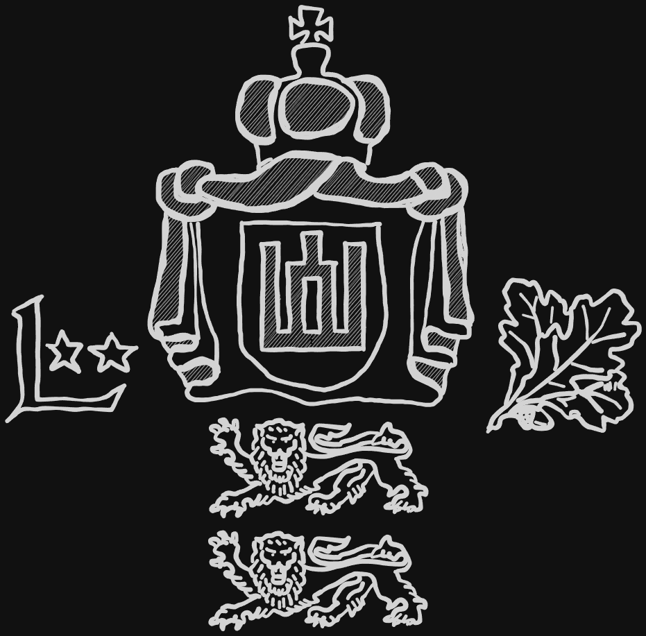

# Baltic Security Partnership Brigade

Logo of the Baltic Security Partnership Brigade

***

## Table of content

- [Army modifiers](#army-modifiers)

- [Officers](#officers)
- [Infantry](#infantry)
- [Combat support](#combat-support-units)
- [Machine guns](#machine-gun-teams)
- [Anti tank teams](#anti-tank-teams)
- [Micro air vehicles](#micro-air-vehicles)
- [Mortar teams](#mortar-teams)
- [Anti-air systems](#anti-air-systems)
- [Divisional reinforcements](#divisional-reinforcements)

- [APCs/IFVs](#apcs--ifvs)
- [Heavy vehicles](#heavy-vehicles)
- [Transports](#transports)

***

## Army modifiers

### Cavalry Training

Units in this Brigade are specifically trained to be deployed by helicopter.
Combat landings and disembarking are the norm. Due to this training, regulars
are allowed to disembark by rapelling, and any failed order test to leave a
helicopter may be rerolled.

*TLDR: Regs are allowed to rapell, reroll failed helicopter disembark order tests*

### Forest dwellers

These units are trained for deep incursions and traversal of the bogs and
marches of the Baltics. What is a specialization for other forces is here normal.
Any regular or veteran officer or infantry group is allowed to get the following rule
at 3pt/u:

<table><tr><td>Recon training</td><td>These soldiers are trained to operate and maneuver in even the toughest terrain.  When using an ADVANCE to move through rough terrain, throw a D2, and on a positive result the team may instead use the RUN distance.</td></table>

***

## Officers

### Leitenantas

Officers of NATO code OF-1 are young officers such as First or Second Lieutenants.
They lead a platoon into battle.

| OF-1 Officer | </img> |
| :---- | ---- |
| Cost | 21 pt / 30 pt / 39 pt |
| Reinforcement | up to 2 attendants (AR): 7 pt / 10 pt / 13 pt each |
| Setup | NCO (as depicted) |
| Options | - |
| Special rules | <table><tr><td><b>Rules</td><td><b>Description</td></tr><tr><td>You men, snap to action!</td><td>-</td></tr><tr><td>Command</td><td>-</td></tr></table> |

### Vyresnysis leitenantas

Companies are lead by Captains or in some cases even Majors. They manage several
platoons and outrank all other units on the table.

| OF-2 Officer | </img> |
| :---- | ---- |
| Cost | 42 pt / 60 pt / 78 pt |
| Reinforcement | up to 2 attendants (AR): 7 pt / 10 pt / 13 pt each |
| Setup | NCO (as depicted) |
| Options | - |
| Special rules | <table><tr><td><b>Rules</td><td><b>Description</td></tr><tr><td>You men, snap to action! (2x)</td><td>-</td></tr><tr><td>Command</td><td>-</td></tr></table> |

***

## Infantry

### Žvalgybos komanda

A small team of forward reconnaissance infantry.

| Recon team | </img> |
| :---- | ---- |
| Cost | 20 pt / 30 pt / 40 pt |
| Reinforcement | up to 2 attendants (AR): 7 pt / 10 pt / 13 pt each |
| Setup | NCO (AR) + 1 attendants (AR) |
| Options |<table><tr><td><b>Additional weapons</td><td><b>Description</td><td><b>Cost</b></td></tr><tr></tr><tr><td>1x DMR</td><td>Designated marksman rifle</td><td>+15 pt</td></tr><tr><td>Smoke grenades</td><td>DM-25 smoke grenade, used for conceilment of movement.</td><td>+10 pt</td></tr><</table><table><tr><td><b>Optional rules</td><td><b>Description</td><td><b>Cost</b></td></tr><tr><td>Quad Bikes</td><td>Unit is equipped with quad bikes.  See [ruleset](../ruleset/heat-ruleset.md#quad-bikes) for more information.</td><td>+15 pt/unit</td></tr></table> |
| Special rules | <table><tr><td><b>Rules</td><td><b>Description</td></tr><tr><td>Rangers</td><td>-</td></tr><tr><td>Smoke grenades (*if selected*)</td><td>One time smoke screen.  See [ruleset](../ruleset/heat-ruleset.md#smoke-grenades) for more information.</td></tr><tr><td>Break contact</td><td>Recon units are often confronted with superior enemies they are not meant to engage. To fall back in a controlled fashion,  these units may fire first, then maneuver during an ADVANCE.</td></tr></table> |

### Žvalgybos skyrius

A group of recon infantry.

| Recon group | </img> |
| :---- | ---- |
| Cost | 35 pt / 50 pt / 65 pt |
| Reinforcement | up to 3 attendants (AR): 7 pt / 10 pt / 13 pt each |
| Setup | NCO (SMG) + 3 attendants (AR) |
| Options |<table><tr><td><b>Additional weapons</td><td><b>Description</td><td><b>Cost</b></td></tr><tr><td>1x DMR</td><td>Designated marksman rifle</td><td>+15 pt</td></tr><tr><td>1x LAW</td><td>Light anti-tank weapon</td><td>+20 pt</td></tr><tr><td>Smoke grenades</td><td>DM-25 smoke grenade, used for conceilment of movement.</td><td>+10 pt</td></tr></table>|
| Special rules | <table><tr><td><b>Rules</td><td><b>Description</td></tr><tr><td>Rangers</td><td>-</td></tr><tr><td>Smoke grenades (*if selected*)</td><td>One time smoke screen.  See [ruleset](../ruleset/heat-ruleset.md#smoke-grenades) for more information.</td></tr><tr><td>Break contact</td><td>Recon units are often confronted with superior enemies they are not meant to engage. To fall back in a controlled fashion,  these units may fire first, then maneuver during an ADVANCE.</td></tr></table> |

### Pasienis pėstininkų "Varlių vyrai"

Nicknamed frog men, this group of infantry is boarded on small boats to
traverse the bogs and marches of the baltic national parks along the borders.

| Frogmen | </img> |
| :---- | ---- |
| Cost | 55 pt / 70 pt / 85 pt |
| Reinforcement | up to 3 attendants (SMG): 7 pt / 10 pt / 13 pt each |
| Setup | NCO (SMG) + 3 attendants (SMG) |
| Options |<table><tr><td><b>Additional weapons</td><td><b>Description</td><td><b>Cost</b></td></tr><tr><td>1x LMG</td><td>Light machine gun</td><td>+20 pt</td></tr><tr><td>1x UGL</td><td>Underbarrel grenade launcher</td><td>+10 pt</td></tr><tr><td>Explosives</td><td>Multi-purpose explosive.</td><td>+15 pt</td></tr><tr><td>Smoke grenades</td><td>DM-25 smoke grenade, used for conceilment of movement.</td><td>+10 pt</td></tr></table><table><tr><td><b>Optional rules</td><td><b>Description</td><td><b>Cost</b></td></tr><tr><td>Boats</td><td>Unit is mounted on a small boat.  See [ruleset](../ruleset/heat-ruleset.md#boats) for more information.</td><td>+15 pt</td></tr></table> |
| Special rules | <table><tr><td><b>Rules</td><td><b>Description</td></tr></tr><tr><td>Rangers</td><td>-</td></tr><tr><td>Stubborn</td><td>-</td></tr><tr><td>Recon training</td><td>These soldiers are trained to operate and maneuver  in even the toughest terrain.  When using an ADVANCE to move through rough terrain, throw a D2, and on a positive result the team may instead use the RUN distance.</td><tr><td>Smoke grenades (*if selected*)</td><td>One time smoke screen.  See [ruleset](../ruleset/heat-ruleset.md#smoke-grenades) for more information.</td></tr><tr><td>Explosives</td><td>See [ruleset](../ruleset/heat-ruleset.md#bangalores) for more information.</td></tr></table> |

### Kavalerijos skyrius

Retaining the old name for horse mounted infantry, modern cavalry is mounted upon
helicopters. This infantry group works in conjunction with a helicopter
in areas which are hard to reach by any other means.

| Cavalry squad | </img> |
| :---- | ---- |
| Cost | 35 pt / 50 pt / 65 pt |
| Reinforcement | up to 5 attendants (AR): 7 pt / 10 pt / 13 pt each |
| Setup | NCO (AR) + 3 attendants (AR) |
| Options |<table><tr><td><b>Additional weapons</td><td><b>Description</td><td><b>Cost</b></td></tr><tr><td>2x LMG</td><td>Light machine gun</td><td>+20 pt each</td></tr><tr><td>1x UGL</td><td>Underbarrel grenade launcher</td><td>+10 pt</td></tr><tr><td>1x LAW</td><td>Light anti-tank weapon</td><td>+20 pt</td></tr></table> |
| Special rules | <table><tr><td>Airborne</td><td>When dismounting from a helicopter, this unit may reroll failed order checks.</td></tr></table> |

### Husarų pėstininkų skyrius

The heaviest infantry the brigade has to offer. The hussars are the mechanized
units which use M113 and armoured reserve vehicles.

| Husar squad | </img> |
| :---- | ---- |
| Cost | 45 pt / 60 pt / 75 pt |
| Reinforcement | up to 3 attendants (AR): 7 pt / 10 pt / 13 pt each |
| Setup | NCO (AR) + 3 attendants (AR) |
| Options |<table><tr><td><b>Additional weapons</td><td><b>Description</td><td><b>Cost</b></td></tr><tr><td>1x LMG</td><td>Light machine gun</td><td>+20 pt</td></tr><tr><td>1x UGL</td><td>Underbarrel grenade launcher</td><td>+10 pt</td></tr><tr><td>Explosives</td><td>Multi-purpose explosive.</td><td>+15 pt</td></tr><tr><td>Smoke grenades</td><td>DM-25 smoke grenade, used for conceilment of movement.</td><td>+10 pt</td></tr></table> |
| Special rules | <table><tr><td><b>Rules</td><td><b>Description</td></tr><tr><td>Smoke grenades (*if selected*)</td><td>One time smoke screen.  See [ruleset](../ruleset/heat-ruleset.md#smoke-grenades) for more information.</td></tr><tr><td>Explosives</td><td>See [ruleset](../ruleset/heat-ruleset.md#bangalores) for more information.</td></tr></table> |

### "Eksitaja" užpuolimas skyrius

Raid infantry groups were used in the beginning of the war to deal heavy losses
to the NSPR logistical hubs located in remote parts of the national park.

This earned them the local nickname "Eksitaja", which are mythological creatures
haunting estonian bogs.

| Raiding squad | </img> |
| :---- | ---- |
| Cost | 40 pt / 55 pt / 70 pt |
| Reinforcement | up to 3 attendants (AR): 7 pt / 10 pt / 13 pt each |
| Setup | NCO (SMG) + 3 attendants (AR) |
| Options |<table><tr><td><b>Additional weapons</td><td><b>Description</td><td><b>Cost</b></td></tr><tr><td>1x LMG</td><td>Light machine gun</td><td>+20 pt</td></tr><tr><td>1x UGL</td><td>Underbarrel grenade launcher</td><td>+10 pt</td></tr><tr><td>Explosives</td><td>Multi-purpose explosive.</td><td>+15 pt</td></tr><tr><td>Smoke grenades</td><td>DM-25 smoke grenade, used for conceilment of movement.</td><td>+10 pt</td></tr></table>|
| Special rules | <table><tr><td><b>Rules</td><td><b>Description</td></tr></tr><tr><td>Engineers</td><td>See [ruleset](../ruleset/heat-ruleset.md#engineer) for more information</td></tr><td>Smoke grenades (*if selected*)</td><td>One time smoke screen.  See [ruleset](../ruleset/heat-ruleset.md#smoke-grenades) for more information.</td></tr><tr><td>Explosives</td><td>See [ruleset](../ruleset/heat-ruleset.md#bangalores) for more information.</td></tr></table> |

***

## Combat support units

### Armoured Engineer group

Support infantry, used to clear terrain or restrict enemy movement.

| Engineers group |  </img> |
| :---- | ---- |
| Cost | 40 pt / 55 pt / 70 pt |
| Reinforcement | up to 5 attendants (SMG): 7 pt / 10 pt / 13 pt each |
| Setup | NCO (SMG) + 2 attendants (SMG) |
| Options |<table><tr><td><b>Additional weapons</td><td><b>Description</td><td><b>Cost</b></td></tr><tr><td>1x LMG</td><td>Light machine gun</td><td>+20 pt</td></tr><tr><td>Sprengrohr (*Bangalore*)</td><td>Multi-purpose explosive.</td><td>+15 pt</td></tr><tr><td>Mines</td><td>See IED section in [ruleset](../ruleset/heat-ruleset.md#improvised-explosive-devices-ied-and-mines). They behave the same as IEDs, but can't be disguised. Conventional forces don't use decoys.<td>+20 pt</td></tr></table> |
| Special rules | <table><tr><td><b>Rules</td><td><b>Description</td></tr><tr><td>Explosives</td><td>See [ruleset](../ruleset/heat-ruleset.md#bangalores) for more information.</td></tr><tr><td>Engineers</td><td>See [ruleset](../ruleset/heat-ruleset.md#engineer) for more information.</td></tr></table> |

### Sako TRG-22 sniper team

Snipers are used to engage high-valuable targets in an engagement, particularly
leaders of infantry groups, heavy weapon system operators or other assets.
They can be devastating in the correct spot, used at the correct time.

| Sniper team | </img> |
| :---- | ---- |
| Cost | 35 pt / 50 pt / 65 pt |
| Reinforcement | - |
| Setup | NCO (SNIPER) + 1 attendant (SMG) |
| Options | - |
| Special rules | <table><tr><td><b>Rules</td><td><b>Description</td></tr><tr><td>Sniper</td><td>-</td></tr><tr><td>Team</td><td>-</td></tr></table> |

### M82 AMR team

Anti materiell rifle sniper team are used to engage anything from infantry to
lightly armoured vehicles.

| AMR team | </img> |
| :---- | ---- |
| Cost | 45 pt / 60 pt / 75 pt |
| Reinforcement | - |
| Setup | NCO (AMR) + 1 attendant (SMG) |
| Options | - |
| Special rules | <table><tr><td><b>Rules</td><td><b>Description</td></tr><tr><td>Sniper</td><td>-</td></tr><tr><td>Team</td><td>-</td></tr><tr><td>Fixed</td><td>-</td></tr></table> |

### Medical specialist

Medics move among the frontline and try to rescue any casualties that happen close
to them. Just as in the original ruleset, they are treated as true profesionalls,
only worthy of the "Veteran" status.

| Medic | </img> |
| :---- | ---- |
| Cost | - / - / 45 pt |
| Reinforcement | - |
| Setup | NCO (unarmed) |
|Options| - |
| Special rules | <table><tr><td><b>Rules</td><td><b>Description</td></tr><tr><td>Medic</td><td>-</td></tr></table> |

***

## Machine gun teams

### MG3 MMG team

Lithuanian MG3s taken from wartime storage to equip the new formations.
MG3 MMG team.

| MG3 MMG team | </img> |
| :---- | ---- |
| Cost | 35 pt / 50 pt / 65 pt |
| Reinforcement | - |
| Setup | NCO (MMG) + 2 loaders (SMG) |
| Options | - |
| Special rules | <table><tr><td><b>Rules</td><td><b>Description</td></tr><tr><td>Team</td><td>-</td></tr><tr><td>Fixed</td><td>-</td></tr></table> |

### .50cal Browning HMG team

Heavy machine gun system used to surpress enemy forces at longer ranges, as well
as lightly armoured vehicles.

| .50cal Browning HMG team | </img> |
| :---- | ---- |
| Cost | 49 pt / 70 pt / 91 pt |
| Reinforcement | - |
| Setup | NCO (HMG) + 2 loaders (SMG) |
| Options | - |
| Special rules | <table><tr><td><b>Rules</td><td><b>Description</td></tr><tr><td>Team</td><td>-</td></tr><tr><td>Fixed</td><td>-</td></tr></table> |

### Quad MMG

A Yamaha Grizzly 450EPS Quad with a rear-mounted MG 3 MMG.

| MG3 quad | </img> |
| :---- | ---- |
| Cost | - pt / 65 pt / 80 pt |
| Reinforcement | - |
| Setup | NCO ( MMG ) |
|Options| - |
| Special rules | <table><tr><td><b>Rules</td><td><b>Description</td></tr><tr><td>Team</td><td>Rulebook [pg. X]</td></tr><tr><td>Fixed</td><td>Rulebook [pg. X]</td></tr><tr><td>Quad Bike</td><td>See [ruleset](../ruleset/heat-ruleset.md#quad-bikes)</td></tr><tr><td>Rear-mounted MMG</td><td>Fire ark of MG3 is to the back and 90° to each side (so 9 and 3 o'clock from the drivers perspective).</table> |

### GMG 40mm team

AGL team with a HK GMG 40mm.

| AGL team | </img> |
| :---- | ---- |
| Cost | 50 pt / 60 pt / 75 pt |
| Reinforcement | - |
| Setup | NCO (AGL) + 2 loaders (SMG) |
| Options | - |
| Special rules | <table><tr><td><b>Rules</td><td><b>Description</td></tr><tr><td>Team</td><td>-</td></tr><tr><td>Fixed</td><td>-</td></tr><tr><td>HE 1"</td><td>-</td></tr><tr><td>AGL</td><td>Automatic grenade launcher, which rapidly fires 40mm ordnance.  Detailed description in [ruleset](../ruleset/heat-ruleset.md#automatic-grenade-launchers-agl). </td></tr></table> |

***

## Anti-tank teams

### RPG team

Anti-tank rocket team, equipped with a mix of Carl Gustav, Panzerfaust 3s, and
other arms donations that made it from the armed forces down to the reserve
brigades.

| RPG team | </img> |
| :---- | ---- |
| Cost | 42 pt / 60 pt / 78 pt |
| Reinforcement | - |
| Setup | NCO (RPG + SMG) + 1 loader (SMG) |
| Options | <table><table><tr><td><b>Rules</td><td><b>Description</td><td><b>Cost</td></tr><tr><td>Tandem HEAT Charge</td><td>Heavier charge than  normal round, but less range. Check [ruleset](../ruleset/heat-ruleset.md#tandem-heat-charges) for details.</td><td>+15 pt</td></tr></table> |
| Special rules | <table><tr><td><b>Rules</td><td><b>Description</td></tr><tr><td>Team</td><td>-</td></tr><tr><td>Fixed</td><td>-</td></tr><tr><td>Backblast</td><td>See [ruleset](../ruleset/heat-ruleset.md#anti-tank-guided-missiles-atgm) for more information.</td></tr></table> |

### FMG-148 Javelin team

The Javelin is a popular ATGM system developed in the United States, which is
able to use "fire-and-forget"-capable missiles with infrared seakers. Tanks and
other heavily armoured targets can furthermore be attacked in a TOP-DOWN attack,
striking the roof of the tank, which is oftentimes less armoured than the front.

Anti-tank guided missiles are used against heavily armoured targets, and are
oftentimes launched from a man-portable weapon system or from a vehicle mount.
They are able to traverse large areas and more modern targeting systems do not
even require the operator themselves to aid the missile to its target.

| ATGM team | </img> |
| :---- | ---- |
| Cost | 60 pt / 75 pt / 90 pt |
| Reinforcement | - |
| Setup | NCO (ATGM) + 2 loaders (SMG) |
| Options |<table><tr><td><b>Additional weapons</td><td><b>Description</td><td><b>Cost</b></td></tr><tr><td>Fire-And-Forget</td><td>Weapon team is not required to stay stationary during flight.  See ATGM section in [ruleset](../ruleset/heat-ruleset.md#anti-tank-guided-missiles-atgm).<td>+20 pt</td></tr></table> |
| Special rules | <table><tr><td><b>Rules</td><td><b>Description</td></tr><tr><td>Team</td><td>-</td></tr><tr><td>Fixed</td><td>-</td><tr><td>ATGM</td><td>See [ruleset](../ruleset/heat-ruleset.md#anti-tank-guided-missiles-atgm) for more information.</td></tr><tr><td>Backblast</td><td>See [ruleset](../ruleset/heat-ruleset.md#anti-tank-guided-missiles-atgm) for more information.</td></tr></table> |

### 90mm Pvpj-1110 recoilless rifle team

The Pansarvärnspjäs 1110, commonly abbreviated as Pvpj-1110 and nicknamed
"stove pipe", is a swedish anti tank recoilless rifle. It is mounted on a one-axial
carriage and can be towed.

Recoilless guns or rifles are lightweight artillery pieces, or in this case man-
portable launchers, which propel a large projectile and a counterweight at the
same time. This way, the recoil is mitigated, allowing for a simpler, lighter
design compared to weapons of similar calibre and effect.

| Recoilless gun team | </img> |
| :---- | ---- |
| Cost | tbd |
| Reinforcement | - |
| Setup | NCO (MEDIUM AT GUN) + 2 loaders (PISTOL) |
| Options | - |
| Special rules | <table><tr><td><b>Rules</td><td><b>Description</td></tr><tr><td>Team</td><td>-</td></tr><tr><td>Fixed</td><td>-</td></table> |

***

## Micro air vehicles

### AeroVironment RQ-20 Puma

The RQ-20 Puma is an american made fixed wing reconnaissance drone system used
to observe enemy formations.

| Recon UAV team | </img> |
| :---- | ---- |
| Cost | 41 pt / 52 pt / 63 pt |
| Reinforcement | up to 2 attendants: 7 pt / 10 pt / 13 pt |
| Setup | NCO (PDW) |
| Options | - |
| Special rules | <table><tr><td><b>Rules</td><td><b>Description</td></tr><tr><td>Fixed</td><td>-</td></tr><tr><td>UAV</td><td>Team operates a small UAV with varying mission role. Detailed description in [ruleset](../ruleset/heat-ruleset.md#drones). </td></tr><tr><td>On-map Operator</td><td>Operator of unit is present on map.</td></tr><tr><td>Quadrocopter</td><td>Drone is propelled by multiple rotors. </td></tr></table> |

### THeMIS Operator

As if taken straight from a science fiction movie, the THeMIS is a ground based
drone with a modular flatbed design. It can operate as a mule for logistical
purposes on a group level, be equipped with a camera pod for reconnaissance
missions, or be fielded with remote weapon stations in a support or attack role.

| THeMIS |  </img> |
| :---- | ---- |
| Cost | tbd |
| Reinforcement | up to 2 attendants: 7 pt / 10 pt / 13 pt |
| Setup | NCO (PDW) |
| Options | <table><tr><td><b>Variant<b></td><td><b>Description<b></td><td><b>Modifiers<b></td><td><b>Cost</td></tr><tr><td>Observe</td><td>Recon unit. Serves as a platoon spotter.</td><td>-</td><td>+0 pt</td></tr><tr><td>Combat Support</td><td>Equipped with singular MMG. Remote controlled weapon station.</td><td><ul><li>turret mounted</ul></td><td>+15 pt</td></tr><tr><td>Combat ADDER</td><td>Combat Version with remote weapon station. Equipped with:<ul><li>CIS40 AGL</li><li>CIS50MG HMG</li><li>7.62 COAX MMG</li></ul></td><td><ul><li>turret mounted</li><li>co-axial</ul></td><td>+70 pt</td></tr></tr></table> Additionally, the ADDER Variant are allowed to buy the following smoke screen. <table><tr><td><b>Variant<b></td><td><b>Description<b></td><td><b>Modifiers<b><td><b>Cost</td></td></tr><tr><td>Smoke Screen</td><td>Smoke grenade launcher.   Detailed rules see [ruleset](../ruleset/heat-ruleset.md#smoke-screens). </td><td><ul><li>hull-mounted</li><li>front-facing</li></ul></td><td>+15 pt</td></tr></table>|

***

## Mortar teams

Since this brigade does not field any artillery, mortars are used to counter-
balance the missing firepower.

### Hirtenberger M60 60mm light mortar team

light mortar team.

| 60mm light mortar team | </img> |
| :---- | ---- |
| Cost | 24 pt / 35 pt / 46 pt |
| Reinforcement | Spotter (PDW) +10 pt |
| Setup | NCO (LIGHT MORTAR) + 1 loader (PISTOL) |
| Options | - |
| Special rules | <table><tr><td><b>Rules</td><td><b>Description</td></tr><tr><td>Team</td><td>-</td></tr><tr><td>HE 1"</td><td>-</td></tr><tr><td>Indirect Fire</td><td>-</td></tr><tr><td>Spotter</td><td>-</td></tr></table> |

### L16 81mm medium mortar team

Medium mortar team at infantry group level, models fielded by the estonian army
include the B-455, M252 and L16A1, all 81mm.

| 81mm medium mortar team | </img> |
| :---- | ---- |
| Cost | 35 pt / 50 pt / 65 pt |
| Reinforcement | Spotter +10 pt |
| Setup | NCO (MEDIUM MORTAR) + 1 loader (PISTOL) |
| Options | - |
| Special rules | <table><tr><td><b>Rules</td><td><b>Description</td></tr><tr><td>Team</td><td>-</td></tr><tr><td>Fixed</td><td>-</td></tr><tr><td>HE 2"</td><td>-</td></tr><tr><td>Indirect Fire</td><td>-</td></tr><tr><td>Spotter</td><td>-</td></tr></table> |

### m/41D 120 mm heavy mortar team

heavy mortar team.

| 120mm heavy mortar team | </img> |
| :---- | ---- |
| Cost | 46 pt / 65 pt / 84 pt |
| Reinforcement | Spotter (PDW) +10 pt |
| Setup | NCO (HEAVY MORTAR) + 2 loader (PISTOL) |
| Options | - |
| Special rules | <table><tr><td><b>Rules</td><td><b>Description</td></tr><tr><td>Team</td><td>-</td></tr><tr><td>Fixed</td><td>-</td></tr><tr><td>HE 3"</td><td>-</td></tr><tr><td>Indirect Fire</td><td>-</td></tr><tr><td>Spotter</td><td>-</td></tr></table> |

### M113 self propelled mortar

| M113 | </img> |
| :---- | ---- |
| Cost | 130 pt / 150 pt / 170 pt |
| Capacity | - |
| Damage value | 7+ Armoured Carrier |
| Default weapon configuration | <table><tr><td><b>Weapon systems</td><td><b>Description</td><td>Modifiers</td><tr><td>Smoke screen generator</td><td>Smoke grenade launcher.   Detailed rules see [ruleset](../ruleset/heat-ruleset.md#smoke-screens). </td><td><ul><li>hull-mounted</li><li>front-facing</li></ul></tr><tr><td>120mm heavy mortar</td><td>heavy mortar system</td><td><ul><li>hull-mounted</li><li>front-facing</li><li>open-topped</li></ul></td></tr></table> |
| Options |<table><tr><td><b>Additional weapons</td><td><b>Description</td><td>Modifiers</td><td><b>Cost</b></td></tr><tr><td>MMG</td><td>Medium machine gun</td><td><ul><li>pintle-mounted</li><li>open-topped</li></ul></td><td>+15 pt</td></tr></table> |
| Special rules | <table><tr><td><b>Rules</td><td><b>Description</td></tr><tr><td>Open-Topped _(if selected)_</td><td>-</td></tr></table> |

***

## Divisional reinforcements

### PzH 2000 Battery Observer

| Artillery forward observer | </img> |
| :---- | ---- |
| Cost | - pt / 100 pt / 115 pt |
| Reinforcement | up to 2 attendants (SMG) 7 pt / 10 pt / 13 pt each |
| Setup | NCO (SMG) |
| Options |- |
| Special rules | - |

***

## Anti-air systems

### FIM-92 Stinger team

Small team of infantry with a MANPADS Stinger Surface-to-air-missile launcher.

| MANPADS team | </img> |
| :---- | ---- |
| Cost | 50 pt / 65 pt / 80 pt |
| Reinforcement | up to 2 attendants (SMG) 7 pt / 10 pt / 13 pt each |
| Setup | NCO (MANPADS) + 1 loader (SMG) |
| Options | - |
| Special rules | <table><tr><td><b>Rules</td><td><b>Description</td></tr><tr><td>Team</td><td>-</td></tr><tr><td>Fixed</td><td>-</td></tr><tr><td>Backblast</td><td>See [ruleset](../ruleset/heat-ruleset.md#anti-tank-guided-missiles-atgm) for more information.</td></tr><tr><td>MANPADS</td><td>See [ruleset](../ruleset/heat-ruleset.md#manportable-air-defense-systems-manpads) for more information.</td></tr></table> |

### ZU-23-2 anti air autocannon

The ZU-23-2 is a towed 23 mm anti-aircraft twin autocannon.

| ZU-23-2 AA gun team | </img> |
| :---- | ---- |
| Cost | 40 / 51 / 62 pt |
| Reinforcement | up to 2 attendants (SMG) 7 pt / 10 pt / 13 pt each |
| Setup | NCO (MEDIUM AUTOCANNON) + 2 loader (SMG) |
| Options | - |
| Special rules | <table><tr><td><b>Rules</td><td><b>Description</td></tr><tr><td>Team</td><td>-</td></tr><tr><td>Fixed</td><td>-</td></tr></table> |

### L/70 Bofors anti air gun

| L/70 Bofors gun team | </img> |
| :---- | ---- |
| Cost | 52 / 63 / 74 pt |
| Reinforcement | up to 2 attendants (SMG) 7 pt / 10 pt / 13 pt each |
| Setup | NCO (HEAVY AUTOCANNON) + 3 loader (SMG) |
| Options | - |
| Special rules | <table><tr><td><b>Rules</td><td><b>Description</td></tr><tr><td>Team</td><td>-</td></tr><tr><td>Fixed</td><td>-</td></tr></table> |

### EDM4S EW team

The Electronic Drone Mitigation 4 - System, or EDM4S, is a domestically produced
lithuanian anti UAV system. The weapon interferes with the communication of the
UAV with satellites and ground operators by jamming it with electromagnetic
pulses at up to 5km of range. Issued for experimental use.

| EDM4S Anti Drone team | </img> |
| :---- | ---- |
| Cost | 50 pt / 65 pt / 80 pt |
| Reinforcement | up to 2 attendants (SMG) 7 pt / 10 pt / 13 pt each |
| Setup | NCO (EDM4S) + 1 loader (SMG) |
| Options | - |
| Special rules | <table><tr><td><b>Rules</td><td><b>Description</td></tr><tr><td>Team</td><td>-</td></tr><tr><td>Fixed</td><td>-</td></tr><tr><td>Backblast</td><td>See [ruleset](../ruleset/heat-ruleset.md#anti-tank-guided-missiles-atgm) for more information.</td></tr><tr><td>EW Rifle</td><td>*Only usable against unmanned weapon systems.* Attack as normally, ignoring drone size/movement malus. If hit, the drone cannot be moved or used (even as a spotter!) the next round. Range of 72".</td></tr></table> |

***

## APCs / IFVs

### HMMWV "Humvee"

Originally donated to the latvian army by the USA, some of the ~40 vehicles were
put to use for the BASEP units.

| HMMWV | </img> |
| :---- | ---- |
| Cost | 60 pt / 65 pt / 70 pt |
| Capacity | 3 soldiers |
| Damage value | 7+ Armoured Carrier |
| Options | <table><tr><td><b>Rules</td><td><b>Description</td><td><b>Cost</b></td></tr><tr><td>Command Vehicle</td><td>-  *This removes the ability to use any main weapon option, the IFV rule or use this vehicle as a troop transport.*</td><td>+40 pt</td></tr><tr><td>Medic Vehicle</td><td>-  *This removes the ability to use any main weapon option, the IFV rule or use this vehicle as a troop transport.*</td><td>+25 pt</td></tr></table><table><tr><td><b>Main weapon options</td><td><b>Description</td><td>Modifiers</td><td><b>Cost</b></td></tr><tr><td>TOW ATGM launcher</td><td>TOW Anti-tank guided missile launcher  Detailed rules see [ruleset](../ruleset/heat-ruleset.md#anti-tank-guided-missiles-atgm).</td><td><ul><li>pintle-mounted</li><li>open-topped</li></ul></td><td>+35 pt</td></tr></table><table><tr><td><b>Additional weapons</td><td><b>Description</td><td>Modifiers</td><td><b>Cost</b></td></tr><tr><td>MMG</td><td>Medium machine gun</td><td><ul><li>pintle-mounted</li><li>open-topped</li></ul></td><td>+15 pt</td></tr><tr><td>HMG</td><td>Heavy machine gun</td><td><ul><li>pintle-mounted</li><li>open-topped</li></ul></td><td>+25 pt</td></tr></table> |
| Default weapon configuration | - |
| Special rules | <table><tr><td><b>Rules</td><td><b>Description</td></tr><tr><td>IFV _(optional)_</td><td>Detailed rules see [ruleset](../ruleset/heat-ruleset.md#ifv-rule).</td></tr><tr><td>Open-Topped _(if selected)_</td><td>-</td></tr></table> |

### M113

A true workhorse of NATO forces, the M113 comes in dozens of variants and has
been used by more countries than not since the 1960s. These vehicles were formerly
used by the lithuanian army.

| M113 | </img> |
| :---- | ---- |
| Cost | 100 pt / 125 pt / 140 pt |
| Capacity | 11 soldiers |
| Damage value | 7+ Armoured Carrier |
| Default weapon configuration | <table><tr><td><b>Weapon systems</td><td><b>Description</td><td>Modifiers</td><tr><td>Smoke Screen Generator</td><td>Smoke grenade launcher.   Detailed rules see [ruleset](../ruleset/heat-ruleset.md#smoke-screens). </td><td><ul><li>hull-mounted</li><li>front-facing</li></ul></tr></table> |
| Options |<table><tr><td><b>Rules</td><td><b>Description</td><td><b>Cost</b></td></tr><tr><td>Command Vehicle</td><td>-  *This removes the ability to use any main weapon option, the IFV rule or use this vehicle as a troop transport.*</td><td>+40 pt</td></tr><tr><td>Medic Vehicle</td><td>-  *This removes the ability to use any main weapon option, the IFV rule or use this vehicle as a troop transport.*</td><td>+25 pt</td></tr></table><table><tr><td><b>Main weapon options</td><td><b>Description</td><td>Modifiers</td><td><b>Cost</b></td></tr><tr><td>TOW ATGM launcher</td><td>TOW Anti-tank guided missile launcher  Detailed rules see [ruleset](../ruleset/heat-ruleset.md#anti-tank-guided-missiles-atgm).</td><td><ul><li>pintle-mounted</li><li>open-topped</li></ul></td><td>+35 pt</td></tr><tr><td>Tampella 120mm heavy mortar</td><td>heavy mortar system</td><td><ul><li>hull-mounted</li><li>front-facing</li><li>open-topped</li></ul></td><td>+35 pt</td></tr></table><table><tr><td><b>Additional weapons</td><td><b>Description</td><td>Modifiers</td><td><b>Cost</b></td></tr><tr><td>MMG</td><td>Medium machine gun</td><td><ul><li>pintle-mounted</li><li>open-topped</li></ul></td><td>+15 pt</td></tr><tr><td>HMG</td><td>Heavy machine gun</td><td><ul><li>pintle-mounted</li><li>open-topped</li></ul></td><td>+25 pt</td></tr></table> |
| Special rules | <table><tr><td><b>Rules</td><td><b>Description</td></tr><tr><td>IFV _(optional)_</td><td>Detailed rules see [ruleset](../ruleset/heat-ruleset.md#ifv-rule).</td></tr><tr><td>Open-Topped _(if selected)_</td><td>-</td></tr></table> |

### BTR-80 UNSh

The Estonian Defense League still fields some BTR-80s as troop transports, which
were reshuffled after the polish arms donations and BWP-1 aquisitions.

| BTR-80 | </img> |
| :---- | ---- |
| Cost | 110 pt / 120 pt / 130 pt |
| Capacity | 7 soldiers |
| Damage value | 7+ Armoured Carrier |
| Default weapon configuration | <table><tr><td><b>Weapon systems</td><td><b>Description</td><td>Modifiers</td><tr><td>Smoke Screen</td><td>Smoke grenade launcher.   Detailed rules see [ruleset](../ruleset/heat-ruleset.md#smoke-screens). </td><td><ul><li>hull-mounted</li><li>front-facing</li></ul></tr><tr><td>14.5mm KPWT</td><td>Light auto-cannon.</td><td><ul><li>turret-mounted</li></ul></td></tr><td>7.62mm PKT</td><td>Co-axial MMG.  Comes as part of turret with the autocannon.</td><td><ul><li>turret-mounted</li><li>co-axial</li></ul></td></tr></table> |
| Options | - |
| Special rules | <table><tr><td><b>Rules</td><td><b>Description</td></tr><tr><td>IFV</td><td>Detailed rules see [HEAT rules](../H.E.A.T.excalidraw).</td></tr></table> |

### Sisu Parsi 4x4

Two vehicles of the finnish APC family. XA-180EST is an estonian version of the
XA-180 with a domestic production line, with active combat use in Afghanistan.
The vehicle is mostly used for troop transport, but there are also medevac and
command units available to the estonian army.

Due to Finlands neutral status at the time, it refused to sell Estonia additional
vehicles to be used in the Coalition of the Willing, because of which the estonian
government was forced to buy from the XA-188 variant from the Dutch Army. The
vehicle has some modernization, but for all intents and purposes, it is a very
similar vehicle.

| XA-180EST / XA-188 | </img> |
| :---- | ---- |
| Cost | tbd |
| Capacity | 16 soldiers |
| Damage value | 7+ Armoured Carrier |
| Default weapon configuration | <table><tr><td><b>Weapon systems</td><td><b>Description</td><td>Modifiers</td><tr><td>Nebelmittel-wurfanlage (*Smoke Screen*)</td><td>Smoke grenade launcher.   Detailed rules see [ruleset](../ruleset/heat-ruleset.md#smoke-screens). </td><td><ul><li>hull-mounted</li><li>front-facing</li></ul></tr></table> |
| Options | <table><tr><td><b>Rules</td><td><b>Description</td><td><b>Cost</b></td></tr><tr><td>Command Vehicle</td><td>-  *This removes the ability to use any main weapon option, the IFV rule or use this vehicle as a troop transport.*</td><td>+40 pt</td></tr><tr><td>Medic Vehicle</td><td>-  *This removes the ability to use any main weapon option, the IFV rule or use this vehicle as a troop transport.*</td><td>+25 pt</td></tr></table><table><tr><td><b>Main weapon options</td><td><b>Description</td><td>Modifiers</td><td><b>Cost</b></td></tr><tr><td>HMG in Turret box</td><td>M2 Browning in a turret box,  colloquially known as a "crow's nest".</td><td><ul><li>pintle-mounted</li><li>open-topped</li><li>Gun Shield</li></ul></td><td>+20 pt</td></tr></table> |
| Special rules |  <table><tr><td><b>Rules</td><td><b>Description</td></tr><tr><td>IFV _(optional)_</td><td>Detailed rules see [ruleset](../ruleset/heat-ruleset.md#ifv-rule).</td></tr><tr><td>Open-Topped _(if selected)_</td><td>-</td></tr><tr><td>Gun Shield _(if turret box is selected)_</td><td>-</td></tr></table> |

### CV9035EE

Estonia provided a number of CV90 to the brigade as part of their commitment.
Armed with a Bushmaster III 35/50. The CV9035EE is an export variant of the swedish
CV90 family. It is a modular infantry fighting vehicle design with a Bushmaster
35mm autocannon in the estonian variant. It is specifically designed with a high
mobility in artic climate and swamplands, making it ideal for estonian terrain.

Currently the system has over a thousand units produced and is being operated
by 17 nations, 7 of which are NATO members.

| CV9035EE | </img> |
| :---- | ---- |
| Cost | tbd |
| Capacity | 8 soldiers |
| Damage value | 8+ Light Tank |
| Default weapon configuration | <table><tr><td><b>Weapon systems</td><td><b>Description</td><td>Modifiers</td></r><tr><td>Smoke Screen</td><td>Smoke grenade launcher.   Detailed rules see [ruleset](../ruleset/heat-ruleset.md#smoke-screens). </td><td><ul><li>hull-mounted</li><li>front-facing</li></ul></tr><tr><td>35×228mm Bushmaster III 35/50</td><td>35mm medium autocannon</td><td><ul><li>turret-mounted</li></ul></tr><tr><td> Ksp m/39</td><td>7.62mm coaxial MMG.</td><td><ul><li>turret-mounted</li><li>co-axial</li></ul></tr></table> |
| Options | - |
| Special rules | <table><tr><td><b>Rules</td><td><b>Description</td></tr><tr><td>Open-Topped (*if selected*)</td><td>-</td></tr><tr><td>IFV</td><td>Detailed rules see [HEAT rules](../H.E.A.T.excalidraw).</td></tr></table> |

***

## Heavy vehicles

### CVR(T)

The latvian army has a stockpile of over a hundred different CVR(T) variants which
are available for missions to BASEP. The "Combat Vehicle Reconnaissance (Tracked)"
APC family has several different variants of the small tracked chassis ranging
from C&C over medical units to small tanks with autocannons.

| CVR(T) | </img> |
| :---- | ---- |
| Cost | 45 / 50 / 55 pt |
| Capacity | - |
| Damage value | 7+ Armoured Carrier |
| Variant | <table><tr><td><b>Variant</td><td><b>Unit Modifiers</td><td><b>Cost</td></tr><tr><td>FV107 Scimitar</td><td> <table><tr><td><b>Default Weapon Configuration</td><td><b>Modifiers</td></tr><tr><td>30 mm L21 RARDEN cannon</td><td><ul><li>medium auto cannon</li><li>turret-mounted</li><li>HE 1"</li></ul></td></tr><tr><td>L37A1 7.62mm MMG</td><td><ul><li>medium machine gun</li><li>turret-mounted</li><li>co-axial</li></ul></td></tr></table></td><td>+ 45 pt</td><tr><td>FV105 Sultan</td><td><table><tr><td><b>Default Weapon Configuration</td><td><b>Modifiers</td></tr><tr><td>FN MAG 7.62mm</td><td><ul><li>light machine gun</li><li>pintle-mounted</li><li>open-topped</li></ul></td></tr></table><table><tr><td><b>Special Rules</td><td><b>Modifiers</td></tr><tr><td>Command</td><td>-</td></tr></table></td><td>+ 40 pt</td><tr><td>FV103 Spartan</td><td>Additional transport capacity of 4 soldiers.<table><tr><td><b>Default Weapon Configuration</td><td><b>Modifiers</td></tr><tr><td>FN MAG 7.62mm</td><td><ul><li>light machine gun</li><li>pintle-mounted</li><li>open-topped</li></ul></td></tr></table><table><tr><td><b>Special Rules</td><td><b>Modifiers</td></tr><tr><td>IFV</td><td>Detailed rules see [ruleset](../ruleset/heat-ruleset.md#ifv-rule).</td></tr></table></td><td>+ 35 pt</td><tr><td>FV104 Samaritan</td><td><table><tr><td><b>Special Rules</td><td><b>Modifiers</td></tr><tr><td>Medic</td><td>-</td></tr></table></td><td>+ 10 pt</td></table> |
| Options | <table><tr><td><b>Additional weapons</td><td><b>Description</td><td>Modifiers</td><td><b>Cost</b></td></tr><tr><td>Smoke Screen</td><td>Used to conceil position.</td><td><ul><li>hull-mounted</li><li>front-facing</li></ul></td><td>+10 pt</td></tr></table> |
| Special rules | <table><tr><td><b>Special Rules</td><td><b>Description</td></tr><tr><td>Recce</td><td>-</td></tr></table> More special rules in variant tab. |

### Mi-8T "Hip-C"

The latvian air force restored and provided their old Mi-8T "Hip-C" helicopters,
which were formerly part of their post-soviet stockpile but retired after joining
NATO. The helicopter has been in continuous production since 1971 and is one of
the most widely used military helicopters in the entire world, with approximately
60 countries operating it.

The latvian helicopters come equipped with four hardpoints for weapon attachments,
as well as two door gunner weapons.

| Mi-8T "Hip-C" | </img> |
| :---- | ---- |
| Cost | 80 / 100 / 120 pt |
| Capacity | 24 soldiers |
| Damage value | 7+ Large Helicopter |
| Default weapon configuration | - |
| Options | *The Mi-8T has 4 hardpoints, which can be equipped with the following weapoon pods:*<table><tr><td><b>Weapon Pod</td><td><b>Modifier</td><td><b>Cost</td></tr><tr><td>GUV-8700-9A624 12.7mm / 7.62mm</td><td><ul><li>front-facing</li><li>heavy machine gun</li><li>coaxial medium machine gun</li></ul></td><td>+40 pt/u</td></tr><tr><td>GUV-8700-9A669 30mm AGS-17</td><td><ul><li>front-facing</li><li>medium auto cannon</li><li>HE 1"</li></ul></td><td>+30 pt/u</td></tr><tr><td>UPK-23-250 23mm </td><td><ul><li>front-facing</li><li>light auto cannon</li><li>HE 1"</li></ul></td><td>+40 pt/u</td></tr><tr><td>S5-M 57mm HEAT</td><td><ul><li>front-facing</li><li>medium rocket pod</li><li>HE 2"</li></ul></td><td>+70 pt/u</td></tr></table>*The Mi-8T can have up to three door guns facing left, right, or back.*<table><tr><td><b>Doorframe Weapon set</td><td><b>Modifier</td><td><b>Cost</td></tr><tr><td>PKT 7.62mm MMG</td><td><ul><li>side-facing</li><li>medium machine gun</li><li>open-topped (to that side)</li></ul></td><td>+15 pt/u</td></tr><tr><td>Kord 12.7mm HMG</td><td><ul><li>side-facing</li><li>heavy machine gun</li><li>open-topped (to that side)</li></ul></td><td>+25 pt/u</td></tr></tr></table>*Additional Options:*<table><tr><td><b>Option</td><td><b>Cost</td></tr><tr><td>Countermeasures</td><td>+20 pt</td></tr></table> |
| Special rules | Weapon special rules in Modifier tab. |

### W-3W/WA Sokół

The PZL W-3 Sokół ("Falcon") is a medium-size, twin-engine, multipurpose helicopter.
The WA Variant is equipped with a twin 23mm autocannon and four hardpoint pylons
for different weapon assets.

Part of arms donation from polish land forces to Estonia.

| W-3W/WA Sokół | </img> |
| :---- | ---- |
| Cost | 95 / 115 / 140 pt |
| Capacity | 12 soldiers |
| Damage value | 7+ Large Helicopter |
| Default weapon configuration | <table><tr><td><b>Weapon systems</td><td><b>Description</td><td>Modifiers</td></r><tr><td>GSh-23 23×115mm</td><td>medium autocannon</td><td><ul><li>hull-mounted</li><li>front-facing</li></ul></tr></table> |
| Options | *The W-3W/WA has 4 hardpoints, which can be equipped with the following weapoon pods:*<table><tr><td><b>Weapon Pod</td><td><b>Modifier</td><td><b>Cost</td></tr><tr><td>12.7mm / 7.62mm rotary gun pod</td><td><ul><li>front-facing</li><li>heavy machine gun</li><li>coaxial medium machine gun</li></ul></td><td>+40 pt/u</td></tr><tr><td>30mm autocannon pod</td><td><ul><li>front-facing</li><li>medium auto cannon</li><li>HE 1"</li></ul></td><td>+30 pt/u</td></tr><tr><td>23mm autocannon pod </td><td><ul><li>front-facing</li><li>light auto cannon</li><li>HE 1"</li></ul></td><td>+40 pt/u</td></tr><tr><td>HEAT dump rockets</td><td><ul><li>front-facing</li><li>medium rocket pod</li><li>HE 2"</li></ul></td><td>+70 pt/u</td></tr></table>*Additional Options:*<table><tr><td><b>Option</td><td><b>Cost</td></tr><tr><td>Countermeasures</td><td>+20 pt</td></tr></table> |
| Special rules | Weapon special rules in Modifier tab. |

***

## Transports

Some transport vehicles may be upgraded to fill different slots, e. g. as a
command vehicle, artillery spotter, etc.. You can find more information in the
Options-column of the respective transport vehicle.

### Mi-8 Hip

Helicopter unit in a transport role.

| Mil Mi-2B | </img> |
| :---- | ---- |
| Cost | tbd |
| Capacity | 16 soldiers |
| Damage value | 7+ Medium helicopter |
| Special rules | <table><tr><td><b>Rules</td><td><b>Description</td></tr><tr><td>Transport Vehicle</td><td>Transport vehicles are unarmed and more vulnerable than vehicles in a combat role.</td></tr></table> |

### Mi-2 Hoplite

Helicopter unit in a transport role.

| Mil Mi-2B | </img> |
| :---- | ---- |
| Cost | tbd |
| Capacity | 16 soldiers |
| Damage value | 7+ Medium helicopter |
| Special rules | <table><tr><td><b>Rules</td><td><b>Description</td></tr><tr><td>Transport Vehicle</td><td>Transport vehicles are unarmed and more vulnerable than vehicles in a combat role.</td></tr></table> |

### Truck

Mostly used for logistical operations or other roles, if push comes to shove,
a truck may be enough to get soldiers from A to B.

| Truck | </img> |
| :---- | ---- |
| Cost | tbd |
| Capacity | 16 soldiers |
| Damage value | 6+ Soft-Skinned Vehicle |
| Default weapon configuration | - |
| Special rules | <table><tr><td><b>Rules</td><td><b>Description</td></tr><tr><td>Transport Vehicle</td><td>Transport vehicles are unarmed and more vulnerable than vehicles in a combat role.</td></tr></table> |

### Toyota/Range Rover

Mobile troop transporter for HQ units or other units not expecting direct enemy
contact. Used by most modern army for behind-the-line operations.

| Range Rover | </img> |
| :---- | ---- |
| Cost | tbd |
| Capacity | 12 soldiers |
| Damage value | 6+ Soft-Skinned Vehicle |
| Options | <table><tr><td><b>Rules</td><td><b>Description</td><td><b>Cost</b></td></tr><tr><td>Gefechtsstand *Command Vehicle*</td><td>-  *This removes transport rule as well as transport capacity.*</td><td>+10 pt</td></tr></table> |
| Special rules | <table><tr><td><b>Rules</td><td><b>Description</td></tr><tr><td>Transport Vehicle</td><td>Transport vehicles are unarmed and more vulnerable than vehicles in a combat role.</td></tr></table> |

### Jeep

Military truck used to transport small groups of infantry, or as a mobile small
command post. Fast, reliable, found in most, if not all platoons.

| Wolf G5 Jeep | </img> |
| :---- | ---- |
| Cost | tbd |
| Capacity | 6 soldiers |
| Damage value | 6+ Soft-Skinned Vehicle |
| Options | <table><tr><td><b>Rules</td><td><b>Description</td><td><b>Cost</b></td></tr><tr><td>Gefechtsstand *Command Vehicle*</td><td>-  *This removes transport rule as well as transport capacity.*</td><td>+10 pt</td></tr></table> |
| Special rules | <table><tr><td><b>Rules</td><td><b>Description</td></tr><tr><td>Transport Vehicle</td><td>Transport vehicles are unarmed and more vulnerable than vehicles in a combat role.</td></tr></table> |

### MRZR-2/4 Polaris RZR 4x4

Military offroad transport vehicle. Used to quickly traverse through rougher
terrain and transport a squad of infantry. Oftentimes used by airborne formations
due to size and weight restraints.

| Polaris RZR | </img> |
| :---- | ---- |
| Cost | tbd |
| Capacity | 5 soldiers |
| Damage value | 6+ Soft-skinned Vehicle |
| Special rules | <table><tr><td><b>Rules</td><td><b>Description</td></tr><tr><td>Transport Vehicle</td><td>Transport vehicles are unarmed and more vulnerable than vehicles in a combat role.</td></tr><tr><td>Quad Bike</td><td>Moves like a wheeled vehicle offroad, but does not get onroad bonus. See [ruleset](../ruleset/heat-ruleset.md#quad-bikes).</td></tr></table> |

### Boat

From the latvian national guard. Fast boat for troop deployment. Used for crossing
rivers, small waters or move up and down a river.

| Boat | </img> |
| :---- | ---- |
| Cost | tbd |
| Capacity | 6 soldiers |
| Damage value | 6+ Soft-Skinned Vehicle |
| Special rules | <table><tr><td><b>Rules</td><td><b>Description</td></tr><tr><td>Transport Vehicle</td><td>Transport vehicles are unarmed and more vulnerable than vehicles in a combat role.</td></tr><tr><td>Waterborne</td><td>-</td></tr></table> |
