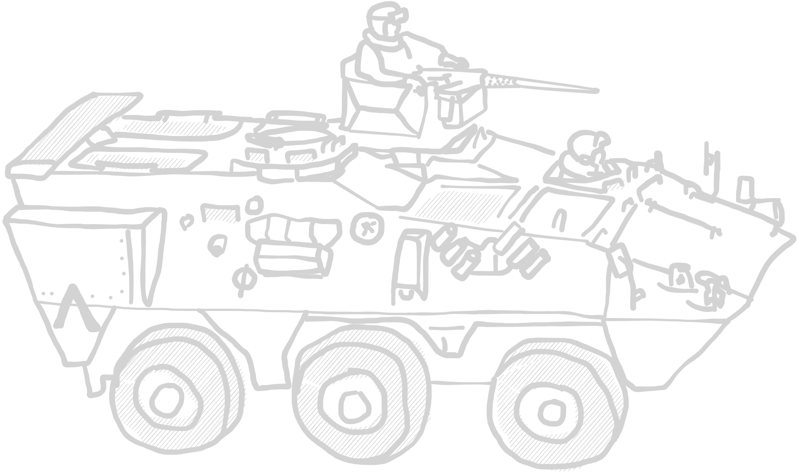
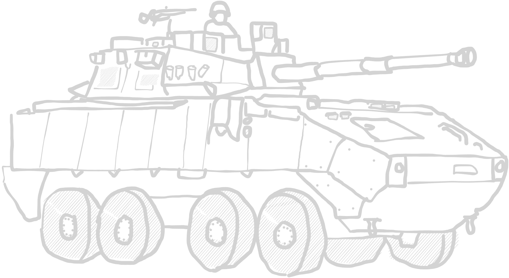

# EUFOR Estonia Ground Forces

This list represents the reinforced battlegroups sent by the European Union to
Estonia to defeat the separatist forces of Ida Viru. The corps-sized ground force
is compromised of the franco-belgian battlegroup as well as the EUROCORPS.

***

## Table of contents

Click to expand

- [EUFOR Estonia Ground Forces](#eufor-estonia-ground-forces)
  - [Table of contents](#table-of-contents)
  - [Army modifiers](#army-modifiers)
    - [FÉLIN system](#félin-system)
    - [Combat Readiness](#combat-readiness)
  - [Officers](#officers)
    - [Platoon Officer](#platoon-officer)
    - [Company Officer](#company-officer)
  - [Infantry](#infantry)
    - [Aufklärergruppe](#aufklärergruppe)
    - [Jägergruppe](#jägergruppe)
    - [Groupe de Hussards](#groupe-de-hussards)
    - [Groupe de Combat](#groupe-de-combat)
    - [Panzergrenadiergruppe](#panzergrenadiergruppe)
    - [Groupe de Dragons Parachutistes](#groupe-de-dragons-parachutistes)
  - [Combat support units](#combat-support-units)
    - [Panzerpioniergruppe](#panzerpioniergruppe)
    - [FR F2 sniper team](#fr-f2-sniper-team)
    - [PGM Hécate II AMR team](#pgm-hécate-ii-amr-team)
    - [Medical specialist](#medical-specialist)
  - [Machine gun teams](#machine-gun-teams)
    - [FN Minimi Para LMG team](#fn-minimi-para-lmg-team)
    - [FN MAG 58 MMG team](#fn-mag-58-mmg-team)
    - [.50cal Browning HMG team](#50cal-browning-hmg-team)
    - [GMG 40mm team](#gmg-40mm-team)
  - [Anti-Tank teams](#anti-tank-teams)
    - [Panzerfaust team](#panzerfaust-team)
    - [MILAN/Eryx 136mm ATGM team](#milaneryx-136mm-atgm-team)
    - [FMG-148 Javelin team](#fmg-148-javelin-team)
  - [Mortar teams](#mortar-teams)
    - [Hirtenberger M60 60mm light mortar team](#hirtenberger-m60-60mm-light-mortar-team)
    - [Mo 81 LLR F1 81mm medium mortar team](#mo-81-llr-f1-81mm-medium-mortar-team)
    - [MO 120 RT F1 120 mm heavy mortar team](#mo-120-rt-f1-120-mm-heavy-mortar-team)
    - [Wiesel I Mörser 120mm](#wiesel-i-mörser-120mm)
  - [Divisional Reinforcements](#divisional-reinforcements)
    - [EUNAVFOR Battery Observer](#eunavfor-battery-observer)
    - [VAB VOA](#vab-voa)
    - [Thales Squire GBR](#thales-squire-gbr)
  - [Micro Air Vehicles](#micro-air-vehicles)
    - [AirRobot AR 100-B "Mikado"](#airrobot-ar-100-b-mikado)
    - [EMT Aladin](#emt-aladin)
    - [Rheinmetall KZO](#rheinmetall-kzo)
  - [Artillery](#artillery)
    - [CAESAR](#caesar)
    - [AMX-30 AuF1](#amx-30-auf1)
    - [Panzerhaubitze 2000](#panzerhaubitze-2000)
    - [MARS II MLRS](#mars-ii-mlrs)
  - [Anti-Air systems](#anti-air-systems)
    - [Mistral team](#mistral-team)
    - [VLRA Mistral](#vlra-mistral)
  - [APCs / IFVs](#apcs--ifvs)
    - [Nexter Systems Aravis / Dingo II](#nexter-systems-aravis--dingo-ii)
    - [VBL](#vbl)
    - [PVP](#pvp)
    - [TPz Fuchs 1A4/5](#tpz-fuchs-1a45)
    - [Pandur I](#pandur-i)
    - [VAB](#vab)
    - [VBCI](#vbci)
    - [GTK Boxer](#gtk-boxer)
  - 
    - [Piranha IIIC](#piranha-iiic)
    - [SPz 1A3 Marder](#spz-1a3-marder)
  - [Heavy vehicles](#heavy-vehicles)
    - [Panhard VPS / Jankel FOX RRV](#panhard-vps--jankel-fox-rrv)
    - [Wiesel I](#wiesel-i)
      - [Wiesel I TOW](#wiesel-i-tow)
      - [Wiesel I A3 MK](#wiesel-i-a3-mk)
    - [AMX-10 RC](#amx-10-rc)
    - [AMX Leclerc](#amx-leclerc)
    - [Eurocopter](#eurocopter)
  - [Transports](#transports)
    - [EC725 Caracal / Super Cougar H225M](#ec725-caracal--super-cougar-h225m)
    - [AS550 Fennec](#as550-fennec)
    - [MAN gl Truck](#man-gl-truck)
    - [Toyota/Range Rover](#toyotarange-rover)
    - [Mercedes G "Wolf"](#mercedes-g-wolf)
    - [MRZR-2/4 Polaris RZR 4x4](#mrzr-24-polaris-rzr-4x4)
    - [S-Boot](#s-boot)

***

## Army modifiers

### FÉLIN system

Infantry units can be equipped with the FÉLIN integrated combat and comm system
(_Fantassin à Équipement et Liaisons Intégrés_), which allows a squad to share
position and real-time camera information between each other.

Due to the enhanced interconnection of the squad, communication gets easier.
Fireteams with the FÉLIN system do not need to do an order check when separated,
as long as they have no Pins. The system costs +1pt/soldier of a squad.

_TLDR: FÉLIN system for every infantry unit at +1pt/u. Units with FÉLIN system do not need to do an order check when splitting into fireteams._

### Combat Readiness

Due to a lack of experience regarding mobilization at a divisional level, the
strain on logistic is quite high. Transport units must perform an order check
with 1 pin marker when moving out of reserve to represent the stressed personnel.

*TLDR +1 pin on all reserve transports*

***

## Officers

_an actual image i found an eurocorps leaflet. The document even used the classic Windows military font for headers lmao_

### Platoon Officer

Officers of NATO code OF-1 are young officers such as First or Second Lieutenants.
They lead a platoon into battle.

| OF-1 Officer | </img> |
| :---- | ---- |
| Cost | 21 pt / 30 pt / 39 pt |
| Reinforcement | up to 2 attendants (AR): 7 pt / 10 pt / 13 pt each |
| Setup | NCO (as depicted) |
| Options | - |
| Special rules | <table><tr><td><b>Rules</td><td><b>Description</td></tr><tr><td>You men, snap to action!</td><td>-</td></tr><tr><td>Command</td><td>-</td></tr></table> |

### Company Officer

Companies are lead by Captains or in some cases even Majors. They manage several
platoons and outrank all other units on the table.

| OF-2 Officer | </img> |
| :---- | ---- |
| Cost | 42 pt / 60 pt / 78 pt |
| Reinforcement | up to 2 attendants (AR): 7 pt / 10 pt / 13 pt each |
| Setup | NCO (as depicted) |
| Options | - |
| Special rules | <table><tr><td><b>Rules</td><td><b>Description</td></tr><tr><td>You men, snap to action! (2x)</td><td>-</td></tr><tr><td>Command</td><td>-</td></tr></table> |

***

## Infantry

### Aufklärergruppe

German reconnaissance infantry group, watching the area in front of friendly
forces and reporting enemy troop movement.

| Recon infantry group | </img> |
| :---- | ---- |
| Cost | 45 pt / 60 pt / 75 pt |
| Reinforcement | up to 3 attendants (AR): 7 pt / 10 pt / 13 pt each |
| Setup | NCO (AR) + 3 attendants (AR) |
| Options |<table><tr><td><b>Additional weapons</td><td><b>Description</td><td><b>Cost</b></td></tr><tr><td>1x DMR</td><td>Designated marksman rifle</td><td>+15 pt</td></tr><tr><td>Smoke grenades</td><td>DM-25 smoke grenade, used for conceilment of movement.</td><td>+10 pt</td></tr></table> |
| Special rules | <table><tr><td><b>Rules</td><td><b>Description</td></tr><tr><td>Rangers</td><td>-</td></tr><tr><td>Break contact</td><td>Recon units are often confronted with superior enemies they are not meant to engage. To fall back in a controlled fashion,  these units may fire first, then maneuver during an ADVANCE.</td></tr><tr><td>Smoke grenades (*if selected*)</td><td>One time smoke screen.  See [ruleset](../ruleset/heat-ruleset.md#smoke-grenades) for more information.</td></tr></table> |

### Jägergruppe

Light infantry unit, which is able to perform flanking operations without
motorized support.

| Light infantry group | </img> |
| :---- | ---- |
| Cost | 35 pt / 50 pt / 65 pt |
| Reinforcement | up to 5 attendants (AR): 7 pt / 10 pt / 13 pt each |
| Setup | NCO (AR) + 3 attendants (AR) |
| Options | <table><tr><td><b>Additional weapons</td><td><b>Description</td><td><b>Cost</b></td></tr><tr><td>1x DMR</td><td>Designated marksman rifle</td><td>+15 pt</td></tr><tr><td>1x LMG</td><td>Light machine gun</td><td>+20 pt</td></tr><tr><td>PETN Plastiksprengstoff (*Explosives*)</td><td>Multi-purpose explosive.</td><td>+15 pt</td></tr><tr><td>RABE drones</td><td>Small recon rc drones.</td><td>+20 pt</td></tr></table><table><tr><td><b>Optional rules</td><td><b>Description</td><td><b>Cost</b></td></tr><tr><td>Tough Fighters</td><td>-</td><td>+ 1 pt each</td></tr></table> |
| Special rules | <table><tr><td><b>Rules</td><td><b>Description</td></tr><tr><td>Explosives</td><td>See [ruleset](../ruleset/heat-ruleset.md#explosives) for more information.</td></tr><tr><td>RABE drones</td><td>Unit has small rc drone to use in attacks into enemy buildings. If chosen, CQC attacks into a building always begin with this units attack.</td></tr></table> |

### Groupe de Hussards

French hussards look back on a long history of reactivations and restructures,
from the horseborne heavy infantry units of the 1700s to the airborne cavalry
role they serve today.

Hussards, e. g. from the  _1e Régiment de Hussards Parachutistes_ are trained not
only as airborne infantry, but also serve in a reconnaissance role. In the french
army, this often includes engagements with the enemy, and these units are equipped
with wheeled tanks and other APCs and IFVs other armies would not use in a
recon role.

| Cavalry group | </img> |
| :---- | ---- |
| Cost | 35 pt / 50 pt / 65 pt |
| Reinforcement | up to 5 attendants (AR): 7 pt / 10 pt / 13 pt each |
| Setup | NCO (AR) + 3 attendants (AR) |
| Options | <table><tr><td><b>Additional weapons</td><td><b>Description</td><td><b>Cost</b></td></tr><tr><td>1x DMR</td><td>Designated marksman rifle</td><td>+15 pt</td></tr><tr><td>1x LMG</td><td>Light machine gun</td><td>+20 pt</td></tr><tr><td>1x UGL</td><td>Underbarrel grenade launcher</td><td>+10 pt</td></tr><tr><td>1x LAW</td><td>Light anti-tank weapon</td><td>+20 pt</td></tr></table> |
| Special rules | <table><tr><td>Airborne</td><td>When dismounting from a helicopter, this unit may reroll failed order checks.</td></tr></table> |

### Groupe de Combat

The french army structures its infantry into so called _groupe de combat_, which
are mechanized infantry squads divided into three distinct sections of differing
role.

The first team is the leading element consisting of the squad leader and a
designated marksman.

The "Alpha team", formerly known as the _L´equipe choc_ (Shock team), consists of
the weapon systems with an effective range of up to 300m, which means HK416, one
of sometimes is equipped with the HK269F 40mm grenade launcher, as well as LAW
carried by the Grenadier-Voltiguer.

The "Bravo team" or _L´equipe feu_ (Fire team) is the second half of the weapon
section equipped with a FN Minimi Para and an optional Lance Grenadier carrying
a 51mm light mortar, which can support the Alpha teams advance.

| Mechanized infantry group | </img> |
| :---- | ---- |
| Cost | 35 pt / 50 pt / 65 pt |
| Reinforcement | up to 5 attendants (AR): 7 pt / 10 pt / 13 pt each |
| Setup | NCO (AR) + 3 attendants (AR) |
| Options |<table><tr><td><b>Additional weapons</td><td><b>Description</td><td><b>Cost</b></td></tr><tr><td>2x LMG</td><td>Light machine gun</td><td>+20 pt each</td></tr><tr><td>1x UGL</td><td>Underbarrel grenade launcher</td><td>+10 pt</td></tr><tr><td>1x LAW</td><td>Light anti-tank weapon</td><td>+20 pt</td></tr></table> |
| Special rules | <table><tr><td><b>Rules</td><td><b>Description</td></tr><tr><td>Fireteam</td><td>Unit is able to split into fireteams. See [ruleset](../ruleset/heat-ruleset.md#fireteams) for details.</td></tr></table> |

### Panzergrenadiergruppe

Armoured infantry from the german-franco EUROCORPS. The most common type of
german infantry, operating as a group in conjunction with its APC, and being
able to be equipped with heavy anti tank options.

| Armoured infantry group | </img> |
| :---- | ---- |
| Cost | 35 pt / 50 pt / 65 pt |
| Reinforcement | up to 5 attendants (AR): 7 pt / 10 pt / 13 pt each |
| Setup | NCO (AR) + 3 attendants (AR) |
| Options |<table><tr><td><b>Additional weapons</td><td><b>Description</td><td><b>Cost</b></td></tr><tr><td>2x LMG</td><td>Light machine gun</td><td>+20 pt each</td></tr><tr><td>1x UGL</td><td>Underbarrel grenade launcher</td><td>+10 pt</td></tr><tr><td>1x RPG</td><td>PzF 3 RPG. One further soldier becomes a loader. Both keep their rifles.</td><td>+60 pt</td></tr></table> |
| Special rules | - |

### Groupe de Dragons Parachutistes

Dragoons have been decommissioned, reactived and repurposed just as the Hussards.
These days, they serve as special reconnaisance teams in the Special Forces
Command of the French Army, and have seen deployment in dozens of campaigns.

| Special Recon group | </img> |
| :---- | ---- |
| Cost | - / 65 pt / 80 pt |
| Reinforcement | up to 3 attendants (AR): 7 pt / 10 pt / 13 pt each |
| Setup | NCO (AR) + 3 attendants (AR) |
| Options |<table><tr><td><b>Additional weapons</td><td><b>Description</td><td><b>Cost</b></td></tr><tr><td>2x DMR</td><td>Designated marksman rifle</td><td>+15 pt</td></tr></table> |
| Special rules | <table><tr><td><b>Rules</td><td><b>Description</td></tr></tr><tr><td>Rangers</td><td>-</td></tr><tr><td>Stubborn</td><td>-</td></tr><tr><td>Recon training</td><td>These soldiers are trained to operate and maneuver  in even the toughest terrain.  When using an ADVANCE to move through rough terrain, throw a D2, and on a positive result the team may instead use the RUN distance.</td></table> |

***

## Combat support units

### Panzerpioniergruppe

German armoured engineers from the franco-german brigade, equipped with explosives
and mine clearing equipment.

| Engineer group | </img> |
| :---- | ---- |
| Cost | 40 pt / 55 pt / 70 pt |
| Reinforcement | up to 5 attendants (SMG): 7 pt / 10 pt / 13 pt each |
| Setup | NCO (SMG) + 2 attendants (SMG) |
| Options |<table><tr><td><b>Additional weapons</td><td><b>Description</td><td><b>Cost</b></td></tr><tr><td>1x LMG</td><td>Light machine gun</td><td>+20 pt</td></tr><tr><td>PETN Plastiksprengstoff (*Explosives*)</td><td>Multi-purpose explosive.</td><td>+15 pt</td></tr><tr><td>Mines</td><td>See IED section in [ruleset](../ruleset/heat-ruleset.md#improvised-explosive-devices-ied-and-mines). They behave the same as IEDs, but can't be disguised. Conventional forces don't use decoys.<td>+20 pt</td></tr></table> |
| Special rules | <table><tr><td><b>Rules</td><td><b>Description</td></tr><tr><td>Explosives</td><td>See [ruleset](../ruleset/heat-ruleset.md#explosives) for more information.</td></tr><tr><td>Engineers</td><td>See [ruleset](../ruleset/heat-ruleset.md#engineer) for more information.</td></tr></table> |

### FR F2 sniper team

Snipers are used to engage high-valuable targets in an engagement, particularly
leaders of infantry groups, heavy weapon system operators or other assets.
They can be devastating in the correct spot, used at the correct time.

| FR F2 sniper team | </img> |
| :---- | ---- |
| Cost | 35 pt / 50 pt / 65 pt |
| Reinforcement | - |
| Setup | NCO (SNIPER) + 1 attendant (SMG) |
| Options | - |
| Special rules | <table><tr><td><b>Rules</td><td><b>Description</td></tr><tr><td>Sniper</td><td>-</td></tr><tr><td>Team</td><td>-</td></tr></table> |

### PGM Hécate II AMR team

Anti materiell rifle sniper team are used to engage anything from infantry to
lightly armoured vehicles.

| PGM Hécate II AMR team | </img> |
| :---- | ---- |
| Cost | 45 pt / 60 pt / 75 pt |
| Reinforcement | - |
| Setup | NCO (AMR) + 1 attendant (SMG) |
| Options | - |
| Special rules | <table><tr><td><b>Rules</td><td><b>Description</td></tr><tr><td>Sniper</td><td>-</td></tr><tr><td>Team</td><td>-</td></tr><tr><td>Fixed</td><td>-</td></tr></table> |

### Medical specialist

Medics move among the frontline and try to rescue any casualties that happen close
to them. Just as in the original ruleset, they are treated as true profesionalls,
only worthy of the "Veteran" status.

| Medic | </img> |
| :---- | ---- |
| Cost | - / - / 45 pt |
| Reinforcement | - |
| Setup | NCO (unarmed) |
|Options| - |
| Special rules | <table><tr><td><b>Rules</td><td><b>Description</td></tr><tr><td>Medic</td><td>-</td></tr></table> |

***

## Machine gun teams

### FN Minimi Para LMG team

Widely used in the conventional forces of the french army.

| FN Minimi LMG team | </img> |
| :---- | ---- |
| Cost | 35 pt / 50 pt / 65 pt |
| Reinforcement | - |
| Setup | NCO (MMG) + 2 loaders (SMG) |
| Options | - |
| Special rules | <table><tr><td><b>Rules</td><td><b>Description</td></tr><tr><td>Team</td><td>-</td></tr><tr><td>Fixed</td><td>-</td></tr></table> |

### FN MAG 58 MMG team

The general purpose machine gun currently replacing the old ANF1 GMGs. Used
in most parts of the french army.

| FN MAG 58 MMG team | </img> |
| :---- | ---- |
| Cost | 35 pt / 50 pt / 65 pt |
| Reinforcement | - |
| Setup | NCO (MMG) + 2 loaders (SMG) |
| Options | - |
| Special rules | <table><tr><td><b>Rules</td><td><b>Description</td></tr><tr><td>Team</td><td>-</td></tr><tr><td>Fixed</td><td>-</td></tr></table> |

### .50cal Browning HMG team

Heavy machine gun system used to surpress enemy forces at longer ranges, as well
as lightly armoured vehicles.

| .50cal Browning HMG team | </img> |
| :---- | ---- |
| Cost | 49 pt / 70 pt / 91 pt |
| Reinforcement | - |
| Setup | NCO (HMG) + 2 loaders (SMG) |
| Options | - |
| Special rules | <table><tr><td><b>Rules</td><td><b>Description</td></tr><tr><td>Team</td><td>-</td></tr><tr><td>Fixed</td><td>-</td></tr></table> |

### GMG 40mm team

AGL team with a HK GMG 40mm.

| AGL team | </img> |
| :---- | ---- |
| Cost | 50 pt / 60 pt / 75 pt |
| Reinforcement | - |
| Setup | NCO (AGL) + 2 loaders (SMG) |
| Options | - |
| Special rules | <table><tr><td><b>Rules</td><td><b>Description</td></tr><tr><td>Team</td><td>-</td></tr><tr><td>Fixed</td><td>-</td></tr><tr><td>HE 1"</td><td>-</td></tr><tr><td>AGL</td><td>Automatic grenade launcher, which rapidly fires 40mm ordnance.  Detailed description in [ruleset](../ruleset/heat-ruleset.md#automatic-grenade-launchers-agl). </td></tr></table> |

***

## Anti-Tank teams

### Panzerfaust team

Anti-tank rocket team, equipped with Panzerfaust 3, which is the standard issue
german RPG.

| RPG team | </img> |
| :---- | ---- |
| Cost | 42 pt / 60 pt / 78 pt |
| Reinforcement | - |
| Setup | NCO (RPG + SMG) + 1 loader (SMG) |
| Options | <table><table><tr><td><b>Rules</td><td><b>Description</td><td><b>Cost</td></tr><tr><td>Tandem HEAT Charge</td><td>Heavier charge than  normal round, but less range. Check [ruleset](../ruleset/heat-ruleset.md#tandem-heat-charges) for details.</td><td>+15 pt</td></tr></table> |
| Special rules | <table><tr><td><b>Rules</td><td><b>Description</td></tr><tr><td>Team</td><td>-</td></tr><tr><td>Fixed</td><td>-</td></tr><tr><td>Backblast</td><td>See [ruleset](../ruleset/heat-ruleset.md#anti-tank-guided-missiles-atgm) for more information.</td></tr></table> |

### MILAN/Eryx 136mm ATGM team

EUFOR fields a number of european ATGM launchers, most prominently the MILAN ATGM
and the Eryx ATGM systems.

Anti-tank guided missiles are used against heavily armoured targets, and are
oftentimes launched from a man-portable weapon system or from a vehicle mount.
They are able to traverse large areas and more modern targeting systems do not
even require the operator themselves to aid the missile to its target.

|  ATGM team | </img> |
| :---- | ---- |
| Cost | 60 pt / 75 pt / 90 pt |
| Reinforcement | - |
| Setup | NCO (ATGM) + 2 loaders (SMG) |
| Options |- |
| Special rules | <table><tr><td><b>Rules</td><td><b>Description</td></tr><tr><td>Team</td><td>-</td></tr><tr><td>Fixed</td><td>-</td><tr><td>ATGM</td><td>See [ruleset](../ruleset/heat-ruleset.md#anti-tank-guided-missiles-atgm) for more information.</td></tr><tr><td>Backblast</td><td>See [ruleset](../ruleset/heat-ruleset.md#anti-tank-guided-missiles-atgm) for more information.</td></tr></table> |

### FMG-148 Javelin team

The Javelin is a popular ATGM system developed in the United States, which is
able to use "fire-and-forget"-capable missiles with infrared seakers. Tanks and
other heavily armoured targets can furthermore be attacked in a TOP-DOWN attack,
striking the roof of the tank, which is oftentimes less armoured than the front.

Anti-tank guided missiles are used against heavily armoured targets, and are
oftentimes launched from a man-portable weapon system or from a vehicle mount.
They are able to traverse large areas and more modern targeting systems do not
even require the operator themselves to aid the missile to its target.

| ATGM team | </img> |
| :---- | ---- |
| Cost | 60 pt / 75 pt / 90 pt |
| Reinforcement | - |
| Setup | NCO (ATGM) + 2 loaders (SMG) |
| Options |<table><tr><td><b>Additional weapons</td><td><b>Description</td><td><b>Cost</b></td></tr><tr><td>Fire-And-Forget</td><td>Weapon team is not required to stay stationary during flight.  See ATGM section in [ruleset](../ruleset/heat-ruleset.md#anti-tank-guided-missiles-atgm).<td>+20 pt</td></tr></table> |
| Special rules | <table><tr><td><b>Rules</td><td><b>Description</td></tr><tr><td>Team</td><td>-</td></tr><tr><td>Fixed</td><td>-</td><tr><td>ATGM</td><td>See [ruleset](../ruleset/heat-ruleset.md#anti-tank-guided-missiles-atgm) for more information.</td></tr><tr><td>Backblast</td><td>See [ruleset](../ruleset/heat-ruleset.md#anti-tank-guided-missiles-atgm) for more information.</td></tr></table> |

***

## Mortar teams

### Hirtenberger M60 60mm light mortar team

light mortar team.

| M60 60mm light mortar team | </img> |
| :---- | ---- |
| Cost | 24 pt / 35 pt / 46 pt |
| Reinforcement | Spotter (PDW) +10 pt |
| Setup | NCO (LIGHT MORTAR) + 1 loader (PISTOL) |
| Options | - |
| Special rules | <table><tr><td><b>Rules</td><td><b>Description</td></tr><tr><td>Team</td><td>-</td></tr><tr><td>HE 1"</td><td>-</td></tr><tr><td>Indirect Fire</td><td>-</td></tr><tr><td>Spotter</td><td>-</td></tr></table> |

### Mo 81 LLR F1 81mm medium mortar team

medium mortar team.

| 81mm medium mortar team | </img> |
| :---- | ---- |
| Cost | 35 pt / 50 pt / 65 pt |
| Reinforcement | Spotter +10 pt |
| Setup | NCO (MEDIUM MORTAR) + 1 loader (PISTOL) |
| Options | - |
| Special rules | <table><tr><td><b>Rules</td><td><b>Description</td></tr><tr><td>Team</td><td>-</td></tr><tr><td>Fixed</td><td>-</td></tr><tr><td>HE 2"</td><td>-</td></tr><tr><td>Indirect Fire</td><td>-</td></tr><tr><td>Spotter</td><td>-</td></tr></table> |

### MO 120 RT F1 120 mm heavy mortar team

heavy mortar team.

| 120mm heavy mortar team |</img> |
| :---- | ---- |
| Cost | 46 pt / 65 pt / 84 pt |
| Reinforcement | Spotter (PDW) +10 pt |
| Setup | NCO (HEAVY MORTAR) + 2 loader (PISTOL) |
| Options | - |
| Special rules | <table><tr><td><b>Rules</td><td><b>Description</td></tr><tr><td>Team</td><td>-</td></tr><tr><td>Fixed</td><td>-</td></tr><tr><td>HE 3"</td><td>-</td></tr><tr><td>Indirect Fire</td><td>-</td></tr><tr><td>Spotter</td><td>-</td></tr></table> |

### Wiesel I Mörser 120mm

Wiesel I mounted heavy mortar system.

| 120mm heavy mortar Wiesel | </img> |
| :---- | ---- |
| Cost | 46 pt / 65 pt / 84 pt |
| Reinforcement | Spotter (PDW) +10 pt |
| Options | - |
| Damage value | 7+ Armoured Carrier |
| Default weapon configuration | <table><tr><td><b>Weapon systems</td><td><b>Description</td><td>Modifiers</td><tr><td>Nebelmittel-wurfanlage (*Smoke Screen*)</td><td>Smoke grenade launcher.   Detailed rules see [ruleset](../ruleset/heat-ruleset.md#smoke-screens). </td><td><ul><li>hull-mounted</li><li>front-facing</li></ul></tr></table> |
| Special rules | <table><tr><td><b>Rules</td><td><b>Description</td></tr><tr><td>Team</td><td>-</td></tr><tr><td>Fixed</td><td>-</td></tr><tr><td>HE 3"</td><td>-</td></tr><tr><td>Indirect Fire</td><td>-</td></tr><tr><td>Spotter</td><td>-</td></tr></table> |

***

## Divisional Reinforcements

### EUNAVFOR Battery Observer

Artillery Observer coordinating fire missions from EUNAVFOR naval assets.

| Artillery forward observer | </img> |
| :---- | ---- |
| Cost | - pt / 100 pt / 115 pt |
| Reinforcement | up to 2 attendants (SMG) 7 pt / 10 pt / 13 pt each |
| Setup | NCO (SMG) |
| Options | - |
| Special rules | <table><tr><td><b>Rules</td><td><b>Description</td></tr><tr><td>Artillery Observer</td><td>Detailed rules see [Rule adjustments](../ruleset/heat-ruleset.md#spotters).</td></tr></table> |

### VAB VOA

VAB version for artillery coordination.

| APC Observer | </img> |
| :---- | ---- |
| Cost | tbd |
| Capacity | - |
| Damage value | 7+ Armoured Carrier |
| Default weapon configuration | - |
| Options | - |
| Special rules | <table><tr><td><b>Rules</td><td><b>Description</td></tr><tr><td>Artillery Observer</td><td>Detailed rules see [Rule adjustments](../ruleset/heat-ruleset.md#spotters).</td></tr><tr><td>Amphibious</td><td>-</td></tr></table> |

### Thales Squire GBR

Ground based radar system operated by a radar unit.

| RADAR team | </img> |
| :---- | ---- |
| Cost | 65 pt / 75 pt / 85 pt |
| Reinforcement | up to 2 attendants (SMG) 7 pt / 10 pt / 13 pt each |
| Setup | NCO (RADAR) + 1 helper (SMG) |
| Options | - |
| Special rules | <table><tr><td><b>Rules</td><td><b>Description</td></tr><tr><td>Ground Radar</td><td>Can enhance zeroing capability for indirect fire missions. See [ruleset adjustments](/ruleset/heat-ruleset.md#radar) for detailed description.</td></tr></table> |

***

## Micro Air Vehicles

### AirRobot AR 100-B "Mikado"

Mikado is a micro quadcopter drone with several imaging capabilities. Equipped
with a normal camera, a black/white NV capable one and a thermal imaging device,
Mikado can be used to observe an area of up to one kilometer at any time of the
day. In use since 2011 and used in Afghanistan, Kosovo, Mali and other missions.

| Recon UAV team | </img> |
| :---- | ---- |
| Cost | tbd |
| Reinforcement | up to 2 attendants: 7 pt / 10 pt / 13 pt |
| Setup | NCO (PDW) |
|Options| - |
| Special rules | <table><tr><td><b>Rules</td><td><b>Description</td></tr><tr><td>Fixed</td><td>-</td></tr><tr><td>UAV</td><td>Team operates a small UAV with varying mission role. Detailed description in [ruleset](../ruleset/heat-ruleset.md#drones). </td></tr><tr><td>On-map Operator</td><td>Operator of unit is present on map.</td></tr><tr><td>Quadrocopter</td><td>Drone is propelled by multiple rotors. </td></tr></table> |

### EMT Aladin

The "Abbildende Luftgestützte Aufklärungsdrohne im Nächstbereich" or "Airborne
Reconnaissance drone for image generation in close proximity" is a fixed wing,
lightweight drone with a camera capable of broadcasting a live-feed to its
operator. Used mainly in Afghanistan and Mali, EMT Aladin is a proven design
and a part of german reconnaissance capabilities since 2005.

| Recon UAV team |  </img> |
| :---- | ---- |
| Cost | tbd |
| Reinforcement | up to 2 attendants: 7 pt / 10 pt / 13 pt |
| Setup | NCO (PDW) |
|Options| - |
| Special rules | <table><tr><td><b>Rules</td><td><b>Description</td></tr><tr><td>Fixed</td><td>-</td></tr><tr><td>UAV</td><td>Team operates a small UAV with varying mission role. Detailed description in [ruleset](../ruleset/heat-ruleset.md#drones). </td></tr><tr><td>On-map Operator</td><td>Operator of unit is present on map.</td></tr><tr><td>Fixed wing</td><td>Drone is propelled by a rotor and fixed wings. </td></tr></table> |

### Rheinmetall KZO

The "Kleinfluggerät für Zielortung" (small guidance air vehicle) is a tactical
fixed wing air vehicle for artillery guidance.

| Artillery UAV team |  </img> |
| :---- | ---- |
| Cost | tbd |
| Reinforcement | - |
| Setup | Drone |
|Options| - |
| Special rules | <table><tr><td><b>Rules</td><td><b>Description</td></tr><tr><td>Fixed</td><td>-</td></tr><tr><td>UAV</td><td>Team operates a small UAV with varying mission role. Detailed description in [ruleset](../ruleset/heat-ruleset.md#drones). </td></tr><tr><td>Off-map Operator</td><td>Unit is operated off-map.</td></tr><tr><td>Fixed wing</td><td>Drone is propelled by a rotor and fixed wings. </td></tr><tr><td>Artillery Observer</td><td>Unit acts the same a normal artillery observer.</td></tr></table> |

***

## Artillery

### CAESAR

CAESAR, or _Camion équipé d’un système d’artillerie_ is a french designed and
produces mobile artillery system with a 155mm howitzer. Designed as an air-
transportable alternative to the heavier systems used during the cold war, the
truck initially wasnt even armoured and could reach speeds of up to 90kph and
50kph offroad. Later versions do feature some protection against small arms. Over
300 units were produces in its 30 year service time.

| CAESAR | </img> |
| :---- | ---- |
| Cost | tbd |
| Capacity | - |
| Damage value | 7+ Armoured Carrier |
| Default weapon configuration | TODO |
| Options | - |
| Special rules | <table><tr><td><b>Rules</td><td><b>Description</td></tr><tr><td>Indirect Fire</td><td>-</td></tr><tr><td>Howitzer</td><td>-</td></tr><tr><td>HE 3"</td><td>-</td></tr></table> |-

### AMX-30 AuF1

| AMX-30 AuF1 | </img> |
| :---- | ---- |
| Cost | tbd |
| Capacity | - |
| Damage value | 7+ Armoured Carrier |
| Default weapon configuration | <table><tr><td><b>Weapon systems</td><td><b>Description</td><td>Modifiers</td></r><tr><td>Smoke Screen</td><td>Smoke grenade launcher.   Detailed rules see [ruleset](../ruleset/heat-ruleset.md#smoke-screens). </td><td><ul><li>hull-mounted</li><li>front-facing</li></ul></tr><tr><td>155mm Howitzer</td><td>Medium sized howitzer.</td><td><ul><li>turret-mounted</li><li>Howitzer</li></ul></tr></table> |
| Options | <table><tr><td><b>Additional weapons</td><td><b>Description</td><td>Modifiers</td><td><b>Cost</b></td></tr><tr><td>.50cal M2HB HMG</td><td>Heavy machine gun, pintle-mounted at the commander's hatch.</td><td><ul><li>pintle-mounted</li><li>open-topped</li></ul></td><td>+ 20 pt</td></tr></table> |
| Special rules | <table><tr><td><b>Rules</td><td><b>Description</td></tr><tr><td>Indirect Fire</td><td>-</td></tr><tr><td>Howitzer</td><td>-</td></tr><tr><td>HE 3"</td><td>-</td></tr></table> |

### Panzerhaubitze 2000

The Panzerhaubitze 2000 is a self-propelled 155mm howitzer produced by the german
arms manufacturers KNDS and Rheinmetall. They replaced the older M109 Paladin in
many european armies around the 2000s. Praised for its high mobility, range, and
its exceptional rate of fire.

| Panzerhaubitze 2000 | </img> |
| :---- | ---- |
| Cost | tbd |
| Capacity | - |
| Damage value | 7+ Armoured Carrier |
| Default weapon configuration | <table><tr><td><b>Weapon systems</td><td><b>Description</td><td>Modifiers</td></r><tr><td>Nebelmittel-wurfanlage (*Smoke Screen*)</td><td>Smoke grenade launcher.   Detailed rules see [ruleset](../ruleset/heat-ruleset.md#smoke-screens). </td><td><ul><li>hull-mounted</li><li>front-facing</li></ul></tr><tr><td>L/52 155mm Haubitze</td><td>Medium sized howitzer.</td><td><ul><li>turret-mounted</li><li>Howitzer</li></ul></tr></table> |
| Options | <table><tr><td><b>Additional weapons</td><td><b>Description</td><td>Modifiers</td><td><b>Cost</b></td></tr><tr><td>MG 3 MMG</td><td>Medium machine gun, pintle-mounted at the commander's hatch.</td><td><ul><li>pintle-mounted</li><li>open-topped</li></ul></td><td>+ 15 pt</td></tr></table> |
| Special rules | <table><tr><td><b>Rules</td><td><b>Description</td></tr><tr><td>Indirect Fire</td><td>-</td></tr><tr><td>Howitzer</td><td>-</td></tr><tr><td>HE 3"</td><td>-</td></tr></table> |

### MARS II MLRS

The "MLRS", or "Multiple Launch Rocket System", is an american self-propelled
artillery rocket system used by a range of western militaries, first and foremost
the US Army themselves as the "M270". It saw action in the second gulf war as well
as other wars since the 80s and has only recently been started to be phased out
by more modern systems.

| MARS II MLRS | </img> |
| :---- | ---- |
| Cost | 181 pt / 196 pt / 211 pt |
| Capacity | - |
| Damage value | 7+ Armoured Carrier |
| Default weapon configuration | <table><tr><td><b>Weapon systems</td><td><b>Description</td><td>Modifiers</td></r><tr><td>Nebelmittel-wurfanlage (*Smoke Screen*)</td><td>Smoke grenade launcher.   Detailed rules see [ruleset](../ruleset/heat-ruleset.md#smoke-screens). </td><td><ul><li>hull-mounted</li><li>front-facing</li></ul></tr><tr><td>Cal. 298mm MLRS</td><td>Multiple Launcher Rocket System</td><td><ul><li>turret-mounted</li><li>rocket-launcher</li></ul></tr></table> |
| Options | - |
| Special rules | <table><tr><td><b>Rules</td><td><b>Description</td></tr><tr><td>Multiple Launcher</td><td>-</td></tr><tr><td>Indirect Fire</td><td>-</td></tr><tr><td>HE 3"</td><td>-</td></tr></table> |

***

## Anti-Air systems

### Mistral team

Small team of infantry with a MANPADS Mistral Surface-to-air-missile launcher.

| MANPADS team | </img> |
| :---- | ---- |
| Cost | 50 pt / 65 pt / 80 pt |
| Reinforcement | up to 2 attendants (SMG) 7 pt / 10 pt / 13 pt each |
| Setup | NCO (MANPADS) + 1 loader (SMG) |
| Options | - |
| Special rules | <table><tr><td><b>Rules</td><td><b>Description</td></tr><tr><td>Team</td><td>-</td></tr><tr><td>Fixed</td><td>-</td></tr><tr><td>Backblast</td><td>See [ruleset](../ruleset/heat-ruleset.md#anti-tank-guided-missiles-atgm) for more information.</td></tr><tr><td>MANPADS</td><td>See [ruleset](../ruleset/heat-ruleset.md#manportable-air-defense-systems-manpads) for more information.</td></tr></table> |

### VLRA Mistral

The VLRA was a french multi-purpose all-terrain truck built by AMCAT, a division of
Renault. This variant is mounted with a Mistral MANPADS system.

| VLRA Mistral | </img> |
| :---- | ---- |
| Cost | tbd |
| Capacity | - |
| Damage value | 6+ Soft-skinned vehicle |
| Default weapon configuration | <table><tr><td><b>Weapon systems</td><td><b>Description</td><td>Modifiers</td></r><tr><td>Mistral MANPADS</td><td>Anti Air Rocket Launcher</td><td><ul><li>pintle-mounted</li><li>open-topped</li></ul></tr></table> |
| Options | - |
| Special rules | <table><tr><td><b>Rules</td><td><b>Description</td></tr><tr><td>MANPADS</td><td>Anti-Air rocket launcher system. See [ruleset](../ruleset/heat-ruleset.md#manportable-air-defense-systems-manpads) for more information.</td></tr></table> |

***

## APCs / IFVs

### Nexter Systems Aravis / Dingo II

Both the Aravis and the Dingo II use the U5000 Unimog chassis as a base, and
are in many regards very similar vehicles. Since the merger of KMW and Nexus,
they are even produced by the same company KNDS KMW! And yet, they seem to have
been developed separately. But regarding their points and equipment, they are
as similar as they look.

| Aravis/Dingo 2 |</img> |
| :---- | ---- |
| Cost | 70 pt / 80 pt / 90 pt |
| Capacity | 5 soldiers |
| Damage value | 7+ Armoured Carrier |
| Default weapon configuration | - |
| Options | _Only one FLW can be mounted per vehicle._<table><tr><td><b>Main weapon options</td><td><b>Description</td><td>Modifiers</td><td><b>Cost</b></td></tr><tr><td>FLW 200 (7.62mm) MMG</td><td>Remote-controlled MMG</td><td><ul><li>turret-mounted</li></ul></td><td>+ 15 pt</td></tr><tr><td>FLW 200 (12.7mm) HMG</td><td>Remote-controlled HMG</td><td><ul><li>turret-mounted</li></ul></td><td>+ 25 pt</td></tr><tr><td>FLW 200 (40mm HE) GraMaWa</td><td>Remote-controlled AGL</td><td><ul><li>turret-mounted</li></ul></td><td>+ 35 pt</td></tr></table> |
| Special rules | - |

### VBL

The Panhard Véhicule Blindé Léger ("Light armoured vehicle") is a french 4x4 based
on the P4 Peugeot. It serves in several roles in the french armed forces, from
a light combat reconnaissance role in combination with the AMX-10RC, as a MILAN
platform or as a troop transport.

| VBL | </img> |
| :---- | ---- |
| Cost | 60 pt / 65 pt / 70 pt |
| Capacity | 2 soldiers |
| Damage value | 7+ Armoured Carrier |
| Default weapon configuration | <table><tr><td><b>Weapon systems</td><td><b>Description</td><td>Modifiers</td><tr><td>ANF1 MMG</td><td>Pintle-mounted MMG. </td><td><ul><li>pintle-mounted</li><li>open-topped</li></ul></tr></table> |
| Options | <table><tr><td><b>Rules</td><td><b>Description</td><td><b>Cost</b></td></tr><tr><td>POSTE DE COMMANDEMENT *Command Vehicle*</td><td>-  *This does <b>not</b> cancel weapons options.*</td><td>+40 pt</td></tr></table><table><tr><td><b>Main weapon options</td><td><b>Description</td><td>Modifiers</td><td><b>Cost</b></td></tr><tr><td>MILAN ATGM launcher</td><td>MILAN Anti-tank guided missile launcher  Detailed rules see [ruleset](../ruleset/heat-ruleset.md#anti-tank-guided-missiles-atgm).</td><td><ul><li>pintle-mounted</li><li>open-topped</li></ul></td><td>+ 35 pt</td></tr></table><table><tr><td><b>Additional weapons</td><td><b>Description</td><td>Modifiers</td><td><b>Cost</b></td></tr><tr><td>MMG</td><td>Medium machine gun</td><td><ul><li>pintle-mounted</li><li>open-topped</li></ul></td><td>+15 pt</td></tr><tr><td>HMG</td><td>Heavy machine gun</td><td><ul><li>pintle-mounted</li><li>open-topped</li></ul></td><td>+ 25 pt</td></tr><tr><td>HK GMG 40mm</td><td>40mm AGL.</td><td><ul><li>pintle-mounted</li><li>open-topped</li></ul></td><td>+ 30 pt</td></tr></table> |
| Special rules | <table><tr><td><b>Rules</td><td><b>Description</td></tr><tr><td>Open-Topped _(if selected)_</td><td>-</td></tr><tr><td>Recce</td><td>-</td></tr></table> |

### PVP

The Petit Véhicule Protégé ("Light Protected vehicle") is a light, general-purpose
armoured 4-wheel drive vehicle used by the French Army, made by Panhard.

| PVP | </img> |
| :---- | ---- |
| Cost | tbd |
| Capacity | 4 soldiers |
| Damage value | 7+ Armoured Carrier |
| Default weapon configuration | - |
| Options | _Only one FLW can be mounted per vehicle._<table><tr><td><b>Main weapon options</td><td><b>Description</td><td>Modifiers</td><td><b>Cost</b></td></tr><tr><td>FLW 200 (7.62mm) MMG</td><td>Remote-controlled MMG</td><td><ul><li>turret-mounted</li></ul></td><td>+ 15 pt</td></tr><tr><td>FLW 200 (12.7mm) HMG</td><td>Remote-controlled HMG</td><td><ul><li>turret-mounted</li></ul></td><td>+ 25 pt</td></tr><tr><td>FLW 200 (40mm HE) GraMaWa</td><td>Remote-controlled AGL</td><td><ul><li>turret-mounted</li></ul></td><td>+ 35 pt</td></tr></table>|
| Special rules | - |

### TPz Fuchs 1A4/5

Almost 60 years old and still found in most platoons, the TPz Fuchs is a
versatile and reliable, if also old-fashioned, troop transport for the german
armed forces. With almost as many variants and upgrade kits as the M113, this
APC can be equipped with medical equipment, command utility or recon modifications.

| TPz Fuchs 1A4/5 | </img> |
| :---- | ---- |
| Cost | 95 pt / 110 pt / 125 pt |
| Capacity | 8 soldiers |
| Damage value | 7+ Armoured Carrier |
| Default weapon configuration | <table><tr><td><b>Weapon systems</td><td><b>Description</td><td>Modifiers</td><tr><td>Nebelmittel-wurfanlage (*Smoke Screen*)</td><td>Smoke grenade launcher.   Detailed rules see [ruleset](../ruleset/heat-ruleset.md#smoke-screens). </td><td><ul><li>hull-mounted</li><li>front-facing</li></ul></tr></table> |
| Options | <table><tr><td><b>Rules</td><td><b>Description</td><td><b>Cost</b></td></tr><tr><td>Gefechtsstand *Command Vehicle*</td><td>-  *This removes the ability to use any main weapon option, the IFV rule or use this vehicle as a troop transport.*</td><td>+40 pt</td></tr><tr><td>Medic Vehicle</td><td>-  *This removes the ability to use any main weapon option, the IFV rule or use this vehicle as a troop transport.*</td><td>+25 pt</td></tr></table><table><tr><td><b>Main weapon options</td><td><b>Description</td><td>Modifiers</td><td><b>Cost</b></td></tr><tr><td>Milan ATGM launcher</td><td>Milan Anti-Tank Guided Missile Launcher. Mounted at the commander's hatch in  the middle-right, blocking it for optional MG 3.  Detailed rules see [ruleset](../ruleset/heat-ruleset.md#anti-tank-guided-missiles-atgm).</td><td><ul><li>pintle-mounted</li><li>open-topped</li></ul></td><td>+ 35 pt</td></tr></table><table><tr><td><b>Additional weapons</td><td><b>Description</td><td>Modifiers</td><td><b>Cost</b></td></tr><tr><td>MG3 MMG  (*3x possible*)</td><td>Medium machine guns, either at the co-pilot's hatch (*front-right*),  the commander's hatch (*center-right*),  or the transport room hatch (*back-left*). </td><td><ul><li>pintle-mounted</li><li>open-topped</li></ul></td><td>+15 pt each</td></tr></table> |
| Special rules |  <table><tr><td><b>Rules</td><td><b>Description</td></tr><tr><td>IFV _(optional)_</td><td>Detailed rules see [ruleset](../ruleset/heat-ruleset.md#ifv-rule).</td></tr><tr><td>Open-Topped _(if selected)_</td><td>-</td></tr></table> |

### Pandur I

APC used by the belgian army. The APC comes in multiple variants, a command version,
a medevac vehicle and as a normal APC with varying weapon options. An austrian
design that is also used by Kuwait, Belgium is one of the biggest users of this
vehicle.

| Pandur I | </img> |
| :---- | ---- |
| Cost | tdb |
| Capacity | 8 soldiers |
| Damage value | 7+ Armoured Carrier |
| Default weapon configuration | <table><tr><td><b>Weapon systems</td><td><b>Description</td><td>Modifiers</td><tr><td>Smoke Screen</td><td>Smoke grenade launcher.   Detailed rules see [ruleset](../ruleset/heat-ruleset.md#smoke-screens). </td><td><ul><li>hull-mounted</li><li>front-facing</li></ul></tr></table> |
| Options | <table><tr><td><b>Rules</td><td><b>Description</td><td><b>Cost</b></td></tr><tr><td>Command Vehicle</td><td>-  *This removes the ability to use any main weapon option, the IFV rule or use this vehicle as a troop transport.*</td><td>+40 pt</td></tr><tr><td>Medic Vehicle</td><td>-  *This removes the ability to use any main weapon option, the IFV rule or use this vehicle as a troop transport.*</td><td>+25 pt</td></tr></table><table><tr><td><b>Main weapon options</td><td><b>Description</td><td>Modifiers</td><td><b>Cost</b></td></tr><tr><td>TOW ATGM launcher</td><td>TOW Anti-tank guided missile launcher  Detailed rules see [ruleset](../ruleset/heat-ruleset.md#anti-tank-guided-missiles-atgm).</td><td><ul><li>pintle-mounted</li><li>open-topped</li></ul></td><td>+35 pt</td></tr><tr><td>Tampella 120mm heavy mortar</td><td>heavy mortar system</td><td><ul><li>hull-mounted</li><li>front-facing</li><li>open-topped</li></ul></td><td>+35 pt</td></tr></table><table><tr><td><b>Additional weapons</td><td><b>Description</td><td>Modifiers</td><td><b>Cost</b></td></tr><tr><td>MMG</td><td>Medium machine gun</td><td><ul><li>pintle-mounted</li><li>open-topped</li></ul></td><td>+15 pt</td></tr><tr><td>HMG</td><td>Heavy machine gun</td><td><ul><li>pintle-mounted</li><li>open-topped</li></ul></td><td>+25 pt</td></tr></table> |
| Special rules |  <table><tr><td><b>Rules</td><td><b>Description</td></tr><tr><td>IFV _(optional)_</td><td>Detailed rules see [ruleset](../ruleset/heat-ruleset.md#ifv-rule).</td></tr><tr><td>Open-Topped _(if selected)_</td><td>-</td></tr></table> |

### VAB

The Véhicule de l'Avant Blindé or VAB (literally meaning "Armoured Forward Vehicle";
but more appropriately translated: "Armoured Vanguard Vehicle") is a french
armoured personnel carrier and support vehicle designed and manufactured by
Renault Trucks Defense (now known as Arquus). It entered French service in 1979
and around 5,000 were produced for the French Army as well as for export. It has
seen combat in various conflicts in Africa, Asia as well as Europe and has also
been exported to more than 15 countries.

| VAB | </img> |
| :---- | ---- |
| Cost | 95 pt / 110 pt / 125 pt |
| Capacity | 8 soldiers |
| Damage value | 7+ Armoured Carrier |
| Default weapon configuration | <table><tr><td><b>Weapon systems</td><td><b>Description</td><td>Modifiers</td><tr><td>Smoke Screen</td><td>Smoke grenade launcher.   Detailed rules see [ruleset](../ruleset/heat-ruleset.md#smoke-screens). </td><td><ul><li>hull-mounted</li><li>front-facing</li></ul></tr></table> |
| Options |  <table><tr><td><b>Rules</td><td><b>Description</td><td><b>Cost</b></td></tr><tr><td>Command Vehicle</td><td>-  *This removes the ability to use any main weapon option, the IFV rule or use this vehicle as a troop transport.*</td><td>+40 pt</td></tr><tr><td>Medic Vehicle</td><td>-  *This removes the ability to use any main weapon option, the IFV rule or use this vehicle as a troop transport.*</td><td>+25 pt</td></tr></table><table><tr><td><b>Additional weapons</td><td><b>Description</td><td>Modifiers</td><td><b>Cost</b></td></tr><tr><td>.50cal M2HB HMG</td><td>Heavy machine gun, pintle-mounted at the commander's hatch.</td><td><ul><li>pintle-mounted</li><li>open-topped</li></ul></td><td>+ 20 pt</td></tr></table> |
| Special rules | <table><tr><td><b>Rules</td><td><b>Description</td></tr><tr><td>Open-Topped _(if selected)_</td><td>-</td></tr></table> |

### VBCI

The _véhicule blindé de combat d'infanterie_ (armoured infantry fighting vehicle)
or VBCI is a French Infantry fighting vehicle designed and manufactured by GIAT
Industries (now Nexter Systems) and Renault Trucks Defense (now Arquus) to replace
the AMX-10P.

The first units entered active service with the French Army in 2008. 630 units
were ordered and full delivery was completed in 2018. They are available in two
core variants, the VCI infantry fighting vehicle and the VPC command post vehicle.

| VBCI | </img> |
| :---- | ---- |
| Cost | 145 pt / 170 pt / 185 pt |
| Capacity | 6 soldiers |
| Damage value | 8+ Light Tank |
| Default weapon configuration | <table><tr><td><b>Weapon systems</td><td><b>Description</td><td>Modifiers</td></r><tr><td>Smoke Screen</td><td>Smoke grenade launcher.   Detailed rules see [ruleset](../ruleset/heat-ruleset.md#smoke-screens). </td><td><ul><li>hull-mounted</li><li>front-facing</li></ul></tr><tr><td>GIAT modèle M811 25 mm</td><td>25mm light autocannon.</td><td><ul><li>turret-mounted</li></ul></tr><tr><td>MMG</td><td>Coaxial MMG.</td><td><ul><li>turret-mounted</li><li>co-axial</li></ul></tr></table> |
| Options |  <table><tr><td><b>Rules</td><td><b>Description</td><td><b>Cost</b></td></tr><tr><td>Command Vehicle</td><td>-  *This removes the ability to use any main weapon option, the IFV rule or use this vehicle as a troop transport.*</td><td>+40 pt</td></tr><tr><td>Medic Vehicle</td><td>-  *This removes the ability to use any main weapon option, the IFV rule or use this vehicle as a troop transport.*</td><td>+25 pt</td></tr></table> |
| Special rules | <table><tr><td><b>Rules</td><td><b>Description</td></tr><tr><td>IFV _(optional)_</td><td>Detailed rules see [ruleset](../ruleset/heat-ruleset.md#ifv-rule).</td></tr></table> |

### GTK Boxer

--

The GTK Boxer is a German-designed and manufactured Infantry Fighting Vehicle (IFV)
known for its versatility and modular design. It is part of the Boxer family of
armored vehicles, which includes various configurations for different military roles.
The GTK Boxer IFV is specifically designed to transport and support infantry
troops on the battlefield.

| GTK Boxer | </img> |
| :---- | ---- |
| Cost | 90 pt / 105 pt / 120 pt |
| Capacity | 7 soldiers |
| Damage value | 7+ Armoured Carrier |
| Default weapon configuration | <table><tr><td><b>Weapon systems</td><td><b>Description</td><td>Modifiers</td><tr><td>Nebelmittel-wurfanlage (*Smoke Screen*)</td><td>Smoke grenade launcher.   Detailed rules see [ruleset](../ruleset/heat-ruleset.md#smoke-screens). </td><td><ul><li>hull-mounted</li><li>front-facing</li></ul></tr></table> |
| Options |_Only one FLW can be mounted per vehicle._<table><tr><td><b>Main weapon options</td><td><b>Description</td><td>Modifiers</td><td><b>Cost</b></td></tr><tr><td>FLW 200 (7.62mm) MMG</td><td>Remote-controlled MMG</td><td><ul><li>turret-mounted</li></ul></td><td>+ 15 pt</td></tr><tr><td>FLW 200 (12.7mm) HMG</td><td>Remote-controlled HMG</td><td><ul><li>turret-mounted</li></ul></td><td>+ 25 pt</td></tr><tr><td>FLW 200 (40mm HE) GraMaWa</td><td>Remote-controlled AGL</td><td><ul><li>turret-mounted</li></ul></td><td>+ 35 pt</td></tr></table> |
| Special rules | <table><tr><td><b>Rules</td><td><b>Description</td></tr><tr><td>IFV _(optional)_</td><td>Detailed rules see [ruleset](../ruleset/heat-ruleset.md#ifv-rule).</td></tr><tr><td>AGL _(if selected)_</td><td>Detailed rules see [ruleset](../ruleset/heat-ruleset.md#automatic-grenade-launchers-agl).</td></tr><tr><td>HE 1" _(if selected)_</td><td>-</td></tr></table> |

### Piranha IIIC

The main IFV used by belgian armoured infantry. The belgian army fields a range
of variants, from APCs to IFVs to command units.
<ul>
<li>APC - default configuration</li>
<li>DF30 - IFV variant with RWS</li>
<li>DF90 - assault gun variant </li>
<li>C2 - mobile command post</li>
<li>Ambulance - medical evacuation vehicle</li>
</ul>

| Piranha IIIC | </img> |
| :---- | ---- |
| Cost |  |
| Capacity | 6 soldiers |
| Damage value | 7+ Armoured carrier |
| Variant | |
| Special rules | <table><tr><td><b>Rules</td><td><b>Description</td></tr><tr><td>IFV _(optional)_</td><td>Detailed rules see [ruleset](../ruleset/heat-ruleset.md#ifv-rule).</td></tr></table> Other rules can be found in the respective variant modifier cell. |

### SPz 1A3 Marder

The Marder is a German Infantry Fighting Vehicle (IFV) that has been in service
since the 1970s. It was designed to transport infantry troops and support them
on the battlefield. While it has seen several upgrades over the years, it is
gradually being replaced by more modern IFV designs in some armed forces.

| SPz 1A3 Marder | </img> |
| :---- | ---- |
| Cost | 120 pt / 135 pt / 150 pt |
| Capacity | 6 soldiers |
| Damage value | 7+ Armoured carrier |
| Default weapon configuration | <table><tr><td><b>Weapon systems</td><td><b>Description</td><td>Modifiers</td></r><tr><td>Nebelmittel-wurfanlage (*Smoke Screen*)</td><td>Smoke grenade launcher.   Detailed rules see [ruleset](../ruleset/heat-ruleset.md#smoke-screens). </td><td><ul><li>hull-mounted</li><li>front-facing</li></ul></tr><tr><td>MG 3 MMG</td><td>MG 3 MMG.</td><td><ul><li>turret-mounted</li><li>co-axial</li></ul></tr><tr><td>20-mm MK 20 RH 202</td><td>20mm light autocannon</td><td><ul><li>turret-mounted</li></ul></tr></table> |
| Options | <table><tr><td><b>Rules</td><td><b>Description</td><td><b>Costs</td></tr><tr><td>Schottpanzerung</td><td>Improved armour profile adds a +1 to the armour value.</td><td>+20pt</td></tr></table><table><tr><td><b>Additional weapons</td><td><b>Description</td><td>Modifiers</td><td><b>Cost</b></td></tr><tr><td>Milan ATGM Launcher</td><td>Milan Anti-Tank Guided Missile Launcher.</td><td><ul><li>turret-mounted</li><li>co-axial</li></ul></td><td>+ 35 pt</td></tr></table> |
| Special rules | <table><tr><td><b>Rules</td><td><b>Description</td></tr><tr><td>IFV _(optional)_</td><td>Detailed rules see [ruleset](../ruleset/heat-ruleset.md#ifv-rule).</td></tr><tr><td>ATGM _(if selected)_</td><td>Detailed rules see [ruleset](../ruleset/heat-ruleset.md#anti-tank-guided-missiles-atgm).</td></tr></table> |

***

## Heavy vehicles

### Panhard VPS / Jankel FOX RRV

The VPS as well as the FOX RRV are light 4x4 patrol vehicles especially designed
for Special Forces. These vehicles can carry up to five fully equipped soldiers
on patrol missions and are equipped with multiple machine guns, providing the
squad with a lot of firepower on a fast and mobile platform.

| Panhard VPS | </img> |
| :---- | ---- |
| Cost | tbd |
| Capacity | 5 soldiers |
| Damage value | 6+ Soft-skinned Vehicle |
| Default weapon configuration | <table><tr><td><b>Weapon systems</td><td><b>Description</td><td>Modifiers</td></r><tr><td>Smoke Screen</td><td>Smoke grenade launcher.  Detailed rules see [ruleset](../ruleset/heat-ruleset.md#smoke-screens). </td><td><ul><li>hull-mounted</li><li>front-facing</li></ul></tr><tr><td>.50cal</td><td>HMG.</td><td><ul><li>pintle-mounted</li></ul></tr><tr><td>ANF1 MMG</td><td>MMG.</td><td><ul><li>front-facing</li></ul></tr></table> |
| Options | - |
| Special rules | <table><tr><td><b>Rules</td><td><b>Description</td></tr><tr><td>Open-topped</td><td>-</td></tr></table> |

### Wiesel I

A german tankette used in a variety of roles, from ambulance and reconnaissance
to combat roles with a 20mm autocannon, a TOW or even with an Ozelot
anti air system. Capable of air transport with a A400M or helicopter.

#### Wiesel I TOW

| Wiesel I TOW | </img> |
| :---- | ---- |
| Cost | tbd |
| Capacity | - |
| Damage value | 8+ Light Tank |
| Default weapon configuration | <table><tr><td><b>Weapon systems</td><td><b>Description</td><td>Modifiers</td></r><tr><td>Nebelmittel-wurfanlage (*Smoke Screen*)</td><td>Smoke grenade launcher.  Detailed rules see [ruleset](../ruleset/heat-ruleset.md#smoke-screens). </td><td><ul><li>hull-mounted</li><li>front-facing</li></ul></tr><tr><td>TOW ATGM Launcher</td><td>TOW Anti-Tank Guided Missile Launcher.</td><td><ul><li>turret-mounted</li></ul></td><tr><td>MG 3 MMG</td><td>MG 3 MMG.</td><td><ul><li>turret-mounted</li><li>co-axial</li></ul></tr></table> |
| Options | <table><tr><td><b>Additional weapons</td><td><b>Description</td><td>Modifiers</td><td><b>Cost</b></td></tr><tr><td>MG 3 MMG</td><td>Medium machine gun, pintle-mounted at the commander's hatch.</td><td><ul><li>pintle-mounted</li><li>open-topped</li></ul></td><td>+ 15 pt</td></tr></table> |
| Special rules | <table><tr><td><b>Rules</td><td><b>Description</td></tr><tr><td>ATGM</td><td>Detailed rules see [ruleset](../ruleset/heat-ruleset.md#anti-tank-guided-missiles-atgm).</td></tr></table> |

#### Wiesel I A3 MK

| Wiesel I A3 MK | </img> |
| :---- | ---- |
| Cost | tbd |
| Capacity | - |
| Damage value | 8+ Light Tank |
| Default weapon configuration | <table><tr><td><b>Weapon systems</td><td><b>Description</td><td>Modifiers</td></r><tr><td>Nebelmittel-wurfanlage (*Smoke Screen*)</td><td>Smoke grenade launcher.  Detailed rules see [ruleset](../ruleset/heat-ruleset.md#smoke-screens). </td><td><ul><li>hull-mounted</li><li>front-facing</li></ul></tr><tr><td>30-mm-MK 30-2/ABM</td><td>30mm medium autocannon</td><td><ul><li>turret-mounted</li></ul></td></tr></table> |
| Options | - |

### AMX-10 RC

The AMX-10 RC is a French armoured fighting vehicle manufactured by Nexter Systems
for armoured reconnaissance purposes. The "RC" stands for "Roues-Canon",
meaning "wheeled gun". The AMX-10 RC is usually used for reconnaissance missions
in dangerous environments or for fire support.

The AMX-10 RC is fitted with a 105/47 F2 MECA 105 mm medium-pressure gun, mounted
in a GIAT Industries TK 105 three-man turret. The F2 cannon fires 105×527R
proprietary ammunition. The turret uses a SAMM CH49 electrohydraulic gun control
system. No stabilization system is fitted.

| AMX 10 RC | </img> |
| :---- | ---- |
| Cost | tbd |
| Capacity | - |
| Damage value | 8+ Light Tank |
| Default weapon configuration | <table><tr><td><b>Weapon systems</td><td><b>Description</td><td>Modifiers</td></r><tr><td>Smoke Screen</td><td>Smoke grenade launcher.  Detailed rules see [ruleset](../ruleset/heat-ruleset.md#smoke-screens). </td><td><ul><li>hull-mounted</li><li>front-facing</li></ul></tr><tr><td>105 mm F2 BK MECA L/47 medium anti tank gun</td><td>Medium anti tank gun.</td><td><ul><li>turret-mounted</li></ul></td><tr><td> 7.62 mm NF1 medium machine gun</td><td>Co-axial MMG.</td><td><ul><li>turret-mounted</li><li>co-axial</li></ul></tr></table> |
| Options | <table><tr><td><b>Additional weapons</td><td><b>Description</td><td>Modifiers</td><td><b>Cost</b></td></tr><tr><td>M2HB 12.7mm</td><td>Heavy machine gun, pintle-mounted at the commander's hatch.</td><td><ul><li>pintle-mounted</li><li>open-topped</li></ul></td><td>+ 25 pt</td></tr></table> |
| Special rules | <table><tr><td><b>Rules</td><td><b>Description</td></tr><tr><td>Recce</td><td>-</td></tr></table> |

### AMX Leclerc

The Leclerc is a third-generation French main battle tank developed and manufactured
by Nexter Systems. It was named in honour of Marshal Philippe Leclerc de Hauteclocque,
a commander of the Free French Forces, who led the 2nd Armoured Division in
World War II.

| AMX Leclerc | </img> |
| :---- | ---- |
| Cost | 210 pt / 225 pt / 240 pt |
| Capacity | - |
| Damage value | 9+ Medium Tank |
| Default weapon configuration | <table><tr><td><b>Weapon systems</td><td><b>Description</td><td>Modifiers</td></r><tr><td>Smoke Screen</td><td>Smoke grenade launcher.   Detailed rules see [ruleset](../ruleset/heat-ruleset.md#smoke-screens). </td><td><ul><li>hull-mounted</li><li>front-facing</li></ul></tr><tr><td>GIAT CN120-26/52 120mm</td><td>120mm smoothbore heavy anti-tank gun</td><td><ul><li>turret-mounted</li></ul></tr><tr><td>ANF1 MMG</td><td>ANF1 MMG.</td><td><ul><li>turret-mounted</li><li>co-axial</li></ul></tr></table> |
| Options | <table><tr><td><b>Additional weapons</td><td><b>Description</td><td>Modifiers</td><td><b>Cost</b></td></tr><tr><td>.50cal M2HB HMG</td><td>Heavy machine gun, pintle-mounted at the commander's hatch.</td><td><ul><li>pintle-mounted</li><li>open-topped</li></ul></td><td>+ 20 pt</td></tr></table> |
| Special rules | <table><tr><td><b>Rules</td><td><b>Description</td></tr><tr><td>Open-Topped (*if selected*)</td><td>-</td></tr></table> |

### Eurocopter

The Eurocopter Tiger is a four-blade, twin-engine attack helicopter which first
entered service in 2003. It is manufactured by Airbus Helicopters (formerly
Eurocopter), which arose from the merger of Aérospatiale's and DASA's respective
helicopter divisions. Airbus Helicopters designates it as the EC665.

Development of the Tiger started during the Cold War, and it was initially
intended as an anti-tank helicopter platform to be used against a Soviet ground
invasion of Western Europe. During its prolonged development period the Soviet
Union collapsed, changing the European security situation. France and Germany
chose to proceed with the Tiger, developing it instead as a multirole attack
helicopter. It achieved operational readiness in 2008.

| Eurocopter Tiger | </img> |
| :---- | ---- |
| Cost | 145 pt / 160 pt / 175 pt |
| Capacity | - |
| Damage value | 7+ Medium Helicopter |
| Default weapon configuration | <table><tr><td><b>Weapon systems</td><td><b>Description</td><td>Modifiers</td></r><tr><td>30 mm (1.18 in) GIAT 30</td><td>medium autocannon</td><td><ul><li>hull-mounted</li><li>front-facing</li></ul></tr></table> |
| Options |*The Tiger has 4 hardpoints, which can be equipped with the following weapon pods:*<table><tr><td><b>Weapon Pod</td><td><b>Modifier</td><td><b>Cost</td></tr><tr><td>12.7mm rotary gun pod</td><td><ul><li>front-facing</li><li>heavy machine gun</li></ul></td><td>+25 pt/u</td></tr><tr><td>30mm autocannon pod</td><td><ul><li>front-facing</li><li>medium auto cannon</li><li>HE 1"</li></ul></td><td>+30 pt/u</td></tr><tr><td>23mm autocannon pod </td><td><ul><li>front-facing</li><li>light auto cannon</li><li>HE 1"</li></ul></td><td>+40 pt/u</td></tr><tr><td>HEAT dump rockets</td><td><ul><li>front-facing</li><li>medium rocket pod</li><li>HE 2"</li></ul></td><td>+70 pt/u</td></tr><tr><td>70mm hydra rockets</td><td><ul><li>front-facing</li><li>medium missile</li><li>HE 2"</li><li>Single Use</li></ul></td><td>+65 pt/u</td></tr></table>*Additional Options:*<table><tr><td><b>Option</td><td><b>Cost</td></tr><tr><td>Countermeasures</td><td>+20 pt</td></tr></table> |
| Special rules | <table><tr><td><b>Rules</td><td><b>Description</td></tr><tr><td>Multiple Launcher (*if selected*)</td><td>-</td></tr><tr><td>Indirect Fire (*if selected*)</td><td>-</td></tr><tr><td>HE 3" (*if selected*)</td><td>-</td></tr></table> |

***

## Transports

Some transport vehicles may be upgraded to fill different slots, e. g. as a
command vehicle, artillery spotter, etc.. You can find more information in the
Options-column of the respective transport vehicle.

### EC725 Caracal / Super Cougar H225M

### AS550 Fennec

### MAN gl Truck

Mostly used for logistical operations or other roles, if push comes to shove,
a truck may be enough to get soldiers from A to B.

| Truck | </img> |
| :---- | ---- |
| Cost | tbd |
| Capacity | 16 soldiers |
| Damage value | 6+ Soft-Skinned Vehicle |
| Default weapon configuration | - |
| Special rules | <table><tr><td><b>Rules</td><td><b>Description</td></tr><tr><td>Transport Vehicle</td><td>Transport vehicles are unarmed and more vulnerable than vehicles in a combat role.</td></tr></table> |

### Toyota/Range Rover

Mobile troop transporter for HQ units or other units not expecting direct enemy
contact. Used by most modern army for behind-the-line operations.

| Range Rover | </img> |
| :---- | ---- |
| Cost | tbd |
| Capacity | 12 soldiers |
| Damage value | 6+ Soft-Skinned Vehicle |
| Options | <table><tr><td><b>Rules</td><td><b>Description</td><td><b>Cost</b></td></tr><tr><td>Gefechtsstand *Command Vehicle*</td><td>-  *This removes transport rule as well as transport capacity.*</td><td>+10 pt</td></tr></table> |
| Special rules | <table><tr><td><b>Rules</td><td><b>Description</td></tr><tr><td>Transport Vehicle</td><td>Transport vehicles are unarmed and more vulnerable than vehicles in a combat role.</td></tr></table> |

### Mercedes G "Wolf"

Military truck used to transport small groups of infantry, or as a mobile small
command post. Fast, reliable, found in most, if not all platoons.

| Wolf G5 Jeep | </img> |
| :---- | ---- |
| Cost | tbd |
| Capacity | 6 soldiers |
| Damage value | 6+ Soft-Skinned Vehicle |
| Options | <table><tr><td><b>Rules</td><td><b>Description</td><td><b>Cost</b></td></tr><tr><td>Gefechtsstand *Command Vehicle*</td><td>-  *This removes transport rule as well as transport capacity.*</td><td>+10 pt</td></tr></table> |
| Special rules | <table><tr><td><b>Rules</td><td><b>Description</td></tr><tr><td>Transport Vehicle</td><td>Transport vehicles are unarmed and more vulnerable than vehicles in a combat role.</td></tr></table> |

### MRZR-2/4 Polaris RZR 4x4

Military offroad transport vehicle. Used to quickly traverse through rougher
terrain and transport a squad of infantry. Oftentimes used by airborne formations
due to size and weight restraints.

| Polaris RZR | </img> |
| :---- | ---- |
| Cost | tbd |
| Capacity | 5 soldiers |
| Damage value | 6+ Soft-skinned Vehicle |
| Special rules | <table><tr><td><b>Rules</td><td><b>Description</td></tr><tr><td>Transport Vehicle</td><td>Transport vehicles are unarmed and more vulnerable than vehicles in a combat role.</td></tr><tr><td>Quad Bike</td><td>Moves like a wheeled vehicle offroad, but does not get onroad bonus. See [ruleset](../ruleset/heat-ruleset.md#quad-bikes).</td></tr></table> |

### S-Boot

Fast boat for troop deployment operated the german engineers. Used for crossing
rivers, small waters or move up and down a river.

| Boat | </img> |
| :---- | ---- |
| Cost | tbd |
| Capacity | 6 soldiers |
| Damage value | 6+ Soft-Skinned Vehicle |
| Special rules | <table><tr><td><b>Rules</td><td><b>Description</td></tr><tr><td>Transport Vehicle</td><td>Transport vehicles are unarmed and more vulnerable than vehicles in a combat role.</td></tr><tr><td>Waterborne</td><td>-</td></tr></table> |
