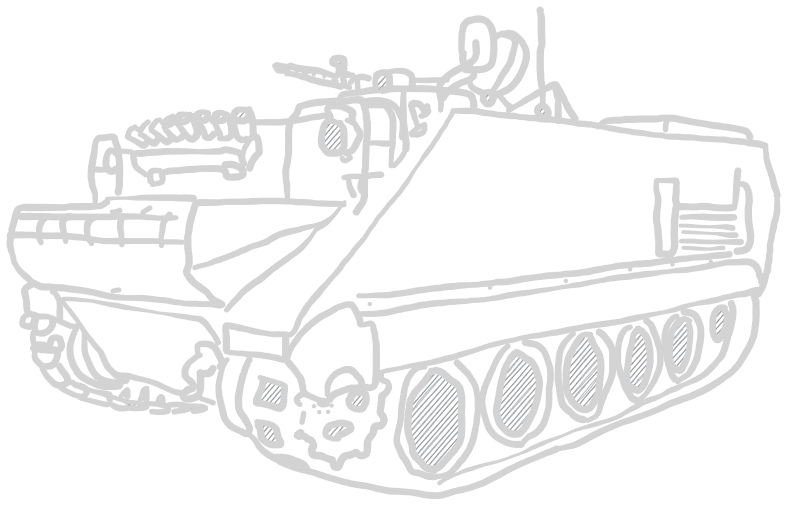

# H.E.A.T

## Introduction

This is a ruleset for a modern, platoon-sized tabletop wargame. While size- and
modelagnostic, weapon ranges and distances are balanced towards a 28mm size. If
used in another scale, adjustments might be necessary.

As a note: modern vehicles for 28mm are often scaled to "true" size, which is
1/50 in relation to the miniatures. While I personally dont care about size too
much, it is noticable on the table if you mix up a 1/56 M113 next to a 1/50 or
even 1/48 M1 Abrams. Just a heads up, so you wont be too surprised when the "28mm"
vehicles suddenly turn out way bigger than most WW2 era vehicles.

## Weapons

These weapons are operated by a single unit, which uses it as its primary weapon.

| Small arms | Range | Shots | PEN | Special rules |
| :---- | :----: | :----: | :----: | ---- |
| Pistol | 0" - 6" | 1 | - | Assault |
| Personal defense weapon | 0" - 12" | 3 | - | Assault |
| Submachine gun | 0" - 18" | 2 | - | Assault |
| Assault rifle | 0" - 12" | 2 | - | - |
| Assault rifle | 12" - 24" | 1 | - | - |
| Rifle | 0" - 24" | 1 | - | - |
| Designated marksman rifle | 24" - 38" | 1 | - | DMR |
| Shotgun | 0" - 12" | D3 | - | Assault |
| Underbarrel grenade launcher | 6" - 20" | 1 | HE | Indirect Fire, HE 1" |

The following weapons systems are operated by teams. The number of attendants
indicates the unit's size to function properly, if deployed as an infantry group.
This does not apply if operated as e. g. a vehicle weapon.

| Infantry weapon systems | Atten- dants | Range | Shots | PEN | Special rules |
| :---- | :----: | :----: | :----: | :----: | ---- |
| Light machine gun | 1 | 0" - 36" | 4 | - | Team |
| Medium machine gun | 1 | 0" - 36" | 5 | - | Team, Fixed |
| Heavy machine gun | 2 | 0" - 36" | 3 | +1 | Team, Fixed |
| Sniper | 1 | 12" - 48" | 1 | - | Team, Sniper|
| Anti-materiel rifle | 1 | 12" - 36" | 1 | +2 | Team, Sniper |
| Flamethrower (Infantry) | 1 | 0" - 6" | D6 | +3 | Team, Flamethrower |

| Vehicle weapon systems | Atten- dants | Range | Shots | PEN | Special rules |
| :---- | :----: | :----: | :----: | :----: | ---- |
| Light anti-tank gun | 2 | 0" - 48" | 1 | +4 | HE 1" |
| Medium anti-tank gun | 3 | 0" - 60" | 1 | +5 | HE 1" |
| Heavy anti-tank gun | 3 | 0" - 72" | 1 | +6 | HE 2" |
| Super-heavy anti-tank gun | 3 | 0" - 82" | 1 | +7 | HE 3"|
| Light autocannon | 2 | 0" - 48" | 2 | +2 | Team, Fixed, HE 1" |
| Medium autocannon | 2 | 0" - 60" | 2 | +3 | Team, HE 1" |
| Heavy autocannon | 3 | 0" - 72" | 2 | +3 | Team, HE 2" |
| Flamethrower (Vehicle) | - | 0" - 12" | D6+1 | +3 | Flamethrower |

| Indirect fire systems | Atten- dants | Range | Shots | PEN | Special rules |
| :---- | :----: | :----: | :----: | :----: | ---- |
| Light mortar | 1 | 12" - 24" | 1 | HE | Team,  Indirect Fire, HE 1" |
| Medium mortar | 2 | 12" - 60" | 1 | HE | Team, Fixed,  Indirect Fire, HE 2" |
| Heavy mortar | 2 | 12" - 72" | 1 | HE | Team, Fixed,  Indirect Fire, HE 3" |
| Light howitzer | 2 | 0" - 48" (24" - 60") | 1 | HE | Team, Fixed,  Howitzer, HE 2" |
| Medium howitzer | 3 | 0" - 60" (30" - 72") | 1 | HE | Team, Fixed,  Howitzer, HE 3" |
| Heavy howitzer | 3 | 0" - 72" (36" - 84") | 1 | HE | Team, Fixed,  Howitzer, HE 4" |

Additional weapon systems, explosives, mines, ...

| Explosives | Atten- dants | Range | Shots | PEN | Special rules |
| :---- | :----: | :----: | :----: | :----: | ---- |
| Rocket propelled grenade launcher | 1 | 6" - 36" | 1 | +5 | Team, Backblast,  Shaped charge |
| Tandem HEAT charge launcher | 1 | 6" - 24" | 1 | +7 | Team, Backblast,  Shaped charge |
| Anti-Tank guided missile launcher | 2 | ∞ (32" per turn) | 1 | +7  | Team, Fixed,  Backblast, ATGM |
| Improvised Explosive Device | 1 | placed down | 1 | HE | IED, HE 3" |
| Bangalore | - | 0" - 6" | 1 | HE | Bangalore, Single-Shot, HE 1" |

## Gameplay Rules

### Vehicles

#### IFVs

##### Introduction

With the advancements of tank engines in the first world war tanks, started to
outpace the infantry it was trying to catch up to. As a result, half-tracks and
other armoured personnel carriers (APC) became widespread. After the war, these
mostly unarmed vehicles grew into a more interconnected role with the infantry
they were transporting, giving rise to mechanized infantry, who fight in
conjunction with their carrier. This type of carrier, mostly armed with at least
a 20mm autocannon or ATGM systems, is called "infantry fighting vehicle" (IFV).

##### Mechanics

The IFV combines transport capabilities with a combat role. Since they work
extensively interconnected with the infantry they carry, the NCO role of the
infantry group is filled by the IFV itself.

The infantry group and the IFV are still two different units, but they are
"connected" to each other; an IFV cannot be deployed without a connected infantry
group.

If the infantry unit is destroyed, the IFV does not need to be removed and serves
as a normal vehicle. If the connected unit is separated by more than 36" from its
carrier, a pin is added to any order test performed.

##### IFV rule

| Rule | Description |
| ---- | ---- |
| IFV | <li>The IFV is connected to the first or second mandatory infantry  unit, if applicable. Otherwise it serves just as a normal unit.</li><li>Vehicle stays as a separate unit.</li><li>It replaces the NCO of the infantry group.</li><li>If connected infantry is further than 30" away, they have to perform  an order test for any action. This does not apply to the vehicle.</li> |

#### Helicopters

##### Introduction

Helicopters are another post-WW2 addition to all conventional ground forces.
Capable over hovering and vertical liftoff, these crafts are used in logistics,
troop movement, close air support roles and reconnaissance.

##### Gameplay

Helicopters function either as a transport or are deployed in a CAS role, upon
which they lose their troop capacity. Other than their vertical movement capability,
helicopters are treated the same way as any other vehicle.

| Type | Cost | Capacity | Examples |
| :--- | :--- | :--: | :--: |
| Light helicopters | <table><tr><td>Inexperienced</td><td>35 pt</td></tr><tr><td>Regular</td><td>50 pt</td></tr><tr><td>Veteran</td><td>65 pt</td></tr></table> | 8 | Boeing AH-6 MD500 Ka-226 |
| Medium helicopters | <table><tr><td>Inexperienced</td><td>50 pt</td></tr><tr><td>Regular</td><td>65 pt</td></tr><tr><td>Veteran</td><td>80 pt</td></tr></table> | 16 | Mil Mi-2 Bell UH "Huey" |
| Large helicopters | <table><tr><td>Inexperienced</td><td>65 pt</td></tr><tr><td>Regular</td><td>80 pt</td></tr><tr><td>Veteran</td><td>95 pt</td></tr></table> | 24 | NH90 UH-60 "Black Hawk" Mi-24 Hind |
| Giant helicopters | <table><tr><td>Inexperienced</td><td>80 pt</td></tr><tr><td>Regular</td><td>95 pt</td></tr><tr><td>Veteran</td><td>110 pt</td></tr></table> | 36 | Mi-26 VH-47 Chinook |

##### Flight

A helicopter may begin the match on the ground or offmap in reserve, from where
it can enter the match at any height after a successful order test.

Lift-Off and Landing require the helicopter to perform a successful order test
as well and are performed to/from 6" height (always measured from bottom of hull).

The minimum flight height is 6", the maximum is 60".

Horizontal movement works the same as normal vehicle movement. The helicopter can
move either vertical or horizontal in a single turn as described below.

| Type | Horizontal (RUN) | Horizontal (ADVANCE) | Horizontal (RUN) | Horizontal (ADVANCE) |
| :--: | :--: | :--: | :--: | :--: |
| **Light** | 48" (1) | 24" (2) | 20" (2) | 10" (2) |
| **Medium** | 36" (1) | 18" (2) | 20" (2) | 10" (2) |
| **Large** | 24" (0) | 12" (1) | 10" (1) | 5" (2) |
| **Giant** | 20" (0) | 10" (1) | 10" (1) | 5" (2) |

*In Brackets: Allowed 45° turns.*

##### Transport and (Dis)embarking

Every helicopter has a capacity indicating the amount of personell that is able
to be transported.

A landed helicopter can be treated the same way as a normal transport. Take an
order test to embark or disembark. After succesfully leaving the helicopter, unit
get the usual 6" movement in any direction they choose.

A hovering helicopter (not after a RUN) can also rapell units from a height of up
to 20". The unit disembarking needs to be veterans, and the helicopter crew
regulars.

The disembarking units rapell down to the ground, directly below the helicopter.
From there, they also get the 6" move range.

##### Combat

###### Attacking with a helicopter

The helicopter is able to attack anything in 45° arks, distances measured from
the weapon barrels themselves.

###### Attacking from a helicopter

If the helicopter is hovering (anything except RUN), onboard units are allowed to
"open" rear/side doors and attack with their small arms from there, with a *-2*
*modifier to hit*.

The helicopter gets the "Open Topped" rule while having open rear/side doors. As
soon as the helicoter succesfully performs a RUN order, or the turn is over, the
rule does no longer apply.

Reconnaissance units like spotters are allowed to perform their role from the
helicopter in 45° arks from the opening they are looking from. The door has to be
open to do this.

###### Shooting at a helicopter

Attacking a helicopter works the same way as any other vehicle, and if hit, has
to check against the following chart:

| D6 | Effect |
| :--: | :--- |
| <=1 | <li>+D2 pin marker to helicopter crew.</li><li>The unit goes DOWN.</li><li>If the helicopter has a rotating weapon, roll for turret jam.</li> |
| 2-3 | <li>+D3 pin marker to helicopter crew. </li><li>The unit goes DOWN.</li><li>Severe damage to the vehicle leads to a reduction in movement  speed by half, except downwards movements.</li><li>If the helicopter has a rotating weapon, roll for turret jam.</li> |
| +4 |<li>The helicopter is considered destroyed.</li><li>It crashes 3D6 in a random direction, where it causes an explosion (HE 2").</li><li>Any passengers are considered destroyed.</li> |

### Weapon Systems

#### Drones

##### Introduction

Drones are wireless-controlled air vehicles, from quadrotor helicopters to giant weapon systems. 

They are a very recent development in warfare, used by all sides for reconnaissance, deployment of weapons or other purposes.

##### Gameplay

Due to the scale at which H.E.A.T takes place, large autonomous systems like the Heron drone are a tad to ambitious for the time being. 
In this chapter we cover small quadrocopter drones, as used for example by irregular forces in Afghanistan or more recently Karabach/Ukraine.

Drones are steered by an operator who has a wireless connection to the device.
As soon as either the drone or the operator is lost, the DOT is considered
destroyed. In any given round either the operator or his drone acts, just like a spotter and artillery.

The UAV uses the same damage value as its team. They always deploy grounded with the operator, except if the scenario rules state otherwise.

###### Default unit costs

| Veterancy | Cost | Cost attendant |
| ---- | ---- | ---- |
| Inexperienced | 35 pt | 7 pt |
| Regular | 50 pt | 10 pt |
| Veteran | 65 pt | 13 pt |

##### Movement

A drone can be suspended at any height below 2' (60cm). Per activation, either
the operator or the UAV can perform an action. The UAV is able to move in
30" (RUN)/ 15" (ADVANCE) in any direction. 

Landing and starting do not require a full round as a helicopter, and can just move from the operators position to any other height. A UAV counts as grounded if it ends the turn within 1" of the DOT or on the ground.

It can stay airbound for 4 consecutive rounds before potentially losing battery
charge:

The UAV can be recovered by the DOT by moving within 1" of the grounded drone.
If turn ends with the grounded UAV closer to enemy forces than friendly ones, it
is considered destroyed. The battery pack is reset every time the DOT is within
1" of the grounded UAV.

##### Range

Similar to the battery pack, the range of an airborne UAV is limited by the wire-
less connection range to the DOT. If the UAV ends its turn more than 60" away from
the DOT, upon activation the following test has to be passed:

##### Variants

###### Reconnaissance

Enables capable of spotting enemy targets in direct LoS. The DOT can commicate
with any unit within the DOTs platoon and any unit capable of indirect fire in 12"
around the DOT, once per turn.

The communication does not require or use up an activation, but is blocked if the
DOT is DOWN.

###### IED variant

The UAV carries an improvised high explosive with it, capable of being dropped on
enemy units:

Upon dropping the payload, the UAV can be recovered by the DOT to be rearmed,
which takes a successful RALLY order.

###### Anti-tank IED variant

The UAV carries a powerful AT warhead instead of a HE round.

Upon dropping the payload, the UAV can be recovered by the DOT to be rearmed,
which takes a successful RALLY order.

##### Drone rule

| Rule | Description |
| :--- | :--- |
| Drone | -1 hit modifier while airborne -2 if airborne plus RUN as last active order Unit is connected via a wireless connection to the operator |

****

#### Anti-Tank guided missiles (ATGM)

##### Introduction

Anti-Tank guided missiles are stationary AT weapons, capable of effectively
engaging any armoured target over several kilometers. They are most often wire-
guided, thus being able to strike targets which move after deployment.

This places the system operator at a risk of being attacked while the missile is
still mid-air.

##### Gameplay

ATGMs come in different forms, but mostly consist of a stationary or fixed weapon
system with a weapon operator, similar to an anti-tank gun or machine gun position.
They can also come as vehicle mounted systems.

ATGMs can be fired at any vehicle in its LoS, but the missile requires some time
to approach targets at greater distances. Any vehicle in the ATGMs LoS can be
targeted, regardless of distance to target. Upon firing, the missile approaches
the target in a straight line at 32" per turn.

If the target ends the turn out of LoS or the ATGM operator unit goes DOWN or
moves, the missile is destroyed. This behaviour can be mitigated by using more
modern equipment, which is no longer wire-guided. For details on that, see the
"Fire-and-Forget"-special rule.

###### Default weapon costs

| Veterancy | Cost |
| ---- | ---- |
| Inexperienced | 60 pt |
| Regular | 85 pt |
| Veteran | 110 pt |

##### Rule

| Rule | Description |
| :--- | :--- |
| ATGM | Fixed weapon system. Fires missiles behaving according to ATGM ruleset. |

##### Special rules

Some weapons also can have other special rules describing the system.

| Rule | Description |
| :--- | :--- |
| Fire-And-Forget | <li>The targeting and movement of the missile stays the same, but the system  operator is not required to interact with the missile anymore.<li>Pathfinding for the missile is always in a straight line toward the target. <li>If at the end of turn the missile loses LoS, it is considered destroyed. |
| Backblast | If this weapon is fired in an enclosed room or if there are units within 3" of a 45°  ark behind the exhaust, roll to damage for any unit in this room or area. |

****

#### Underbarrel grenade launchers (UGL)

##### Introduction

##### Gameplay

****

#### Tandem HEAT charges

##### Introduction

Heavier versions of the usual AT rocket propelled grenades. While having a more
limited range due to a larger and heavier configuration, the multiple stages of
detonation provided by a Tandem HEAT round are capable of striking through modern
reactive armour and heavy defenses.

##### Gameplay

Most RPGs have an option to be equipped with Tandem HEAT rounds. They do not
replace the normal RPG round, giving you the option of using both. Before attacking,
announce which type is used by the system operator. Attacks are performed the
same way as any normal RPG attack.

PEN values and range as seen in the weapons chart.

##### Rule

| Rule | Description |
| :--- | :--- |
| Tandem HEAT Charge | Optional Upgrade for most RPGs. If chosen and selected for  an attack, announce before roling to hit.   Damage values and range as seen in weapons chart. |

****

#### Light anti-tank weapons (LAW)

##### Introduction

Light anti-tank weapons (LAW) are lightweight, fire-and-forget AT rockets. They
are fired from a disposable missile launch platform. These weapons are issued at
squad-level and provide normal infantry units with anti-tank capabilizies.

##### Gameplay

Fires a single AT warhead against any unit. An attack is performed the same way
as a normal attack against a vehicle, e. g. with an RPG. The PEN value can be found
in the weapons chart.

The weapon is single-Use and once fired, it is discarded. A squad can carry
multiple LAWs, and the maximum amount is described in their unit template.

##### Rule

| Rule | Description |
| :--- | :--- |
| LAW | A single-use AT weapon. |

****

#### Designated marksman rifles (DMR)

##### Introduction

##### Gameplay

##### Rule

****

#### Improvised explosive devices (IED)

##### Sappers

****

#### Automatic grenade launchers (AGL)

##### Introduction

Automatic Grenade Launchers (AGL) are stationary weapon systems used to fire high
explosive grenades.

##### Gameplay

Similar to machine guns, these weapons are fixed-position guns controlling areas
and channeling enemy forces. They fire multiple grenades per salvo, which can easily
decimate infantry groups.

###### Default unit costs

| Veterancy | Cost |
| ---- | ---- |
| Inexperienced | 50 pt |
| Regular | 60 pt |
| Veteran | 75 pt |

##### Rule

| Rule | Description |
| :--- | :--- |
| AGL | A platform to fire HE grenades from. The system functions fires 2 HE shots at a  target, for each hit the HE template can be placed over the unit. They need to connect to each other and can overlap.   When firing at buildings, the HE hits are rolled as described in the HE section. |

****

#### Manportable air defense systems (MANPADS)

##### Introduction

##### Gameplay

##### Rule

****

#### Bangalores

##### Introduction

Invented even before World War 1, these long torpedoes are used to blow holes or
clear mines from a safe cover, even while under fire. Prominently featured in
"Saving Private Ryan" to blow holes in razor wire fortifications.

##### Gameplay

Bangalores serve a multitude of roles:

| Example situation | Example  |
| :--- | :--- |
| Removing light fortifications |  |
| Blowing a door-sized hole into walls |  |
| Using as a HE weapon against infantry or vehicle || |
| Removing mines and IEDs | See IED section |

If you find a completely new way to use these and its credible enough, try to reuse
one of these formulas.

Bangalores are single-use. Any unit can carry any amount of them, but
a maximum can be set in the squad template.

##### Rule

| Rule | Description |
| :--- | :--- |
| Bangalore | Multipurpose, single-use explosives. Usable against vehicles, buildings, fortifications. | 

****

#### Smoke Screens

##### Introduction

Modern vehicles are equopped with smoke grenade laumchers to quickly provide cover
in case of an emergency situation. They are forward facing and enable maneuvering
and retreat if necessary.

##### Gameplay

Once per vehicle, a unit equipped with a smoke screen can active it by going DOWN.
(You dont activate with the DOWN, it can be performed without using up the smoke
screen, but using it leads to your vehicle to go DOWN.)

The smoke screen consists of two 2" smoke markers which are placed in front of
the vehicle. Built-up smoke behaves the same as any other smoke, drifting and
vanishing just like a smoke round.

## Additional Rules and Systems

### Adjustments

#### Weapon choice

Since modern infantry structures and their weapon arsenal are not as restricted
as they were in the second world war, instead of only providing a choice of a
few SMGs next to a bunch of rifles and paying more points for them, the way
units choose their weapons is changed.

Now a squad has a base weapon for each soldier and deviating from that weapon
costs 3 points. This applies to **ARs**, **SMGs**, **PDWs** and **shotguns**.

A pistol can be used, which returns 3 points, since its a step back.

A squad can change out none, a couple or even all their weapons, and we count the
logistical strain by adding up the points, since we don't really have that much
of a buff anymore by using SMGs. It's much more about the role the unit is supposed
to fulfill.

#### Spotters

Since modern forces use raduos extensively on squad-, platoon- and up to battalion-
level, any spotter can spot for any gun in his platoon, just like a UAV spots for
its entire platoon.

There is still an option for any gun to bring a designated spotter, since you are
still allowed to field multiple spotters, but it is not mandatory.

If a gun has begun zeroing in on a position, it is not bound to a specific spotter.
If they went from 6 to 4 on spotter A and spotter B takes over due to A dying or
repositioning, the zeroing is not affected. But without a spotter correcting shots,
it is also unable to further zero in and lower its value. A direct hit also needs
to be observed to notify the artillery that zeroing has finished.

#### Indirect fire rework

To better use smoke grenades (and make artillery less frustrating to use imho), we reworked target selection and what happens to missed shots, since it is kind of ridiculous that a missed shot just despawns and does not affect the battlefield.

This might not sit right with every player, so I would call this optional. But I do recommend to use at least the reworked target selection.

##### Target Selection

To better use artillery in an area denial role, or to use smoke more preventive, we decided to target markers in addition to units. This has several advantages:

- Target an area to generate a smoke barrier
- Target cover or houses to destroy them
- Saturate areas to channel enemy options in movement
- Stay zeroed on a point, in case a unit returns

##### Failing to hit roll

Even if a round does not hit, firing a HE 4"-equivalent projectile at anything will ruin that general areas day. So it is frustrating that usually, a round just vanishes if they miss. 

To mitigate this, we came up with following formula to calculate misfire:

<mark> TODO </mark>

Just throw an order dice to get the direction with the little arrows on each face and use the formula to calculate distance. Place the template directly above and roll to hit for anything below, be it house or man. Any unit below is also allowed to go DOWN, as this might be a bit overpowered otherwise. And this rule is buff enough already for artillery.