# H.E.A.T

## Introduction

This is a ruleset for a modern, platoon-sized tabletop wargame. While size- and
modelagnostic, weapon ranges and distances are balanced towards a 28mm size. If
used in another scale, adjustments might be necessary.

As a note: modern vehicles for 28mm are often scaled to "true" size, which is
1/50 in relation to the miniatures. While I personally dont care about size too
much, it is noticable on the table if you mix up a 1/56 M113 next to a 1/50 or
even 1/48 M1 Abrams. Just a heads up, so you wont be too surprised when the "28mm"
vehicles suddenly turn out way bigger than most WW2 era vehicles.

## Weapons

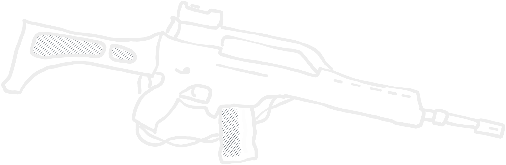

### Small arms weapons chart

These weapons are operated by a single unit, which uses it as its primary weapon.

| Small arms | Range | Shots | PEN | Special rules |
| :---- | :----: | :----: | :----: | ---- |
| Pistol | 0" - 6" | 1 | - | Assault |
| Personal defense weapon | 0" - 12" | 3 | - | Assault |
| Submachine gun | 0" - 18" | 2 | - | Assault |
| Assault rifle | 0" - 12" | 2 | - | - |
| Assault rifle* | 12" - 24" | 1 | - | - |
| Rifle | 0" - 24" | 1 | - | - |
| Designated marksman rifle | 0" - 38" | 1 | - | DMR |
| Shotgun | 0" - 18" | D3 | - | Assault |
| Underbarrel grenade launcher | 6" - 20" | 1 | HE | UGL |

*This replaces the long range hit modifier.

The following weapons systems are operated by teams. The number of attendants
indicates the unit's size to function properly, if deployed as an infantry group.
This does not apply if operated as e. g. a vehicle weapon.

### Team-based weapons chart

| Infantry weapon systems | Atten- dants | Range | Shots | PEN | Special rules |
| :---- | :----: | :----: | :----: | :----: | ---- |
| Light machine gun | 1 | 0" - 36" | 4 | - | Team |
| Medium machine gun | 1 | 0" - 36" | 5 | - | Team, Fixed |
| Heavy machine gun | 2 | 0" - 36" | 3 | +1 | Team, Fixed |
| Sniper | 1 | 12" - 48" | 1 | - | Team, Sniper|
| Anti-materiel rifle | 1 | 12" - 36" | 1 | +2 | Team, Sniper, Fixed |
| Flamethrower (Infantry) | 1 | 0" - 6" | D6 | +3 | Team, Flamethrower |
| Automatic grenade launcher | 1 | 0" - 36" | 2 | HE | Team, Fixed, HE 1" |

### Vehicle-mounted or fixed weapon systems chart

Every following unit is counted as a system operator plus the given amount of attendants.

| Vehicle weapon systems | Atten- dants | Range | Shots | PEN | Special rules |
| :---- | :----: | :----: | :----: | :----: | ---- |
| Light anti-tank gun | 2 | 0" - 48" | 1 | +4 | Team, Fixed, HE 1" |
| Medium anti-tank gun | 3 | 0" - 60" | 1 | +5 | Team, Fixed, HE 1" |
| Heavy anti-tank gun | 3 | 0" - 72" | 1 | +6 | Team, Fixed, HE 2" |
| Super-heavy anti-tank gun | 3 | 0" - 82" | 1 | +7 | Team, Fixed, HE 3"|
| Light autocannon | 2 | 0" - 48" | 2 | +2 | Team, Fixed, HE 1" |
| Medium autocannon | 2 | 0" - 60" | 2 | +3 | Team, Fixed, HE 1" |
| Heavy autocannon | 3 | 0" - 72" | 2 | +3 | Team, Fixed, HE 2" |
| Flamethrower (Vehicle) | - | 0" - 12" | D6+1 | +3 | Flamethrower |

#### Hardpoint arsenal weapon chart

To make it easier to find, helicopter weapon systems are listed here separately.

| Weapon system | Range | Shots | PEN | Special Rules |
| :--- | :---: | :---: | :---: | --- |
| Light autocannon | 0" - 48" | 2 | +2 | HE 1" |
| Medium autocannon | 0" - 60" | 2 | +3 | HE 1" |
| Heavy autocannon | 0" - 72" | 2 | +3 | HE 2" |
| Light rocket pod | 0" - 48" | 2 | +4 | Rocket Pod, HE 1" |
| Medium rocket pod | 0" - 60" | 2 | +5 | Rocket Pod, HE 1" |
| Heavy rocket pod | 0" - 72" | 2 | +6 | Rocket Pod, HE 2" |
| Light missile | 20" - 60" | 1 | +5 | Single Use, HE 1" |
| Medium missile | 20" - 72" | 1 | +6 | Single Use, HE 2" |
| Heavy missile | 20" - 82" | 1 | +7 | Single Use, HE 3" |
| Small bomb | ||||
| Medium bomb | ||||
| Large bomb | ||||
| Clusterbomb | ||||

### Indirect fire weapons chart

Every following unit is counted as a system operator plus the given amount of attendants.

| Indirect fire systems | Atten- dants | Range | Shots | PEN | Special rules |
| :---- | :----: | :----: | :----: | :----: | ---- |
| Light mortar | 1 | 12" - 24" | 1 | HE | Team,  Indirect Fire, HE 1" |
| Medium mortar | 2 | 12" - 60" | 1 | HE | Team, Fixed,  Indirect Fire, HE 2" |
| Heavy mortar | 2 | 12" - 72" | 1 | HE | Team, Fixed,  Indirect Fire, HE 3" |
| Light howitzer | 2 | 0" - 48" (24" - 60") | 1 | HE | Team, Fixed,  Howitzer, HE 2" |
| Medium howitzer | 3 | 0" - 60" (30" - 72") | 1 | HE | Team, Fixed,  Howitzer, HE 3" |
| Heavy howitzer | 3 | 0" - 72" (36" - 84") | 1 | HE | Team, Fixed,  Howitzer, HE 4" |

### Explosives and rockets weapons chart

Every following unit is counted as a system operator plus the given amount of attendants.

Additional weapon systems, explosives, mines, ...

| Explosives | Atten- dants | Range | Shots | PEN | Special rules |
| :---- | :----: | :----: | :----: | :----: | ---- |
| Rocket propelled grenade launcher | 1 | 6" - 36" | 1 | +5 | Team, Backblast,  Shaped charge |
| Tandem HEAT charge launcher | 1 | 6" - 24" | 1 | +7 | Team, Backblast,  Shaped charge |
| Light Anti-tank guided missile launcher | 1 | 90"  (30" per turn) | 1 | +5  | Team, Fixed,  Backblast, ATGM |
| Anti-tank guided missile launcher | 1 | 90"  (30" per turn) | 1 | +7  | Team, Fixed,  Backblast, ATGM |
| Man-portable anti air defense system | 1 | 72" | 1 | +4 | Team, Fixed, Backblast, MANPADS |
| Improvised Explosive Device | 1 | placed down | 1 | +4 | Explosive, IED, HE 3" |
| Mine | 1 | placed down | 1 | +6 | Explosive, HE 3" |
| Explosives | - | 0" - 6" | 1 | HE | Explosives, Single-Shot, HE 1" |

### HE chart

Chart for high explosives and how to calculate losses.

| Radius | Pins | PEN | Hits |
| ----- | ---- | ---- | ---- |
| 1" | D2 | 1 | D3 |
| 2" | D3 | 2 | D6 |
| 3" | D3 | 3 | 2D6 |
| 4" | D6 | 4 | 3D6 |

## Gameplay Rules

### Vehicles

#### Movement

To adjust for half-tracks becoming obsolete, bulky multi-axial vehicles take their
space:

| Vehicle Type | ADVANCE (Pivots) | RUN (Pivots) |
| :--- | ---- | ---- |
| Wheeled | 12" (2) | 24" (1) |
| Multi-axial wheeled | 12" (1) | 24" (0) |
| Tracked | 9" (1) | 18" (0) |

On-Road bonus still doubles range.

#### IFVs

##### Introduction

With the advancements of tank engines in the first world war tanks, started to
outpace the infantry it was trying to catch up to. As a result, half-tracks and
other armoured personnel carriers (APC) became widespread. After the war, these
mostly unarmed vehicles grew into a more interconnected role with the infantry
they were transporting, giving rise to mechanized infantry, who fight in
conjunction with their carrier. This type of carrier, mostly armed with at least
a 20mm autocannon or ATGM systems, is called "infantry fighting vehicle" (IFV).

##### Mechanics

The IFV shares its slots (2 per platoon) with APCs and is not mandatory. Some
IFVs also can switch out their crew compartments for weapon systems or other
upgrades, rendering them unable to fulfill this role.

If chosen as an IFV, they connect to one of the two mandatory infantry groups.
Keep the maximum carry capacity in mind, if this is the case, as they do need to
fit into their IFV.

The IFV combines transport capabilities with a combat role. Since they work
extensively interconnected with the infantry they carry, the NCO role of the
infantry group is filled by the IFV itself.

The infantry group and the IFV are still two different units with
separate order dice.

If the infantry unit is destroyed, the IFV does not need to be removed and serves
as a normal vehicle. If the connected unit is separated by more than 36" from its
carrier, an order test has to be performed for each action.

The role comes at no further cost, since the bonus of having their NCO switched
out for the vehicle is mitigated by needing to stay relatively close to the IFV.

##### IFV rule

| Rule | Description |
| ---- | ---- |
| IFV | <li>The IFV is connected to the first or second mandatory infantry  unit, if applicable. Otherwise it serves just as a normal unit.</li><li>Vehicle stays as a separate unit.</li><li>It replaces the NCO of the infantry group.</li><li>If connected infantry is further than 30" away, they have to perform  an order test for any action. This does not apply to the vehicle.</li> |

#### Helicopters

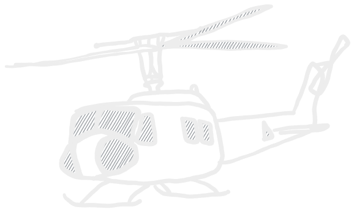

##### Introduction

Helicopters are another post-WW2 addition to all conventional ground forces.
Capable over hovering and vertical liftoff, these crafts are used in logistics,
troop movement, close air support roles and reconnaissance.

##### Gameplay

Helicopters function either as a transport or are deployed in a CAS role.
Other than their vertical movement capability, helicopters are treated the same
way as any other vehicle.

| Type | Cost | Capacity | Examples |
| :--- | :--- | :--: | :--: |
| Light helicopters | <table><tr><td>Inexperienced</td><td>35 pt</td></tr><tr><td>Regular</td><td>50 pt</td></tr><tr><td>Veteran</td><td>65 pt</td></tr></table> | 8 | Boeing AH-6 MD500 Ka-226 |
| Medium helicopters | <table><tr><td>Inexperienced</td><td>50 pt</td></tr><tr><td>Regular</td><td>65 pt</td></tr><tr><td>Veteran</td><td>80 pt</td></tr></table> | 16 | Mil Mi-2 Bell UH "Huey" |
| Large helicopters | <table><tr><td>Inexperienced</td><td>65 pt</td></tr><tr><td>Regular</td><td>80 pt</td></tr><tr><td>Veteran</td><td>95 pt</td></tr></table> | 24 | NH90 UH-60 "Black Hawk" Mi-24 Hind |
| Giant helicopters | <table><tr><td>Inexperienced</td><td>80 pt</td></tr><tr><td>Regular</td><td>95 pt</td></tr><tr><td>Veteran</td><td>110 pt</td></tr></table> | 36 | Mi-26 VH-47 Chinook |

##### Flight

A helicopter may begin the match on the ground or offmap in reserve, from where
it can enter the match at any height after a successful order test.

Lift-Off and Landing require the helicopter to perform a successful order test
as well and are performed to/from 6" height (always measured from bottom of hull).

The minimum flight height is 6", the maximum is 30".

Horizontal movement works the same as normal vehicle movement. The helicopter can
move either only horizontally, which is faster, or change its altitude as well.

| Type | Horizontal (RUN) | Horizontal (ADVANCE) | Vertical (RUN) | Vertical (ADVANCE) |
| :--: | :--: | :--: | :--: | :--: |
| **Light** | 48" (1) | 24" (2) | 20" (1) | 10" (2) |
| **Medium** | 36" (1) | 18" (2) | 20" (1) | 10" (2) |
| **Large** | 24" (0) | 12" (1) | 10" (0) | 5" (1) |
| **Giant** | 20" (0) | 10" (1) | 10" (0) | 5" (1) |

*In Brackets: Allowed 45° turns.*

##### Transport and (Dis)embarking

Every helicopter has a capacity indicating the amount of personnel that is able
to be transported.

A landed helicopter can be treated the same way as a normal transport. Take an
order test to embark or disembark. After succesfully leaving the helicopter, unit
get the usual 6" movement in any direction they choose.

A hovering helicopter (not after a RUN) can also rapell units from a height of up
to 10". The unit disembarking needs to be veterans, and the helicopter crew
regulars.

The disembarking units rapell down to the ground, directly below the helicopter.
From there, they also get the 6" move range.

##### Combat

###### Attacking with a helicopter

Attack helicopters used for close air support have an abundance of weapon system
at their disposal, from normal MMGs, HMGs and autocannons mounted front- or side-
facing, to hardpoint-mounted rocket pods, missiles, ATGMs and bombs.

The helicopter is able to attack anything in 45° arks, distances measured from
the weapon barrels themselves.

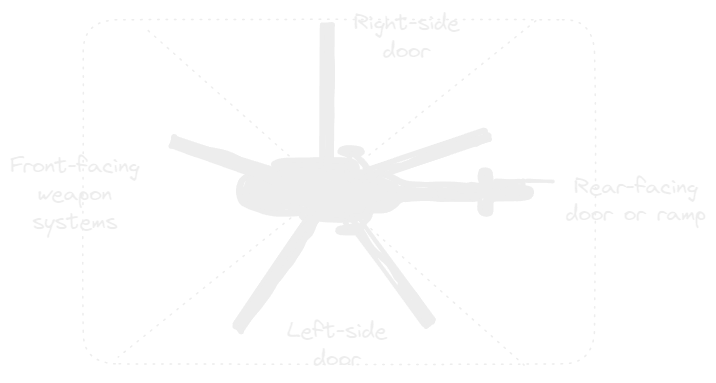

- **Machine guns** and **autocannons** are treated just like any other weapon, they fire from their barrel in their respective ark at targets.

- **Missiles** are fired the same way, though they are single use and do not necessarily need to be HE or AT, as other variants such as smoke rockets exist in some militaries.

- **Rocket pods** are not single use and fire 2 shots per salvo, but they get a -2 to hit modifier.

- **ATGMs**, if not specified otherwise (sometimes these act so different from the "norm" that they deserve a special treatment), work the same as normal ATGMs.

- **Bombs** are thrown from the helicopter in the path it travels, according to the following chart, if not specified otherwise (e. g. in case it is somehow guided).

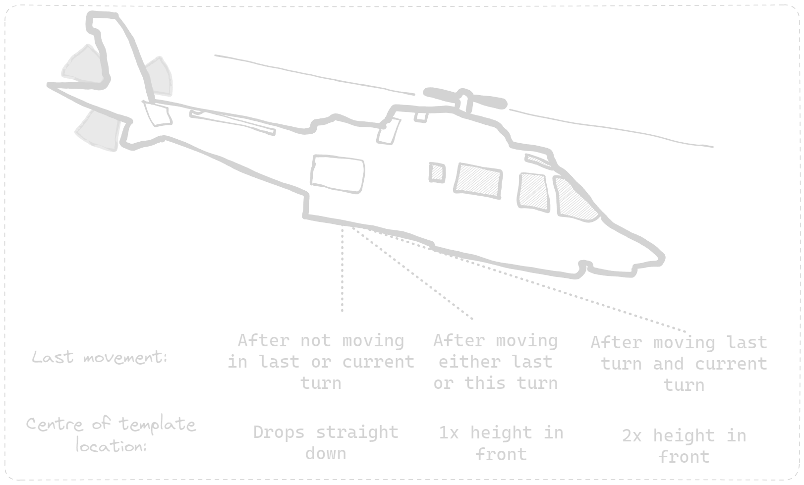

Helicopters with hardpoints are allowed to fire one set of weapons per turn as
well as their vehicle mounted gun, if it has one.

###### Attacking from a helicopter

If the helicopter is hovering (anything except RUN), onboard units are allowed to
"open" rear/side doors and attack with their small arms from there, with a *-2*
*modifier to hit*.

The helicopter gets the "Open Topped" rule while having open rear/side doors. As
soon as the helicoter succesfully performs a RUN order or the turn is over, the
rule does no longer apply.

Reconnaissance units like spotters are allowed to perform their role from the
helicopter in 45° arks from the opening they are looking from. The door has to be
open to do this.

###### Shooting at a helicopter

Attacking a helicopter works the same way as any other vehicle, and if hit, has
to check against the following chart:

| FUBAR Value | Effect |
| :--: | :--- |
| <=1 | <li>+D2 pin marker to helicopter crew.</li><li>The unit goes DOWN.</li><li>If the helicopter has a rotating weapon, roll for turret jam.</li> |
| 2-3 | <li>+D3 pin marker to helicopter crew. </li><li>The unit goes DOWN.</li><li>Severe damage to the vehicle leads to a reduction in movement  speed by half, except downwards movements.</li><li>If the helicopter has a rotating weapon, roll for turret jam.</li> |
| +4 |<li>The helicopter is considered destroyed.</li><li>It crashes 3D6 in a random direction, where it causes an explosion (HE 2").</li><li>Any passengers are considered destroyed.</li> |

### Minor Additions

#### Quad Bikes

Quad Bikes are used by small units for traversing difficult terrain. They can be
mounted on them at the start of the match to move on any surface with the
distances of a wheeled vehicle, but dont get the on-road bonus.

Unit mounted on a quad bike cannot fire their weapons.

| Rule | Description |
| ---- | ---- |
| Quad Bikes | Unit mounts for faster deployment. Move as a wheeled vehicle without on road bonus. Can be chosen as an upgrade to a unit if available in unit options. Removed once disembarked. |

***

### Drones

#### Introduction

Drones are wireless-controlled air vehicles, from quadrotor helicopters to giant
fixed wing weapon carriers. They are a very recent development in warfare, used
by all sides for reconnaissance, deployment of weapons or other purposes.

Due to the scale at which H.E.A.T takes place, large autonomous systems like the
Heron drone are a tad to ambitious for the time being.

Currently, the three types of drones are:

- small quadrocopter drones, as used for example by irregular forces in Afghanistan or more recently Karabach/Ukraine,
- RC plane sized UAVs with off-map operators and either fixed wings, rotors or even both,
- loitering munition, or more colloquially known as "suicide drones".

#### Gameplay

The gameplay difference is how the actual unit is set up. The cheapest option are
on-map operators who sit behind a bush somewhere and steer the UAV with a remote.

Bigger UAS, such as a _Threod Systems Stream C_ fixed wing, are operated off map
and behave like a normal unit. They will have more heavy-hitting options, but
obviously cost more in terms of points.

##### On-Map Operator

Small drones are steered by an operator who has a wireless connection to the device.
As soon as either the drone or the operator is lost, the team is considered
destroyed. In any given round either the operator or his drone acts, just like a
spotter and artillery.

The UAV uses the same damage value as its team. They always deploy grounded with
the operator, except if the scenario rules state otherwise.

Except for recon role, a team is considered destroyed once the drone is lost.

##### Off-Map Operator

Off-map operated drones act as their own unit and deploy like a helicopter airborne on-
or off-map. They cannot be resupplied as the on-map operated drones.

#### Movement

##### Quadcopter/rotor vehicles

A drone can be suspended at any height below 2' (60cm). Per activation, either
the operator or the UAV can perform an action. The UAV is able to move in
30" (RUN)/ 15" (ADVANCE) in any direction.

Landing and starting do not require a full round as a helicopter, and can just
move from the operators position to any other height. A UAV counts as grounded if
it ends the turn within 1" of the team or on the ground.

##### Fixed wing designs

Fixed wing aircraft are either started by throwing it or from a ramp/vehicle.
Once started, they are required to perform a full ADVANCE or RUN order as
described below:

| Order | Distance | Vert. Distance | Pivots |
| :--- | :---: | :---: | :---: |
| RUN | 24" | 10" | 1 |
| ADVANCE | 12" | 5" | 2 |

They can attempt a landing with a D6, everything over a 1 is a success. On a 1 the
UAV is considered destroyed. To restart, they need to either be rethrown by the
operator or have a rule such as the VTOL rule, which does not require an entire
turn from an operator. Just like the quadcopter, it can end the turn at the full
travel distance of 24" or 12".

##### Variants

###### Reconnaissance

Enables capable of spotting enemy targets in direct LoS. The DOT can communicate
with any unit within the DOTs platoon and any unit capable of indirect fire in 12"
around the DOT, once per turn.

The communication does not require or use up an activation, but is blocked if the
DOT is DOWN. If the drone is shot down, the DOT takes the role of a normal spotter.

###### IED variant

The UAV carries an improvised high explosive with it, capable of being dropped on
enemy units:

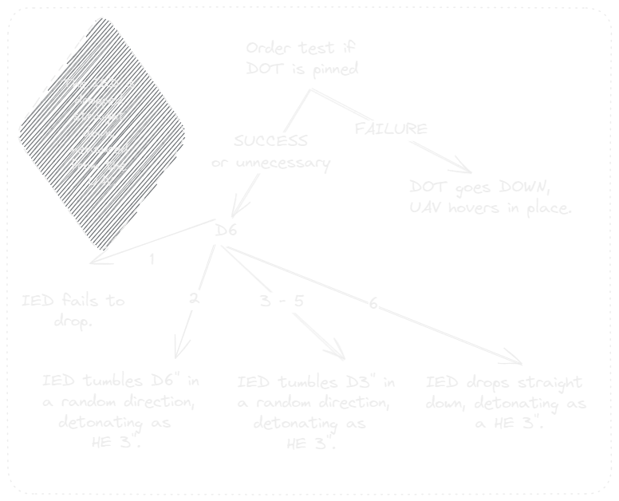

Upon dropping the payload, the UAV can be recovered by the operator to be rearmed,
which takes a successful RALLY order.

###### Anti-tank IED variant

The UAV carries a powerful AT warhead instead of a HE round.

Upon dropping the payload, the UAV can be recovered by the operator to be rearmed,
which takes a successful RALLY order.

###### Loitering munition

In this configuration, the drone itself is the weapon, and is destroyed once the
payload detonates. Detonation can be triggered by a FIRE or at the end of an
ADVANCE.

##### Drone rules

| Rule | Description |
| :--- | :--- |
| Drone | -1 hit modifier while airborne -2 if airborne plus RUN as last active order. |
| Fixed Wing | UAV has to constantly move as described in the fixed-wing movement section. |
| VTOL | For fixed-wing UAVs, allows takeoff without being physically thrown by the operator. |
|Loitering Munition | Acts like an IED. Explodes once triggered by the operator. |

***

### Weapon Systems

#### Anti-Tank guided missiles (ATGM)

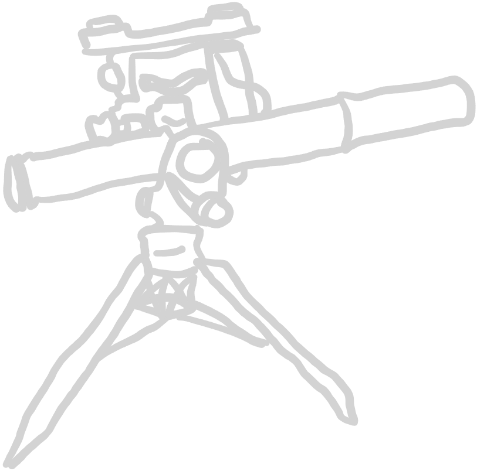

##### Introduction

Anti-Tank guided missiles are stationary AT weapons, capable of effectively
engaging any armoured target over several kilometers. They are most often wire-
guided, thus being able to strike targets which move after deployment.

This places the system operator at a risk of being attacked while the missile is
still mid-air.

##### Gameplay

ATGMs come in different forms, but mostly consist of a stationary or fixed weapon
system with a weapon operator, similar to an anti-tank gun or machine gun position.
They can also come as vehicle mounted systems.

ATGMs can be fired at any vehicle in its LoS, but the missile requires some time
to approach targets at greater distances. Any vehicle in the ATGMs LoS can be
targeted, regardless of distance to target. Upon firing, the missile approaches
the target in a straight line at the speed given in the [weapons chart](#explosives-and-rockets-weapons-chart).

If the target ends the turn out of LoS or the ATGM operator unit goes DOWN or
moves, the missile is destroyed. This behaviour can be mitigated by using more
modern equipment, which is no longer wire-guided. For details on that, see the
"Fire-and-Forget"-special rule.

##### Rule

| Rule | Description |
| :--- | :--- |
| ATGM | Fixed weapon system. Fires missiles behaving according to ATGM ruleset. |

##### Special rules

Some weapons also can have other special rules describing the system.

| Rule | Description |
| :--- | :--- |
| Fire-And-Forget | <li>The targeting and movement of the missile stays the same, but the system  operator is not required to interact with the missile anymore.<li>Pathfinding for the missile is always in a straight line toward the target. <li>If at the end of turn the missile loses LoS, it is considered destroyed. |
| Backblast | If this weapon is fired in an enclosed room or if there are units within 3" of a 45°  ark behind the exhaust, roll to damage for any unit in this room or area. |

***

#### Underbarrel grenade launchers (UGL)

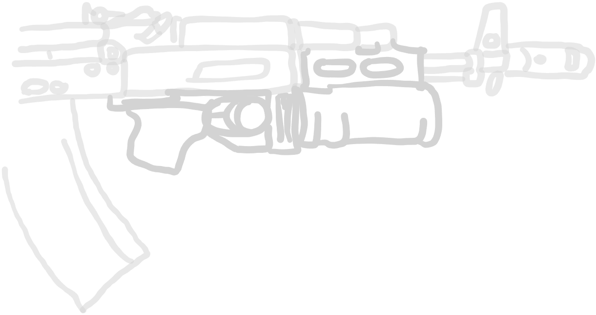

##### Introduction

Underbarrel grenade launchers are modular components which are fixed to another
weapon, mostly assault rifles. They fire 40mm HE rounds or other projectiles in
a ballistic trajectory.

##### Gameplay

UGLs behave similarly enough to light mortars that we treat them the same way,
as to not add unnecessary new rules. They cannot use a spotter and fire in direct
line of sight according to normal indirect fire rules.

They have the choice between HE rounds (HE 1") and smoke rounds (HE 1").  A unit
can either fire its gun or the underbarrel grenade launcher. It does not require
a loader or assistant. Range and other stats can be found in the [weapons chart](#explosives-and-rockets-weapons-chart).

##### Rule

| Rule | Description |
| :--- | :--- |
| UGL | Line-of-Sight-only "light mortar". Can fire either HE rounds or smoke rounds (HE 1"). Range and stats check in [weapons chart](#explosives-and-rockets-weapons-chart).|

***

#### Tandem HEAT charges

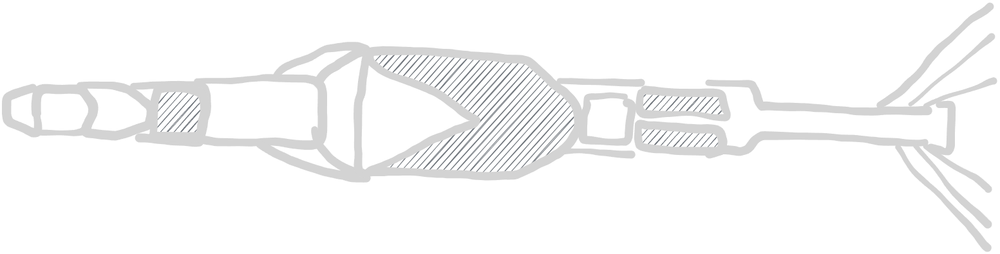

##### Introduction

Heavier versions of the usual AT rocket propelled grenades. While having a more
limited range due to a larger and heavier configuration, the multiple stages of
detonation provided by a Tandem HEAT round are capable of striking through modern
reactive armour and heavy defenses.

##### Gameplay

Most RPGs have an option to be equipped with Tandem HEAT rounds. They do not
replace the normal RPG round, giving you the option of using both. Before attacking,
announce which type is used by the system operator. Attacks are performed the
same way as any normal RPG attack.

PEN values and range as seen in the [weapons chart](#explosives-and-rockets-weapons-chart).

##### Rule

| Rule | Description |
| :--- | :--- |
| Tandem HEAT Charge | Optional Upgrade for most RPGs. If chosen and selected for  an attack, announce before roling to hit.   Damage values and range as seen in [weapons chart](#explosives-and-rockets-weapons-chart). |

***

#### Light anti-tank weapons (LAW)

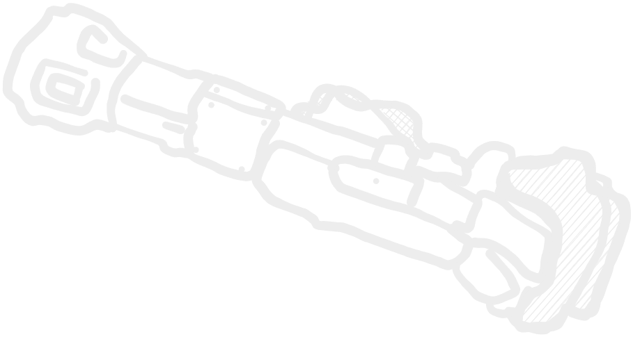

##### Introduction

Light anti-tank weapons (LAW) are lightweight, fire-and-forget AT rockets. They
are fired from a disposable missile launch platform. These weapons are issued at
squad-level and provide normal infantry units with anti-tank capabilizies.

##### Gameplay

Fires a single AT warhead against any unit. An attack is performed the same way
as a normal attack against a vehicle, e. g. with an RPG. The PEN value can be
found in the [weapons chart](#explosives-and-rockets-weapons-chart).

The weapon is single-Use and once fired, it is discarded. A squad can carry
multiple LAWs, and the maximum amount is described in their unit template.

##### Rule

| Rule | Description |
| :--- | :--- |
| LAW | A single-use AT weapon. Check [weapons chart](#explosives-and-rockets-weapons-chart) for details. (Same as RPG, judt single shot.) |

***

#### Designated marksman rifles (DMR)

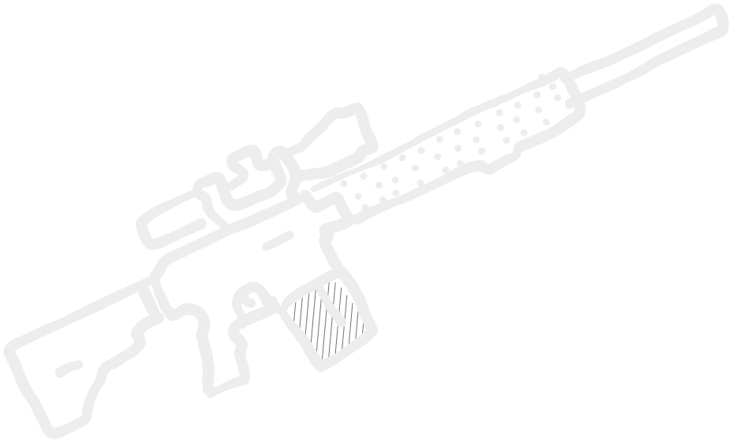

##### Introduction

DMRs extend the range of a squad and are used for accurate fire to about 600m,
compared to most normal service rifles' 300-400m effective range.

##### Gameplay

DMRs are basically longer range rifles. They act as part of the squad, rather
than a stationary sniper, which is why they dont get the sniper rule (and are way
cheaper). They can however extend the effective range of a squad, if only for one
soldier, which can be handy in some situations.

If chosen, a DMR replaces the AR of one soldier in a squad. If none are present,
the unit also costs the +5pt for switching the main weapon out in addition to the
DMR cost (see Adjustments).

Otherwise, the DMR counts as a normal rifle with an extended range. For details,
check [weapons chart](#small-arms-weapons-chart).

##### Rule

| Rule | Description |
| :--- | :--- |
| DMR | Extended range rifle. Replaces one AR in the squad. Check [weapons chart](#small-arms-weapons-chart) for details. |

***

#### Improvised explosive devices (IED) and mines

Improvised explosive device, or IEDs, are selfmade, sometimes remotely triggered
bombs. They can be manufactured with all kinds of objects, be it military-grade
high explosives in a pipe or industrial mining explosives in a truckbed.

Mines are also explosives, but usually reserved to conventional forces as a way
to inhibit enemy troop movement and attritional usage against vehicles.

For the purposes of pragmaticality, we treat IEDs and mines the same way.

##### Gameplay

Mines and IEDs are indicated by markers on the map, maybe something like a base
or chip. Under each has to be clearly marked, whether the marker is for a mine/IED
or a decoy, since the sapper unit (see below) also has a stockpile of duds to fake
mined areas. If a marker is not clearly marked as either, it is considered a decoy.

Conceiled deployed IEDs are treated the same way as mines, but if for some reason
the player thinks its better to remote-detonate an IED at any point, that is
possible. As soon as an enemy comes within 3" of a marker, the following test is
rolled:

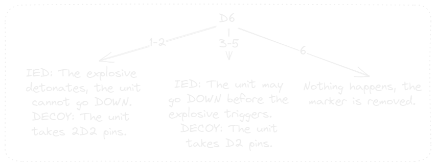

##### Sapper

The sapper is a specialized unit reserved to rebel and insurgent forces. A sapper
team consists of the operator and one attendant. They carry IEDs and decoys, which
can be deployed within 1" of the unit as a FIRE order or as the attack action of
an ADVANCE order. Any sapper carries 3 IEDs and an unlimited amount of decoys.

###### Attacking vehicles

If a sapper comes within 1" of a vehicle, he can attach IEDs to the vehicle after
a successful FIRE or as the attack action of an ADVANCE order.

While the sapper is still alive, the IED can be triggered at any point. The
vehicle is automatically counted as hit and rolls for damage according to the
[weapons chart](#explosives-and-rockets-weapons-chart) values for an IED. Any other unit, including enemy forces, within
the appropriate HE template also roll to hit.

##### Engineer

The engineer is a part of any conventional army. They are the multi-tool of a
ground force and are well-versed in dealing with explosives and fortifications,
both deploying and destroying.

Other than sappers, engineers are infantry units with their specialty as a bonus
rather than single-purpose operators.

Engineers are a counter to mines and IEDs, and only suffer a +1 Stress pin for a
decoy, regardless of their roll when engaging one. Also, they get to reroll a 3-5
on the IED flowchart, if it actually is an explosive. This only applies if the
unit itself triggeres a conceiled marker, not if they are hit by an explosion.

##### Vehicle-born IEDs

##### Rules

| Rules | Descriptions |
| :--- | :--- |
| Sapper | Carries 3 IEDs and unlimited decoys. These can be placed as a FIRE  or ADVANCE order. Any engineer rule bonus applies as well.|
| Engineer | If failing check against decoy, only receive +1 stress pin. Can reroll a 3-5 roll against a mine or IED, if triggered by the unit. |
| IED | Remote-controlled explosive device. Can be placed on ground or on a vehicle. For details, see [IED section](#improvised-explosive-devices-ied-and-mines). |
| Explosive | A conceiled deployed marker with a 3" range. If any unit is within 3, roll against [flowchart](#gameplay-7). |

***

#### Automatic grenade launchers (AGL)

##### Introduction

Automatic Grenade Launchers (AGL) are stationary weapon systems used to fire high
explosive grenades.

##### Gameplay

Similar to machine guns, these weapons are fixed-position guns controlling areas
and channeling enemy forces. They fire multiple grenades per salvo, which can easily
decimate infantry groups.

##### Rule

| Rule | Description |
| :--- | :--- |
| AGL | A platform to fire HE 1" grenades from. The system functions fires 2 HE shots at a  target, for each hit the HE 1" template can be placed over the unit. They need to connect to each other and can overlap.   When firing at buildings, the HE hits are rolled as described in the HE section.  For more information see [weapons chart](#explosives-and-rockets-weapons-chart) |

***

#### Manportable air defense systems (MANPADS)

##### Introduction

Man-portable air defense systems, or MANPADS, are anti-air missile launchers,
which are used to fight airborne targets such as helicopters or jets on a squad-
level. They offer protection against low-flying attackers for infantry formations
without using expensive vehicleborn weaponry.

##### Gameplay

Since MANPADS are about 3x as fast as ATGMs (as a comparison, a TOW flies at around
278-320m/s, while a Stinger missile flies at Mach 2.2 or 745m/s), they do not get
the ATGM inch-per-round treatment. Rather, an attacked vehicle is able to react
based on its condition and distance to the attacker, as seen below:

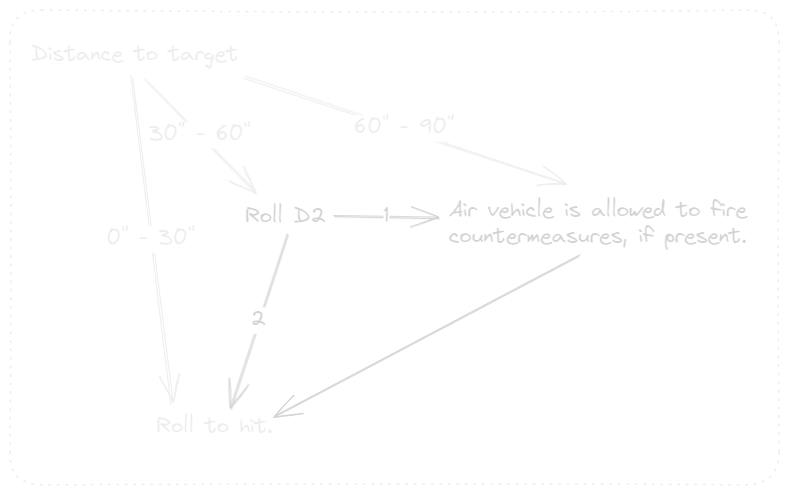

The MANPADS team consists of a gunner and a loader, and behaves otherwise similar
to an RPG team. The weapon is fixed and cannot be fired after moving. A direct LoS
is required.

MANPADS can also be deployed on a tripod as a stationary weapon system.

##### Rule

| Rule | Description |
| :--- | :--- |
| MANPADS | Portable air defense system. Fires from a fixed position. Roll against [flowchart](#gameplay-9) when firing at enemy unit. |
| Countermeasures | Anti-missile countermeasures, released to confuse the rocket target lock. If able to release,this adds a -2 to hit modifier to a MANPADS attack roll.Not single-use, can be used multiple times.|

***

#### Explosives

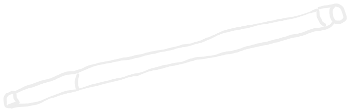

_Bangalores, prominently used in "Saving Private Ryan" as a clearing device and the pinnacle of art in this ruleset._

##### Introduction

Used to blow holes or clear mines from a safe cover, even while under fire.
Youre imagination is the limit!

##### Gameplay

Explosive kits serve a multitude of roles:

| Example situation | Example  |
| :--- | :--- |
| Removing light fortifications | Roll D2, on a 2, light forticiation is destroyed/ a non-obscured pathway for infantry is breached. |
| Blowing a door-sized hole into walls | Roll D3, on a 3, an entryway is breached into a wall. Roll to hit against any unit inside if breached. |
| Using as a HE weapon against infantry or vehicle | Use as a single use weapon with values of [weapons chart](#explosives-and-rockets-weapons-chart). |
| Removing mines and IEDs | Roll D3 <li>on a 1 nothing happens, <li> on a 2 the explosive detonates (*check with HE template if anyone is in range and roll to hit*),<li> on a 3 explosive is considered disarmed without harm. |

If you find a completely new way to use these and its credible enough, try to reuse
one of these formulas or make up your own.

Kits are single-use. Any unit can carry any amount of them, but
a maximum can be set in the squad template.

##### Rule

| Rule | Description |
| :--- | :--- |
| Explosives | Multipurpose, single-use explosives. Usable against vehicles, buildings, fortifications. |

***

#### Smoke Screens

##### Introduction

Modern vehicles are equipped with smoke grenade laumchers to quickly provide cover
in case of an emergency situation. They are forward facing and enable maneuvering
and retreat if necessary.

##### Gameplay

Once per vehicle, a unit equipped with a smoke screen can active it by going DOWN.
(You are not forced to activate it when going DOWN, it can be performed without
using up the smoke screen, but using it leads to your vehicle to go DOWN.)
Furthermore, an ADVANCE can be used to trigger the smoke as well, using up the
firing action. The unit goes DOWN afterwards.

The smoke screen consists of two 2" smoke markers which are placed either in front
of the vehicle or in the direction the turret is aiming, depending on where the
smoke pods are located. Built-up smoke behaves the same as any other smoke,
drifting and vanishing just like a smoke round.

##### Rule

| Rule | Description |
| :--- | :--- |
| Smoke Screen | Single-use smoke screen. 2x HE 2" in size. Unit goes DOWN when used. |

***

#### Smoke Grenades

##### Introduction

Smoke grenades are used by infantry formations to reduce visibility during an
engagement over open terrain.

##### Gameplay

Smoke grenades come as an upgrade to infantry groups. If equipped, they count as
a singular action to throw, and the entire squad uses their grenades for maximum
cover. This can be done once per squad.

Uses a FIRE or ADVANCE action. 3 HE 1" smoke markers are placed at any point
within 12" of the infantry squad. The clouds behaves like any other smoke,
see rulesbook. After usage, the squad cannot perform another smoke barrage.

##### Rule

| Rule | Description |
| :--- | :--- |
| Smoke grenades | Single-Use action upgrade for infantry units. Requires successful FIRE or ADVANCE order. Place 3x 1" smoke markers within 12" of the squad. |

***

#### Thermal Cameras

##### Introduction

Many modern vehicles are equipped with not just night vision capable optics, but
thermal imaging cameras. These are capable of observing radiotion in the 400-700 nm
range, which can be tranlated into a thermographic image, visualizing actual heat.

By using these, a human or vehicle can be found way easier than with normal imaging,
as long as its heat signature is higher than its surroundings.

##### Gameplay

Thermal cameras reduce the effectiveness of conceilment. A weapon systems operator
that has access to a thermal camera is thus not affected by light cover, so when
shooting at someone behind a bush or trees, the light cover bonus is ignored.

On vehicles, the thermal camera is considered destroyed as soon as the vehicle
is damaged.

##### Rule

| Rule | Description |
| :--- | :--- |
| Thermal Camera | A vehicle or infantry team with a thermal camera ignores the light cover bonus when attacking. For vehicles, the camera is considered inoperable as soon as the vehicle is damaged, losing the bonus. |

***

## Additional Rules and Systems

### Adjustments

These are adjustments or rule rewrites my group worked out as house rules. Take
them as you will, but this ruleset is written with all of them in mind as normal
rules. Feel free to change them around in your personal games, or dont use them
at all. Your loss :D

#### Weapon choice

Since modern infantry structures and their weapon arsenal are not as restricted
as they were in the second world war, instead of only providing a choice of a
few SMGs next to a bunch of rifles and paying more points for them, the way
units choose their weapons is changed.

Now a squad has a base weapon for each soldier and deviating from that weapon
costs 3 points. This applies to **ARs**, **SMGs**, **PDWs** and **shotguns**.

A pistol can be used, which returns 3 points, since its a step back.

A squad can change out none, a couple or even all their weapons, and we count the
logistical strain by adding up the points, since we don't really have that much
of a buff anymore by using SMGs. It's much more about the role the unit is supposed
to fulfill.

#### Spotters

Since modern forces use raduos extensively on squad-, platoon- and up to battalion-
level, any spotter can spot for any gun in his platoon, just like a UAV spots for
its entire platoon.

There is still an option for any gun to bring a designated spotter, since you are
still allowed to field multiple spotters, but it is not mandatory.

If a gun has begun zeroing in on a position, it is not bound to a specific spotter.
If they went from 6 to 4 on spotter A and spotter B takes over due to A dying or
repositioning, the zeroing is not affected. But without a spotter correcting shots,
it is also unable to further zero in and lower its value. A direct hit also needs
to be observed to notify the artillery that zeroing has finished.

#### Indirect fire rework

To better use smoke grenades (and make artillery less frustrating to use imho),
we reworked target selection and what happens to missed shots, since it is kind
of ridiculous that a missed shot just despawns and does not affect the battlefield.

This might not sit right with every player, so I would call this optional. But I
do recommend to use at least the reworked target selection.

##### Target Selection

To better use artillery in an area denial role, or to use smoke more preventive,
we decided to target markers in addition to units. This has several advantages:

- Target an area to generate a smoke barrier
- Target cover or houses to destroy them
- Saturate areas to channel enemy options in movement
- Stay zeroed on a point, in case a unit returns

##### Failing to hit roll

Even if a round does not hit, firing a HE 4"-equivalent projectile at anything
will ruin that general areas day. So it is frustrating that usually, a round
just vanishes if they miss.

To mitigate this, we came up with following formula to calculate misfire:

**D3 * zeroing value before reducing**

Just throw an order dice to get the direction with the little arrows on each face
and use the formula to calculate distance. Place the template directly above and
roll to hit for anything below, be it house or man. Any unit below is also allowed
to go DOWN, as this might be a bit overpowered otherwise. And this rule is buff
enough already for artillery.

#### Troop capacity and true capacity

The troop capacity value for a vehicle represents the seats a vehicle has per
passenger. But there are tons of examples of people using for example the top of
a tank to ride into battle, or sit on the flatbed of a truck, holding onto the
sides of a Jeep, etc.

Since it would completely arbitrary to set a fixed limit to this, or categorize
it, any vehicle is allowed to carry "unauthorized" passengers of any amount, as
long as at least one seat is taken up by someone of their squad or team.

You first fill all slots of a vehicle with a squad, and then you overfill.
So no 10 NCOs on the flatbed of a truck with their 100 soldiers clinging to the
sides! :D It's just for the rest of the last squad.

As soon as you overfill a vehicle, it is only allowed to drive at ADVANCE speed.
Otherwise, the units outside are treated the same as the rest of the squad.

#### Tank Hunter rule in modern combat

Since the times of tank hunting infantry running up to a tank and hurling grenades
into the engine compartment are over, the rule has been removed.

As a replacement we now have more units with LAWs, increasing survivability and
lethality of infantry. If a unit does have the IED rule or explosives though,
they are treated the same way as if they were tank hunters, just to keep the
option open.

#### Machine gun buff

As a quite popular buff for MGs, all weapons in the machine gun team slot deal D2 Pins to make them more viable.

### Experimental Stuff

#### More detailed drone rules

At first, we experimented with limitations to range and movement of drones. This
quickly started being ignored, so I removed the rules. But if you want to have a
more difficult time with drones, feel free to adapt these workflows as you want:

##### Movement

It can stay airbound for 4 consecutive rounds before potentially losing battery
charge:

The UAV can be recovered by the DOT by moving within 1" of the grounded drone.
If turn ends with the grounded UAV closer to enemy forces than friendly ones, it
is considered destroyed. The battery pack is reset every time the DOT is within
1" of the grounded UAV.

##### Range

Similar to the battery pack, the range of an airborne UAV is limited by the wire-
less connection range to the DOT. If the UAV ends its turn more than 60" away from
the DOT, upon activation the following test has to be passed:

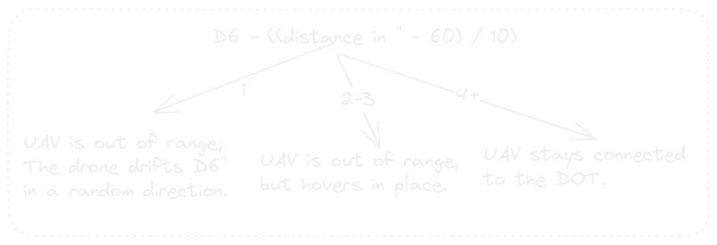

After losing connection, the DOT can try again next round, but has to pass the
test again.
