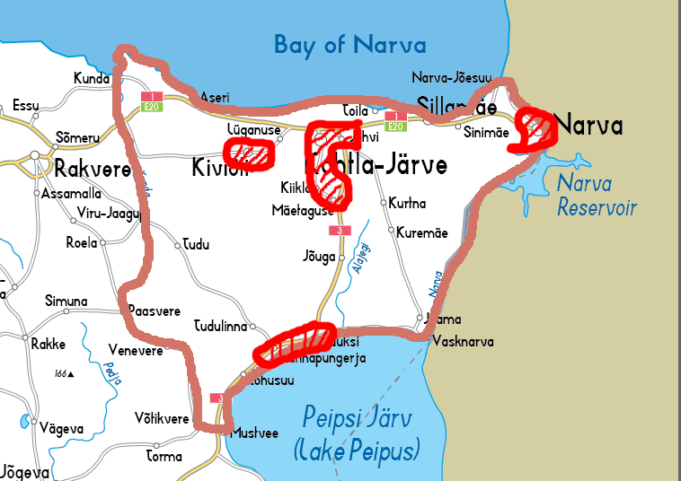
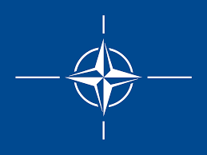
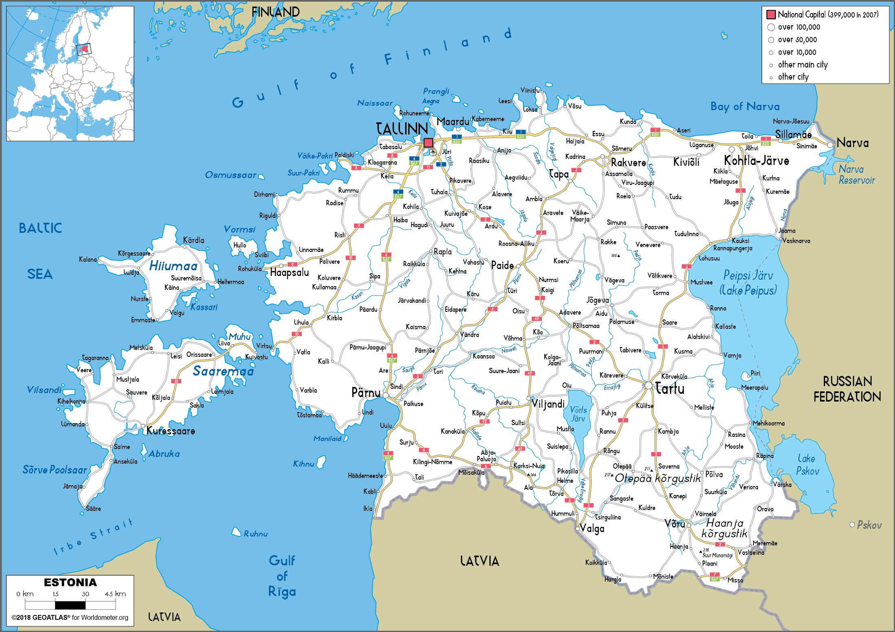
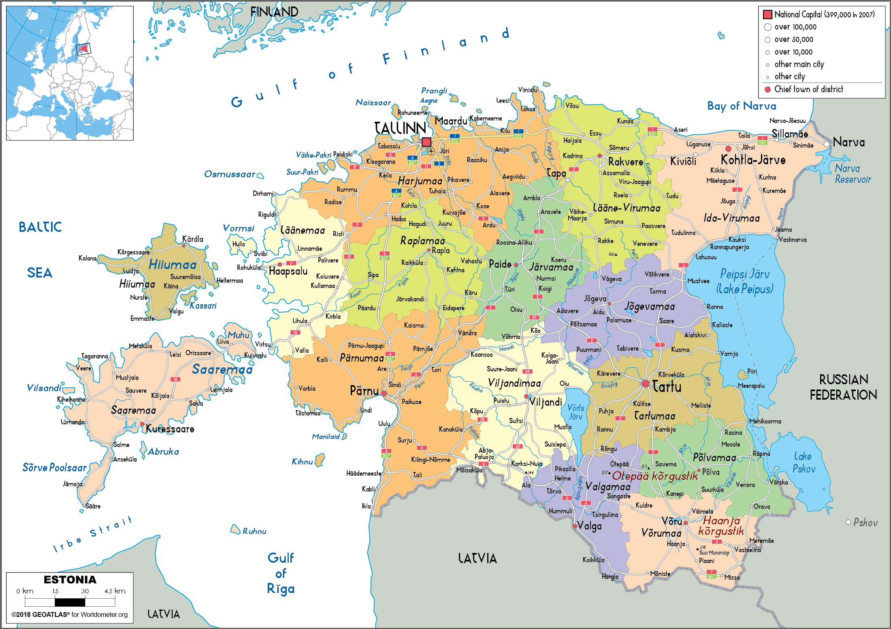

# Breakaway Socialist Republic of Narva

## Scenario introduction

This is the first setting for H.E.A.T. as a modern, fictional war in northern
europe. If you play this just as a unit roster for an army, a single match, or a
full campaign is up to you.

### Breakdown

A revolution in the eastern district of Ida Viru in Estonia plunged Estonia
into a civil war. Many of the larger settlements were swiftly taken under control
of the Narva Socialist People's Republic (NSPR), which has a standing force of
around 10-13.000 men. The NSPR forces are a patchwork of former soldiers, poorly
trained civilians and paramilitary groups, which are as differently trained as
they are equipped, making use of old soviet equiment, civilian vehicles and more
modern weaponry sponsored by foreign donors. Ideologically just as split, the
NSPR is internally divided between left-leaning revolutionaries seeking their own
state and far right militias such as "Bratstwa", who want to become part of the
Russian Federation.

NATO now sends the VJTF (currently lead by the Bundeswehr with a PzGren-Division)
to fight off the separatists, which for now means a assymetrical fight for control
over the various cities and facilities under NSPR control.

The RF has condemned the use of NATO troops without a UN mandate and threatens to
send their own force in an effort to protect ethnic russians in the region.

***

### Timetable

#### 2012 - Declining baltics

Several years of disinformation campaigns, civil unrest due to declining living
standards, and a feeling of being left out by the more ethnically estonian west
counties lead to the rise of extremist sentiment in the more eastern counties of
Estonia. As a former soviet republic, many older, russian-born citizens remember
the USSR in a positive light and see the decline of industrial sites in Ida Viru
as a failure to keep the region relevant by the government.

Most of them live right at the border with Russia, for example in the city of
Narva (95.7% native russian speakers, 87.7% ethnic russians), right at the border,
many of whom face lower living standards due to not speaking estonian.

#### 2014 - Steadfast Jazz Disaster

While tensions brew over the years, a far-right, nationalist movement consisting
of former Red Army soldiers, communist politicians and a small, but vocal voter
base formed the *"Iseseisvus rahvale"* movement. This group was a fierce opposition
minority in local politics seeking independence from Estonia to form a socialist
republic, similar to the former soviet republic of Estonia.

The movement gained an influx in supporters and recognition after a military
excercise called "Steadfast Jazz" in November of 2013 lead to the crash of a
french Mirage F1 in a village with a civilian losses, an ethnically russian
farmer. The lackluster response of authorities and NATO commands belatedly
response, at first refusing to halt the maneuver, lead to a PR disaster for
NATO, fueling anti-west sentiment.

As a reaction to the annexation of Crimea, the baltic states increased the budgets
for the large reservist and volunteer forces of their respective armed forces.
Furthermore, a [joined air cavalry unit](#baltic-security-partnership) was established as a sign of unison and
resolve against russian aggression and dissent in not only the estonian, but
also the other baltic border counties with Russia.

#### 2015 - Spiraling protests

With reoccuring protests demanding more autonomy and accepting russian as a state
language, civil unrest grew over the course of couple of months in early 2015,
while the refugee crisis fueled conservative populism. First open calls for
independence followed razzias against popular far-right extremists, shortly before
the election of parliament in March.

The *"Iseseisvus rahvale"* party were elected by over 80% of voters in the Ida
Viru and other bordering counties during the election run.

After learning about their victory, party officials announced an independence
referendum before the end of the year. This was sharply condemned by estonian and
EU officials, leading to protests in both Ida Viru and the rest of the country.

First clashes between paramilitary forces and police followed in March and April.
The death of two policemen made global news in early May. The estonian, lithuanian
and latvian presidents called upon the treaty of the european union to aid against
the threat of a civil war, but media outlets were too preoccupied with the
"migrant crisis" in the EU, which overshadowed the event.

As a reaction to the deteriorating situation, a [UN peacekeeping operation](#unfibal) was
established to aid police forces.

#### 2016 - Outbreak of war

With the largest settlements under control, central POI for the economical effort
and logistical centres were taken swiftly to create a decentralized net of holdouts
for assymetrical defense. Power stations, important crossroads, the north-south
connection to Tudulinna were a high priority. Former quarries and parts of the
national forests are used to hide equipment and house medical facilities for
casualties.

Populist rethoric and disinformation campaigns lead to a polarized society in the
years prior, and many unsupportive of the revolution were driven to move west,
but not many people had the monetary support necessary for this. There still are
parts of the population which did not approve of the coup, and some even took to
arms, forming small counter-revolutionary cells. The majority of these people are
enlisted in the volunteer structures of the estonian forces.

While this was enough to gain control in some parts of the country, the many small
villages and settlements surrounding the cities were too many to be militarily
controlled.

*NSPR claimed territory and initial controlled territory*

***

### Baltic Security Partnership

The BASEP was founded in 2014 as a reaction to tension arrising in several counties
of the baltic states at the russian border. It was established as a combined
brigade of all 3 state's ground force with the aim to signal cohesion and
willingness to defend each other.

Mission goals include:

- Security in border regions
- Operations within national parks
- Low or non mechanized infantry operations

Some other properties of this light infantry include

- Fast Deployment in swamp and bogs
- Modularity in equipment with NATO partners

With large parts of the estonian and lithuanian forces being either reservists,
volunteers and border guards, some of these structures were integrated into this
newly formed brigade. Also, an air cavalry battalion is establised as a heavier
support for the light infantry sections.

- Headquarters and Signal Company
- __1st Light Infantry Battalion "*Łauma*"__
  - Headquarters and Support Company
  - First Light Infantry Company
  - Second Light Infantry Company
  - Third Light Infantry Company (Reserve)
  - Combat Service Support Company
- __2st Light Infantry Battalion "*Kaukas*"__ (Reserve)
  - Headquarters and Support Company (Reserve)
  - First Light Infantry Company (Reserve)
  - Second Light Infantry Company (Reserve)
  - Third Light Infantry Company (Reserve)
  - Combat Service Support Company (Reserve)
- __Air Cavalry Battalion "*Vēja māte*"__
  - Headquarters and Support Company
  - First Air Cavalry Company
  - Second Air Cavalry Company
  - Aviation Company, General Support
- __Artillery Company__ (Reserve)
- __Combat Support Battalion__
  - Signal Company
  - Supply and Transport Company
  - Technical Support and Maintenance Company
  - Medical Company

### UNFIBAL

// TODO

### VJTF

*NATO flag*

*Emblem of NATO response forces, stationed in the baltic countries*

The Very High Readiness Joint Task Force (VJTF) is a multinational rapid reaction
force established by NATO. Designed to be a highly agile and capable force, the
VJTF serves as a deterrent and quick-response element in times of crisis.

It consists of land, air, maritime, and special operations forces contributed by
NATO member states on a rotational basis.

It is characterized by its high readiness and ability to rapidly deploy within a
few days' notice. It serves as a visible demonstration of NATO's commitment to
collective defense and the security of its member states. The force is capable of
conducting a range of missions, including crisis response, deterrence, and
reinforcement operations.

### NSPR

*Narva Socialist People's Republic flag*

The NSPR has a standing force of around 10-13.000 personell, which serve under
the umbrella of the NSPR flag. Internally, there are several factions.

The "Bratstwa" far-right, russian-nationalistic militia is the best equipped part
of the force. Their leader, Roman Sokolov, is a wealthy oligarch with ties to the
Kremlin. Most personell enjoyed a thorough paramilitary training and their
equipment pool is modern. The entire force is estimated to consist of about
2000-2500 men.

In contrast to Bratstwa stands the majority of NSPR soldiers, which consist of
more left-leaning, mostly ethnic russian estonians, which are fighting for anything
between a sovereign, communist state, just more autonomy, frustration and pure
hartred for the West. These people come from diverse backgrounds, some have former
military training, like the soviet mandatory service or come from a estonian armed
forces background. Most have no real prior experience at all and were trained
covertly in NSPR training camps throughout the county.

The vehicle pool is a mix of former soviet equipment, some stolen western/estonian
armed forces materiell, small amounts of modern russian weaponry and just reworked
civilian technicals. Additionally, some civilian drones are used for surveillance,
as IED carriers or suicide drones.

#### Goals

The war goal for NSPR is to somehow drive out the invaders and establish a functional
state in Ida Viru.

Control over power stations, the oil shale production and excavation sites, quarries,
city centres and the agricultural sites must be established and uphold without
damaging too much infrastructre.

Kivioli is an important site to the oil shale production, which needs to be
restarted for power autonomy. Sillimäe has old uranium processing sites, which
are a lucrative market for future potential economical problems.

While Russia does seem like a natural ally against the West, depending too much
on their intervention could lead to being integrated in the Russian Federation,
or even a third world war.

***

## Geography

### General Description

*Map of Estonia before 19.04.2016*

*In the upper right corner, Ida-Viru County.*

Ida Viru lies at the russian-estonian land border as well as the Gulf of Finland
in the north. To the south-east, a large part of the border runs through Lake
Peipsi.

The terrain itself is largely flat with up to 30% composed of mires and bogs.
These areas cover open fields with muddy, almost swampy terrain and waist-high
vegetation. Additionally many small rivers and revines, some artificial, cover
the landscape. While some parts are used for agriculture, there are still vast
swathes of forest and bushlands remaining, also thanks to a nation-wide
reforestation program. Ida Viru county is the location of several national
reserves, two of the larger and more important ones can be found below.

>Raised bogs are unique ecosystems characterized by the accumulation of peat,
which is formed from decaying organic matter over thousands of years. Agusalu
offers a remarkable display of the typical features found in a raised bog,
including an undulating surface with hummocks, hollows, and pools. The bog is
rich in biodiversity, supporting a variety of plant species, such as sphagnum
mosses, cranberries, and heather, which are specially adapted to the acidic
and nutrientpoor conditions of the bog.

With the population centres along the northern coast most other parts of the
Ida-Viru are only compromised of small villages, connected by two major roads,
for once the E246 motorway connecting Jõhvi through the forests of Agusalu
national reserve with several larger villages and along the shore of Lake Peipus
with Tartu, a city in a neighboring county. Only one other road, Route 32, covers
this north-south route.

In the north, the E20 highway not only connects western counties to all major
settlements in Ida-Viru, e. g. Kothla-Järve, Jõhvi, Sillimäe and Narva, but also
leads to the only major bridge joining the country to Russia over a Narva river.

### Points of interest

Here are some probable locations for the conflict between the NSPR and BLUFOR.

#### North

With the population centres, mining operations and connection to the Gulf of
Finland in the north, this region is the most important to control.

##### E20

The E20 is part of the european road 20, connecting Ireland to Saint Petersburg.
It runs through all the major cities in Ida-Viru, which makes it invaluable for
troop transportation for either side of the conflict.

##### Kiviõli/Püssi

With the name literally being "oil shale" in estonian, it is no secret what type
of industry is prevalent in Kiviõli. After the dissolution of the USSR, this town
of 10.000 lost almost half of its inhabitants. A stronghold of *Iseseisvus rahvale*
support with the two ash hills, highest artificial points in the entire baltics,
towering over empty houses.

###### Aidu karjääri tööstusplats

A mine east of Püssi, wide open terrain with excellent train network. Used by NSPR
forces as a rallying place.

###### Ash Hills of Kiviõli oil factory

A sad landmark and constant reminder of former life in the USSR, these over 100m
high hills were created by oil shale extraction.

##### Kohtla-Järve

Kothla-Järve is a large town in the centre of Ida-Viru, the fifth-largest in Estonia.
Established as a mining town in the 1920s, it is a key element in the oil shale
industry of Ida-Viru, making it a valuable target to NSPR forces.

##### Jõhvi

Another former mining town with declining population. Most buildings are typical
soviet blocks, and over 50% of the population are ethnically russian, with another
20% from other former eastern bloc countries. Other than similar, neighboring towns,
Jõhvi never developed any business to the same extend of oil shale mining, which
led to a high level of unemployment.

Almost 92% of Jõhvi voted for independence, and it is home to many of *Iseseisvus*
*rahvale*'s most fierce supporters.

##### Sillimäe

Sillamäe is a former closed city located in northeastern Estonia. Placed colse to
the shores of the Gulf of Finland, it offers a unique blend of natural beauty and
intriguing history. Once a secretive Soviet-era uranium processing center, Sillamäe
has multiple locations of interest, with its city centre boasting former soviet
architecture, an old city hall, a well equipped port and a valuable thermal power
station.

Further points of interest:

- City Centre
- Thermal power plant
- Port of Sillamäe

##### Narva

Narva is a historic city located in northeastern Estonia, situated on the banks
of the Narva River, which forms the border with Russia. Known for its rich history
and cultural heritage, Narva stands as a unique blend of Estonian and Russian
influences. The city is renowned for its striking medieval fortress,
Narva Castle, which overlooks the river and serves as a symbol of its past.

Narva is characterized by its diverse architecture, showcasing a mix of medieval,
Soviet-era, and modern buildings. The city has witnessed a fusion of cultures
over the centuries, resulting in a vibrant atmosphere and a fascinating blend
of traditions. Narva is home to a multicultural community, and both Estonian
and Russian languages are widely spoken.

Further points of interest:

- Enefit Power AS
- Narva river bridge
- Hermann castle

#### Centre

##### Mäetaguse

Mäetaguse is a village located in the Ida-Viru County of northeastern Estonia.
It is situated approximately 25 kilometers southwest of the city of Jõhvi. The
village is known for its rich history, with settlements dating back to ancient
times. Today, it serves as a residential area with a close-knit community and a
slower pace of life. Mäetaguse is characterized by its predominantly rural
landscape, surrounded by lush forests and picturesque countryside.

The village is home to a small number of traditional wooden houses, reflecting
the architectural style of the region. It offers basic amenities such as schools,
a church, and local shops, providing a sense of community for its residents.

#### East

##### Agusalu national reserve

Agusalu is a raised bog located in Estonia, specifically in the northeastern
part of the country. It is situated in the Lahemaa National Park, which is known
for its diverse and pristine natural landscapes. Agusalu is one of the largest
and most well-preserved raised bogs in Estonia, covering an area of approximately
9 square kilometers.

#### South

##### Tudulinna

Tudulinna is a small settlement located in the Lääne-Viru County of northeastern
Estonia. It lies approximately 35 kilometers northwest of the city of Mustvee.
The settlement has a relatively small population and is characterized by its rural
and peaceful environment.

Tudulinna serves as a local administrative center, providing basic services and
amenities to its residents. The settlement is home to a school, a church, and a
few local shops. The settlement is also located in proximity to Lake Peipus, one
of the largest freshwater lakes in Europe-

Here also sits the Tudulinna hydroelectric dam, a key position with strategic and
civilian value, as it provides a huge amount of energy for Estonia.
